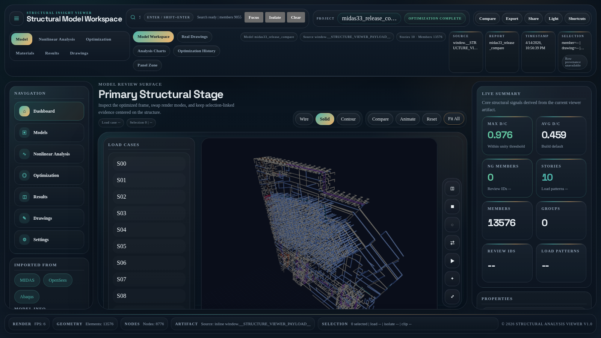

# Structural Optimization Workbench



Release-facing structural optimization workbench with reproducible P0/P1 quality gates, browser-verified 3D viewer smoke, and bounded engineer-in-loop commercial assist readiness.
The README image is captured from the actual `src/structure-viewer/index.html?preset=midas33_optimized` web viewer with `npm run capture:readme-viewer-image`.

## Documents

- [Workbench v2 usage guide](docs/workbench-v2.md)
- [Frontend build reproducibility](docs/frontend-build-reproducibility.md)
- [Viewer source/export contract](docs/viewer-contract.md)
- [Structure viewer product workspace](docs/structure-viewer-product-workspace.md)
- [Release publication runbook](docs/release-publication-runbook.md)
- [Open-data artifact restore runbook](docs/open-data-artifact-restore-runbook.md)
- [GitHub documentation status](docs/github-documentation-status.md)
- [상용화 갭 현재상태 보고서](docs/commercialization-gap-current-state.md)
- [Independent commercial productization plan](docs/independent-commercial-productization-plan.md)
- [Independent commercial product gap reassessment](docs/independent-commercial-product-gap-reassessment.md)
- [Workstation delivery service productization roadmap](docs/workstation-service-productization-roadmap.md)
- [Workstation delivery package](docs/workstation-delivery-package.md)
- [Production ops security runbook](docs/production-ops-security.md)
- [Runtime production packaging runbook](docs/runtime-production-packaging.md)
- [PM release gate milestones](docs/pm-release-gate-milestones.md)
- [Developer Preview blocker split](implementation/phase1/release_evidence/productization/developer_preview_blocker_split.md)
- [Codex/Cursor/OpenCode orchestration](docs/ai/ORCHESTRATION.md)
- [Real Project Corpus closeout guide](docs/real-project-corpus.md)
- [차세대 하이브리드 건축구조 분석 AI 아키텍처 명세서 (ADD)](docs/architecture-definition-document.md)
- [Phase 1 실행 산출물: LF 출력 스키마/검증](implementation/phase1/README.md)
- [Phase 1 다음 구현 계획](implementation/phase1/next-implementation-plan.md)
- [Phase 1 상용화 갭 분석/실행 플레이북 (Red Team)](implementation/phase1/commercialization-gap-redteam-playbook.md)
- [Phase 1 상용화 실행 로드맵](implementation/phase1/commercialization-execution-roadmap.md)
- [Phase 1 직교사영 잔차 보정 리포트](implementation/phase1/projection_update_report.json)
- [Phase 1 Zero-copy bridge report](implementation/phase1/zero_copy_bridge_report.json)
- [Phase 1 Krylov projection report](implementation/phase1/krylov_projection_report.json)
- [Phase 1 material mapping report](implementation/phase1/material_map_report.json)
- [Phase 1 priority 1/2/3 summary](implementation/phase1/priority3_summary.json)

## Commercial v1 Scope

The paid-pilot scope guard (`scripts/build_paid_pilot_scope_guard_report.py`)
machine-checks both the constrained paid-pilot language and the commercial v1
product surface. The supported commercial v1 scope and the explicit
separate-validation exclusions are recorded together in
`docs/pm-release-gate-milestones.md` and `docs/release-limitation-manual.md`,
and the guard blocks if any required supported-scope term or
separate-validation exclusion is missing from the scope source.

Supported commercial v1 scope (must stay visible in scope source):

- Structure families: frame, wall-frame, outrigger, truss
- Interop: MIDAS interop, OpenSees interop, KDS interop
- Analysis: nonlinear static, bounded NDTHA
- Audit: residual audit, reference comparison
- Reviewer package

Separate-validation exclusions (must stay visible in scope source):

- rail/tunnel
- special SSI
- nonstandard contact
- legal/authority approval automation
- special construction stages

## Commercial Priority Snapshot

- Canonical product readiness snapshot: status `blocked`, blocker_count `36`, paid_pilot_ready=`false`, release_ready=`false`. Canonical blocker categories: numerical `4`, benchmark `8`, software product `8`, future commercial `16`. The authoritative source is `implementation/phase1/release_evidence/productization/product_readiness_snapshot.json`; inspect it with `python3 scripts/build_product_readiness_snapshot.py --json --no-write` so protected evidence is not refreshed accidentally. README and current-state docs must match it before release claims move. The separated readiness tracks are assisted_service_pilot_ready=`false`, solver_product_pilot_ready=`false`, limited_commercial_ready=`false`, ga_enterprise_ready=`false`. Structural-scope cleanup is now represented by `implementation/phase1/release_evidence/productization/structural_scope_quarantine_manifest.json`: `86` tracked molecular/GPCR/PocketMD/public-benchmark-style paths are explicitly quarantined outside the structural solver release surface, with `0` unquarantined non-structural paths. This does not delete those paths or turn them into structural evidence; it keeps owner delete/extract review visible.
- Open Benchmark Developer Preview readiness: `implementation/phase1/release_evidence/productization/developer_preview_readiness.json` and `implementation/phase1/release_evidence/productization/developer_preview_readiness.md` report developer_preview_ready=`false`, blocker_count `5`, and future_commercial_blocker_count `31`. Developer Preview readiness blockers are classified as numerical `4`, benchmark `0`, and software product `1`; the Developer Preview RC final-gate blockers are split separately in `implementation/phase1/release_evidence/productization/developer_preview_blocker_split.md`. Customer shadow, product/legal license approval, license-server operation, commercial SLA, 30-run CI streak, external approval receipts, external benchmark receipts, license/security release evidence, and GitHub main-sync release controls stay visible as future Commercial Release context but do not block Developer Preview. The preview scope is public/open benchmark import, deterministic analysis/reporting, benchmark scorecards, and local GUI review; it excludes permit automation, engineer replacement, SaaS/accounts/license server, commercial SLA, and autonomous AI/GNN/surrogate truth claims until the deterministic reference solver, residual/Jacobian/Newton closure, and benchmark truth are fixed. AI guardrail rows are tracked separately from autonomous AI engine claim closure. Freeze policy is explicit: new feature freeze `frozen_until_developer_preview_baseline_is_clean`, AI training freeze `frozen_until_deterministic_reference_solver_and_benchmark_truth_are_fixed`, and GPU/HIP track `performance_track_after_cpu_reference_parity`.
- Developer Preview RC status: `implementation/phase1/release_evidence/productization/developer_preview_rc_status.json` and `implementation/phase1/release_evidence/productization/developer_preview_rc_status.md` report status `blocked`, deliverables `10/10`, and final gates `6/9`. The ready deliverables are package, CLI, local GUI surface, sample acquisition command, benchmark runner/scorecard, known limitations, reproducibility bundle, dataset/license manifest, and commercial comparison import template. `phase4_analytic_physical_fallback_scorecard.json` also proves that generated seed cases without commercial outputs have analytic/physical fallback checks (`30/30`, expected-output comparisons `88/88`), and the RC silent import loss zero and large crash/OOM-free gates are now passing, but this attaches no operator outputs, has no two-reference-solver comparison, and does not close Phase 4 or full benchmark parity. The remaining RC final gates are selected medium models, Linux/Windows reproducibility with the Windows replay receipt still missing, and human new-user workflow observation; each remains visible through known-limitations handoffs and does not close full Phase 3, G1 full nonlinear full-mesh/material Newton, Linux/Windows parity, or UX observation.
- Phase 1 core API first slice: the installable `src/structural_analysis/` package now exposes the conservative Developer Preview contract `load_model(path) -> analyze(model, AnalysisConfig(...)) -> validate(result, reference)` plus the `structural-analysis` CLI entry point. This API surface is much narrower than the viewer/workbench product surface: it supports neutral canonical JSON model loading, MIDAS MGT topology import, IFC STEP entity-scan `model_health` checks, narrow neutral-JSON axial/truss `linear_static`, and a 1D axial material-mesh `nonlinear_static_material_mesh` preview with engine version, input checksum, tolerance, convergence history, and claim-boundary fields. MGT structural sections that are not yet canonicalized, IFC exact geometry/load evidence gaps, frame/shell/general linear, modal, buckling, general nonlinear, design-code automation, and commercial solver replacement paths remain explicit `blocked`/unsupported states until their thin adapters and deterministic solver evidence are closed.
- Current state: P0/P1/P1 breadth status commands converge on the same release-publication evidence index, PM release milestones M1-M5 pass, and the source structure viewer has a real Playwright browser smoke for the registered optimized/real-drawing 3D preset. Release evidence freshness now passes across the 14 structural release-decision artifacts, and GitHub feature/main refs are synced to the current release HEAD. The broader release-area gate is still blocked by CI streak, human UX observation, and license-status evidence. GA/Enterprise handoff is separately blocked by independent V&V, family validation manual signoff, customer audit/failure-bundle/SLA evidence, and completed-project customer shadow evidence.
- Release evidence anchors for the P0/P1 handoff are tracked under `implementation/phase1/release_evidence/productization/`: `p0_closure_status.json`, `p1_readiness_status.json`, and `p1_benchmark_breadth_status.json`. They are regenerated in dependency order (`P0 -> P1 readiness -> P1 breadth`) so each receipt declares the upstream input checksum it actually consumed; `report_release_evidence_freshness.py` is the gate that verifies the source commit boundary, engine version, input checksums, generated-at window, dependency mtime, and reuse marker across the chain.
- GitHub development sync is checked read-only with `python3 scripts/check_github_development_sync_preflight.py --fetch --json`. The current tracked `github_development_sync_preflight.json` receipt is `synced`: feature and `origin/main` refs both match the release HEAD, `remote_sync_needed=false`, and the PM `github_sync` release area is pass. Future commits must refresh this preflight before release claims move. By default the release gate uses the tracked preflight receipt, while `--github-sync-live-state` is reserved for ad-hoc diagnostics that may record work-in-progress dirty state.
- Default P0 closure is reproducible: `python3 scripts/check_p0_closure_status.py --json --fail-open` auto-uses `implementation/phase1/release/publication_evidence/current/release-publication-evidence-index.json`, which verifies the `structural-analysis-artifacts-2026-04-26` release against the 22 manifest assets, metadata preflight, upload-plan SHA/bytes, hydrated published bytes, and post-publish round-trip evidence. If that default evidence index is missing, the status stays blocked with `default publication evidence missing`.
- Commercial scope is release-facing and intentionally bounded: `python3 scripts/report_commercialization_level.py --closure-mode strict` reports score `8.0/10`, level `L4`, `conditional_productization_closed=true`, `strict_evidence_closed=false`, grade `Commercial`, `engineer_in_loop_accelerated_coverage_ready=true` for 95-99% accelerated coverage, and `full_commercial_replacement_ready=false`. RH closure evidence is now signed/attached for RH-001/RH-002/RH-003 (`3/3`), but the strict package remains blocked because EB receipts stay `0/4`. The allowed claim remains commercial engineer-in-loop acceleration, not full autonomous replacement.
- Release evidence freshness is currently a passing PM release area: `python3 scripts/report_release_evidence_freshness.py` audits `p0_closure_status.json`, `p1_readiness_status.json`, `p1_benchmark_breadth_status.json`, `real_project_corpus_measured_status.json`, `customer_shadow_evidence_status.json`, `customer_shadow_evidence_intake_packet.json`, `fresh_full_validation_lane_status.json`, `residual_level3_status.json`, `mgt_g1_direct_residual_terminal_gate_report.json`, `mgt_g1_followup387_shell_material_budgeted_continuation_status.json`, `evidence_console_scope_status.json`, `developer_preview_rc_status.json`, `accuracy_parity_scorecard.json`, and `product_production_ai_checkpoint_readiness.json` for `generated_at`, source commit, engine version, input checksum, reuse marker, producer mtime, and declared input-checksum dependency mtime. Current status is PASS with `14/14` rows passing; PM release areas are `13/16` green, with open PM blockers `9`, release-area blockers `5`, external-owner input blockers `9`, and local-remediation blockers `0`. Freshness metadata does not close customer shadow readiness, G1 full-mesh nonlinear equilibrium, Evidence Console launch readiness, Developer Preview RC final gates, structural public benchmark source material, owner deletion/extraction of quarantined non-structural artifacts, external V&V, or GA breadth. CASF/PDBBind/Vina/GNINA, molecular/PocketMD, and GPCR artifacts are intentionally excluded from the structural release freshness leaf set and are quarantined by the structural-scope contamination audit instead.
- Fresh full-validation lane status is tracked separately with `python3 scripts/build_fresh_full_validation_lane_status.py --json`. Current status is ready with lane contracts `8/8` visible and fresh receipts `8/8`; every receipt satisfies `implementation/phase1/fresh_validation_receipt.schema.json` through `implementation/phase1/validate_fresh_validation_receipt.py`, including `reused_evidence=false`, matching lane/runner identity, green contract fields, provenance, input checksums, artifact checksums, and claim boundary. This closes only the fresh-validation receipt presence/contract lane; it does not close CI streak, human UX, license/security, customer shadow, independent V&V, external benchmark receipts, G1 full-mesh/full-load/material Newton, or autonomous AI claims.
- PM blocker handoff is tracked with `python3 scripts/build_pm_release_blocker_action_register.py --json`. Current action register has `9` open blocker handoffs: release-area blockers `5`, external owner input-required blockers `9`, and local remediation-ready blockers `0`. All `9/9` have handoff commands and acceptance criteria; this does not convert missing CI/UX/license evidence or customer-retained shadow metadata into release PASS. The support bundle currently records `51/51` artifacts and PM failure-bundle coverage PASS.
- GitHub Actions billing hard-stop mitigation is now repository-local: `python3 scripts/check_github_actions_runner_policy.py --fail-blocked` rejects GitHub-hosted labels such as `ubuntu-latest`, and all tracked workflow defaults now route through self-hosted runner label variables or `["self-hosted","linux","x64"]`. The canonical snapshot no longer carries runner-policy blockers for GitHub-hosted fallbacks, but it still keeps self-hosted runner availability and CI streak evidence blocked until a matching runner is online and 30-run receipts are attached. `python3 scripts/check_github_actions_self_hosted_runner_status.py --out implementation/phase1/release_evidence/productization/github_actions_self_hosted_runner_status.json --check --fail-blocked` verifies that the stored runner-status evidence still matches a read-only online/idle check for the required labels, while CI streak evidence records workflow `runs-on` metadata and classifies missing/offline self-hosted runner job-start failures as `github_actions_self_hosted_runner_unavailable`. Release mode checks the stored self-hosted runner status and canonical readiness snapshot without rewriting either evidence file; a network-limited `gh api` query failure remains a blocker and must not overwrite the last runner-status evidence unless `--write-query-error-evidence` is explicitly supplied outside release mode. This policy check does not install/register an online self-hosted runner, mutate billing, or create PR/nightly 30-run streak evidence; Commercial Release still needs actual runner evidence and the 30-run streak receipts.
- External benchmark handoff is tracked separately through the one-page attestation queue (`hardest_external_10case`, `tpu_hffb`, `peer_spd_hinge`, `korean_public_structures`), with work item, submission id, lifecycle, receipt status, owner action, and dry-run evidence visible in the release-gap and committee package surfaces.
- Before a live queue changes, preview batch review updates with `implementation/phase1/preview_external_benchmark_submission_after_review_updates.py --queue-manifest <queue-manifest.json> --batch-updates-json <batch-updates.json> --out <external_benchmark_submission_readiness_preview.json>` so the next `submission_receipt` / `receipt_status` and owner action stay explicit; when a receipt/update sidecar exists, merge it with `implementation/phase1/generate_external_benchmark_submission_readiness.py --submission-updates <external_benchmark_submission_updates.json>` so `receipt_url`, `submitted_at_utc`, `last_checked_at_utc`, and `closure_evidence_status` stay machine-readable. RH closure updates are carried by `residual_holdout_closure_updates.json`; `signed_attached` is accepted as attached closure evidence when the referenced packet exists.
- Source-boundary cleanup now uses `implementation/phase1/source_boundary_allowlist.json` with `scripts/plan_source_boundary_cleanup.py --large-file-threshold-mib 10 --allowlist-manifest implementation/phase1/source_boundary_allowlist.json --fail-on-candidates`, so unknown large/generated/private artifacts fail CI while approved source-required or external-restore artifacts remain explicit.
- CI is split by intent: `.github/workflows/ci.yml` runs `python scripts/verify_quality_gate.py --mode pr`; `.github/workflows/nightly-full-quality.yml` runs `python scripts/verify_quality_gate.py --mode full`, including full pytest, full browser smoke, generated drift, and conditional commercialization gate. `python scripts/verify_quality_gate.py --mode release` now runs the full quality gate first, then runner policy, `scripts/check_github_actions_self_hosted_runner_status.py --check --fail-blocked`, `scripts/build_product_readiness_snapshot.py --check --fail-blocked`, README/current-state snapshot sync, and whitespace checks without rewriting tracked evidence, even when the snapshot is already blocked.
- Viewer/frontend status: `npm run verify:frontend-browser-smoke` starts a local HTTP server and uses Playwright to load the real drawing preset plus the manifest-driven MIDAS33 workspace route `src/structure-viewer/index.html?project=midas33_release&drawing=midas33_optimized&variant=optimized`, verify the canvas is nonblank, exercise project browsing, drawing evidence drilldown, issue severity badges, variant switching, before/optimized member filters with 3D overlay/highlight state, drawing/member search, render mode, fit/reset controls, selection inspector checklist, review task save, solver receipt slot display, ETABS/SAP/RFEM/Tekla/Revit-aware CSV evidence ingest preview/attach, commercial-tool member crosswalk row selection and mismatch isolation, commercial-tool CSV mapper preview, renderable JSON evidence ingest, temporary `Evidence Ingest Preview` project opening as an actual loaded model, HTML report export, local review note, and provenance/selection chips on desktop and mobile. `npm run verify:viewer-manifest` separately checks the project manifest paths, variant coverage, and artifact-count parity against `interactive_3d.baseline_segment_count` / `interactive_3d.after_segment_count`; the project browser, viewer report panel, and exported HTML/PDF reports now show the same artifact-count verification status/source, drawing review card, issue list, member comparison table, selected member evidence, review task, solver receipt summary, commercial-tool crosswalk summary/mismatch rows, mapper field candidates, 3D highlight count, renderable ingest status, source→analysis→optimization→report lineage drilldown, SVG sheet/revision/callout deep-link package, evidence ingest/import summary, and screenshot marker. `npm run verify:viewer-report-pdf` adds a full-gate Playwright PDF export smoke for the MIDAS33 report, `npm run verify:viewer-performance-probe` adds a local browser performance smoke, and `npm run verify:viewer-visual-regression` compares local canvas signatures across 11 desktop/mobile render-mode and workflow states: plan view, review member selection, compare overlay, CSV evidence ingest, renderable JSON ingest, section edit apply, and load-combination draft, without claiming pixel-perfect customer-device rendering. `python3 scripts/build_structure_viewer_performance_budget_manifest.py --json` records the static wall/slab instancing, surface LOD, BVH picking, and pick-candidate budget contract in `implementation/phase1/structure_viewer_performance_budget_manifest.json`; `node scripts/measure-structure-viewer-performance.mjs` persists the local performance probe at `implementation/phase1/structure_viewer_browser_performance_probe.json`; `node scripts/measure-structure-viewer-visual-regression.mjs --update-baseline` persists the local visual baseline at `implementation/phase1/structure_viewer_visual_regression_baseline.json`. The same project manifest now registers the OPSTOOL 606m release visualization optimization set as browseable drawings: outrigger plus seven megatall baseline/after/compare triples, with drawing search, review-status filters, bundle import/export preview, and MIDAS/IFC/JSON/CSV row normalization in the existing viewer contract.
- Viewer cockpit status: `src/structure-viewer/index.html` now adds an artifact-derived analysis cockpit layer with eight KPI cards, before/after optimization summary, clickable critical-member ranking with drift contribution, story-drift/load-step/material/heatmap chart strip, footer solver timeline, compact desktop chrome, short-viewport dense cockpit compression, and stage-native lateral-load/support-marker overlays through `viewer-analysis-cockpit-model.js` and the source viewer shell.
- Evidence Console scope status: `python3 scripts/build_evidence_console_scope_status.py --json` fixes the first GUI surface to case list, source/provenance inspector, reference-vs-engine comparison, residual audit, worst member/story, PASS/REVIEW/FAIL reviewer decision, and reproduce bundle export. Current scope is `7/7` with deferred full-GUI surfaces `5/5`, but launch remains blocked because customer completed-project shadow evidence is still `0/3`; full project dashboard, model editor, accounts/permissions, collaboration, and licensing remain deferred.
- Operational product layer status: `implementation/phase1/project_ops_api_service.py` is a SaaS control-plane reference with bearer token, tenant/actor/request headers, tenant filtering, RBAC roles, rate limit, request metadata limit, audit JSONL, audit SHA-256 batch digest, `/ops/policy`, license status, telemetry off by default, version, and update-channel endpoints while preserving `/health`, `/summary`, `/projects`, `/families`, and `/submissions` compatibility. `scripts/build_project_ops_deployment_drill_manifest.py` adds dry-run deployment drill evidence for secret rotation negative-start, gateway/rate policy, backup/restore, tenant delete, audit digest, and incident response handoff without claiming a live deployment.
- Workstation delivery service status: `python3 scripts/check_workstation_delivery_readiness.py --json` is the separate local gate for the workstation-based delivery track. It aggregates `workstation_hardware_profile.json`, `workstation_service_budget.json`, `workstation_delivery_package_manifest.json`, `workstation_delivery_viewer_smoke.json`, `client_input_validation_report.json`, `workstation_job_record.json`, local viewer performance/visual evidence, package restore smoke, customer-open delivery viewer browser smoke, current commercial-cockpit single-file alignment, PDF header/report-manifest checks, customer acceptance packet markers, customer-safe delivery QA summary, customer-facing handoff diff summary, report metadata cross-reference, unsigned signing manifest skeleton, redelivery comparison manifest, job-folder checksums, a non-destructive job cleanup preview, and engineer-review claim boundary. This gate can pass locally without EB/RH and is intentionally separate from independent commercial product readiness.
- Independent commercial product status: `python3 scripts/check_independent_product_readiness.py --json` aggregates P0/P1, strict EB/RH evidence, runtime packaging, production ops/security, on-prem/air-gapped packaging skeleton, support bundle, static viewer performance budget, local browser performance probe, 11-case visual regression baseline, claim governance, and source-boundary state. Current status is blocked at `80.0/100`: runtime packaging, production ops/security hardening, on-prem/air-gapped skeleton packaging, support bundle, viewer report/workflow packaging, static viewer performance budget, local browser performance probe, 11-case visual regression baseline, and RH signed closure evidence are ready, while strict EB evidence remains blocked.
- Next order: collect strict EB receipt evidence when available, then promote `check_independent_product_readiness.py --fail-blocked` into the release gate. Current README claim remains not full autonomous replacement.
- P0-1 remains closed only while the release has exactly the current 22 manifest assets, metadata preflight passes, upload-plan SHA/bytes match the promoted manifest, and hydrated published bytes plus post-publish round-trip evidence verify cleanly.
- Viewer provenance/report packaging is closed for the current workstation package path through `viewer-provenance-model.js`, recursive source-to-single-file viewer module inlining, cockpit polish stylesheet inlining, customer-open package smoke, evidence ingest, solver receipt, commercial-tool crosswalk, lineage drilldown, `structure-viewer-drawing-sheet-package.v1`, the static performance budget manifest, the local browser performance probe, and local visual regression baselines for render modes, core workflow states, renderable JSON ingest, section edit apply, and load-combination draft. Remaining viewer work is deeper componentization, customer-hardware FPS/latency budgets, and solver-verified panel-zone surfacing.

## Commercial Gate Commands

These commands are the current reproducible readiness contract:

```bash
python3 scripts/check_p0_closure_status.py --json --fail-open
python3 scripts/check_p1_readiness_status.py --json --fail-blocked
python3 scripts/check_p1_benchmark_breadth_status.py --json --fail-blocked
python3 scripts/report_commercialization_level.py --closure-mode conditional --fail-below 9.0
python3 scripts/build_runtime_packaging_manifest.py --json
python3 scripts/build_structure_viewer_performance_budget_manifest.py --json
python3 scripts/build_workstation_hardware_profile.py --json
python3 scripts/build_workstation_service_budget.py --json
python3 scripts/validate_client_input_package.py --input implementation/phase1/open_data/midas/midas_model.json --json
python3 scripts/build_workstation_delivery_package.py --json
python3 scripts/build_workstation_job_retention_policy.py --json
node scripts/verify-workstation-delivery-viewer-smoke.mjs --json
python3 scripts/check_workstation_delivery_readiness.py --json
python3 scripts/build_evidence_console_scope_status.py --json
python3 scripts/build_support_bundle.py --json
python3 scripts/build_ai_orchestration_preflight_report.py --json
python3 scripts/build_github_actions_ci_streak_evidence.py --json
python3 scripts/build_ci_consecutive_pass_manifest.py
python3 scripts/build_license_status_closure_report.py --json
python3 scripts/build_pm_strict_ci_reports.py
python3 scripts/build_core_family_p95_report.py --json
python3 scripts/build_runtime_memory_release_budget_report.py
python3 scripts/build_opensees_roundtrip_trace_report.py --json
python3 scripts/build_ux_release_readiness_report.py --run-browser-smoke --json
python3 scripts/materialize_ndtha_corrected_state_recompute.py
python3 implementation/phase1/run_ndtha_residual_gate.py --ndtha-stress implementation/phase1/release_evidence/productization/nonlinear_ndtha_stress.corrected_state_recompute.json --max-fallback-rate 0.05 --strict-recommended-residual-hard-fail --require-corrected-state-recompute --out implementation/phase1/release_evidence/productization/ndtha_residual_gate_report.json
python3 implementation/phase1/check_residual_level3_status.py --out implementation/phase1/release_evidence/productization/residual_level3_status.json --json
python3 scripts/report_release_evidence_freshness.py
python3 scripts/build_fresh_full_validation_lane_status.py --json
python3 scripts/report_pm_release_gate.py --json
npm run ai:preflight
python3 scripts/check_independent_product_readiness.py --json
python3 scripts/verify_quality_gate.py --mode pr
python3 scripts/verify_quality_gate.py --mode full
npm run verify:frontend-browser-smoke
npm run verify:viewer-manifest
npm run verify:viewer-report-pdf
npm run verify:viewer-performance-probe
npm run verify:viewer-visual-regression
```

## Clean Clone Quickstart

From a source checkout, run:

```bash
npm ci
python3 -m pip install -e .[dev]
python3 scripts/verify_quality_gate.py --mode pr
```

Run `python3 scripts/verify_quality_gate.py --mode full` before release-facing promotion or after broad refactors. It includes the PR gate, full `python -m pytest -q`, full Playwright browser smoke, conditional commercialization scoring, independent product readiness reporting, generated drift, and whitespace checks.

After publication, pass the captured P0 closure evidence into the same clean-checkout materializer: `python3 scripts/materialize_clean_checkout_evidence_chain.py --p0-status <p0-status.json> --p1-readiness-out <p1-readiness-status.json> --p1-benchmark-out <p1-benchmark-breadth-status.json> --p1-operational-queues-out <p1-operational-queues.json> --p1-operational-queues-out-md <p1-operational-queues.md> --p1-evidence-intake-template-out <p1-evidence-intake.template.json> --p1-evidence-intake-template-out-md <p1-evidence-intake.template.md> --json --out <clean-checkout-evidence-chain.json>`. When a completed intake exists, add `--p1-evidence-intake <p1-evidence-intake.json> --p1-evidence-sidecar-build-summary-out <p1-evidence-sidecar-build-summary.json>` to build EB/RH sidecars and rerun the same preflight in the chain. The materializer reports both `p1_evidence_sidecar_structure_preflight` for internal readiness and `p1_evidence_sidecar_preflight` for strict promotion evidence. It keeps `contract_pass=false` unless P0 closure evidence is consumed and P1 execution/breadth gates are unblocked; `inputs_contract_pass` remains available for the softer pre-P0 materialization check.

If you want the clean-clone smoke path instead of the manual build step, run `npm run verify:frontend-smoke`; it already performs the frontend contract check, a clean `npm ci`, and `npm run build`.

## Snapshot Hygiene

- After a full `python3 -m pytest -q`, run `python3 scripts/check_generated_worktree_clean.py --show-ok` as the `generated worktree clean` check before you commit. If it fails, run `python3 scripts/report_worktree_drift.py` to confirm the generated/asset/source split and wait until `source_changes` is `0` before deciding what belongs in cleanup. This guard only reports tracked generated paths that are dirty relative to `HEAD`; it should pass in clean clone/CI, and it does not decide whether source edits or intentional user deletions outside those paths are valid.
- Before cleanup, run `python3 scripts/report_worktree_drift.py --json --fail-on-source --fail-on-other` as a no-write gate. After approval, use `python3 scripts/report_worktree_drift.py --write-pathspec-dir <dir>` to write category pathspec files, then run `python3 scripts/verify_worktree_cleanup_plan.py --pathspec-dir <dir>` to confirm the pathspec still matches the current worktree. Keep generated cleanup and user-owned asset deletion in separate approvals and separate commits. If the diff includes a user-owned asset deletion or any intentional deletion outside the tracked generated paths, confirm that separately before restoring or removing anything.
- A full `python3 -m pytest -q` run may regenerate tracked outputs under `implementation/phase1/open_data/`, `implementation/phase1/stress/`, and `implementation/phase1/panel_zone_solver_verified_*.json`. Keep those refreshes separate from feature changes and expectation patches.
- Legitimate artifact refreshes belong in a separate commit with the verification result that justified them.
- Test side-effect bugs should be fixed with test isolation, not by blindly committing the generated diff.
- `stale local state` means the local release bundle or workspace state is out of date; handle it only after approval, in a separate release-artifact-refresh or workspace-cleanup task, not folded into feature or test work.
- When cleaning up snapshot drift, align the expected values to the current deterministic product state, keep asserts in place, and add explicit enum/status checks instead of removing coverage.

## Source vs Release Viewers

- Source viewers live in `src/structure-viewer/` and are for local development, QA, and deterministic rebuilds from the source repo.
- They may depend on repo-local vendor files and committed sidecars during development.
- If P0-1 is still open, use [Release publication runbook](docs/release-publication-runbook.md) before trying to publish from the release tree.
- Generated single-file delivery viewers are release artifacts listed in `implementation/phase1/release_artifacts_manifest.json`.
- Release verification runbook:
  1. Source CI: run `python3 scripts/verify_release_artifacts_manifest.py --manifest implementation/phase1/release_artifacts_manifest.json --structure-only` so source CI only checks manifest structure.
  2. Metadata preflight: run `python3 scripts/fetch_github_release_assets.py --repo <owner/name> --tag <release-tag> --out <release-assets.json>` to export release asset metadata, then run `python3 scripts/check_release_asset_listing.py --manifest implementation/phase1/release_artifacts_manifest.json --assets-json <release-assets.json> --require-all --require-exact`.
  3. Fresh candidate root: run `python3 scripts/build_release_publication_candidate.py --manifest implementation/phase1/release_artifacts_manifest.json --artifact-root <fresh-release-asset-root> --work-dir <private-release-work-dir> --manifest-out <candidate-manifest.json> --write`. The work dir holds private signing keys; the artifact root holds only uploadable manifest assets.
  4. Full integrity: run `python3 scripts/verify_release_artifacts_manifest.py --manifest <candidate-manifest.json> --artifact-root <fresh-release-asset-root> --require-artifacts`, then write metadata evidence with `python3 scripts/verify_release_artifacts_manifest.py --manifest <candidate-manifest.json> --artifact-root <fresh-release-asset-root> --hydrate-preflight --out <metadata-preflight.json>`.
  5. Upload plan: run `python3 scripts/prepare_release_upload_plan.py --manifest <candidate-manifest.json> --artifact-root <fresh-release-asset-root> --out <release-upload-plan.json>` and upload only the `upload_assets` entries. With `GITHUB_TOKEN` or `GH_TOKEN` set, run `python3 scripts/publish_github_release_assets.py --repo betelgeuze-kang/Structural-Analysis --manifest <candidate-manifest.json> --artifact-root <fresh-release-asset-root> --assets-out <release-assets.json>` to create/update the GitHub Release and upload those manifest-listed files. Without an env token, run the `Publish Release Assets` GitHub Actions workflow from the UI or dispatch it with `python3 scripts/dispatch_release_publish_workflow.py --allow-gh-auth-token --dry-run --json` followed by the same command without `--dry-run`; the workflow uses the Actions `GITHUB_TOKEN` to regenerate the candidate, publish the release assets, verify release closure, and optionally promote the source manifest.
  6. Published-byte roundtrip: run `python3 scripts/hydrate_github_release_assets.py --repo betelgeuze-kang/Structural-Analysis --manifest <candidate-manifest.json> --artifact-root <hydrated-release-root> --write --out <post-publish-roundtrip.json>`, then `python3 scripts/verify_release_artifacts_manifest.py --manifest <candidate-manifest.json> --artifact-root <hydrated-release-root>`.
  7. Closure gate: run `python3 scripts/check_release_p0_closure.py --manifest <candidate-manifest.json> --assets-json <release-assets.json> --artifact-root <fresh-release-asset-root> --upload-plan-json <release-upload-plan.json> --metadata-preflight-json <metadata-preflight.json> --post-publish-roundtrip-json <post-publish-roundtrip.json> --tag-ref-present true --require-all --require-exact --fail-unclosed`.
  8. Overall P0 status: run `python3 scripts/check_p0_closure_status.py --manifest <candidate-manifest.json> --release-assets-json <release-assets.json> --artifact-root <fresh-release-asset-root> --upload-plan-json <release-upload-plan.json> --metadata-preflight-json <metadata-preflight.json> --post-publish-roundtrip-json <post-publish-roundtrip.json> --tag-ref-present --fail-open` to combine P0-1 publication evidence with P0-2..P0-6 core evidence against the candidate manifest.
  9. Promote manifest: after the GitHub Release asset listing and SHA/bytes checks pass, promote `<candidate-manifest.json>` into `implementation/phase1/release_artifacts_manifest.json` in a separate source commit.
  10. Published status: `structural-analysis-artifacts-2026-04-26` must match the current 22 manifest-listed assets. Repo-local `implementation/phase1/release/` is still not an upload source; verify the release through asset listing, upload plan, metadata preflight, post-publish round-trip JSON, and hydrated published-byte SHA/bytes checks.

- Failure triage: if the `Regenerate release viewer artifacts` step fails, read the `Nightly release gate summary:` block in the job log, then download the `release-publication-evidence` artifact and inspect `implementation/phase1/release/nightly_release_gate_report.json`. A `Node20` warning by itself is only a runtime warning; use the step exit code and artifact contents to decide whether to rerun.
- After success: run `python3 scripts/check_p0_closure_status.py --manifest <candidate-manifest.json> --release-assets-json <release-assets.json> --artifact-root <fresh-release-asset-root> --upload-plan-json <release-upload-plan.json> --metadata-preflight-json <metadata-preflight.json> --post-publish-roundtrip-json <post-publish-roundtrip.json> --tag-ref-present --json --out <p0-status.json> --out-md <p0-status.md> --fail-open` first, then `python3 scripts/check_p1_readiness_status.py --p0-status <p0-status.json> --json --out <p1-readiness-status.json> --out-md <p1-readiness-status.md> --fail-blocked`, and only then `python3 scripts/check_p1_benchmark_breadth_status.py --p1-readiness-status <p1-readiness-status.json> --json --out <p1-benchmark-breadth-status.json> --out-md <p1-benchmark-breadth-status.md> --fail-blocked`.
- Do not wildcard-upload `implementation/phase1/release/`; publish only the manifest-listed assets from a freshly regenerated asset root.
- If you restore the release bundle locally, regenerate the release registries with `implementation/phase1/generate_release_project_registry_bootstrap.py` instead of hand-editing the packaged outputs.

## Repository Hygiene

- The source repo intentionally excludes private signing keys, large raw datasets, generated release folders, repeated experiment archives, and temporary QA scratch space.
- `python3 scripts/check_repo_hygiene.py --show-ok` enforces that `implementation/phase1/release/`, `implementation/phase1/experiments/`, `tmp/`, `node_modules/`, `dist/`, private `.pem` keys, and oversized raw artifacts stay out of Git.
- `python3 scripts/check_git_remote_safety.py --show-ok` prevents accidental publish to the old Monet-wedding remote; both `origin` and `structural` should resolve to `betelgeuze-kang/Structural-Analysis`.
- `python3 scripts/plan_source_boundary_cleanup.py --write-pathspec <path>` creates a non-mutating cleanup plan for tracked stress/workspace/output/rust target artifacts and 25MiB+ files before any `git rm --cached` operation.
- `implementation/phase1/open_data_external_artifacts_manifest.json` records SHA-256 and byte counts for externalized open-data assets that should be restored from GitHub Releases or the source-family artifact cache when running heavy validation.
- Use [Open-data artifact restore runbook](docs/open-data-artifact-restore-runbook.md) and `python3 scripts/plan_open_data_artifact_restore.py --cache-root <cache-root> --fail-unready` before P1 heavy validation.
- `python3 scripts/check_p1_readiness_status.py --json` separates P1 input readiness from the P0-1 release-publication blocker, so P1 work does not accidentally start before release closure.
- `python3 scripts/check_p1_benchmark_breadth_status.py --json` summarizes the tracked P1 commercial/benchmark breadth evidence, including the external benchmark submission queue lifecycle, and keeps execution blocked until `check_p1_readiness_status.py` reports P0-1 closed.
- `python3 scripts/materialize_p1_operational_queues.py --p1-benchmark-breadth-status <p1-benchmark-breadth-status.json> --artifact-root <artifact-root> --json --out <p1-operational-queues.json> --out-md <p1-operational-queues.md> --fail-open` writes the combined P1 operational backlog: external benchmark submission work items plus residual holdout closure packet templates for RH-001/RH-002/RH-003. The EB receipt/update sidecar is `external_benchmark_submission_updates.json`; the RH closure-update sidecar is `residual_holdout_closure_updates.json`. Publication candidates include both sidecars in `project_package.zip` when present, and the clean-checkout chain can hydrate them back from that package so release reviewers can see pending versus attached receipt/closure evidence without a source checkout. Missing or incomplete sidecars do not auto-close EB/RH rows; they keep the clean-checkout contract blocked or pending until the expected EB/RH update rows are present.
- `python3 scripts/generate_p1_evidence_intake_template.py --p1-operational-queues <p1-operational-queues.json> --out <p1-evidence-intake.template.json> --out-md <p1-evidence-intake.template.md>` creates the fill-in manifest for the four EB receipts and three RH closure packets. The clean-checkout materializer can emit the same template with `--p1-evidence-intake-template-out` and `--p1-evidence-intake-template-out-md` after `--p1-operational-queues-out`. Fill the template with real receipt URLs/files and local closure evidence paths before running the sidecar builder.
- `python3 scripts/validate_p1_evidence_intake_manifest.py --intake-manifest <p1-evidence-intake.json> --json --fail-open` is the no-write promotion lint before sidecar generation. It checks all four EB rows and three RH rows, rejects placeholders, missing local evidence files, and invalid UTC timestamps, and records local evidence SHA/bytes so the filled intake can be reviewed before it mutates sidecars.
- `python3 scripts/build_p1_evidence_sidecar_updates.py --intake-manifest <p1-evidence-intake.json> --external-out <external_benchmark_submission_updates.json> --residual-out <residual_holdout_closure_updates.json> --summary-out <p1-evidence-sidecar-build-summary.json> --require-complete --fail-open --json` turns validated real EB receipt URLs/files and RH closure evidence files into the two promotion sidecars. The clean-checkout materializer runs the same builder when `--p1-evidence-intake` is provided and requires complete EB/RH evidence before promotion. It refuses local evidence paths that do not exist, emits `ERR_P1_EVIDENCE_SIDECAR_BUILD_FAILED` with machine-readable blockers on failure, and leaves omitted rows pending unless `--require-complete` is set.
- `python3 scripts/preflight_p1_evidence_sidecar_intake.py --external-benchmark-submission-updates <external_benchmark_submission_updates.json> --residual-holdout-closure-updates <residual_holdout_closure_updates.json> --structure-only --json --fail-open` validates that the expected EB/RH sidecar rows exist for internal product-development readiness while still reporting `pending_evidence_blockers`.
- `python3 scripts/preflight_p1_evidence_sidecar_intake.py --external-benchmark-submission-updates <external_benchmark_submission_updates.json> --residual-holdout-closure-updates <residual_holdout_closure_updates.json> --json --fail-open` validates the actual EB/RH evidence intake before promotion. EB rows require attached receipt status plus a receipt URL or evidence path; RH rows require closed status plus an attached closure evidence path that exists locally or is an explicit URL. The current checkout has RH closure evidence `3/3` and is expected to fail this strict preflight until EB receipts are `4/4`.
- The clean-checkout materializer preserves the original sidecar materialization steps and also reports `external_benchmark_submission_updates_final` and `residual_holdout_closure_updates_final` after optional intake promotion, so reviewers can distinguish hydrated pending sidecars from final attached/closed evidence counts.
- `python3 scripts/report_commercialization_level.py --external-benchmark-submission-updates <external_benchmark_submission_updates.json> --json` reports the release-facing commercialization level from commercial readiness, EB receipt/update sidecar status, RH closure sidecar status, and P1 breadth readiness. Current intended claim remains engineer-in-loop commercial acceleration, not full autonomous replacement.

## Real Project Corpus P0/P1/P2

- Quick checks: `python3 implementation/phase1/validate_real_project_corpus_manifest.py --schema implementation/phase1/real_project_corpus_manifest.schema.json --manifest implementation/phase1/real_project_corpus_seed_manifest.json --show-summary` and `python3 implementation/phase1/check_real_project_corpus_measured_status.py --no-write --json`.
- P0 starts with [real_project_corpus_seed_manifest.json](implementation/phase1/real_project_corpus_seed_manifest.json): KONEPS and PEER TBI are registered as source families, but KONEPS public metadata/announcement/attachment access stays separate from redistributable artifacts, and PEER TBI starts from citation plus benchmark metric records while raw model/input deck redistribution stays blocked until document-level review is complete.
- P1 begins with [real_project_parser_coverage_matrix.json](implementation/phase1/real_project_parser_coverage_matrix.json): KONEPS coverage targets `.mgt/.ifc/.dwg/.dxf/.pdf/.xlsx/.zip`, PEER TBI benchmark metric groups are `citation`, `period`, `base_shear`, `story_drift`, and `nonlinear_response`, and raw redistribution remains disabled after P0 unless document-level review explicitly allows it.
- P1-3 is the row provenance gate: each promoted parser/benchmark row must keep source family, access policy, checksum-or-withheld reason, file inventory status, parser contract, stable row pointer, manual review status, and release-surface eligibility before it can move to P2. Generate it with `implementation/phase1/build_real_project_row_provenance_report.py`; the tracked `implementation/phase1/real_project_row_provenance_report.json` now includes `10` measured local KR artifact rows across `.ifc` and `.mgt`, while keeping `release_surface_allowed=false`.
- The measured corpus exit status is generated for release evidence with `python3 implementation/phase1/check_real_project_corpus_measured_status.py --out implementation/phase1/real_project_corpus_measured_status.json`. Current status is PASS for the initial metadata/value exit gate: KR measured rows are `10/10`, measured formats are `2/2`, and PEER metric-bearing groups with values are `5/5`. The same report keeps the claim boundary visible: PEER official reference-truth metric groups are `1`, measured-run KPI bridge groups are `3`, and raw redistribution remains blocked.
- PEER TBI metric records are generated by `python3 implementation/phase1/build_peer_tbi_benchmark_metric_records.py --manifest implementation/phase1/real_project_corpus_seed_manifest.json --coverage-matrix implementation/phase1/real_project_parser_coverage_matrix.json --out implementation/phase1/peer_tbi_benchmark_metric_records.json`; the output records the official Task 12 period locator plus local measured-run KPI bridge rows, while keeping raw model/input deck redistribution blocked by default.
- Customer shadow evidence is schema-gated by `implementation/phase1/customer_shadow_evidence.schema.json` and `implementation/phase1/validate_customer_shadow_evidence.py`. The release-facing status gate is `python3 scripts/check_customer_shadow_evidence_status.py --out implementation/phase1/customer_shadow_evidence_status.json`; verification-only runs should use `--no-write`. It is intentionally blocked at `0/3` completed-project shadow cases until real customer-retained evidence files are attached under `implementation/phase1/customer_shadow_evidence/`. `python3 scripts/build_customer_shadow_evidence_intake_packet.py --json` generates five owner-input slots and validation commands for the 3-5 case target, but it does not create customer evidence or close the gate. It records SHA256 reference checksums, engine commit SHA, required numeric `delta_metrics.max_relative_error_pct` and `residual_metrics.normalized_equilibrium_residual`, reviewer decision, and reproduce bundle id only; raw customer data must remain customer-retained and `redistribution_allowed=false`.
- P2 automates refresh, redaction, release packaging, and viewer/report surfacing only after P0/P1 gates are green. Shared selection/provenance and SVG sheet/revision/callout report packaging now have source contracts; wall/slab batching/LOD, hit-test performance, and solver-verified panel-zone remain the main viewer gaps.

## Railway/Tunnel Structural Dynamics Extension

- [차량 모델 입력 스키마 (VTI)](implementation/phase1/vehicle_model_schema.json)
- [터널 라이닝/세그먼트 입력 스키마](implementation/phase1/tunnel_lining_schema.json)
- [지반 임피던스 파라미터 테이블](implementation/phase1/soil_impedance_table.json)
- [동역학 계약 - 건축물](implementation/phase1/dynamics_boundary_report.building.json)
- [동역학 계약 - 궤도](implementation/phase1/dynamics_boundary_report.track.json)
- [동역학 계약 - 터널](implementation/phase1/dynamics_boundary_report.tunnel.json)
