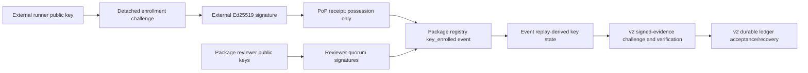

# Engine v2 HIP FGMRES reviewed trust-anchor lifecycle v2

## 1. 상태와 목적

- 마일스톤: v0.2.37 feature-branch publication
- 구현 상태: `implemented`
- promotion 상태: `contract_only`
- 패키지 active runner key: `0`
- 패키지 reviewer authority: `0`
- actual external `gfx1100`: `0/10`
- promotion/commercial ready: `false`

이 단계는 v0.2.36 signed release-identity verifier가 사용하던 snapshot key-row 모델을, package-owned append-only event history에서 runner key 상태를 도출하는 v2 trust registry로 교체한다. 외부 runner가 제출한 키는 별도의 Ed25519 proof-of-possession(PoP)을 통과해야 하며, init 이후의 모든 registry event는 패키지에 고정된 reviewer public key 정족수 서명을 요구한다.

이 계약은 실제 HSM 키, 실제 reviewer root, 실제 외부 GPU 실행을 만들거나 증명하지 않는다. 현재 패키지 fixture는 의도적으로 reviewer와 runner key가 빈 epoch 1 registry이며, 공개 challenge/verify 경로는 fail-closed다.

## 2. 권한 구조

권한은 다음과 같이 분리된다.

1. Caller는 등록 challenge에 포함된 공개 정보와 서명만 제출할 수 있다.
2. PoP receipt는 해당 시점에 private key 보유가 검증되었음만 증명한다.
3. Runner와 reviewer 공개키는 canonical Edwards encoding, non-identity, exact prime-order subgroup을 통과해야 하며 low-order/mixed-order point를 거부한다.
4. PoP receipt 자체는 package registry에 key를 추가하거나 활성화하지 못한다.
5. Init 이후 registry event는 이벤트 본문과 predecessor event hash에 결속된 reviewer 정족수 서명을 통과해야 한다.
6. Signed-evidence v2와 replay-ledger v2는 caller의 registry를 받지 않고 현재 package resource를 코드 고정 raw SHA-256으로 다시 읽는다.
7. Process-local verified wrapper는 signed receipt, release identity, trust-registry hash를 같이 보관한다. Durable wrapper는 여기에 ledger receipt를 추가로 결속한다.

## 3. Detached key enrollment v1

등록 challenge는 다음 값을 canonical self-hash에 포함한다.

- 32-byte verifier nonce, request ID
- runner ID, exact `ed25519:<runner>:v<epoch>` key ID, key epoch
- predecessor registry epoch/hash, exact next target registry epoch
- rotation일 경우 직전 key ID/epoch/public-key hash/final run sequence
- canonical non-identity prime-order Ed25519 public key, public-key SHA-256
- exact `gfx1100`, fixed-suite ID, fixture raw/content hash
- finite inclusive run-sequence 구간
- finite UTC validity 구간
- runner-declared key origin과 optional attestation digest

외부 서명자가 서명하는 메시지는 전용 domain prefix와 challenge canonical JSON의 결합이다. 검증기는 backend Ed25519 호출 전에 공개키와 signature `R`의 canonical prime-order point, signature scalar `S < L`을 독립 검사한다. 등록 모듈은 signing/private-key API를 제공하지 않는다.

첫 key는 `key_epoch=1`, `minimum_run_sequence=1`, predecessor key `null`이어야 한다. Rotation key는 직전 key와 다른 public key를 사용하고, key epoch을 1 증가시키며, `minimum_run_sequence = predecessor.maximum_run_sequence + 1`을 만족해야 한다.

PoP receipt에서 true인 claim은 `private_key_possession_at_enrollment_verified`하나뿐이다. Package inclusion, activation, HSM origin, HSM non-exportability, reviewer identity, hardware execution, promotion, commercial readiness는 모두 false다.

## 4. Event-sourced trust registry v2

Registry snapshot은 strict Draft 2020-12 schema, code-anchored raw resource hash, contiguous registry epoch, predecessor snapshot hash, contiguous event sequence/hash chain을 검사한다. Registry hash는 매 epoch마다 schema/profile/scope, epoch, 직전 registry hash, 불변 reviewer-set commitment, 현재 head event hash만 canonical-hash하는 고정 크기 rolling chain이다. Mutable key row를 외부 권한으로 받지 않고 다음 event를 재생해 현재 key 상태를 도출한다.

| Event | 전이 |
| --- | --- |
| `registry_initialized` | registry ID와 최소 reviewer approval 수를 고정 |
| `key_enrolled` | 유효한 PoP receipt를 `enrolled` 상태로 추가 |
| `key_activated` | 첫 key를 `enrolled -> active`로 전이 |
| `key_rotated` | 직전 `active -> retired`, 연속 successor `enrolled -> active`를 원자적으로 전이 |
| `key_retired` | `active -> retired` |
| `key_revoked` | `enrolled`, `active`, `retired` key를 `revoked`로 전이 |

재생 검증은 runner별 key epoch 연속성, reviewer↔runner 역할 간을 포함한 전체 registry의 public-key 재사용 금지, runner별 active key 최대 1개, run/time range 비중첩, 시간 순서, reviewer authority 유효 구간, 중복 reviewer/key approval 금지를 fail-closed로 강제한다. Derived key는 reviewer가 승인한 activation/rotation 시각을 보존하고 `valid_from <= activated_at < valid_until`, terminal 시각의 strict-after-activation을 강제한다. Signed verifier는 evidence 관찰 시각이 activation보다 앞서면 active key를 사용하지 않는다. Rolling prefix hash와 runner별 immediate-predecessor/active-key index를 사용해 event/key replay를 `O(E+K)`로 유지한다. 이는 trust-registry 재생의 복잡도 경계일 뿐 FE solver나 end-to-end 제품의 `O(N)` 증거가 아니다.

## 5. Signed evidence·durable ledger 결합

Signed-evidence v2는 v1 trust-registry result를 수용하지 않는다. Challenge 발급과 envelope 검증은 exact v2 registry result와 현재 package registry hash를 사용한다. Key가 `active`가 아니거나 runner/key epoch/run sequence/time/suite/fixture binding이 다르면 실패한다. `enrolled`, `retired`, `revoked`는 모두 신규 challenge처럼 현재 권한을 요구하는 경로에서 비활성이다.

Replay-ledger v2도 issue, acceptance, response-loss recovery 모두에서 현재 package registry v2를 다시 읽는다. 저장된 receipt의 trust-registry hash와 현재 registry가 다르면 historical resolver로 뒤로 물러서지 않고 실패한다.

## 6. 명시적 비주장 범위

다음은 이 단계에서 증명하지 않는다.

- runner-declared HSM/hardware-token origin의 진위
- private key non-exportability
- reviewer의 실명, 독립성, 조직적 승인, HSM 사용
- vendor attestation, TPM, remote attestation
- 외부 transparency log/monotonic anchor
- 과거 package registry와 fixture registry를 결정론적으로 찾는 historical resolver
- cross-host/cross-ledger replay 방지, coordinated rollback 저항
- hostile same-process Python module/global/private-mint mutation 격리
- 실제 external `gfx1100` 실행, actual `10/10`
- 동일 final artifact의 `gfx1030`/`gfx1100` two-architecture 증거
- ResultIR, iteration host-copy-zero, speedup, end-to-end O(N)
- promotion 또는 commercial readiness

현재 epoch 1 fixture에는 실제 reviewer root가 없고, init event가 빈 reviewer set의 canonical commitment를 고정한다. 따라서 이 현재 lineage에 나중에 reviewer key를 몰래 추가해 operational registry로 위장할 수 없다. 실제 onboarding은 독립 reviewer/HSM public key, 운영 정책, 검토 기록을 갖춘 별도의 명시적 bootstrap/migration 계약이 필요하다. 그 계약이 구현·검증되기 전에는 실제 key enrollment/activation이 패키지 권한으로 승격될 수 없다.

## 7. 고정 해시와 검증

패키지의 빈 init registry는 다음 identity로 고정한다.

- enrollment schema: `sha256:25efb0862eefbee44f9b88dff48b8ee831ae5ea0d79bcba31a3f6d1b8e7ae614`
- registry schema: `sha256:d8ed736d9c98959d18a50467e3e0a919504c538dd44e510ee83b0ff016278c6e`
- raw registry resource: `sha256:dfa6172c8819f812d9992f64e6e3d5fa0f97e7c2651b49ca7ee47ccc557a2fbc`
- rolling registry head: `sha256:5dc12aa7bb553f1852eb702f1d0ad6f3b927f193dcd7ce28f85a5c9658d6b1e4`
- head event: `sha256:0742df80dcb3c737362fac6c4c409668976b10a030a35f5305e9951f527b1813`
- registry replay receipt: `sha256:3330f6e4ca6738faf02e2244441241cbe0998c1a0a0ce13a1aa85a6826da345f`

현재 고정 바이트 기준 집중 검증은 Ed25519 `11 passed`, detached enrollment `28 passed`, trust-registry v1/v2 `7/27 passed`, signed-evidence v1/v2 `58 passed`, durable-ledger v2 `26 passed`, public export/resource `7 passed`, capability matrix `8 passed`의 비중복 `172 passed`를 통과했다. Candidate wheel은 `1163595` bytes/`220` members, `sha256:a53f7d7c836e304ba6a8ef0026910095b6e4b0e7c1df643c5585bc6082c2c7da`, `RECORD` `sha256:e45c1648aabf116a885b1eb915485c1786c0d50f5455e383ccde7c8563c9a2a3`이며 2회 byte-reproducible build, 격리 설치·package resource import, RFC 8032 정상/변조 경로와 private-key 표식 부재를 확인했다. 독립 감사에서 재현된 pre-activation authorization `HIGH`는 reviewer activation 시각을 derived key에 보존하고 authorization lower bound로 강제해 수정했으며 해당 회귀를 포함한 최종 범위에 잔여 `BLOCKER/HIGH`는 없다. Python 동일 프로세스가 module global/private mint를 직접 변조하는 공격은 명시적 비주장 범위다.

## 8. 다음 마일스톤

1. 실제 독립 reviewer public key set을 초기화하는 명시적 bootstrap/migration 계약을 추가한다.
2. 그 reviewer set이 isolated runner/HSM public key의 enrollment/activation을 정족수로 서명한 package snapshot을 만든다.
3. 해당 final artifact로 external actual `gfx1100` fixed suite `10/10`을 수집한다.
4. 같은 final artifact를 local actual `gfx1030` fixed suite `10/10`에서 재실행한다.
5. Package/trust/fixture rotation을 역사적으로 해석하는 archived-release resolver와 external monotonic anchor를 추가한다.

이 순서가 완료되기 전에는 외부 GPU cell, two-architecture, promotion 또는 상용화 claim을 올리지 않는다.
