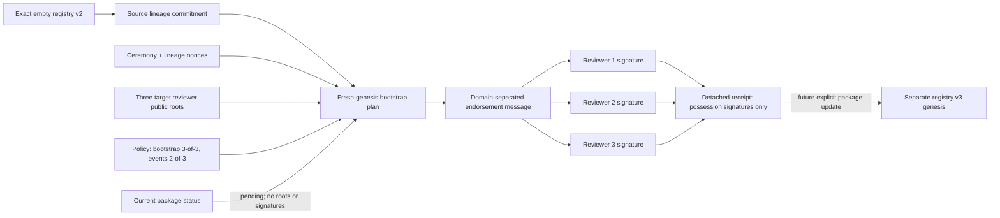

# Engine v2 HIP FGMRES reviewer-root bootstrap/new-trust-genesis v1

## 1. 상태와 목적

- 마일스톤: v0.2.38 working-tree milestone
- 구현 상태: `implemented`
- promotion 상태: `contract_only`
- package bootstrap 상태: `pending_independent_reviewer_root_material`
- package reviewer root material: `0`
- target registry v3 genesis: `inactive`
- package runner/active key: `0/0`
- actual external `gfx1100`: `0/10`
- promotion/commercial ready: `false`

v0.2.37 trust-registry v2는 reviewer가 0명인 epoch-1 genesis이고, 빈 reviewer 집합의 commitment가 모든 rolling prefix에 불변으로 들어간다. 따라서 reviewer를 나중에 같은 lineage에 추가하거나 v2 epoch 2로 이어 붙이는 것은 append가 아니라 과거 genesis의 재작성이다.

이 계약은 그 불가능성을 숨기지 않는다. 기존 v2의 정확한 source identity를 결속하고, 별도 registry ID와 lineage를 사용하는 v3 fresh genesis를 준비한다. 목표 reviewer root는 정확히 3개이고 bootstrap에는 3개 전원의 detached Ed25519 endorsement를 요구하며, 미래 운영 event policy는 2-of-3으로 고정한다.

현재 패키지는 실제 독립 reviewer key를 포함하지 않는다. 공개 pathless loader는 코드에 고정된 `pending` status만 반환한다. Detached 성공 경로는 계약과 검증기를 시험하기 위한 synthetic key 회귀이며 package inclusion, registry activation 또는 운영 reviewer authority를 만들지 않는다.

## 2. 왜 migration continuity가 아닌가

현재 source v2 identity는 다음과 같다.

| 항목 | 고정값 |
| --- | --- |
| schema | `structural-analysis-hip-fgmres-external-trust-anchor-registry.v2` |
| registry ID | `structural-analysis-engine-v2-external-trust-registry` |
| schema raw | `sha256:d8ed736d9c98959d18a50467e3e0a919504c538dd44e510ee83b0ff016278c6e` |
| raw registry | `sha256:dfa6172c8819f812d9992f64e6e3d5fa0f97e7c2651b49ca7ee47ccc557a2fbc` |
| registry hash | `sha256:5dc12aa7bb553f1852eb702f1d0ad6f3b927f193dcd7ce28f85a5c9658d6b1e4` |
| epoch/event | `1/1` |
| head event | `sha256:0742df80dcb3c737362fac6c4c409668976b10a030a35f5305e9951f527b1813` |
| head event time | `2026-07-15T00:00:00Z` |
| reviewer commitment | `sha256:4f53cda18c2baa0c0354bb5f9a3ecbe5ed12ab4d8e11ba873c2f11161202b945` (`canonical_hash([])`) |
| reviewer/runner/active key | `0/0/0` |
| replay receipt | `sha256:3330f6e4ca6738faf02e2244441241cbe0998c1a0a0ce13a1aa85a6826da345f` |

Source에는 migration을 승인할 reviewer가 없다. 새 reviewer의 자기 endorsement는 세 public key 아래에서 exact plan에 대한 유효한 signature가 존재함, 즉 서명 시점의 대응 private-key possession만 증명한다. 현재 control, 인간의 informed consent 또는 자신에게 권한을 부여할 권리는 증명하지 않는다. 따라서 최초 전환의 신뢰 근거는 향후 실제 reviewer material과 receipt를 포함해 배포하는 명시적 package update가 된다. 이 package-rooted genesis는 이전 reviewer quorum의 권한 연속성을 증명하지 않는다.

강한 release 간 연속성은 이전 release에 migration key가 미리 고정되어 있거나 외부 transparency/monotonic authority가 있어야 한다. v0.2.37에 없던 권한을 v0.2.38에서 소급해 만들 수는 없다.

## 3. 권한과 데이터 흐름

공개 API는 signing 또는 private-key loading 기능을 제공하지 않는다. 외부 signer가 exact endorsement message를 서명하고, 검증기는 public root와 signature만 소비한다.

## 4. Fixed policy

v1 policy는 임의 caller 설정을 허용하지 않는다.

- algorithm: `Ed25519`
- reviewer count: `3`
- bootstrap endorsement count: `3`
- future registry event threshold: `2`
- exact target-genesis activation endorsement count: `3`
- target genesis가 bootstrap plan/receipt hash를 결속해야 함
- lineage-bound runner enrollment만 허용
- reviewer root set: lineage 안에서 immutable
- reviewer rotation: 새 lineage 필요
- target schema: `structural-analysis-hip-fgmres-external-trust-anchor-registry.v3`
- target registry ID: `structural-analysis-engine-v2-external-trust-registry-reviewer-root-v3`
- target lineage generation: `1`

각 reviewer root는 다음 공개 필드만 가진다.

- reviewer ID
- exact `ed25519-review:<reviewer>:v1` key ID와 epoch 1
- canonical, non-identity, exact prime-order Ed25519 public key와 SHA-256
- finite canonical UTC validity interval

Root는 `(reviewer_id, key_id, key_epoch)` 순으로 canonical ordering되어야 한다. Reviewer ID, key ID, public-key hash는 모두 유일해야 한다. Bootstrap 시각은 `[valid_from, valid_until)` 안에 있어야 하며 `valid_until` 경계는 무효다.

Bootstrap 시각은 exact source head 시각보다 strict-later여야 한다. 이 검사는 declared timestamp의 내부 순서만 보장하며 wall clock의 진위를 증명하지 않는다.

## 5. Hash와 signature graph

순환 dependency를 피하기 위해 bootstrap plan/receipt에 final registry-v3 raw hash를 넣지 않는다.

1. `source_lineage_commitment = H(exact source registry tuple)`
2. `reviewer_policy_hash = H(exact fixed policy)`
3. `reviewer_root_commitment = H(canonically ordered roots)`
4. `target_lineage_id = SHA256(lineage_domain || canonical(ceremony ID/nonce/time, source commitment, target identity/generation/lineage nonce, policy hash, root commitment))`
5. `plan_hash = H(plan fields excluding plan_hash)`
6. 각 root는 `endorsement_domain || canonical(plan including plan_hash)`를 서명한다.
7. `receipt_hash = H(plan + sorted endorsements + exact claims)`

Signature 검증은 Ed25519 backend 호출 전에 기존 Engine v2 evidence primitive를 통해 public key와 signature `R`의 canonical exact-prime-order 조건 및 `S < L`을 검사한다. Wrong key/domain/plan/lineage transplant를 모두 거부한다.

## 6. Public package status

패키지 resource `status.v1.json`은 다음 상태만 허용한다.

- status: `pending_independent_reviewer_root_material`
- exact v0.2.37 empty source binding
- target v3 identity와 fixed policy
- `bootstrap_plan = null`
- `bootstrap_receipt = null`
- reviewer public key/signature material 없음

Public loader는 caller path나 manifest를 받지 않는다. Schema bytes와 status raw bytes를 코드 고정 SHA-256으로 검사하고, 현재 package registry-v2를 fresh replay해 exact source tuple과 다시 비교한다. Public result validator도 현재 package status와 exact equality를 요구한다.

고정 identity는 다음과 같다.

- bootstrap schema raw: `sha256:f15ca0fe364706e3d6889ac13e61eb73cd3acbadc169b287f903863434b20fda`
- package status raw: `sha256:253945078b9d84d9a816d835978ba033073f94fefe76715f9a7f17bf956bbbaa`
- source lineage commitment: `sha256:932ce4d0b2b90168204cef7285bc004f557ff569f6376854fbda9d581a46e5ff`
- reviewer policy hash: `sha256:d4566a2dd1d2bf76b240ff2c2002085d3358bcbd50d6790c1b52dd11c311834f`
- package status hash: `sha256:cfd57e04c9dfb293edf7cac2bfd5bcec9ac61a97488cd8991eaef2287f4cfcad`

## 7. Claim boundary

Detached all-root receipt에서 true인 범위는 다음뿐이다.

- exact empty source lineage가 plan에 결속됨
- 세 target public root 아래에서 exact-plan private-key possession signature를 검증함
- 동일한 canonical plan에 대한 세 cryptographic signature를 모두 검증함

Package pending status에서 true인 범위는 다음뿐이다.

- exact package contract resource를 로드함
- schema/raw status code pin을 검증함
- exact empty source lineage를 fresh replay해 결속함
- fresh genesis가 필요함

다음은 명시적으로 false다.

- 이전 reviewer authority에서 새 reviewer authority로의 continuity
- 실제 reviewer public-root material의 package inclusion
- target registry-v3 genesis activation
- reviewer의 실명, 조직 신원, 독립성 또는 운영 승인
- HSM origin, non-exportability 또는 hardware token 진위
- trusted ceremony wall clock
- ceremony nonce의 CSPRNG entropy 또는 전역 uniqueness
- hostile same-process Python object/module/global mutation 저항
- release supply-chain 또는 remote commit 진위
- external transparency log, monotonic anchor 또는 rollback 저항
- historical registry resolver
- runner key enrollment/activation
- signed-evidence-v3 또는 durable-ledger-v3
- actual external `gfx1100`, same-artifact two-architecture
- ResultIR, iteration host-copy-zero, speedup, end-to-end `O(N)`
- promotion 또는 commercial readiness

## 8. Complexity와 bounds

Reviewer count는 정확히 3으로 고정되어 있지만 구현은 bounded wire bytes `B`와 root/endorsement를 한 번씩 순회한다. Ceremony 검증은 `O(B+R)` 시간과 `O(B+R)` parsing/index 공간을 사용하고 `R=3`, `B<=256 KiB`다. 이는 trust bootstrap 검증 복잡도일 뿐 FE solver 또는 전체 제품의 `O(N)` 증거가 아니다.

Parser는 다음 경계를 적용한다.

- package resource/schema: 각 256 KiB 이하
- JSON node: 최대 20,000
- JSON depth: 최대 48
- reviewer roots/endorsements: 정확히 3
- canonical Base64: public key 32 bytes, signature 64 bytes
- duplicate JSON member, BOM, non-finite constant 거부
- error path 512 chars, message 240 chars로 제한

## 9. 검증 범위

집중 테스트는 다음을 포함한다.

- exact package pending status, schema/raw/self-hash pin
- source raw/registry/head/reviewer commitment/count/receipt 각각의 변조
- source schema/head time, 같은 registry ID 재사용과 generation/lineage 변조
- 동일 lineage nonce에서 ceremony ID/nonce/time이 다른 split-plan 식별자 분리
- source head 이전/동시 bootstrap timestamp 거부
- root 삽입·삭제·재정렬·중복 ID/key/public-key hash
- low-order/noncanonical public key
- validity 이전/만료/반개구간 경계
- endorsement 누락·초과·중복·재정렬
- wrong key/domain/plan transplant와 malformed signature
- integer/float/bool alias와 pre-hash nested type/string/collection extent 거부
- forged package inclusion/activation/promotion claim
- pathless public loader와 exact package replay
- duplicate JSON/BOM/non-finite/depth/node/error bounds
- pending fixture에 reviewer key/signature/private material이 없음

현재 신규 집중 테스트는 `54 passed`, 신규 public/resource 결합까지 `61 passed`, capability matrix까지 합친 통합 회귀는 `69 passed`다. 인접 Ed25519/key-enrollment/registry-v2 `66 passed in 32.64s`, signed-evidence-v1/v2 `58 passed in 1164.35s`, frozen-tree durable-ledger-v2 `26 passed in 329.50s`를 합쳐 scoped 비중복 회귀는 `219 passed`다. 보안, claim-boundary, integration/API/package 감사의 최종 등급은 모두 `BLOCKER/HIGH/MEDIUM/LOW=0/0/0/0`이다.

첫 signed 회귀 중에는 schema resource가 live working tree에서 변경되어 module-scoped release binding과 후반 current-package replay가 달라졌고, 정확히 `4`건이 `release_current_package_mismatch`로 fail-closed했다. Source/schema를 동결한 전체 재실행에서 `58/58`이 통과했다. 실패한 실행을 제품 결함으로 숨기거나 성공 수치에 합산하지 않는다. 남은 publication gate는 아래 exact declared PEP 517 recipe와 offline wheelhouse 검증이다.

### 9.1 Exact PEP 517 smoke와 authoritative publication 경계

Git tracked working bytes와 v0.2.38 신규 source/resource만 물질화한 clean snapshot 두 벌을 사용했다. 각 snapshot은 build 전 `222` files, manifest `sha256:cd90eb752978f57b0a63fadf83e705d2a505bbca5275a976354793655dd42b77`로 동일했고 `egg-info`, `__pycache__`, `pyc`는 `0`이었다. Build frontend/system wheelhouse는 `build 1.5.1`, `setuptools 83.0.0`, `wheel 0.47.0`, `tomli 2.4.1`, `packaging 26.2`, `pyproject_hooks 1.2.0`의 여섯 wheel로 고정했으며 ordered SHA-256 manifest hash는 `sha256:6c970ac436b5bfd451ac31d817d217cecd7f20711bf6aa4542ceb76284dcdba9`다.

두 snapshot에서 policy와 같은 상대 경로 `PIP_FIND_LINKS=dependency-wheelhouse`, `PIP_NO_INDEX=1`, fixed locale/timezone/hash seed/source epoch를 사용해 exact argv `python -m build --wheel --outdir dist .`를 실행했다. 두 wheel은 모두 `1180847` bytes, `224` members, `sha256:e7d9cfa4790185d5590c4fb30e7a81d30d84422acd49afd5d5f4e58be0718f5a`로 byte-identical이었다. `RECORD`/member-manifest/wheel-identity hash는 각각 `sha256:d60255b688556a067a5bf72e65175892d081616939d4f19dcc79b07bc613cc8c`/`sha256:1d27f1ff6af1c4f0cef276f5b032c6086fa28f9af6012645a7553467df323854`/`sha256:c1d1a86ce87d7b003ee2130e4ad0ed6829a24f6a5fcd8121d2da3ad412f671ba`다. 모든 ZIP timestamp는 `2026-07-15T00:00:00`, source-path/test/private-key filename 누출은 `0`이고 Engine v2 wheel artifact verifier를 통과했다.

Repo 밖 isolated target 설치에서는 root public export identity, schema/status raw hash, pathless loader의 `pending_independent_reviewer_root_material`, reviewer roots 없음, target inactive, promotion/commercial false를 확인했다. 기존 no-isolation fallback wheel `sha256:558007fb2d0a0317824ff80bde50bf8c305440bdf6aecb2a015a941ba788e9d1`은 historical smoke로만 보존한다.

이 성공은 authoritative release-identity publication receipt가 아니다. 현재 v0.2.38은 uncommitted working tree여서 `source_artifact_v1`의 clean HEAD/index/worktree/archive replay를 만족하지 않는다. 더 근본적으로 v1 recipe는 PEP 517 build-system wheel과 runtime dependency exact closure를 같은 `dependency-wheelhouse` 경로에 둔다. Build에 필요한 `setuptools`, `wheel`, `tomli` 등은 runtime lock에 없는 extra artifact이므로 dependency verifier가 `dependency_lock_wheelhouse_artifact_extra`로 거부한다. 따라서 별도 build-system lock/wheelhouse를 갖는 후속 contract 없이 v1 authoritative gate를 통과했다고 주장하지 않는다. `build_system_dependency_closure_verified`, clean committed source, runtime dependency closure, publication approval은 계속 false다.

## 10. 다음 마일스톤

1. 세 명의 실제 독립 reviewer가 각자 HSM 또는 분리된 keystore에서 public root를 생성한다.
2. 별도 채널로 reviewer 신원·독립성·운영 승인 기록을 검토하되 이 코드 receipt와 혼동하지 않는다.
3. 세 root 전원이 동일 bootstrap plan을 서명한다.
4. Exact plan/receipt를 package update에 고정하고 별도 registry-v3 genesis schema/resource를 구현한다.
5. 세 root가 exact v3 genesis descriptor에 대해 별도의 3-of-3 activation signature를 만들고, genesis가 bootstrap plan/receipt hash를 직접 결속하도록 한다.
6. Registry-v3에는 lineage-bound key-enrollment-v2만 허용하고 enrollment-v1 transplant를 거부한다.
7. Runner key activation 뒤 signed-evidence-v3와 ledger-v3를 별도 domain/schema/namespace로 추가한다.
8. 그 후에만 external actual `gfx1100` 10/10과 동일 artifact local `gfx1030` 10/10을 수집한다.
9. Historical resolver와 external monotonic anchor가 생기기 전까지 package rollback/historical recovery claim은 false로 유지한다.
