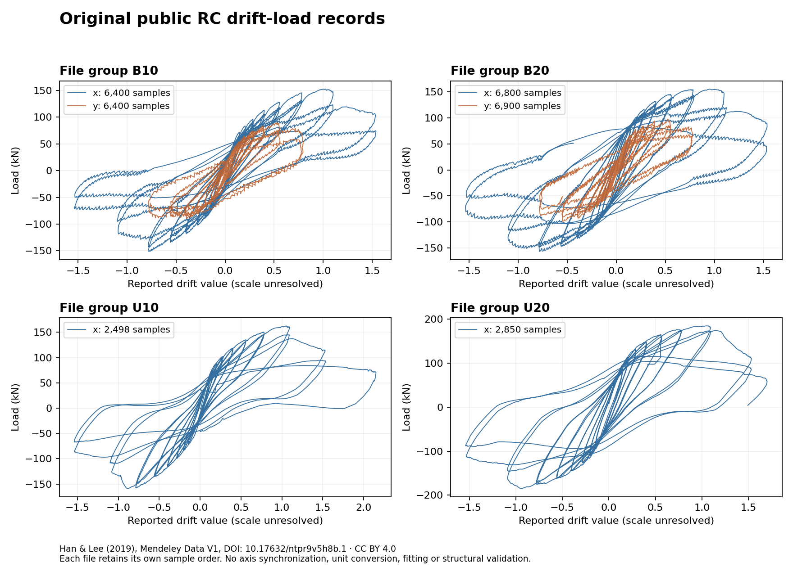

# Public RC drift/load originals and lossless CSV intake

The reader at `bbe578509bfb8c35fe1ddfa490a0e71addde907c` now preserves the
measured drift/load CSV layout in
`structural_analysis.io.measured_drift_load`. An actual source audit covers all
six files of [Han and Lee's Mendeley Data V1](https://data.mendeley.com/datasets/ntpr9v5h8b/1),
DOI `10.17632/ntpr9v5h8b.1`: **31,848 observation pairs / 63,696 decimal cells**.
Every original cell token and decimal tuple compares exactly, including decimal
exponents, nonzero initial readings and repeated observations.

The dataset page and each file's visible information panel declare **CC BY 4.0**.
All six downloaded SHA-256 values match the publisher's visible file checksums.
This establishes a recorded source reuse statement and byte-consistent intake;
it does not establish compatibility with the current RC solver or admit the
records as training or independent physical-validation cases.

## Files and the semantics that must remain explicit

| Original file | Observations | Local filename group |
| --- | ---: | --- |
| Hys_B10x.csv | 6,400 | B10 |
| Hys_B10y.csv | 6,400 | B10 |
| Hys_B20x.csv | 6,800 | B20 |
| Hys_B20y.csv | 6,900 | B20 |
| Hys_U10x.csv | 2,498 | U10 |
| Hys_U20x.csv | 2,850 | U20 |

The original CSV header says `Drift ratio,Load (kN)`. It supplies a force unit,
but does not resolve whether the drift values are fractions or percentages.
No reference length is included. The decoder therefore preserves reported drift
values without producing metre-valued displacements or loading commands.

The B20 files have different sample counts. Matching their rows by index, taking
the shorter length, or interpolating one to the other would introduce an
unverified synchronization assumption. Even equal counts in B10 do not establish
shared acquisition times. The reader keeps each file separate and in source
order, without smoothing, centering, trimming or axis alignment. Each actual
file ends with one empty CSV record; its count is retained explicitly. Interior
empty records, incomplete rows, changed headers and nonfinite cells are rejected.

Six channel files are not six independent experiments. The
[associated publisher abstract](https://www.sciencedirect.com/science/article/pii/S0141029618333443)
describes four full-scale specimens and a study of short lap splices. The local
filename labels remain provisional specimen mappings, grouped under one original
study for split planning. No train/validation/holdout partition is assigned.
All publications, mirrors and channels for an original specimen must remain in
that originating group before fitting or calibration.

Derived visualization from Han, Sang Whan; Lee, Chang Seok (2019), *Data for:
Cyclic behaviour of lightly-reinforced concrete columns with short lap splices
subjected to unidirectional and bidirectional loadings*, Mendeley Data, V1,
[doi:10.17632/ntpr9v5h8b.1](https://doi.org/10.17632/ntpr9v5h8b.1),
[CC BY 4.0](https://creativecommons.org/licenses/by/4.0/).
The change from the source is this visualization: lines connect each file's
original observation sequence independently. It contains no fitted or predicted
response. The displayed drift scale remains unresolved.

## Executed verification and retained originals

The focused check passes **48 tests in 1.73 s**: 28 new CSV-reader cases and
20 existing PEER-reader cases. Tests cover exact decimals under a low-precision
caller context, signed zero, offsets, reversals, unequal channel lengths,
UTF-8/BOM and quoted cells, explicit trailing empty records, malformed/missing
observations and bounded input sizes. Ruff, formatting and the new module's mypy
check pass. An initial check also passed all 48 tests in 1.75 s but requested
formatting of the test file; that formatting was applied before the committed
source was verified.

The actual original-file audit checks all 573,405 CSV bytes against the fetched
file records and publisher hashes. It uses a separate literal-line inspection
of these original unquoted files to compare every cell and decimal tuple with
the decoder. It exits zero in **0.133520319 s internally / 1.533306707 s parent**,
with zero Newton solves, model compilations or fits. These timing scopes are
nested. This audit is source-fidelity evidence, not independent solver validation.

The [machine record](mendeley-rc-drift-load-intake-20260909.summary.json) includes
source IDs, per-file links and license observations, hashes, counts, tests and
the acquisition attempts. The packet at
`/mnt/193005ba-8531-4d0b-87c2-43c01ee2ce25/structural-rc-archive-intake.0zk0q8qz`
contains **30 files / 1,333,718 bytes**, all reread exactly. Its adjacent inventory
SHA-256 is `54f88fabc24bd38c4ca7a1ada7d2dc640ec6ebd62eb5be33ea5eb322011470da`.
The earlier PEER and completed learning-study packets remain unchanged.

## Reconstruction still required

Original specimen geometry, reinforcement, material data, axial loading, drift
definition, commanded loading and any cross-channel time base remain to be
verified against the original report. A current-profile model cannot be accepted
merely because a file contains a familiar hysteresis curve: representation of
short lap-splice behavior and biaxial coupling must be established separately.
Missing inputs remain missing, and calibration assumptions must be declared and
confined to the appropriate split.

A [related 2023 conference paper](https://repo.nzsee.org.nz/bitstream/handle/nzsee/2616/Han.pdf?isAllowed=y&sequence=1)
uses different NC/HC specimen names. Its drawings and dimensions are not assigned
to these 2019 records. The Southampton circular-column landing page and author
README were captured, but its MATLAB files, reuse basis and reconstruction were
not inspected. CORA's demountable column-shoe connection and the Zenodo lap-splice
reference units remain separate source candidates. Unsuccessful metadata/API
probes are retained; no data are admitted from failed responses.

This completes the named source intake and reader implementation. External
training admission, physical validation, the broader learning/generalization
requirements and the complete M1–M5/P1–P3/R1/R2 roadmap remain open.
