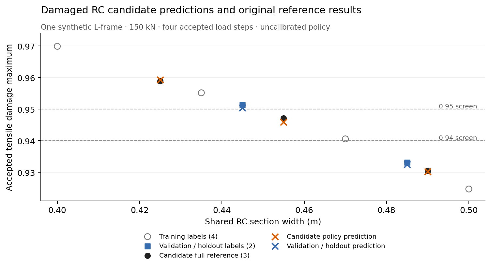

# Damaged RC candidate learning: repeated selection and retained originals

At frozen source `0183c600dcdc2073ed1e890492ef166803ec0dbe`, the seven-target
candidate policy finds a fully verified candidate in all four declared online
case/repetition pairs. The equal-budget price-order strategy finds none. The
whole suite therefore remains **incomplete**, with valid report/resource
contracts and `local_timing_evidence_eligible=false`. This demonstrates useful
ranking in one frozen synthetic candidate pool, without establishing equal-quality
speedup, calibrated safety, independent generalization or construction savings.

## Fixed inputs and selection budget

Observation root:
`/tmp/structural-damaged-candidate-history-observation.uqy_za6w/`.
`protocol.json` revision 2, `request.json`, original inputs, source identities and
launch receipts precede numerical execution. The model is the public two-member
RC L-frame with N3 FY = -150 kN and shared section RC1. Only section width varies;
geometry, reinforcement, materials and load history remain fixed. All requests
use four proportional load steps, residual tolerance `1e-10`, increment tolerance
`1e-12` and at most 40 iterations. Optional terminal polishing is not enabled.

| Split | Widths (m) | Original public requests |
| --- | --- | ---: |
| Train | .4, .435, .47, .5 | 4 |
| Validation | .445 | 1 |
| Holdout | .485 | 1 |

The explicit profile is `terminal_and_committed_material_history.v1`: terminal
translation/strain, accepted-history translation/strain, steel accumulated
plastic strain and concrete tensile/compressive damage. Preprocessing, target
scales, ranges and weights use only the four training rows, with ridge `1e-6`
and OOD margin `.1`. All six original labels retain positive tensile damage;
steel plastic accumulation and compressive damage remain zero. Unique declared
project/geometry/load-history IDs refer to the same synthetic family and do not
establish independent projects or a blind corpus. Physical input identities do
not overlap between splits or with the online pool.

Frozen training report:
`sha256:520576838a82287ec14dc42fe2e39c3f988527eed058a91d545388b112fbb46a`.
Policy artifact:
`sha256:dadb7cfa519e7833a42c98c46687e1db4daf1c046fe28726c651911481f2b879`.

Both online arms receive baseline width .42 m, candidate widths .425/.455/.49 m
and a two-request budget: one baseline plus one shortlisted candidate. Exploration
budget is zero. Two predeclared cases set tensile-damage maxima .95 and .94;
both require zero steel plastic accumulation and zero compressive damage, with
terminal/history translation limits of 1 m and dimensionless strain limits of 1.
These are caller research
screens. They are not design-code limits or independently approved safety criteria.

Each case has two order-balanced repetitions, zero warmups and a separate
exhaustive oracle after both online arms. The two cases reuse the same physical
pool and differ only in their damage screen. Oracle labels are unavailable to
online selection. Common synthetic prices are concrete 100 per m³ and steel 1
per kg, labelled KRW; these are declared comparison inputs, not current quotes.
No refit, threshold change, candidate replacement or numerical retry occurred.

## Original analysis and selection outcomes

Six generation requests, 16 online requests and 16 oracle requests completed:
**38 public requests in total**, including 32 current comparison requests across
12 fresh workers. The capture observer retained original public JSON and raw
checkpoint bytes for all 38 calls. All 32 current requests pass their original
reference, response-history and material-history validation, and their terminal
and history screens. Twenty-two material-screen failures are retained feasibility
outcomes; none is a failed numerical/history validation.

| Input | Width (m) | Verified tensile damage | Predicted tensile damage | Synthetic material estimate (KRW) |
| --- | ---: | ---: | ---: | ---: |
| Baseline | .42 | .9606663726943693 | Unavailable | 173.2626 |
| width-0425 | .425 | .9588649919330566 | .9593546915259789 | 174.3126 |
| width-0455 | .455 | .9471940743451447 | .9459362475751791 | 180.6126 |
| width-0490 | .49 | .9304904804455402 | .9302813962992461 | 187.9626 |

The last estimate is rounded from `187.96259999999998`. These saved predictions
are in range in all 12 candidate/case/repetition evaluations. The exact original
analysis and all requested validations retain final selection authority.

| Damage screen | Oracle-feasible pool | Price-order selection, both repeats | Learned selection, both repeats | Missed feasible, price-order / learned per repeat |
| --- | --- | --- | --- | --- |
| ≤ .95 | .455, .49 | None; baseline and .425 fail | .455 | 2 / 1 |
| ≤ .94 | .49 | None; baseline and .425 fail | .49 | 1 / 0 |

The learned strategy selects the lowest-priced feasible candidate in this
three-candidate pool. At .95, the feasible .49 candidate still counts as missed
because it was not shortlisted; finding the cheapest candidate does not change
that definition. Learned terminal and combined false-safe counts, predicted-safe
unverifiable counts and oracle unverifiable counts are zero in all four pairs.
The deterministic strategy makes no prediction, so its false-safe and
predicted-safe-unverifiable counters are **null / not applicable**, not zero.

All 12 worker manifests are `ready`, with exit code 0 and valid report/resource
contracts. However, all four price-order search reports are `blocked` with
`final_selection=null`: execution completed but no feasible candidate was found.
The suite CLI exits 2 with `status=incomplete` and `report_contract_pass=true`.
The paired equal-quality cost comparison is false and amortization is unavailable
because there is no deterministic winner. Those original statuses remain visible
in the portable review and are not rewritten as a successful timing study.

Grouping current calls by both canonical-model checksum and input checksum gives
four repeated physical input groups: baseline 12, .425 eight, .455 six and .49
six calls. Within every group, **both public JSON and raw checkpoint bytes are
exactly equal**. The six training inputs are separate singleton groups. Hashes
bind retained bytes; they are not external provenance or physical validation.

## Saved-policy validation and holdout errors

After the numerical observation, a separate helper evaluates the frozen policy
on the two saved evaluation rows. The preceding saved-data audit binds the
retained public/checkpoint bytes; this helper validates model bytes and frozen
training, policy and label bindings. It makes exactly two surrogate predictions,
with zero fitting, public analysis or physical recovery calls. Both rows are in
range. Terminal and
accepted-history maxima coincide for these monotonic inputs.

| Saved split | Absolute translation error (m) | Absolute strain error | Actual tensile damage | Predicted tensile damage | Absolute damage error |
| --- | ---: | ---: | ---: | ---: | ---: |
| Validation .445 | 9.023159541365119e-5 | 9.625076935759606e-6 | .951370778704988 | .9504090622254457 | .0009617164795422406 |
| Holdout .485 | 1.3773209918242855e-5 | 1.3779598359669435e-6 | .9331831702341196 | .9325178036243794 | .0006653666097401478 |

Steel plastic and compressive-damage prediction and labels are zero. Two
evaluation rows and threshold agreement in three online candidates provide no
calibrated error bound or independent safety guarantee. The saved-data plot
`postrun/damage-predictions.svg` (also PNG) shows the discrete training,
evaluation and candidate points with the two screens; it contains no fitted
confidence band or extra numerical evaluation.



The committed PNG is byte-exact to the saved plot, SHA256
`e5937604e401301939f4bde014b738c8ddcf862e0649837fa97a9a43dd031564`.
The first documentation diff check flagged generated SVG trailing whitespace;
the document embeds the original PNG, retaining the unchanged SVG in the sealed root.

## Inclusive cost and instrumentation

The captured analyzer forwards each original public call once and returns the
identical typed result. It exports raw public/checkpoint data, validates the
checkpoint accessor and records API/export wall and CPU. It does not accumulate
live result objects or request another public analysis. Startup imports, export,
fsync and transient memory remain charged in enclosing process wall/CPU/peaks.
Source validation and physical replay inside existing collection/comparison
paths are included; 38 public requests is not a count of every internal solve.

| Measured scope | Wall (s) |
| --- | ---: |
| Generation in frozen training report | 310.587635558 |
| Internal fit in frozen training report | .002199284 |
| Entire collection child, launch through exit | 312.306685053 |
| Current process parent through aggregation | 1685.876359322 |
| Comparison CLI child, launch through exit | 1689.136593386 |
| Generation + fit + current process accounting | 1996.466194164 |
| Driver through both children | 2001.482571193 |

These are overlapping measurement scopes, not additive rows. The collection API
receipt separately records 310.592683634 s wall and 310.489458264 s CPU, excluding
collector startup, input construction and final report persistence. The frozen
training report does not contain historical CPU, so the suite retains that field
as unavailable rather than inserting this different-scope receipt.

Current parent CPU is 2.443506045 s and the disjoint worker subtotal is
1681.028102697 s, giving 1683.471608742 s. Parent preflight is already included.
Capture API wall sums to 1172.910613395 s and export wall/CPU to
17.601526313 / 17.193545570 s. These are subintervals of the observation; receipt
serialization/I/O is outside the export subinterval but inside enclosing costs.
Preparation and subsequent audits, export, plots and browser verification remain
separate additional work, not hidden inside the original timing numerator.

| Screen | Price-order median parent slot (s) | Learned median parent slot (s) | Paired price-order minus learned (s) | Median paired difference (s) |
| --- | ---: | ---: | --- | ---: |
| .95 | 106.3055770525 | 107.0118364015 | -.581620161, -.830898537 | -.706259349 |
| .94 | 105.7347078875 | 105.3668941500 | +.420122223, +.315505252 | +.3678137375 |

Parent slots include request persistence, worker launch/imports, ranking,
analysis, selection, worker persistence and parent validation. Shared preflight,
final aggregation and training are outside each slot. Different selected widths
and unsuccessful deterministic selection prevent equal-quality or causal
acceleration claims. All failed-screen work and separate oracle costs are retained.

Across four workers per strategy, process peak RSS ranges are
124,350,464–125,378,560 bytes for price-order, 129,118,208–129,830,912 for learned
and 124,407,808–124,809,216 for oracle. These are separate lifetime high-water
marks including instrumentation, never summed or subtracted as memory savings.
Coordinator peak memory is unavailable; GPU time is unavailable on this CPU path.
Bounded worker input reads total 979,600 bytes and search-report writes total
28,900,268 bytes. Their counters exclude capture files, sidecars, manifests,
parent suite persistence and browser exports; they are not full disk traffic.

## Preparation, audit and actual Workbench review

The first preparation caught a hook identity change before any collection or
comparison launch. Its original protocol, hook and zero-analysis preflight remain
under `preparation/`. Revision 2 freezes both final hook copies at
`ec8ef3878d9f3daf0026c7207400314e76e86b3f55070029cc469f923554bda3`
(10,440 bytes). The old startup-only preflight is identified separately and has
zero public calls. This was a preparation correction, not a numerical retry.

The 397 committed package files (261 Python, 136 JSON) and declared observation
inputs are byte-exact before and after execution, with a clean worktree. The
saved-data audit passes **2,533 checks**: source/Git identities, train-only
membership and preprocessing, all 12 worker/schedule/resource contracts,
recomputed costs and oracle accounting, raw result/checkpoint binding, repeated
byte identity and unchanged originals. It performs no fit, analysis, replay or
worker launch. Audit launch-to-exit costs 5.820829465 s; held-out prediction costs
1.916145952 s; portable export costs 6.822222752 s. These are postrun intervals.

The stock portable exporter binds the original 33,003,405-byte suite through a
v2 review manifest with 54 artifacts and eight comparisons. The complete review
directory has 72 files and 70,787,556 bytes. A real loopback HTTP server serves
those bytes and the existing UI distribution from the same source revision.
Chromium 141.0.7390.37 verifies desktop 1440×1000 and mobile 390×844 viewports.
The passing run `postrun/browser-run-33cUkc/receipt.json` records 1,975 assertions.
Each viewport covers all 12 worker slots, eight online comparisons, 18
original-byte downloads (suite, manifest and eight comparison/manifest pairs),
eight whole-Workbench exports checked for equality of their bound source objects,
and 22 retained screenshots. A generated whole export is not claimed byte-exact
to any original file.

Checks bind displayed terminal/history/material metrics and limits, quantities,
material estimates, the exact baseline-plus-shortlist candidate IDs, null selection, and
combined false-safe/unverifiable arithmetic. Both viewports display the original
`incomplete` suite status. Prediction scope wording is checked; numeric candidate
predictions are preserved in raw metadata, not claimed as a new displayed table.
Document widths equal 1440 and 390 pixels respectively. The mobile import table
retains internal horizontal scrolling (328-pixel client, 602-pixel contents,
tested scroll offset 40), and checked controls meet the 44-pixel target.

The first real browser attempt is preserved at
`postrun/browser-run-EYuTAa/receipt.json`, with its original helper and driver log.
Both viewports completed their 26 downloads and screenshots, but its final
mobile response-body check failed when Playwright's inspector evicted the
33,003,405-byte suite. The second helper explicitly provisions a CDP response
buffer (256 MiB total, 64 MiB per resource). Only that exact inspector eviction
error permits reading the buffered response with the same URL and unique server
request ID; original length/SHA assertions remain required. The retry retains
the mobile eviction diagnostic and successfully checks the same response bytes
through that buffer. No source, review artifact or numerical result was changed.

The passing receipt retains all request and console diagnostics: desktop has
three review `ERR_ABORTED` events and mobile four, plus one unrelated static
viewer request per viewport. Each review event has individual server-finish,
full-byte, timing and verified-provider/export correlation; no cancellation
cause is inferred or blanket exception used. Both viewports retain 14 console
errors from other static viewer/evidence resources and zero page exceptions.
There are zero unexplained review transport events under these checks. This is
scoped candidate-review evidence, not whole-application or hosted acceptance.
Both contexts and the loopback server close after the run. Browser work and the
initial failed attempt remain separate from the numerical timing observation.

## Sealed artifact identity

After all numerical/browser processes were terminal and writers had stopped,
`seal.py` created `artifact-inventory.json` and a separate read-only invocation
verified its exact file coverage, byte lengths and every SHA256. Both commands
exited 0. The inventory covers **928 files / 1,888,433,680 bytes**, excluding only
its own 187,396 bytes. Its SHA256 is
`a5c396ddf7309f2def8d5473e147d4c157133d15c380756d461dd30d87f49665`.

The sealed root includes the full 397-file source snapshot, original inputs,
38 raw captures, all worker/report/resource files, both browser attempts and
downloads, postrun audit/prediction/plot scripts and receipts, completion metadata
and README. Its size includes the whole-Workbench exports from both browser
attempts; those files are retained original observation output. The seal helper
streams hashes, rejects symlinks/special/protected filenames, checks the
terminal/incomplete status boundaries and refuses to overwrite an existing
inventory. This is not an atomic filesystem snapshot or external attestation.
External UI distribution bytes are bound by the before/after browser receipt,
not copied into this inventory. No file in the observation root is changed
after successful sealing and separate verification.

Recheck without numerical or browser execution:

```bash
python3 -B /tmp/structural-damaged-candidate-history-observation.uqy_za6w/seal.py verify --inventory artifact-inventory.json
```

This increment adds actual damaged candidate ranking and source-bound review to
the earlier low-load correctness integration in
`rc-fiber-candidate-history-learning.md`. The previous all-OOD material study and
failed learned displacement study keep their original identities and outcomes.
Repeated compatible families, independent licensed corpus, steel-plastic/cyclic
coverage, broader planar/3D validation, hosted integration and owner/admin gates
remain open in the M1–M5/P1–P3/R1/R2 register.
