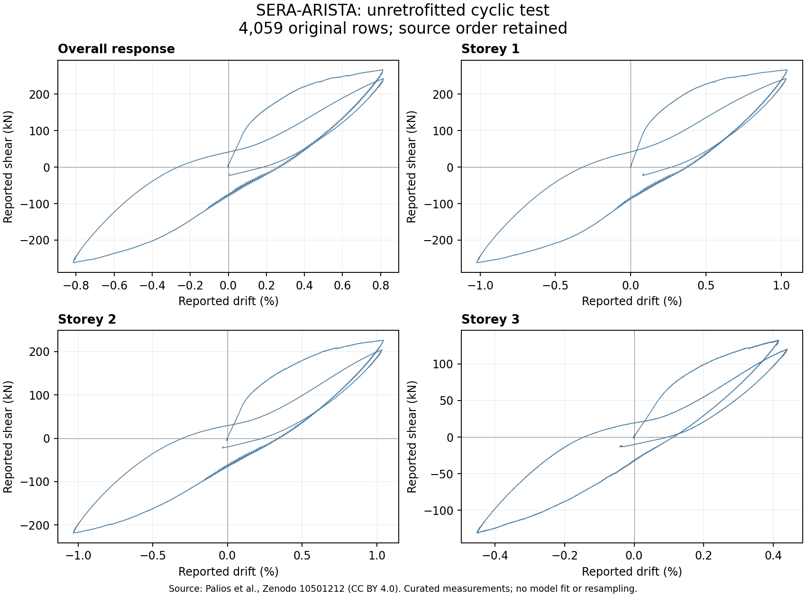

# SERA-ARISTA drawings and measured response intake

[Zenodo record 10501212](https://zenodo.org/records/10501212), DOI
`10.5281/zenodo.10501212`, provides the University of Patras SERA-ARISTA
three-storey RC experiment. Its metadata declares
[CC BY 4.0](https://creativecommons.org/licenses/by/4.0/).
The dataset creators are X. Palios, E. Strepelias, N. Stathas, M. Fardis,
S. Bousias, C. Chrysostomou and N. Kyriakides. The accompanying explanation
points to their [2020 experiment paper](https://doi.org/10.1007/s10518-020-00900-5).

This intake acquires **11 original files / 8,496,172 bytes**: the explanation,
geometry and column naming drawings, general view, unretrofitted instrumentation
drawings and unretrofitted cyclic workbook. Every file matches the publisher's
MD5 checksum and has a retained SHA-256 identity. Both API metadata requests
succeed after the web page reader times out. No retried analysis or data repair
is hidden. The separate retrofitted cyclic and collapse workbooks are not acquired.

The explanation distinguishes three tests: the low-level unretrofitted cyclic
test, retrofitted cyclic test and subsequent monotonic test. These are states of
one physical structure and must remain in the same campaign group for dataset
partitioning. Only the first state is inspected here.

## Geometry and measurement correspondence

Visual review of the geometry drawing confirms three 2.00 m storey annotations,
6.00 m overall height, 0.25 by 0.25 m columns, 0.20 by 0.33 m beams and 0.14 m
slab thickness. The column naming and base strain-gage drawings identify C1-C6,
orientation and sensor labels. Instrumentation is not a complete reinforcement
specification; no missing bar size, strength, axial load or bond-slip law is filled
in from assumptions.

The workbook contains one sheet, `Sheet1`, with four header rows and **4,059
observation rows**, `A5:DL4063`. There are 116 columns, including the observation
index. Its 471,045 populated cells comprise 201 header strings and 470,844
numeric observation values. There are no formulas. Styled blank cells in the
header are retained separately from numeric observations.

| Source columns | Reported quantity |
| --- | --- |
| A | Top displacement, mm |
| B | Base shear, kN |
| C | Top drift, percent |
| D/E, F/G, H/I | Storey drift in percent and shear in kN |
| J | Observation index, 1-4059 |
| K:AZ | Bar strain channels, percent, with column/side/section/sensor headers |
| BA:DL | Interface displacement channels, mm, with storey and sensor headers |

An exact-token extraction retains all **40,590 numeric XML tokens** in A:J,
including original row numbers. The remaining sensor columns remain intact in
the original workbook. There is no unit guessing, interpolation, centering,
resampling, formula execution or workbook rewrite. Observation indices are
consecutive, but a sampling interval in seconds has not been established.

The plot uses the source's percent and kN channels directly. It represents the
curated experimental observations, not a solver fit or validation result.

## A material reference-height distinction

Across all 4,059 observations, `A - 59.3*C` differs from zero by at most
`7.9086e-14 mm`. Thus these two supplied channels are algebraically consistent
with a **5.93 m** drift reference height. Applying the drawing's 6.00 m overall
height instead gives a maximum displacement discrepancy of **0.570447317 mm**.
This is an inferred channel relationship; the exact instrument reference point
has not been authoritatively identified. No source channel is corrected.

Likewise, the base and first-storey shear channels are numerically identical,
while combining the three drift channels with uniform 2.00 m heights differs
from the reported top displacement by up to **1.75272155 mm**. These are
diagnostics for reconciling measurement definitions, not imposed acceptance
criteria. Drawing and measurement reference points must be resolved before
constructing corresponding model outputs.

## Preserved scope and next requirements

The source packet is retained at
`/mnt/193005ba-8531-4d0b-87c2-43c01ee2ce25/structural-zenodo-drawing-intake.4urv2oe1`:
**28 files / 10,644,403 bytes**, inventory SHA-256
`b2a85a7395f15ed72af10705e95dc1b7c36ce361153e62963c43c1ee1e1def75`.
The [machine summary](zenodo-arista-source-intake-20260910.summary.json) records
source URLs, file checksums, exact header cells, channel checks and exclusions.
The PDF and selected drawings are visually inspected; the derived plot is also
reviewed. Bundled Python performs read-only XML inspection. Its missing
Matplotlib is recorded; the available system Matplotlib generates the plot.

Material and reinforcement definitions, gravity/axial and lateral loading,
sensor reference points, full sensor correspondence, bond-slip/lap-splice
compatibility and whole-history solver support remain open. No canonical
physical model, external training sample or independent validation credit is
created. The paper's repository metadata describes separate restrictions; its
full text was not obtained, and the dataset declaration is not transferred to it.
Zenodo 2653488, which advertises a DWG and wall experiments, is retained as
metadata only with its `afl-3.0` declaration; none of its files is acquired.

This source investigation runs alongside the expanded authored learning pilot.
That pilot records the concurrent coordinator activity; no isolated-hardware
timing claim follows from either task. Existing studies and protected receipts
remain unchanged, and the full roadmap remains open.
