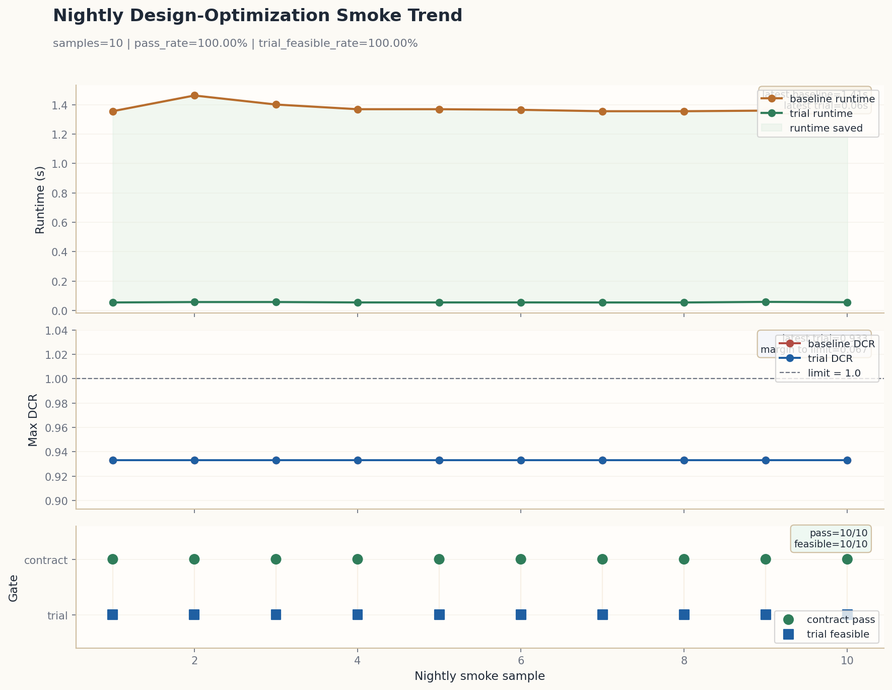
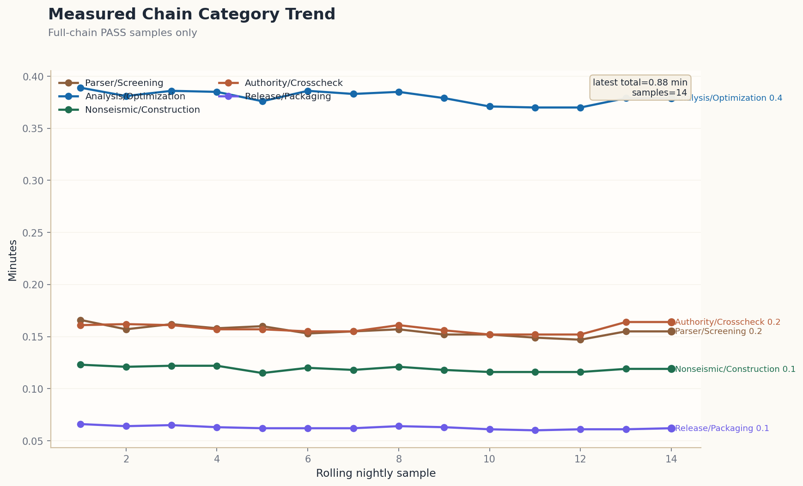

# External Validation One-Page

- Generated at: `2026-04-22T14:05:48.342988+00:00`
- Bundle id: `20260422T140547Z`

## Gate Status

- `nightly_release`: `PASS`
- `ci_gate`: `PASS`
- `static_validation`: `PASS`
- `freeze_release`: `PASS`
- `promotion`: `PASS`

## Integrity

- `signed_release_registry`: `PASS`
- `registry_signature_verified`: `PASS`
- `solver_hip_e2e`: `PASS`
- `rc_benchmark_lock`: `PASS`
- `ndtha_residual_gate`: `PASS`
- `committee_review_package`: `PASS`
- `midas_section_library_validator`: `MIDAS section-library: ok | 182/183 used | 183 templates | source=midas_parser_derived | implementation/phase1/open_data/midas/midas_generator_33.json`

## MIDAS Section Library

- `status`: `embedded metadata validated`
- `validator_line`: `MIDAS section-library: ok | 182/183 used | 183 templates | source=midas_parser_derived | implementation/phase1/open_data/midas/midas_generator_33.json`
- `consumers`: `nightly / release gap / committee dashboard / external validation onepage all consume the same validator line`

## Constitutive / Interaction Coverage

- `constitutive_interaction_families`: `expanded constitutive/interaction families are surfaced explicitly as shared summary lines across the release, committee, and external reports; the same lines are reused as-is.`
- `material_constitutive`: `Material constitutive gate: PASS | concrete_damage=yes(matrix=48/48,max=1.000) | cyclic_degradation=yes(matrix=46/46,residual_max=1.914%,lib=rev2/pinch0.22/crush1.00/series=3/3@2400/wall=1/rc=2) | bond_interface=yes(matrix=48/48,bond_max=0.980) | creep_shrinkage=yes(matrix=7/7,mean=1.000/0.617) | soil_boundary_nonlinear=yes(matrix=11/11,profile=dense_sand) | device_dissipation=yes(matrix=10/10,types=3) | foundation_impedance_nonlinear=yes(matrix=19/19,links=6) | contact_link_hysteresis=yes(matrix=15/15,cats=6) | panel_zone_joint_response=yes(matrix=12/12,rows=12) | wind_dynamic_response=yes(matrix=16/16,topo=4) | track_support_viscoelasticity=yes(matrix=11/11,class=B) | vehicle_track_transient_coupling=yes(matrix=19/19,iters=1.01) | tunnel_soil_wave_attenuation=yes(matrix=13/13,dist=24) | serviceability_velocity_response=yes(matrix=8/8,pass_ratio=1.000) | construction_stage_redistribution=yes(matrix=6/6,diff=1) | joint_constraint_transfer=yes(matrix=5/5,rows=135) | aeroelastic_serviceability=yes(matrix=7/7,pass_ratio=1.000) | heterogeneous_soil_adaptation=yes(matrix=5/5,recall=1.000) | segment_joint_softening=yes(matrix=5/5,yield=53.000) | longitudinal_wave_strain_transfer=yes(matrix=5/5,strain=0.000000) | raw_pressure_field_mapping=yes(matrix=5/5,mapped=7278) | phase_assimilation_correction=yes(matrix=5/5,ratio=0.964) | multiscale_streaming_refinement=yes(matrix=5/5,chunk=16) | integrated_vibration_transfer=yes(matrix=5/5,checks=4) | resilience_ood_recovery=yes(matrix=5/5,steps=3) | boundary_absorption_nonlinear=yes(matrix=6/6,supports=2) | attention_load_localization=yes(matrix=6/6,peak=0.350) | residual_energy_stabilization=yes(matrix=7/7,solver=FIRE) | matrix=400/400 | groups=concrete_damage=48/48,cyclic_degradation=46/46,bond_interface=48/48,creep_shrinkage=7/7,soil_boundary_nonlinear=11/11,device_dissipation=10/10,foundation_impedance_nonlinear=19/19,contact_link_hysteresis=15/15,panel_zone_joint_response=12/12,wind_dynamic_response=16/16,track_support_viscoelasticity=11/11,vehicle_track_transient_coupling=19/19,tunnel_soil_wave_attenuation=13/13,serviceability_velocity_response=8/8,construction_stage_redistribution=6/6,joint_constraint_transfer=5/5,aeroelastic_serviceability=7/7,heterogeneous_soil_adaptation=5/5,segment_joint_softening=5/5,longitudinal_wave_strain_transfer=5/5,raw_pressure_field_mapping=5/5,phase_assimilation_correction=5/5,multiscale_streaming_refinement=5/5,integrated_vibration_transfer=5/5,resilience_ood_recovery=5/5,boundary_absorption_nonlinear=6/6,attention_load_localization=6/6,residual_energy_stabilization=7/7,phase_latency_projection=5/5,cache_window_adaptation=5/5,whitebox_feedback_stitching=5/5,recovery_residual_relock=5/5,rail_support_contact_modulation=5/5,tunnel_lining_interface_recovery=5/5,panel_feedback_residual_transfer=5/5,wind_pressure_coupled_transfer=5/5 | coverage=cd[t=2,h=2,s=2,sf=19],cyc[t=2,h=2,store=1,sf=18],bond[t=2,h=2,s=2,sf=18]`
- `surface_interaction`: `Surface interaction benchmark: PASS | ready=7/7 | family_matrix=420/420 | source_families=10/10 | shell_surface=yes | interface_transfer=yes | interface_gap=yes | foundation=yes | track_slab=yes | vehicle_track=yes | tunnel_lining_soil=yes | joint_panel=yes | ssi=yes | soil_tunnel=yes | direct_contact=6/6 | general_fe_coupling=yes | groups=modal-transfer=4/4,phase-assimilation-coupling=4/4,streaming-partition-coupling=4/4,integrated-vibration-coupling=4/4,resilience-recovery-coupling=4/4,kinematic-coupling=3/3,constraint-bridge=3/3,wave-radiation=2/2,boundary-absorption-coupling=4/4,attention-guided-transfer=4/4,residual-stabilization-coupling=4/4,solver-feedback-coupling=4/4,multiphysics-coupling=4/4,explicit-shear-transfer=4/4,phase-latency-coupling=4/4,cache-window-coupling=4/4,whitebox-feedback-coupling=4/4,recovery-residual-coupling=4/4,support-contact-modulation-coupling=4/4,lining-recovery-coupling=4/4,panel-feedback-coupling=4/4,pressure-mapping-coupling=4/4,shell-shell=53/53,shell-wall=81/81,footing-soil=62/62,track-slab=8/8,vehicle-track=8/8,tunnel-lining-soil=8/8,joint-panel=8/8,ssi=13/13,soil-tunnel=84/84,direct-contact=11/11`

## MIDAS Native Roundtrip / Write-Back

- `roundtrip_gate_summary`: `MIDAS native roundtrip: PASS | corpus=77 | native_text=35 | public_native=9 | public_raw_native=8 | public_bridge_native=1 | public_preview_native=7 | public_structural_preview_native=8 | fixture_native=4 | repo_native=3 | experiment_native=3 | archives=7 | ready=35 | public_ready=25 | public_native_ready=9 | public_raw_ready=8 | public_bridge_ready=1 | public_preview_ready=7 | public_structural_preview_ready=8 | exact_queue=0/8 | korean_reconstruction=5/5 | korean_promotions=0/0 | fixture_ready=4 | repo_ready=3 | experiment_ready=3 | receipts=35/35 | topology=35/35 | load=35/35 | loadcomb=35/35 exact | coverage=ready:100%,receipts:100%,loadcomb:100%,public_source:71%,exact_queue:100%,kr_recon:100% | gaps=ready:0,receipts:0,topology:0,load:0,loadcomb:0,public_source:10,exact_queue:0,korean_reconstruction:0 | types=12 | taxonomy=exact:34,canonical:1,lossy:0,unsupported:0,manual:0 | pending_review=0`
- `writeback_diff_summary`: `MIDAS native write-back diff receipts: PASS | ready=35 | receipts=35/35 | topology=35/35 | load=35/35 | loadcomb=35/35 exact | types=12 | exact_queue=0/8 | korean_promotions=0/0 | taxonomy=exact:34,canonical:1,lossy:0,unsupported:0,manual:0 | pending_review=0`
- `honest_counts`: corpus=77 | native_text=35 | ready=35 | public_native_ready=9 | public_preview_ready=7 | public_source_ready=25 | structure_types=12 | batches=12 | receipts=35/35 | pending_review=0
- `appendix_md`: `implementation/phase1/release/midas_native_roundtrip/unsupported_lossy_card_family_appendix.md`
- `appendix_json`: `implementation/phase1/release/midas_native_roundtrip/unsupported_lossy_card_family_appendix.json`
- `receipts_report`: `implementation/phase1/release/midas_native_roundtrip/midas_native_writeback_diff_receipts_report.json`

## KR Source / Preview

- `kr_ingest_summary`: `KR ingest: PASS | src=15 | cls=4 | got=10 | fp=10 | meta=5 | rej=0 | dup=0 | seed=15 | topo=5 | native=5 | p0=11`
- `measured_benchmark_breadth`: `Measured benchmark breadth: PASS | baseline=2/51 | opensees_delta=6/7 | authority_delta=2/6 | external_delta=10/10 | canton_delta=1/220 | measured_families=21 | measured_cases=294 | parser_ready=3`
- `opensees_canonical_breadth`: `OpenSees canonical breadth: PASS | families=6 | cases=7 | parser_ready=3 | origins=designsafe_publication=1,github_public=2,global_authority=2,public_lab_download=2`
- `kr_preview_queue_summary`: `KR preview queue: PASS | cand=8 | pend=0 | state=closed_until_new_public_archive_exact_topology_candidate`

### KR Representative Type Batches

- `summary`: `rows=7 | lanes=public_native_ready=5, public_structural_preview_ready=2`

#### Public Structural Preview Lane

| Structure Type | Representative | Lane | System | Receipt | Type Batch |
|---|---|---|---|---|---|
| mixed_use | buildingSMART Korea BIM Awards 2024 구조 골조 curated IFC (`ifc_public_award_reference_2024`) | public_structural_preview | mixed_structure | `implementation/phase1/release/midas_native_roundtrip/21.ifc_public_award_reference_2024_structural_preview_candidate_identity_writeback.diff_receipt.md` | `implementation/phase1/release/midas_native_roundtrip/mixed_use.diff_batch.md` |
| public_facility | buildingSMART Korea BIM Awards 2020 구조 골조 curated IFC (`ifc_public_award_reference_2020`) | public_structural_preview | rc_frame | `implementation/phase1/release/midas_native_roundtrip/22.ifc_public_award_reference_2020_structural_preview_candidate_identity_writeback.diff_receipt.md` | `implementation/phase1/release/midas_native_roundtrip/public_facility.diff_batch.md` |

#### Public Native Lane

| Structure Type | Representative | Lane | System | Receipt | Type Batch |
|---|---|---|---|---|---|
| building | 콘크리트 건축물 구조설계 예제집 (제2판) curated MIDAS baseline (`kci_concrete_building_design_examples_2e_native_baseline`) | public_native | rc_frame | `implementation/phase1/release/midas_native_roundtrip/28.kci_concrete_building_design_examples_2e_native_baseline_identity_writeback.diff_receipt.md` | `implementation/phase1/release/midas_native_roundtrip/building.diff_batch.md` |
| housing | 부천역곡지구 A-1블록 공동주택 설계공모 curated MIDAS baseline (`lh_bucheon_yeokgok_a1_housing_native_baseline`) | public_native | wall_frame_hybrid | `implementation/phase1/release/midas_native_roundtrip/26.lh_bucheon_yeokgok_a1_housing_native_baseline_identity_writeback.diff_receipt.md` | `implementation/phase1/release/midas_native_roundtrip/housing.diff_batch.md` |
| industrial_facility | 고양창릉 복합발전소 건설사업 설계기술용역 (`koneps_goyang_changneung_powerplant_design_service`) | public_native | steel_rc_hybrid | `implementation/phase1/release/midas_native_roundtrip/24.koneps_goyang_changneung_powerplant_design_service_identity_writeback.diff_receipt.md` | `implementation/phase1/release/midas_native_roundtrip/industrial_facility.diff_batch.md` |
| mixed_use | 행정중심복합도시 5-1생활권 설계공모 curated MIDAS baseline (`lh_happy_city_5_1_native_baseline`) | public_native | rc_core_wall_frame | `implementation/phase1/release/midas_native_roundtrip/27.lh_happy_city_5_1_native_baseline_identity_writeback.diff_receipt.md` | `implementation/phase1/release/midas_native_roundtrip/mixed_use.diff_batch.md` |
| public_facility | 한강공원 매점(광나루2호) 신축 설계용역 curated MIDAS baseline (`koneps_hangang_park_gwangnaru2_native_baseline`) | public_native | rc_frame | `implementation/phase1/release/midas_native_roundtrip/25.koneps_hangang_park_gwangnaru2_native_baseline_identity_writeback.diff_receipt.md` | `implementation/phase1/release/midas_native_roundtrip/public_facility.diff_batch.md` |

## Irregular Structure Track

- `track_summary`: `Irregular structure collection gate: PASS | families=20 | sources=32 | local_ready=15 | remote_candidates=17 | collected=21 | top5=5`
- `source_catalog_summary`: `Irregular source catalog: PASS | families=20 | sources=32 | local_ready=15 | remote_candidates=17`
- `triage_summary`: `Irregular triage: PASS | native_candidates=18 | solver_candidates=13 | ai_candidates=32`
- `collection_summary`: `Irregular collection: PASS | collected=21 | metadata_only_remote_candidate=-4 | rejected=0`
- `top5_summary`: `Irregular top5 manifest: PASS | top5=0 | local_ready=0 | remote_needed=0`
- `benchmark_execution_summary`: `Irregular benchmark execution: CHECK | ready=0 | blocked=0 | task_count=0 | canonical=0 | bridged=0 | proxy=0 | receipts=0`
- `top5_family_ids`: `n/a`
- `benchmark_manifest`: `implementation/phase1/release/external_benchmark_kickoff/irregular_benchmark_execution_manifest.json`
- `receipt_index`: [irregular benchmark receipt index](artifacts/implementation/phase1/release/external_benchmark_kickoff/irregular_benchmark_receipts/receipt_index.json)
- `canonical_promotion_queue_count`: `0`
- `canonical_promotion_queue_scope`: `only unresolved bridged families shown`

## Nightly Smoke Probe

- `smoke_reason_code`: `PASS`
- `smoke_pass_rate`: `100.00%`
- `smoke_trial_feasible_rate`: `100.00%`
- `smoke_avg_trial_runtime_s`: `0.0563`
- `smoke_history_count`: `10`
- `smoke_strict_recommendation`: `candidate_for_strict_enable`

### Smoke Trend

- `smoke_history_png`: `implementation/phase1/release/release_gap_smoke_history.png`
- `runtime_drift`: baseline `1.3553s -> 1.4059s` (`+0.0507s`), trial `0.0551s -> 0.0567s` (`+0.0016s`)
- `max_dcr_drift`: baseline `0.9332 -> 0.9332` (`+0.0000`), trial `0.9332 -> 0.9332` (`+0.0000`)

### Recent Smoke Samples

| Sample | Generated | Pass | Trial Feasible | Baseline Runtime (s) | Trial Runtime (s) | Trial Max DCR | Action |
|---:|---|---|---|---:|---:|---:|---|
| 6 | 2026-04-06T12:19:39.039411+00:00 | True | True | 1.3646 | 0.0554 | 0.9332 | connection_detailing_down |
| 7 | 2026-04-06T12:23:56.108705+00:00 | True | True | 1.3550 | 0.0550 | 0.9332 | connection_detailing_down |
| 8 | 2026-04-06T12:23:56.108705+00:00 | True | True | 1.3550 | 0.0550 | 0.9332 | connection_detailing_down |
| 9 | 2026-04-06T12:32:45.009996+00:00 | True | True | 1.3590 | 0.0590 | 0.9332 | connection_detailing_down |
| 10 | 2026-04-06T13:54:47.180033+00:00 | True | True | 1.4059 | 0.0567 | 0.9332 | connection_detailing_down |

### Measured Chain Category Trend

- `measured_chain_category_png`: `implementation/phase1/release/release_gap_measured_chain_categories.png`

## Key Metrics

- `commercial_grade`: `Commercial`
- `deployment_model`: `engineer_in_the_loop_accelerated_coverage`
- `accelerated_coverage_target`: `95-99%`
- `residual_holdout_target`: `1-5%`
- `estimated_time_saved`: `90-96%`
- `measured_chain_wall_clock_comparable_rolling_min`: `0.88` (N=14, range=0.846-0.906)
- `measured_chain_wall_clock_min`: `0.88`
- `comparable_run_selection_mode`: `current_pipeline_comparable_full_chain_pass`
- `comparable_reference_deployment_model`: `engineer_in_the_loop_accelerated_coverage`
- `comparable_reference_strict_smoke`: `True`
- `engineer_in_loop_accelerated_coverage_ready`: `True`
- `empirical_smoke_runtime_reduction`: `95.66-96.04%`
- `estimated_time_saved_basis`: `Empirical estimate derived from nightly design-optimization smoke runtime reduction, scaled by the accelerated-coverage target. smoke_mean_runtime_saved=95.92%, sample_count=10.`
- `time_saving_focus`: `Use this engine to automate the dominant, time-consuming 95-99% of repeated analysis, screening, packaging, and optimization workflows. Keep the residual 1-5% under licensed engineer review, legacy-tool cross-check, and formal sign-off workflows.`
- `full_commercial_replacement_ready`: `False`
- `external_benchmark_submission_ready_to_start_now`: `True`
- `external_benchmark_submission_ready_to_start_full_submission_now`: `True`
- `external_benchmark_submission_reason_code`: `PASS_START_NOW_FULL`
- `external_benchmark_submission_recommended_start_mode`: `start_now_full_external_submission`
- `external_benchmark_submission_recommended_submission_scope`: `full_external_submission_package`
- `external_benchmark_submission_blocker_label`: `none`
- `external_benchmark_submission_caution_label`: `panel_zone_external_validation_only_boundary`
- `external_benchmark_execution_mode`: `limited`
- `external_benchmark_execution_ready_task_count`: `10`
- `external_benchmark_execution_blocked_task_count`: `0`
- `external_benchmark_execution_review_boundary_pending_count`: `0`
- `external_benchmark_execution_review_boundary_resolution_label`: `approve_all=PASS_NO_OPEN_DECISION_ITEMS/ready_full=yes; reject_one=PASS_NO_OPEN_DECISION_ITEMS/open_revision=0`
- `external_benchmark_execution_review_boundary_owner_label`: `none`
- `external_benchmark_execution_review_boundary_assignee_label`: `none`
- `external_benchmark_execution_review_boundary_assignment_status_label`: `none`
- `external_benchmark_execution_review_boundary_priority_label`: `none`
- `external_benchmark_execution_review_boundary_family_label`: `none`
- `external_benchmark_execution_review_boundary_change_count_total`: `0`
- `external_benchmark_execution_review_boundary_followup_action_label`: `none`
- `external_benchmark_execution_review_boundary_sla_state_label`: `none`
- `external_benchmark_execution_review_boundary_age_bucket_label`: `none`
- `external_benchmark_execution_review_boundary_overdue_count`: `0`
- `external_benchmark_execution_review_boundary_oldest_open_age_hours`: `0.000`
- `external_benchmark_execution_status_mode`: `execution_complete_no_fail`
- `external_benchmark_execution_planned_task_count`: `0`
- `external_benchmark_execution_in_progress_task_count`: `0`
- `external_benchmark_execution_completed_task_count`: `10`
- `external_benchmark_execution_failed_task_count`: `0`
- `external_benchmark_execution_finished_task_count`: `10`
- `external_benchmark_execution_completion_ratio`: `1.000`
- `external_benchmark_case_onepage_count`: `10`
- `external_benchmark_case_onepage_dir`: `external_benchmark_case_onepages`
- `external_benchmark_case_attestation_workflow`: `cases=10 | manifests=10 | templates=0 | receipts=10 | attested=10 | source=manifest=10 | status=MANIFEST_ATTESTED_AND_AUTHORITY_RECEIPTED=10 | kickoff_index=implementation/phase1/release/external_benchmark_kickoff/case_onepage_attestation_index.json`
- `audit_review_decision_batch_template_item_count`: `0`
- `audit_review_decision_batch_template_current_status_label`: `none`
- `audit_review_decision_batch_template_review_owner_label`: `none`
- `audit_review_decision_batch_template_review_priority_label`: `none`
- `audit_review_decision_batch_attested_example_count`: `0`
- `audit_review_decision_batch_attested_example_preview_label`: `approve_all=PASS_START_NOW_FULL, mixed=PASS_START_NOW_FULL`
- `external_benchmark_submission_preview_approve_all_reason_code`: `PASS_NO_OPEN_DECISION_ITEMS`
- `external_benchmark_submission_preview_approve_all_ready_full`: `False`
- `external_benchmark_submission_preview_approve_all_pending_count`: `0`
- `external_benchmark_submission_preview_approve_all_open_revision_count`: `0`
- `external_benchmark_submission_preview_reject_one_reason_code`: `PASS_NO_OPEN_DECISION_ITEMS`
- `external_benchmark_submission_preview_reject_one_ready_full`: `False`
- `external_benchmark_submission_preview_reject_one_pending_count`: `0`
- `external_benchmark_submission_preview_reject_one_open_revision_count`: `0`
- `external_benchmark_submission_preview_reject_one_blocker_label`: `none`
- `audit_review_decision_batch_runner_reason_code`: `PASS_ZERO_TOUCH_NO_OPEN_DECISION_ITEMS`
- `audit_review_decision_batch_runner_apply_live`: `False`
- `audit_review_decision_batch_runner_live_applied`: `False`
- `audit_review_decision_batch_runner_preview_reason_code`: `PASS_NO_OPEN_DECISION_ITEMS`
- `audit_review_decision_batch_runner_preview_ready_full`: `False`
- `audit_review_decision_batch_runner_preview_pending_count`: `0`
- `audit_review_decision_batch_runner_preview_open_revision_count`: `0`
- `structural_optimization_viewer_html`: `implementation/phase1/release/visualization/structural_optimization_viewer.html`
- `optimized_drawing_review_html`: `implementation/phase1/release/visualization/optimized_drawing_review.html`
- `optimized_drawing_review_axis_source_mode`: `curated_named_axis_sidecar`
- `optimized_drawing_review_axis_preview_label`: `A B C D E F`
- `structural_optimization_viewer_mode`: `static_release_artifact_viewer`
- `structural_optimization_viewer_story_zone_nonempty_cell_count`: `12`
- `structural_optimization_viewer_story_zone_max_abs_cost_proxy_delta`: `158.714`
- `structural_optimization_viewer_gallery_tile_count`: `7`
- `promotion_reason_code`: `PASS`
- `promotion_hold_for_review`: `False`
- `hold_review_manifest`: `implementation/phase1/release/hold_review_manifest.json`
- `hold_review_packet_md`: `implementation/phase1/release/hold_review_packet.md`
- `hold_review_packet_pdf`: `implementation/phase1/release/hold_review_packet.pdf`
- `hold_review_ack_json`: `implementation/phase1/release/hold_review_ack.json`
- `open_gap_counts`: `P0=0, P1=0, P2=0`
- `midas_element_rows_total`: `12728`
- `midas_element_rows_skipped`: `0`
- `midas_unknown_row_total`: `0`
- `midas_semantic_load_binding_pass`: `True`
- `midas_use_stld_block_count`: `2`
- `midas_semantic_load_case_count`: `6`
- `midas_semantic_load_combination_count`: `8`
- `midas_bound_unbound_load_rows`: `nodal=12/0, selfweight=1/0, pressure=7278/0`
- `mgt_export_artifact_exists`: `True`
- `mgt_export_contract_pass`: `True`
- `mgt_export_support_mode`: `native_authoring_supported_changeset`
- `mgt_export_supported_change_count`: `36`
- `mgt_export_unsupported_change_count`: `0`
- `mgt_export_direct_patch_change_count`: `25`
- `mgt_export_direct_patch_action_family_label`: `beam_section=1, connection_detailing=6, detailing=5, perimeter_frame=1, rebar=5, slab_thickness=2, wall_thickness=5`
- `mgt_export_special_member_direct_patch_action_family_label`: `core_beam_connection_detailing=1, intermediate_beam_section=1, intermediate_wall_rebar=4, intermediate_wall_thickness=3, perimeter_frame_column=1, perimeter_slab_thickness=2, perimeter_wall_detailing=5, perimeter_wall_rebar=1, perimeter_wall_thickness=2, transfer_beam_connection_detailing=5`
- `mgt_export_special_member_supported_action_family_label`: `core_beam_connection_detailing=2, intermediate_beam_section=1, intermediate_wall_rebar=4, intermediate_wall_thickness=3, perimeter_frame_column=1, perimeter_slab_thickness=2, perimeter_wall_detailing=10, perimeter_wall_rebar=1, perimeter_wall_thickness=2, transfer_beam_connection_detailing=10`
- `mgt_export_special_member_zero_touch_verified_action_family_label`: `core_beam_connection_detailing=1, perimeter_wall_detailing=5, transfer_beam_connection_detailing=5`
- `mgt_export_rebar_payload_namespace_mode`: `group_local`
- `mgt_export_rebar_delivery_mode`: `direct_patch_eligible`
- `mgt_export_evidence_model`: `direct_patch_plus_zero_touch_verification_manifest`
- `mgt_export_delivery_boundary`: `direct_patch=beam_section=1, connection_detailing=6, detailing=5, perimeter_frame=1, rebar=5, slab_thickness=2, wall_thickness=5 | sidecar=n/a | connection_payload=direct_patch_native_authoring_zero_touch_verified | detailing_payload=direct_patch_native_authoring_zero_touch_verified`
- `mgt_export_rebar_payload_material_level_namespace_present`: `True`
- `mgt_export_rebar_payload_group_local_namespace_present`: `True`
- `mgt_export_material_level_rebar_payloads`: `3/5`
- `mgt_export_group_local_rebar_payload_row_count`: `6/6`
- `mgt_export_connection_detailing_payload_namespace_mode`: `group_local`
- `mgt_export_connection_detailing_payload_group_local_namespace_present`: `True`
- `mgt_export_group_local_connection_detailing_payload_row_count`: `6/6`
- `mgt_export_connection_detailing_direct_patch_eligible_change_count`: `6`
- `mgt_export_detailing_payload_namespace_mode`: `group_local`
- `mgt_export_detailing_payload_group_local_namespace_present`: `True`
- `mgt_export_group_local_detailing_payload_row_count`: `5/5`
- `mgt_export_detailing_direct_patch_eligible_change_count`: `5`
- `mgt_export_connection_detailing_structured_payload_mapped_change_count`: `6`
- `mgt_export_detailing_structured_payload_mapped_change_count`: `5`
- `mgt_export_connection_detailing_delivery_mode`: `direct_patch_native_authoring_zero_touch_verified`
- `mgt_export_detailing_delivery_mode`: `direct_patch_native_authoring_zero_touch_verified`
- `mgt_export_rebar_direct_patch_eligible_change_count`: `6`
- `mgt_export_patched_material_row_count`: `24`
- `mgt_export_cloned_material_count`: `24`
- `mgt_export_rebar_direct_patch_ineligible_reason_label`: ``
- `mgt_export_rebar_direct_patch_mapping_source_label`: `alt_slab_wall_group_id=5, direct_group_id=1`
- `mgt_export_instruction_sidecar_change_count`: `0`
- `mgt_export_instruction_sidecar_action_family_label`: `n/a`
- `mgt_export_instruction_sidecar_audit_only_action_family_label`: `n/a` (0)
- `mgt_export_instruction_sidecar_manual_input_action_family_label`: `n/a` (0)
- `mgt_export_audit_review_manifest_action_family_label`: `n/a` (0)
- `mgt_export_audit_review_packet_action_family_label`: `n/a` (0)
- `mgt_export_audit_review_packet_followup_type_label`: `n/a`
- `mgt_export_audit_review_packet_file_action_family_label`: `n/a` (0)
- `mgt_export_audit_review_queue_action_family_label`: `n/a` (0)
- `mgt_export_audit_review_queue_status_label`: `n/a`
- `mgt_export_audit_review_followup_action_label`: `close_packet=2` (2)
- `mgt_export_audit_review_followup_owner_label`: `none=2`
- `mgt_export_audit_review_followup_review_owner_label`: `licensed_engineer=2`
- `mgt_export_audit_review_followup_status_label`: `approved=2`
- `mgt_export_audit_review_followup_sla_state_label`: `closed=2`
- `mgt_export_audit_review_followup_age_bucket_label`: `closed=2`
- `mgt_export_audit_review_followup_overdue_item_count`: `0`
- `mgt_export_audit_review_resolution_action_label`: `close_packet=2` (2)
- `mgt_export_audit_review_resolution_owner_label`: `release_coordinator=2`
- `mgt_export_audit_review_resolution_status_label`: `closed_packet=2`
- `mgt_export_instruction_sidecar_review_priority_label`: ``
- `mgt_export_instruction_sidecar_followup_type_label`: ``
- `mgt_export_cloned_section_count`: `0`
- `mgt_export_cloned_thickness_count`: `6`
- `mgt_export_retargeted_element_row_count`: `418`
- `kds_compliance_rows`: `511`
- `kds_member_check_rows`: `1056`
- `kds_clause_count`: `16`
- `ndtha_residual_top_m_max_abs`: `0.6880580090188355`
- `ndtha_residual_drift_pct_max_abs`: `1.9136000000000006`
- `ndtha_residual_fallback_rate`: `0.0`
- `registry_artifact_count`: `12`
- `design_opt_long_feasible`: `True`
- `design_opt_long_final_max_dcr`: `0.9331636363636363`
- `design_opt_raw_max_drift_pct`: `9.200000000000003`
- `design_opt_repaired_compliance_max_drift_pct`: `1.9872000000000005`
- `design_opt_compliance_basis`: `repaired_solver_validated_slice`
- `design_opt_repair_action_count`: `1`
- `design_opt_constructability_signal_gain_pct`: `0.6812506971740343`
- `design_opt_constructability_avg`: `0.32310580388643245 -> 0.32090464334484636`
- `design_opt_detailing_complexity_avg`: `0.4242652309769553 -> 0.4227255791394311`
- `design_opt_selected_family_mix`: `connection_detailing=5, detailing=6, perimeter_frame=1, rebar=2, slab_thickness=2, wall_thickness=7`
- `design_opt_selected_dominant_family`: `wall_thickness` (30.43%)
- `design_opt_selected_family_mix_trend`: `connection_detailing=+0, detailing=+0, perimeter_frame=+0, rebar=+0, slab_thickness=+0, wall_thickness=+0`
- `design_opt_previous_dominant_family`: `wall_thickness` (30.43%)
- `design_opt_preview_supply_family_mix`: `beam_section=7, connection_detailing=14, detailing=142, perimeter_frame=1, rebar=254, slab_thickness=42, wall_thickness=175`
- `design_opt_preview_missing_target_families`: ``
- `design_opt_cost_delta`: `411.15925674073515`
- `design_opt_changed_group_count`: `20`
- `design_opt_blocked_action_row_count`: `47`
- `design_opt_blocked_illegal_by_mask`: `0`
- `design_opt_blocked_illegal_by_mask_family_label`: ``
- `design_opt_blocked_no_cost_gain`: `8`
- `design_opt_blocked_constructability_hard_gate`: `3`
- `design_opt_blocked_constructability_hard_gate_label`: `detailing_ratio_above_hard_limit=3`
- `design_opt_blocked_constructability_hard_gate_family_label`: `beam_section=1, rebar=2`
- `design_opt_blocked_no_cost_group_count`: `5`
- `design_opt_blocked_no_cost_explain_row_count`: `5`
- `design_opt_entrypoint_report_count`: `7`
- `design_opt_entrypoint_pass_count`: `7`

## Advanced Holdouts

- `pbd_dynamic_hinge_refresh_ready`: `True` (computed_member_local_hinge_refresh)
- `pbd_hinge_refresh_reason`: `Dynamic hinge-refresh artifact is attached.`
- `pbd_hinge_refresh_artifact_present`: `True`
- `pbd_hinge_refresh_artifact_kind`: `hinge_refresh_projected_from_optimization_changes`
- `pbd_hinge_refresh_source_mode`: `rebar_sensitive_member_local_refresh`
- `pbd_hinge_refresh_overlap_member_count`: `88`
- `pbd_hinge_refresh_rebar_sensitive_member_count`: `70`
- `pbd_hinge_benchmark_gate_pass`: `True`
- `pbd_hinge_benchmark_fixture_regression_pass`: `True`
- `pbd_hinge_benchmark_alignment_pass`: `True`
- `pbd_hinge_benchmark_asset_count`: `5`
- `pbd_hinge_benchmark_split`: `train=2, val=2, holdout=1`
- `pbd_hinge_benchmark_rebar_sensitive_count`: `1`
- `pbd_hinge_benchmark_confinement_sensitive_count`: `1`
- `pbd_hinge_benchmark_fixture_count`: `5`
- `pbd_hinge_benchmark_fixture_min_point_count`: `449`
- `pbd_hinge_benchmark_fixture_min_peak_drift_ratio`: `0.03662513089005235`
- `pbd_hinge_benchmark_alignment_refresh_column_row_count`: `5`
- `pbd_hinge_benchmark_alignment_rebar_sensitive_column_count`: `5`
- `pbd_hinge_benchmark_alignment_benchmark_rebar_ratio_min`: `0.0127`
- `pbd_hinge_benchmark_alignment_benchmark_rebar_ratio_max`: `0.0603`
- `pbd_hinge_benchmark_alignment_refresh_rebar_ratio_min`: `0.064`
- `pbd_hinge_benchmark_alignment_refresh_rebar_ratio_max`: `0.074`
- `panel_zone_3d_clash_ready`: `True` (panel_zone_3d_clash_and_anchorage_verified)
- `panel_zone_constructability_reason`: `3D panel-zone clash and anchorage recomputation artifacts are attached`
- `panel_zone_source_contract_mode`: `true_3d_clash_and_anchorage_verified`
- `panel_zone_internal_engine_complete`: `False`
- `panel_zone_external_validation_pending`: `False`
- `panel_zone_validation_boundary`: ``
- `panel_zone_source_artifact_kind`: `design_optimization_dataset_npz`
- `panel_zone_proxy_candidate_count`: `45`
- `panel_zone_instruction_sidecar_present`: `False`
- `panel_zone_instruction_sidecar_change_count`: `0`
- `panel_zone_instruction_sidecar_candidate_overlap_mode`: ``
- `panel_zone_instruction_sidecar_overlap_row_count`: `0`
- `panel_zone_instruction_sidecar_overlap_member_count`: `0`
- `panel_zone_instruction_sidecar_evidence_model`: `direct_solver_export`
- `panel_zone_instruction_sidecar_rebar_delivery_mode`: `solver_verified_layout_rows`
- `panel_zone_validated_source_row_count_total`: `3`
- `panel_zone_validated_source_overlap_member_count_min`: `1`
- `panel_zone_missing_required_sources`: ``
- `panel_zone_solver_verified_inbox_status_mode`: `empty_after_successful_consume`
- `panel_zone_solver_verified_pending_input`: `False`
- `panel_zone_solver_verified_latest_consume_contract_pass`: `True`
- `panel_zone_solver_verified_source_origin_class`: `trusted_external_solver_source`
- `panel_zone_solver_verified_release_refresh_source_allowed`: `True`
- `panel_zone_solver_verified_recommended_action`: `local_closeout_closed`
- `foundation_optimization_ready`: `True` (active_foundation_member_optimization)
- `foundation_optimization_reason`: `foundation optimization artifact is attached and dataset contains foundation members`
- `foundation_scope_source`: `dataset_summary`
- `foundation_artifact_scan_mode`: `npz_full`
- `upstream_foundation_label_count`: `0` (dataset_scope_only)
- `wind_tunnel_raw_mapping_ready`: `True` (raw_hffb_node_pressure_mapping)
- `wind_tunnel_mapping_reason`: `Raw wind-tunnel HFFB mapping is ready for traceable MIDAS binding.`

## Binary Metrics

| Area | Cases | Key Metric A | Key Metric B | Interpretation |
|---|---:|---|---|---|
| Frame | 3 | drift p95=4.167% | top-disp p95=3.485% | nonlinear frame regression envelope |
| Wind | 4 | max drift=0.000806% | residual drift=0.000113% | long-duration across-wind serviceability |
| SSI | 4 | nonlinear span=0.282342 | residual drift=0.004034% | fixed-vs-SSI residual reduction |
| Design Opt | 13 rows | raw drift=9.2000%, repaired drift=1.9872% | cost delta=411.159 | raw vs repaired compliance slice kept separate |

## Time-Saving Coverage

- `estimated_time_saved`: `90-96%`
- `measured_chain_wall_clock_comparable_rolling_min`: `0.88` (N=14, range=0.846-0.906)
- `measured_chain_wall_clock_min`: `0.88`
- `comparable_run_selection_mode`: `current_pipeline_comparable_full_chain_pass`
- `comparable_reference_deployment_model`: `engineer_in_the_loop_accelerated_coverage`
- `comparable_reference_strict_smoke`: `True`
- `empirical_smoke_runtime_reduction`: `95.66-96.04%`
- `basis`: `Empirical estimate derived from nightly design-optimization smoke runtime reduction, scaled by the accelerated-coverage target. smoke_mean_runtime_saved=95.92%, sample_count=10.`
- `Use this engine to automate the dominant, time-consuming 95-99% of repeated analysis, screening, packaging, and optimization workflows. Keep the residual 1-5% under licensed engineer review, legacy-tool cross-check, and formal sign-off workflows.`

## Residual Holdout Boundary

| Category | Owner | Relative Share | Absolute Project % | Scope |
|---|---|---:|---|---|
| Licensed Engineer Review | 기술사 | 50% | 0.5-2.5% | non-standard interpretation, final judgment, exceptional irregularity, and member-level edge cases |
| Legacy Tool Cross-Validation | 기존툴+기술사 | 30% | 0.3-1.5% | novel load paths, authority-critical submodels, and residual niche workflows outside the accelerated envelope |
| Legal Sign-Off | 기술사/기존 승인 workflow | 20% | 0.2-1.0% | formal seal, legal submission, and authority-facing responsibility that remains outside automated scope |

## Residual Holdout Review Table

| Category | Axis | Detail | Owner | Why |
|---|---|---|---|---|
| Licensed Engineer Review | review_story_zone | S04/perimeter (2), S02/perimeter (1), S03/intermediate (1), S03/perimeter (1) | 기술사 | Top story-zone review pockets are derived from actual accepted design-change rows so engineer holdout stays tied to the highest-touch parts of the structure. |
| Licensed Engineer Review | story_band | 4, 3, 6 | 기술사 | High-touch story bands remain under engineer review because they concentrate accepted design changes and irregular response checks. |
| Licensed Engineer Review | member_family | wall (26), slab (19), column (9) | 기술사 | Dominant member families in accepted optimization changes still require engineer judgment on local edge cases and detailing intent. |
| Licensed Engineer Review | zone | perimeter (8), intermediate (4), transfer (1) | 기술사 | Zone concentration is used to focus manual review on the highest-touch portions of the structural layout. |
| Legacy Tool Cross-Validation | submodel_family | SCBF16B (3), SCBF16B_shell_beam_mix (2), opensees (1), nheri_case01_sensor (1) | 기존툴+기술사 | Authority submodel families are derived from the active catalog paths so cross-validation follows the exact benchmark submodels still outside the accelerated envelope. |
| Legacy Tool Cross-Validation | authority_critical_case | OpenSees (3), SAC (3), NHERI (3) | 기존툴+기술사 | Authority-critical benchmark tracks remain the primary cross-validation target outside the accelerated envelope. |
| Legacy Tool Cross-Validation | authority_catalog_case_id | SAC20_LA_holdout_01, SAC20_SEA_holdout_02, SAC20_BOS_holdout_03, NHERI_UCSD_like_holdout_01, NHERI_UCSD_like_holdout_02, NHERI_UCSD_like_holdout_03 | 기존툴+기술사 | Authority catalog case ids are read directly so the holdout review list refreshes automatically when the benchmark catalog changes. |
| Legal Sign-Off | authority_catalog_track | opensees (3), sac (3), nheri (3) | 기술사/기존 승인 workflow | Formal authority-facing responsibility is anchored to the active authority catalog tracks and remains outside the automated responsibility boundary. |
| Legal Sign-Off | authority_critical_case | sealed submission pack, authority-facing variants, stamped final issue | 기술사/기존 승인 workflow | Formal authority-facing deliverables remain outside the automated responsibility boundary. |

## Residual Holdout Routing Matrix

| Category | Track | Submodel | Review Story/Zone | Member Family | Owner | Why |
|---|---|---|---|---|---|---|
| Legacy Tool Cross-Validation | opensees | SCBF16B | S04/perimeter | wall | 기존툴+기술사 | Routing matrix links active authority submodels to dominant story/zone/member-family review pockets so the remaining manual and legacy-tool work stays explicit. |
| Legacy Tool Cross-Validation | opensees | SCBF16B_shell_beam_mix | S02/perimeter | slab | 기존툴+기술사 | Routing matrix links active authority submodels to dominant story/zone/member-family review pockets so the remaining manual and legacy-tool work stays explicit. |
| Legacy Tool Cross-Validation | opensees | opensees | S03/intermediate | column | 기존툴+기술사 | Routing matrix links active authority submodels to dominant story/zone/member-family review pockets so the remaining manual and legacy-tool work stays explicit. |
| Legacy Tool Cross-Validation | sac | SCBF16B | S03/perimeter | beam | 기존툴+기술사 | Routing matrix links active authority submodels to dominant story/zone/member-family review pockets so the remaining manual and legacy-tool work stays explicit. |
| Legacy Tool Cross-Validation | sac | SCBF16B_shell_beam_mix | S04/perimeter | wall | 기존툴+기술사 | Routing matrix links active authority submodels to dominant story/zone/member-family review pockets so the remaining manual and legacy-tool work stays explicit. |
| Legacy Tool Cross-Validation | nheri | nheri_case01_sensor | S02/perimeter | slab | 기존툴+기술사 | Routing matrix links active authority submodels to dominant story/zone/member-family review pockets so the remaining manual and legacy-tool work stays explicit. |

## Authority Catalog Routing Diff

- `baseline_seeded`: `False` | `changes=0` | `added=0` | `removed=0` | `unchanged=8`

- No authority-catalog routing changes detected for this external submission refresh.

## Blocked Cost-Down Actions

- `blocked_rows`: `47`
- `illegal_by_mask`: `0`
- `illegal_by_mask_families`: ``
- `no_cost_gain`: `8`
- `constructability_hard_gate`: `3`
- `constructability_hard_gate_reasons`: `detailing_ratio_above_hard_limit=3`
- `no_cost_gain_groups`: `5`
- `no_cost_gain_explain_rows`: `5`

## Design Optimization Entrypoint Groups

- `Ablation` reports=`1/1` pass=`1` fail=`0` all_pass=`True`
- `Dataset` reports=`1/1` pass=`1` fail=`0` all_pass=`True`
- `Profile` reports=`1/1` pass=`1` fail=`0` all_pass=`True`
- `Stage A` reports=`2/2` pass=`2` fail=`0` all_pass=`True`
- `Stage A/B/C` reports=`1/1` pass=`1` fail=`0` all_pass=`True`
- `Stage B` reports=`1/1` pass=`1` fail=`0` all_pass=`True`

## Appendix: Design Optimization Entrypoint Details

Ablation (1 rows, pass=1, fail=0, reasons=PASS:1)

- `ablation` group=`Ablation` pass=`True` reason=`PASS` | report=`/home/betelgeuze/건축구조분석/implementation/phase1/release/design_optimization/design_optimization_ablation_report.json`

Dataset (1 rows, pass=1, fail=0, reasons=PASS:1)

- `dataset` group=`Dataset` pass=`True` reason=`PASS` | report=`/home/betelgeuze/건축구조분석/implementation/phase1/release/design_optimization/design_optimization_dataset_report.json`

Profile (1 rows, pass=1, fail=0, reasons=PASS:1)

- `objective_profile` group=`Profile` pass=`True` reason=`PASS` | report=`/home/betelgeuze/건축구조분석/implementation/phase1/release/design_optimization/design_objective_profile_report.json`

Stage A (2 rows, pass=2, fail=0, reasons=PASS:2)

- `solver_loop` group=`Stage A` pass=`True` reason=`PASS` | report=`/home/betelgeuze/건축구조분석/implementation/phase1/release/design_optimization/design_optimization_solver_loop_report.json`
- `solver_loop_long` group=`Stage A` pass=`True` reason=`PASS` | report=`/home/betelgeuze/건축구조분석/implementation/phase1/release/design_optimization/design_optimization_solver_loop_long_report.json`

Stage A/B/C (1 rows, pass=1, fail=0, reasons=PASS:1)

- `budgeted` group=`Stage A/B/C` pass=`True` reason=`PASS` | report=`/home/betelgeuze/건축구조분석/implementation/phase1/release/design_optimization/design_optimization_budgeted_report.json`

Stage B (1 rows, pass=1, fail=0, reasons=PASS:1)

- `cost_reduction` group=`Stage B` pass=`True` reason=`PASS` | report=`/home/betelgeuze/건축구조분석/implementation/phase1/release/design_optimization/design_optimization_cost_reduction_report.json`

## Appendix: External Benchmark Case Onepages

- `summary`: `case_onepage_count=10 | index_md=external_benchmark_case_onepages/index.md | index_html=external_benchmark_case_onepages/index.html | index_pdf=external_benchmark_case_onepages/index.pdf`
- `attestation_workflow`: `cases=10 | manifests=10 | templates=0 | receipts=10 | attested=10 | status=MANIFEST_ATTESTED_AND_AUTHORITY_RECEIPTED=10 | kickoff_index=implementation/phase1/release/external_benchmark_kickoff/case_onepage_attestation_index.json`
- `cover_sheet`: `Reviewer / Authority Cover Sheet | Auto-generated from the execution status manifest and KPI receipt.`
- `shared native roundtrip appendix`: md=`implementation/phase1/release/midas_native_roundtrip/unsupported_lossy_card_family_appendix.md` | json=`implementation/phase1/release/midas_native_roundtrip/unsupported_lossy_card_family_appendix.json`
- `shared row provenance report`: json=`implementation/phase1/release/kds_compliance/midas_kds_row_provenance_table_report.json` | csv=`implementation/phase1/release/kds_compliance/midas_kds_row_provenance_table.csv`

### KR Public Structural Preview Representatives

- `summary`: `rows=2 | lane=public_structural_preview`

| Structure Type | Representative | Lane | Receipt | Type Batch |
|---|---|---|---|---|
| mixed_use | buildingSMART Korea BIM Awards 2024 구조 골조 curated IFC (`ifc_public_award_reference_2024`) | public_structural_preview | `implementation/phase1/release/midas_native_roundtrip/21.ifc_public_award_reference_2024_structural_preview_candidate_identity_writeback.diff_receipt.md` | `implementation/phase1/release/midas_native_roundtrip/mixed_use.diff_batch.md` |
| public_facility | buildingSMART Korea BIM Awards 2020 구조 골조 curated IFC (`ifc_public_award_reference_2020`) | public_structural_preview | `implementation/phase1/release/midas_native_roundtrip/22.ifc_public_award_reference_2020_structural_preview_candidate_identity_writeback.diff_receipt.md` | `implementation/phase1/release/midas_native_roundtrip/public_facility.diff_batch.md` |

| Case | Family | Status | Attestation | Workflow Receipt | KPI Receipt | Irregular Receipts | Onepage MD | Onepage HTML | Onepage PDF |
|---|---|---|---|---|---|---|---|---|---|
| PEER TBI Tall Building NDTHA | highrise_ndtha | ready/completed | MANIFEST_ATTESTED_AND_AUTHORITY_RECEIPTED (manifest) | `external_benchmark_case_onepages/01.peer_tbi_tall_building_ndtha.authority_onepage.attestation_receipt.json` | `implementation/phase1/release/external_benchmark_kickoff/runs/hardest_peer_tbi_tall_building_ndtha/benchmark_task_kpi_receipt.json` | [irregular benchmark execution manifest](../artifacts/implementation/phase1/release/external_benchmark_kickoff/irregular_benchmark_execution_manifest.json) [irregular benchmark receipt index](../artifacts/implementation/phase1/release/external_benchmark_kickoff/irregular_benchmark_receipts/receipt_index.json) | `external_benchmark_case_onepages/01.peer_tbi_tall_building_ndtha.md` | `external_benchmark_case_onepages/01.peer_tbi_tall_building_ndtha.html` | `external_benchmark_case_onepages/01.peer_tbi_tall_building_ndtha.pdf` |
| NHERI DesignSafe SSI | soil_structure_interaction | ready/completed | MANIFEST_ATTESTED_AND_AUTHORITY_RECEIPTED (manifest) | `external_benchmark_case_onepages/02.nheri_designsafe_ssi.authority_onepage.attestation_receipt.json` | `implementation/phase1/release/external_benchmark_kickoff/runs/hardest_nheri_designsafe_ssi/benchmark_task_kpi_receipt.json` | [irregular benchmark execution manifest](../artifacts/implementation/phase1/release/external_benchmark_kickoff/irregular_benchmark_execution_manifest.json) [irregular benchmark receipt index](../artifacts/implementation/phase1/release/external_benchmark_kickoff/irregular_benchmark_receipts/receipt_index.json) | `external_benchmark_case_onepages/02.nheri_designsafe_ssi.md` | `external_benchmark_case_onepages/02.nheri_designsafe_ssi.html` | `external_benchmark_case_onepages/02.nheri_designsafe_ssi.pdf` |
| UIC / ERRI Railway Bridge | moving_load_track_bridge | ready/completed | MANIFEST_ATTESTED_AND_AUTHORITY_RECEIPTED (manifest) | `external_benchmark_case_onepages/03.uic_erri_rail_bridge.authority_onepage.attestation_receipt.json` | `implementation/phase1/release/external_benchmark_kickoff/runs/hardest_uic_erri_rail_bridge/benchmark_task_kpi_receipt.json` | [irregular benchmark execution manifest](../artifacts/implementation/phase1/release/external_benchmark_kickoff/irregular_benchmark_execution_manifest.json) [irregular benchmark receipt index](../artifacts/implementation/phase1/release/external_benchmark_kickoff/irregular_benchmark_receipts/receipt_index.json) | `external_benchmark_case_onepages/03.uic_erri_rail_bridge.md` | `external_benchmark_case_onepages/03.uic_erri_rail_bridge.html` | `external_benchmark_case_onepages/03.uic_erri_rail_bridge.pdf` |
| NIST / FEMA Progressive Collapse | progressive_collapse | ready/completed | MANIFEST_ATTESTED_AND_AUTHORITY_RECEIPTED (manifest) | `external_benchmark_case_onepages/04.nist_fema_progressive_collapse.authority_onepage.attestation_receipt.json` | `implementation/phase1/release/external_benchmark_kickoff/runs/hardest_nist_fema_progressive_collapse/benchmark_task_kpi_receipt.json` | [irregular benchmark execution manifest](../artifacts/implementation/phase1/release/external_benchmark_kickoff/irregular_benchmark_execution_manifest.json) [irregular benchmark receipt index](../artifacts/implementation/phase1/release/external_benchmark_kickoff/irregular_benchmark_receipts/receipt_index.json) | `external_benchmark_case_onepages/04.nist_fema_progressive_collapse.md` | `external_benchmark_case_onepages/04.nist_fema_progressive_collapse.html` | `external_benchmark_case_onepages/04.nist_fema_progressive_collapse.pdf` |
| CAARC Wind Standard Tower | wind_time_history | ready/completed | MANIFEST_ATTESTED_AND_AUTHORITY_RECEIPTED (manifest) | `external_benchmark_case_onepages/05.caarc_wind_standard_tower.authority_onepage.attestation_receipt.json` | `implementation/phase1/release/external_benchmark_kickoff/runs/hardest_caarc_wind_standard_tower/benchmark_task_kpi_receipt.json` | [irregular benchmark execution manifest](../artifacts/implementation/phase1/release/external_benchmark_kickoff/irregular_benchmark_execution_manifest.json) [irregular benchmark receipt index](../artifacts/implementation/phase1/release/external_benchmark_kickoff/irregular_benchmark_receipts/receipt_index.json) | `external_benchmark_case_onepages/05.caarc_wind_standard_tower.md` | `external_benchmark_case_onepages/05.caarc_wind_standard_tower.html` | `external_benchmark_case_onepages/05.caarc_wind_standard_tower.pdf` |
| NCEER / MCEER Isolation-Damper | seismic_isolation_damping | ready/completed | MANIFEST_ATTESTED_AND_AUTHORITY_RECEIPTED (manifest) | `external_benchmark_case_onepages/06.nceer_mceer_isolation_damper.authority_onepage.attestation_receipt.json` | `implementation/phase1/release/external_benchmark_kickoff/runs/hardest_nceer_mceer_isolation_damper/benchmark_task_kpi_receipt.json` | [irregular benchmark execution manifest](../artifacts/implementation/phase1/release/external_benchmark_kickoff/irregular_benchmark_execution_manifest.json) [irregular benchmark receipt index](../artifacts/implementation/phase1/release/external_benchmark_kickoff/irregular_benchmark_receipts/receipt_index.json) | `external_benchmark_case_onepages/06.nceer_mceer_isolation_damper.md` | `external_benchmark_case_onepages/06.nceer_mceer_isolation_damper.html` | `external_benchmark_case_onepages/06.nceer_mceer_isolation_damper.pdf` |
| IASS Dome Snap-through | buckling_snapthrough | ready/completed | MANIFEST_ATTESTED_AND_AUTHORITY_RECEIPTED (manifest) | `external_benchmark_case_onepages/07.iass_dome_snapthrough.authority_onepage.attestation_receipt.json` | `implementation/phase1/release/external_benchmark_kickoff/runs/hardest_iass_dome_snapthrough/benchmark_task_kpi_receipt.json` | [irregular benchmark execution manifest](../artifacts/implementation/phase1/release/external_benchmark_kickoff/irregular_benchmark_execution_manifest.json) [irregular benchmark receipt index](../artifacts/implementation/phase1/release/external_benchmark_kickoff/irregular_benchmark_receipts/receipt_index.json) | `external_benchmark_case_onepages/07.iass_dome_snapthrough.md` | `external_benchmark_case_onepages/07.iass_dome_snapthrough.html` | `external_benchmark_case_onepages/07.iass_dome_snapthrough.pdf` |
| ACI / FIB Construction Stage CSA | construction_stage_time_dependent | ready/completed | MANIFEST_ATTESTED_AND_AUTHORITY_RECEIPTED (manifest) | `external_benchmark_case_onepages/08.aci_fib_construction_stage_csa.authority_onepage.attestation_receipt.json` | `implementation/phase1/release/external_benchmark_kickoff/runs/hardest_aci_fib_construction_stage_csa/benchmark_task_kpi_receipt.json` | [irregular benchmark execution manifest](../artifacts/implementation/phase1/release/external_benchmark_kickoff/irregular_benchmark_execution_manifest.json) [irregular benchmark receipt index](../artifacts/implementation/phase1/release/external_benchmark_kickoff/irregular_benchmark_receipts/receipt_index.json) | `external_benchmark_case_onepages/08.aci_fib_construction_stage_csa.md` | `external_benchmark_case_onepages/08.aci_fib_construction_stage_csa.html` | `external_benchmark_case_onepages/08.aci_fib_construction_stage_csa.pdf` |
| OC3 / OC4 Offshore Monopile | offshore_multiphysics_ssi | ready/completed | MANIFEST_ATTESTED_AND_AUTHORITY_RECEIPTED (manifest) | `external_benchmark_case_onepages/09.oc3_oc4_offshore_monopile.authority_onepage.attestation_receipt.json` | `implementation/phase1/release/external_benchmark_kickoff/runs/hardest_oc3_oc4_offshore_monopile/benchmark_task_kpi_receipt.json` | [irregular benchmark execution manifest](../artifacts/implementation/phase1/release/external_benchmark_kickoff/irregular_benchmark_execution_manifest.json) [irregular benchmark receipt index](../artifacts/implementation/phase1/release/external_benchmark_kickoff/irregular_benchmark_receipts/receipt_index.json) | `external_benchmark_case_onepages/09.oc3_oc4_offshore_monopile.md` | `external_benchmark_case_onepages/09.oc3_oc4_offshore_monopile.html` | `external_benchmark_case_onepages/09.oc3_oc4_offshore_monopile.pdf` |
| TC204 Excavation and Adjacent Tunnel | excavation_tunnel_ground_interaction | ready/completed | MANIFEST_ATTESTED_AND_AUTHORITY_RECEIPTED (manifest) | `external_benchmark_case_onepages/10.tc204_excavation_tunnel.authority_onepage.attestation_receipt.json` | `implementation/phase1/release/external_benchmark_kickoff/runs/hardest_tc204_excavation_tunnel/benchmark_task_kpi_receipt.json` | [irregular benchmark execution manifest](../artifacts/implementation/phase1/release/external_benchmark_kickoff/irregular_benchmark_execution_manifest.json) [irregular benchmark receipt index](../artifacts/implementation/phase1/release/external_benchmark_kickoff/irregular_benchmark_receipts/receipt_index.json) | `external_benchmark_case_onepages/10.tc204_excavation_tunnel.md` | `external_benchmark_case_onepages/10.tc204_excavation_tunnel.html` | `external_benchmark_case_onepages/10.tc204_excavation_tunnel.pdf` |

## Appendix: MIDAS KDS Row Provenance Export

- `summary`: `MIDAS KDS row provenance export: PASS | combos=6 | rows=144 | members=12 | clauses=6 | exact_rows=144 | clause_filters=6 | member_filters=12 | reverse_jump=viewer_subset_reverse_jump_v11`
- `artifacts`: json=`implementation/phase1/release/kds_compliance/midas_kds_row_provenance_table.json` | csv=`implementation/phase1/release/kds_compliance/midas_kds_row_provenance_table.csv` | report=`implementation/phase1/release/kds_compliance/midas_kds_row_provenance_table_report.json`
- `row-provenance sync`: `the Review surface and row-provenance appendix stay bidirectionally aligned on the same Hazard and Rule Family slices; the appendix exposes explicit viewer_row_url and viewer_slice_url reverse-sync links back to the matching viewer row and slice.`

| Combination | Member | Clause | Baseline Focus | Mode | Clause Provenance | Member Inventory |
|---|---|---|---|---|---|---|
| gLCB1 | MF-012 | KDS-MOMENT-Y-001 | 27441 | exact row-level provenance | rows=12 | members=12 | rules=1 | hazards=3 | review=C-TST-003 | case=C-TST-003 | baseline=27441 | member_types=column |
| gLCB1 | MF-005 | KDS-MOMENT-Y-001 | 27441 | exact row-level provenance | rows=12 | members=12 | rules=1 | hazards=3 | review=C-TRN-005 | case=C-TRN-005 | baseline=27441 | member_types=column |
| gLCB1 | MF-012 | KDS-INT-FRAME-001 | 27441 | exact row-level provenance | rows=12 | members=12 | rules=1 | hazards=3 | review=C-TST-003 | case=C-TST-003 | baseline=27441 | member_types=column |
| gLCB1 | MF-010 | KDS-MOMENT-Y-001 | 27441 | exact row-level provenance | rows=12 | members=12 | rules=1 | hazards=3 | review=C-TST-001 | case=C-TST-001 | baseline=27441 | member_types=column |
| gLCB1 | MF-012 | KDS-SHEAR-Y-001 | 27441 | exact row-level provenance | rows=12 | members=12 | rules=1 | hazards=3 | review=C-TST-003 | case=C-TST-003 | baseline=27441 | member_types=column |
| gLCB1 | MF-005 | KDS-INT-FRAME-001 | 27441 | exact row-level provenance | rows=12 | members=12 | rules=1 | hazards=3 | review=C-TRN-005 | case=C-TRN-005 | baseline=27441 | member_types=column |
| gLCB1 | MF-007 | KDS-MOMENT-Y-001 | 27425 | exact row-level provenance | rows=12 | members=12 | rules=1 | hazards=3 | review=C-TRN-007 | case=C-TRN-007 | baseline=27425 | member_types=wall |
| gLCB1 | MF-012 | KDS-AXIAL-001 | 27441 | exact row-level provenance | rows=12 | members=12 | rules=1 | hazards=3 | review=C-TST-003 | case=C-TST-003 | baseline=27441 | member_types=column |

| Clause | Rows | Members | Combos | Top Member | Top D/C |
|---|---|---|---|---|---|
| KDS-AXIAL-001 | 24 | 12 | 2 | MF-012 | 1.065 |
| KDS-INT-FRAME-001 | 24 | 12 | 2 | MF-012 | 1.137 |
| KDS-MOMENT-Y-001 | 24 | 12 | 2 | MF-012 | 1.216 |
| KDS-MOMENT-Z-001 | 24 | 12 | 2 | MF-012 | 0.991 |
| KDS-SHEAR-Y-001 | 24 | 12 | 2 | MF-012 | 1.110 |
| KDS-SHEAR-Z-001 | 24 | 12 | 2 | MF-012 | 0.863 |

| Member | Baseline Focus | Rows | Clauses | Combos | Top Clause |
|---|---|---|---|---|---|
| MF-001 | 26878 | 12 | 6 | 2 | KDS-MOMENT-Y-001 |
| MF-002 | 27287 | 12 | 6 | 2 | KDS-MOMENT-Y-001 |
| MF-003 | 26878 | 12 | 6 | 2 | KDS-MOMENT-Y-001 |
| MF-004 | 27425 | 12 | 6 | 2 | KDS-MOMENT-Y-001 |
| MF-005 | 27441 | 12 | 6 | 2 | KDS-MOMENT-Y-001 |
| MF-006 | 27287 | 12 | 6 | 2 | KDS-MOMENT-Y-001 |
| MF-007 | 27425 | 12 | 6 | 2 | KDS-MOMENT-Y-001 |
| MF-008 | 26878 | 12 | 6 | 2 | KDS-MOMENT-Y-001 |

| Hazard | Rows | Members | Clauses | Combos | Top Clause | Top D/C |
|---|---|---|---|---|---|---|
| combined | 48 | 4 | 6 | 2 | KDS-MOMENT-Y-001 | 1.216 |
| seismic | 48 | 4 | 6 | 2 | KDS-MOMENT-Y-001 | 1.112 |
| wind | 48 | 4 | 6 | 2 | KDS-MOMENT-Y-001 | 0.809 |

| Rule Family | Rows | Members | Hazards | Combos | Top Clause | Top D/C |
|---|---|---|---|---|---|---|
| strength | 120 | 12 | 3 | 2 | KDS-MOMENT-Y-001 | 1.216 |
| strength_interaction | 24 | 12 | 3 | 2 | KDS-INT-FRAME-001 | 1.137 |

## Appendix: Irregular Structure Track

- `track_summary`: `Irregular structure collection gate: PASS | families=20 | sources=32 | local_ready=15 | remote_candidates=17 | collected=21 | top5=5`
- `benchmark_manifest`: `implementation/phase1/release/external_benchmark_kickoff/irregular_benchmark_execution_manifest.json`
- `counts`: `families=20 | sources=32 | local_ready=15 | remote_candidates=17 | collected=21 | native_roundtrip_candidates=18 | solver_candidates=13 | ai_candidates=32 | top5=0`
- `top5_split`: `local_ready=0 | remote_needed=0 | family_ids=n/a`
- `benchmark_execution_summary`: `Irregular benchmark execution: CHECK | ready=0 | blocked=0 | task_count=0 | canonical=0 | bridged=0 | proxy=0 | receipts=0`
## Appendix: MIDAS Native Roundtrip / Write-Back Taxonomy

- `roundtrip_gate_summary`: `MIDAS native roundtrip: PASS | corpus=77 | native_text=35 | public_native=9 | public_raw_native=8 | public_bridge_native=1 | public_preview_native=7 | public_structural_preview_native=8 | fixture_native=4 | repo_native=3 | experiment_native=3 | archives=7 | ready=35 | public_ready=25 | public_native_ready=9 | public_raw_ready=8 | public_bridge_ready=1 | public_preview_ready=7 | public_structural_preview_ready=8 | exact_queue=0/8 | korean_reconstruction=5/5 | korean_promotions=0/0 | fixture_ready=4 | repo_ready=3 | experiment_ready=3 | receipts=35/35 | topology=35/35 | load=35/35 | loadcomb=35/35 exact | coverage=ready:100%,receipts:100%,loadcomb:100%,public_source:71%,exact_queue:100%,kr_recon:100% | gaps=ready:0,receipts:0,topology:0,load:0,loadcomb:0,public_source:10,exact_queue:0,korean_reconstruction:0 | types=12 | taxonomy=exact:34,canonical:1,lossy:0,unsupported:0,manual:0 | pending_review=0`
- `writeback_diff_summary`: `MIDAS native write-back diff receipts: PASS | ready=35 | receipts=35/35 | topology=35/35 | load=35/35 | loadcomb=35/35 exact | types=12 | exact_queue=0/8 | korean_promotions=0/0 | taxonomy=exact:34,canonical:1,lossy:0,unsupported:0,manual:0 | pending_review=0`
- `counts`: corpus=77 | native_text=35 | ready=35 | public_native=9 | public_raw_native=8 | public_bridge_native=1 | public_preview_native=7 | public_structural_preview_native=8 | public_source=25 | structure_types=12 | batches=12 | receipts=35/35 | pending_review=0
- `public split`: public_native_ready=9 | public_raw_ready=8 | public_bridge_ready=1 | public_archive_preview_ready=7 | public_structural_preview_ready=8 | public_source_ready=25 | fixture_ready=4 | repo_ready=3 | experiment_ready=3
- `kr_preview_promoted`: ready=8 | cand=8 | addl_now=0
- `special_member_family`: direct_patch=`core_beam_connection_detailing=1, intermediate_beam_section=1, intermediate_wall_rebar=4, intermediate_wall_thickness=3, perimeter_frame_column=1, perimeter_slab_thickness=2, perimeter_wall_detailing=5, perimeter_wall_rebar=1, perimeter_wall_thickness=2, transfer_beam_connection_detailing=5` | supported=`core_beam_connection_detailing=2, intermediate_beam_section=1, intermediate_wall_rebar=4, intermediate_wall_thickness=3, perimeter_frame_column=1, perimeter_slab_thickness=2, perimeter_wall_detailing=10, perimeter_wall_rebar=1, perimeter_wall_thickness=2, transfer_beam_connection_detailing=10` | zero_touch_verified=`core_beam_connection_detailing=1, perimeter_wall_detailing=5, transfer_beam_connection_detailing=5`
- `kr_promotion_queue`: json=`implementation/phase1/release/midas_native_roundtrip/exact_topology_structural_preview_promotion_queue.json` | markdown=`implementation/phase1/release/midas_native_roundtrip/exact_topology_structural_preview_promotion_queue.md`
- `artifacts`: gate_json=`implementation/phase1/midas_native_roundtrip_gate_report.json` | receipts_report=`implementation/phase1/release/midas_native_roundtrip/midas_native_writeback_diff_receipts_report.json` | appendix_md=`implementation/phase1/release/midas_native_roundtrip/unsupported_lossy_card_family_appendix.md` | appendix_json=`implementation/phase1/release/midas_native_roundtrip/unsupported_lossy_card_family_appendix.json`

- `kr_promotion_queue_state`: `No supported exact-topology archive candidates are pending right now. The queue reopens automatically when a new public archive decoded preview lands with exact_topology_candidate=true.`

- `taxonomy_case_counts`: `{"canonical_rewrite": 1, "lossy_rewrite": 0, "manual_review_required": 0, "parser_drop_suspected": 1, "preserved_exact": 34, "unsupported_card": 0}`
- `taxonomy_card_family_histogram`: `{"audit_manifest_action_families": {}, "audit_only_action_families": {}, "direct_patch_action_families": {"beam_section": 1, "connection_detailing": 6, "detailing": 5, "perimeter_frame": 1, "rebar": 5, "slab_thickness": 2, "wall_thickness": 5}, "supported_action_families": {"beam_section": 1, "connection_detailing": 12, "detailing": 10, "perimeter_frame": 1, "rebar": 5, "slab_thickness": 2, "wall_thickness": 5}, "unsupported_reason_counts": {}}`

| Structure Type | Ready | Receipts | Topology | Load | LoadComb | Pending Review | Batch Markdown |
|---|---:|---:|---:|---:|---:|---:|---|
| beam | 2 | 2 | 2 | 2 | 2 | 0 | implementation/phase1/release/midas_native_roundtrip/beam.diff_batch.md |
| bearing | 1 | 1 | 1 | 1 | 1 | 0 | implementation/phase1/release/midas_native_roundtrip/bearing.diff_batch.md |
| bridge | 2 | 2 | 2 | 2 | 2 | 0 | implementation/phase1/release/midas_native_roundtrip/bridge.diff_batch.md |
| bridge_section | 2 | 2 | 2 | 2 | 2 | 0 | implementation/phase1/release/midas_native_roundtrip/bridge_section.diff_batch.md |
| building | 11 | 11 | 11 | 11 | 11 | 0 | implementation/phase1/release/midas_native_roundtrip/building.diff_batch.md |
| foundation | 4 | 4 | 4 | 4 | 4 | 0 | implementation/phase1/release/midas_native_roundtrip/foundation.diff_batch.md |
| housing | 1 | 1 | 1 | 1 | 1 | 0 | implementation/phase1/release/midas_native_roundtrip/housing.diff_batch.md |
| industrial_facility | 1 | 1 | 1 | 1 | 1 | 0 | implementation/phase1/release/midas_native_roundtrip/industrial_facility.diff_batch.md |
| mixed_use | 2 | 2 | 2 | 2 | 2 | 0 | implementation/phase1/release/midas_native_roundtrip/mixed_use.diff_batch.md |
| public_facility | 5 | 5 | 5 | 5 | 5 | 0 | implementation/phase1/release/midas_native_roundtrip/public_facility.diff_batch.md |
| ramp | 2 | 2 | 2 | 2 | 2 | 0 | implementation/phase1/release/midas_native_roundtrip/ramp.diff_batch.md |
| stair | 2 | 2 | 2 | 2 | 2 | 0 | implementation/phase1/release/midas_native_roundtrip/stair.diff_batch.md |

| Case | Structure Type | Mode | Pass | Pending Review | Summary | Receipt MD | Receipt JSON |
|---|---|---|---|---:|---|---|---|
| gtc_public_bridge_bearing_c04__identity_writeback | bearing | public_raw_identity_baseline | True | 0 | MIDAS native write-back diff receipt: PASS | case=gtc_public_bridge_bearing_c04__identity_writeback | type=bearing | topology=8/8 stable | load=5/5 stable | loadcomb=exact | direct_patch=0 | pending_review=0 | implementation/phase1/release/midas_native_roundtrip/01.gtc_public_bridge_bearing_c04_identity_writeback.diff_receipt.md | implementation/phase1/release/midas_native_roundtrip/01.gtc_public_bridge_bearing_c04_identity_writeback.diff_receipt.json |
| gtc_public_bridge_section_a3__identity_writeback | bridge_section | public_raw_identity_baseline | True | 0 | MIDAS native write-back diff receipt: PASS | case=gtc_public_bridge_section_a3__identity_writeback | type=bridge_section | topology=8/8 stable | load=5/5 stable | loadcomb=exact | direct_patch=0 | pending_review=0 | implementation/phase1/release/midas_native_roundtrip/02.gtc_public_bridge_section_a3_identity_writeback.diff_receipt.md | implementation/phase1/release/midas_native_roundtrip/02.gtc_public_bridge_section_a3_identity_writeback.diff_receipt.json |
| gtc_public_bridge_section_e1_03__identity_writeback | bridge_section | public_raw_identity_baseline | True | 0 | MIDAS native write-back diff receipt: PASS | case=gtc_public_bridge_section_e1_03__identity_writeback | type=bridge_section | topology=8/8 stable | load=5/5 stable | loadcomb=exact | direct_patch=0 | pending_review=0 | implementation/phase1/release/midas_native_roundtrip/03.gtc_public_bridge_section_e1_03_identity_writeback.diff_receipt.md | implementation/phase1/release/midas_native_roundtrip/03.gtc_public_bridge_section_e1_03_identity_writeback.diff_receipt.json |
| fixture_foundation_deep_small__identity_writeback | foundation | fixture_identity_baseline | True | 0 | MIDAS native write-back diff receipt: PASS | case=fixture_foundation_deep_small__identity_writeback | type=foundation | topology=8/8 stable | load=5/5 stable | loadcomb=exact | direct_patch=0 | pending_review=0 | implementation/phase1/release/midas_native_roundtrip/04.fixture_foundation_deep_small_identity_writeback.diff_receipt.md | implementation/phase1/release/midas_native_roundtrip/04.fixture_foundation_deep_small_identity_writeback.diff_receipt.json |
| fixture_foundation_generic_sections__identity_writeback | foundation | fixture_identity_baseline | True | 0 | MIDAS native write-back diff receipt: PASS | case=fixture_foundation_generic_sections__identity_writeback | type=foundation | topology=8/8 stable | load=5/5 stable | loadcomb=exact | direct_patch=0 | pending_review=0 | implementation/phase1/release/midas_native_roundtrip/05.fixture_foundation_generic_sections_identity_writeback.diff_receipt.md | implementation/phase1/release/midas_native_roundtrip/05.fixture_foundation_generic_sections_identity_writeback.diff_receipt.json |
| fixture_foundation_parser_drop_small__identity_writeback | foundation | fixture_identity_baseline | True | 0 | MIDAS native write-back diff receipt: PASS | case=fixture_foundation_parser_drop_small__identity_writeback | type=foundation | topology=8/8 stable | load=5/5 stable | loadcomb=exact | direct_patch=0 | pending_review=0 | implementation/phase1/release/midas_native_roundtrip/06.fixture_foundation_parser_drop_small_identity_writeback.diff_receipt.md | implementation/phase1/release/midas_native_roundtrip/06.fixture_foundation_parser_drop_small_identity_writeback.diff_receipt.json |
| fixture_foundation_small__identity_writeback | foundation | fixture_identity_baseline | True | 0 | MIDAS native write-back diff receipt: PASS | case=fixture_foundation_small__identity_writeback | type=foundation | topology=8/8 stable | load=5/5 stable | loadcomb=exact | direct_patch=0 | pending_review=0 | implementation/phase1/release/midas_native_roundtrip/07.fixture_foundation_small_identity_writeback.diff_receipt.md | implementation/phase1/release/midas_native_roundtrip/07.fixture_foundation_small_identity_writeback.diff_receipt.json |
| midas_support_rc_house_archive__decoded_preview_native__identity_writeback | building | public_archive_decoded_preview_identity_baseline | True | 0 | MIDAS native write-back diff receipt: PASS | case=midas_support_rc_house_archive__decoded_preview_native__identity_writeback | type=building | topology=8/8 stable | load=5/5 stable | loadcomb=exact | direct_patch=0 | pending_review=0 | implementation/phase1/release/midas_native_roundtrip/08.midas_support_rc_house_archive_decoded_preview_native_identity_writeback.diff_receipt.md | implementation/phase1/release/midas_native_roundtrip/08.midas_support_rc_house_archive_decoded_preview_native_identity_writeback.diff_receipt.json |
| midas_support_multifamily_building_archive__decoded_preview_native__identity_writeback | building | public_archive_decoded_preview_identity_baseline | True | 0 | MIDAS native write-back diff receipt: PASS | case=midas_support_multifamily_building_archive__decoded_preview_native__identity_writeback | type=building | topology=8/8 stable | load=5/5 stable | loadcomb=exact | direct_patch=0 | pending_review=0 | implementation/phase1/release/midas_native_roundtrip/09.midas_support_multifamily_building_archive_decoded_preview_native_identity_writeback.diff_receipt.md | implementation/phase1/release/midas_native_roundtrip/09.midas_support_multifamily_building_archive_decoded_preview_native_identity_writeback.diff_receipt.json |
| midas_support_neighborhood_facility_archive__decoded_preview_native__identity_writeback | building | public_archive_decoded_preview_identity_baseline | True | 0 | MIDAS native write-back diff receipt: PASS | case=midas_support_neighborhood_facility_archive__decoded_preview_native__identity_writeback | type=building | topology=8/8 stable | load=5/5 stable | loadcomb=exact | direct_patch=0 | pending_review=0 | implementation/phase1/release/midas_native_roundtrip/10.midas_support_neighborhood_facility_archive_decoded_preview_native_identity_writeback.diff_receipt.md | implementation/phase1/release/midas_native_roundtrip/10.midas_support_neighborhood_facility_archive_decoded_preview_native_identity_writeback.diff_receipt.json |
| midas_support_fcm_bridge_archive__decoded_preview_native__identity_writeback | bridge | public_archive_decoded_preview_identity_baseline | True | 0 | MIDAS native write-back diff receipt: PASS | case=midas_support_fcm_bridge_archive__decoded_preview_native__identity_writeback | type=bridge | topology=8/8 stable | load=5/5 stable | loadcomb=exact | direct_patch=0 | pending_review=0 | implementation/phase1/release/midas_native_roundtrip/11.midas_support_fcm_bridge_archive_decoded_preview_native_identity_writeback.diff_receipt.md | implementation/phase1/release/midas_native_roundtrip/11.midas_support_fcm_bridge_archive_decoded_preview_native_identity_writeback.diff_receipt.json |
| midas_support_ramp_archive__decoded_preview_native__identity_writeback | ramp | public_archive_decoded_preview_identity_baseline | True | 0 | MIDAS native write-back diff receipt: PASS | case=midas_support_ramp_archive__decoded_preview_native__identity_writeback | type=ramp | topology=8/8 stable | load=5/5 stable | loadcomb=exact | direct_patch=0 | pending_review=0 | implementation/phase1/release/midas_native_roundtrip/12.midas_support_ramp_archive_decoded_preview_native_identity_writeback.diff_receipt.md | implementation/phase1/release/midas_native_roundtrip/12.midas_support_ramp_archive_decoded_preview_native_identity_writeback.diff_receipt.json |
| midas_support_beam_archive__decoded_preview_native__identity_writeback | beam | public_archive_decoded_preview_identity_baseline | True | 0 | MIDAS native write-back diff receipt: PASS | case=midas_support_beam_archive__decoded_preview_native__identity_writeback | type=beam | topology=8/8 stable | load=5/5 stable | loadcomb=exact | direct_patch=0 | pending_review=0 | implementation/phase1/release/midas_native_roundtrip/13.midas_support_beam_archive_decoded_preview_native_identity_writeback.diff_receipt.md | implementation/phase1/release/midas_native_roundtrip/13.midas_support_beam_archive_decoded_preview_native_identity_writeback.diff_receipt.json |
| midas_support_stair_archive__decoded_preview_native__identity_writeback | stair | public_archive_decoded_preview_identity_baseline | True | 0 | MIDAS native write-back diff receipt: PASS | case=midas_support_stair_archive__decoded_preview_native__identity_writeback | type=stair | topology=8/8 stable | load=5/5 stable | loadcomb=exact | direct_patch=0 | pending_review=0 | implementation/phase1/release/midas_native_roundtrip/14.midas_support_stair_archive_decoded_preview_native_identity_writeback.diff_receipt.md | implementation/phase1/release/midas_native_roundtrip/14.midas_support_stair_archive_decoded_preview_native_identity_writeback.diff_receipt.json |
| midas_support_fcm_bridge_archive__structural_preview_native__identity_writeback | bridge | public_archive_structural_preview_identity_baseline | True | 0 | MIDAS native write-back diff receipt: PASS | case=midas_support_fcm_bridge_archive__structural_preview_native__identity_writeback | type=bridge | topology=8/8 stable | load=5/5 stable | loadcomb=exact | direct_patch=0 | pending_review=0 | implementation/phase1/release/midas_native_roundtrip/15.midas_support_fcm_bridge_archive_structural_preview_native_identity_writeback.diff_receipt.md | implementation/phase1/release/midas_native_roundtrip/15.midas_support_fcm_bridge_archive_structural_preview_native_identity_writeback.diff_receipt.json |
| midas_support_ramp_archive__structural_preview_native__identity_writeback | ramp | public_archive_structural_preview_identity_baseline | True | 0 | MIDAS native write-back diff receipt: PASS | case=midas_support_ramp_archive__structural_preview_native__identity_writeback | type=ramp | topology=8/8 stable | load=5/5 stable | loadcomb=exact | direct_patch=0 | pending_review=0 | implementation/phase1/release/midas_native_roundtrip/16.midas_support_ramp_archive_structural_preview_native_identity_writeback.diff_receipt.md | implementation/phase1/release/midas_native_roundtrip/16.midas_support_ramp_archive_structural_preview_native_identity_writeback.diff_receipt.json |
| midas_support_stair_archive__structural_preview_native__identity_writeback | stair | public_archive_structural_preview_identity_baseline | True | 0 | MIDAS native write-back diff receipt: PASS | case=midas_support_stair_archive__structural_preview_native__identity_writeback | type=stair | topology=8/8 stable | load=5/5 stable | loadcomb=exact | direct_patch=0 | pending_review=0 | implementation/phase1/release/midas_native_roundtrip/17.midas_support_stair_archive_structural_preview_native_identity_writeback.diff_receipt.md | implementation/phase1/release/midas_native_roundtrip/17.midas_support_stair_archive_structural_preview_native_identity_writeback.diff_receipt.json |
| ifc_public_award_structure__structural_preview_candidate__identity_writeback | public_facility | public_archive_structural_preview_identity_baseline | True | 0 | MIDAS native write-back diff receipt: PASS | case=ifc_public_award_structure__structural_preview_candidate__identity_writeback | type=public_facility | topology=8/8 stable | load=5/5 stable | loadcomb=exact | direct_patch=0 | pending_review=0 | implementation/phase1/release/midas_native_roundtrip/18.ifc_public_award_structure_structural_preview_candidate_identity_writeback.diff_receipt.md | implementation/phase1/release/midas_native_roundtrip/18.ifc_public_award_structure_structural_preview_candidate_identity_writeback.diff_receipt.json |
| ifc_public_award_reference_2022__structural_preview_candidate__identity_writeback | public_facility | public_archive_structural_preview_identity_baseline | True | 0 | MIDAS native write-back diff receipt: PASS | case=ifc_public_award_reference_2022__structural_preview_candidate__identity_writeback | type=public_facility | topology=8/8 stable | load=5/5 stable | loadcomb=exact | direct_patch=0 | pending_review=0 | implementation/phase1/release/midas_native_roundtrip/19.ifc_public_award_reference_2022_structural_preview_candidate_identity_writeback.diff_receipt.md | implementation/phase1/release/midas_native_roundtrip/19.ifc_public_award_reference_2022_structural_preview_candidate_identity_writeback.diff_receipt.json |
| ifc_public_award_reference_2021__structural_preview_candidate__identity_writeback | public_facility | public_archive_structural_preview_identity_baseline | True | 0 | MIDAS native write-back diff receipt: PASS | case=ifc_public_award_reference_2021__structural_preview_candidate__identity_writeback | type=public_facility | topology=8/8 stable | load=5/5 stable | loadcomb=exact | direct_patch=0 | pending_review=0 | implementation/phase1/release/midas_native_roundtrip/20.ifc_public_award_reference_2021_structural_preview_candidate_identity_writeback.diff_receipt.md | implementation/phase1/release/midas_native_roundtrip/20.ifc_public_award_reference_2021_structural_preview_candidate_identity_writeback.diff_receipt.json |
| ifc_public_award_reference_2024__structural_preview_candidate__identity_writeback | mixed_use | public_archive_structural_preview_identity_baseline | True | 0 | MIDAS native write-back diff receipt: PASS | case=ifc_public_award_reference_2024__structural_preview_candidate__identity_writeback | type=mixed_use | topology=8/8 stable | load=5/5 stable | loadcomb=exact | direct_patch=0 | pending_review=0 | implementation/phase1/release/midas_native_roundtrip/21.ifc_public_award_reference_2024_structural_preview_candidate_identity_writeback.diff_receipt.md | implementation/phase1/release/midas_native_roundtrip/21.ifc_public_award_reference_2024_structural_preview_candidate_identity_writeback.diff_receipt.json |
| ifc_public_award_reference_2020__structural_preview_candidate__identity_writeback | public_facility | public_archive_structural_preview_identity_baseline | True | 0 | MIDAS native write-back diff receipt: PASS | case=ifc_public_award_reference_2020__structural_preview_candidate__identity_writeback | type=public_facility | topology=8/8 stable | load=5/5 stable | loadcomb=exact | direct_patch=0 | pending_review=0 | implementation/phase1/release/midas_native_roundtrip/22.ifc_public_award_reference_2020_structural_preview_candidate_identity_writeback.diff_receipt.md | implementation/phase1/release/midas_native_roundtrip/22.ifc_public_award_reference_2020_structural_preview_candidate_identity_writeback.diff_receipt.json |
| midas_support_beam_archive__bridge_native__identity_writeback | beam | public_bridge_identity_baseline | True | 0 | MIDAS native write-back diff receipt: PASS | case=midas_support_beam_archive__bridge_native__identity_writeback | type=beam | topology=8/8 stable | load=5/5 stable | loadcomb=exact | direct_patch=0 | pending_review=0 | implementation/phase1/release/midas_native_roundtrip/23.midas_support_beam_archive_bridge_native_identity_writeback.diff_receipt.md | implementation/phase1/release/midas_native_roundtrip/23.midas_support_beam_archive_bridge_native_identity_writeback.diff_receipt.json |
| koneps_goyang_changneung_powerplant_design_service__identity_writeback | industrial_facility | public_raw_identity_baseline | True | 0 | MIDAS native write-back diff receipt: PASS | case=koneps_goyang_changneung_powerplant_design_service__identity_writeback | type=industrial_facility | topology=8/8 stable | load=5/5 stable | loadcomb=exact | direct_patch=0 | pending_review=0 | implementation/phase1/release/midas_native_roundtrip/24.koneps_goyang_changneung_powerplant_design_service_identity_writeback.diff_receipt.md | implementation/phase1/release/midas_native_roundtrip/24.koneps_goyang_changneung_powerplant_design_service_identity_writeback.diff_receipt.json |
| koneps_hangang_park_gwangnaru2_native_baseline__identity_writeback | public_facility | public_raw_identity_baseline | True | 0 | MIDAS native write-back diff receipt: PASS | case=koneps_hangang_park_gwangnaru2_native_baseline__identity_writeback | type=public_facility | topology=8/8 stable | load=5/5 stable | loadcomb=exact | direct_patch=0 | pending_review=0 | implementation/phase1/release/midas_native_roundtrip/25.koneps_hangang_park_gwangnaru2_native_baseline_identity_writeback.diff_receipt.md | implementation/phase1/release/midas_native_roundtrip/25.koneps_hangang_park_gwangnaru2_native_baseline_identity_writeback.diff_receipt.json |
| lh_bucheon_yeokgok_a1_housing_native_baseline__identity_writeback | housing | public_raw_identity_baseline | True | 0 | MIDAS native write-back diff receipt: PASS | case=lh_bucheon_yeokgok_a1_housing_native_baseline__identity_writeback | type=housing | topology=8/8 stable | load=5/5 stable | loadcomb=exact | direct_patch=0 | pending_review=0 | implementation/phase1/release/midas_native_roundtrip/26.lh_bucheon_yeokgok_a1_housing_native_baseline_identity_writeback.diff_receipt.md | implementation/phase1/release/midas_native_roundtrip/26.lh_bucheon_yeokgok_a1_housing_native_baseline_identity_writeback.diff_receipt.json |
| lh_happy_city_5_1_native_baseline__identity_writeback | mixed_use | public_raw_identity_baseline | True | 0 | MIDAS native write-back diff receipt: PASS | case=lh_happy_city_5_1_native_baseline__identity_writeback | type=mixed_use | topology=8/8 stable | load=5/5 stable | loadcomb=exact | direct_patch=0 | pending_review=0 | implementation/phase1/release/midas_native_roundtrip/27.lh_happy_city_5_1_native_baseline_identity_writeback.diff_receipt.md | implementation/phase1/release/midas_native_roundtrip/27.lh_happy_city_5_1_native_baseline_identity_writeback.diff_receipt.json |
| kci_concrete_building_design_examples_2e_native_baseline__identity_writeback | building | public_raw_identity_baseline | True | 0 | MIDAS native write-back diff receipt: PASS | case=kci_concrete_building_design_examples_2e_native_baseline__identity_writeback | type=building | topology=8/8 stable | load=5/5 stable | loadcomb=exact | direct_patch=0 | pending_review=0 | implementation/phase1/release/midas_native_roundtrip/28.kci_concrete_building_design_examples_2e_native_baseline_identity_writeback.diff_receipt.md | implementation/phase1/release/midas_native_roundtrip/28.kci_concrete_building_design_examples_2e_native_baseline_identity_writeback.diff_receipt.json |
| repo_midas_generator_33_native__identity_writeback | building | repo_identity_baseline | True | 0 | MIDAS native write-back diff receipt: PASS | case=repo_midas_generator_33_native__identity_writeback | type=building | topology=8/8 stable | load=5/5 stable | loadcomb=exact | direct_patch=0 | pending_review=0 | implementation/phase1/release/midas_native_roundtrip/29.repo_midas_generator_33_native_identity_writeback.diff_receipt.md | implementation/phase1/release/midas_native_roundtrip/29.repo_midas_generator_33_native_identity_writeback.diff_receipt.json |
| repo_midas_generator_33_optimized_native__identity_writeback | building | repo_identity_baseline | True | 0 | MIDAS native write-back diff receipt: PASS | case=repo_midas_generator_33_optimized_native__identity_writeback | type=building | topology=8/8 stable | load=5/5 stable | loadcomb=exact | direct_patch=0 | pending_review=0 | implementation/phase1/release/midas_native_roundtrip/30.repo_midas_generator_33_optimized_native_identity_writeback.diff_receipt.md | implementation/phase1/release/midas_native_roundtrip/30.repo_midas_generator_33_optimized_native_identity_writeback.diff_receipt.json |
| repo_midas_generator_33_loadcomb_preview_native__identity_writeback | building | repo_identity_baseline | True | 0 | MIDAS native write-back diff receipt: PASS | case=repo_midas_generator_33_loadcomb_preview_native__identity_writeback | type=building | topology=8/8 stable | load=5/5 stable | loadcomb=exact | direct_patch=0 | pending_review=0 | implementation/phase1/release/midas_native_roundtrip/31.repo_midas_generator_33_loadcomb_preview_native_identity_writeback.diff_receipt.md | implementation/phase1/release/midas_native_roundtrip/31.repo_midas_generator_33_loadcomb_preview_native_identity_writeback.diff_receipt.json |
| experiment_midas_generator_33_loadcomb_preview_native__identity_writeback | building | experiment_identity_baseline | True | 0 | MIDAS native write-back diff receipt: PASS | case=experiment_midas_generator_33_loadcomb_preview_native__identity_writeback | type=building | topology=8/8 stable | load=5/5 stable | loadcomb=exact | direct_patch=0 | pending_review=0 | implementation/phase1/release/midas_native_roundtrip/32.experiment_midas_generator_33_loadcomb_preview_native_identity_writeback.diff_receipt.md | implementation/phase1/release/midas_native_roundtrip/32.experiment_midas_generator_33_loadcomb_preview_native_identity_writeback.diff_receipt.json |
| experiment_midas_generator_33_pr_recheck_loadcomb_preview_native__identity_writeback | building | experiment_identity_baseline | True | 0 | MIDAS native write-back diff receipt: PASS | case=experiment_midas_generator_33_pr_recheck_loadcomb_preview_native__identity_writeback | type=building | topology=8/8 stable | load=5/5 stable | loadcomb=exact | direct_patch=0 | pending_review=0 | implementation/phase1/release/midas_native_roundtrip/33.experiment_midas_generator_33_pr_recheck_loadcomb_preview_native_identity_writeback.diff_receipt.md | implementation/phase1/release/midas_native_roundtrip/33.experiment_midas_generator_33_pr_recheck_loadcomb_preview_native_identity_writeback.diff_receipt.json |
| experiment_midas_generator_33_optimized_roundtrip_loadcomb_preview_native__identity_writeback | building | experiment_identity_baseline | True | 0 | MIDAS native write-back diff receipt: PASS | case=experiment_midas_generator_33_optimized_roundtrip_loadcomb_preview_native__identity_writeback | type=building | topology=8/8 stable | load=5/5 stable | loadcomb=exact | direct_patch=0 | pending_review=0 | implementation/phase1/release/midas_native_roundtrip/34.experiment_midas_generator_33_optimized_roundtrip_loadcomb_preview_native_identity_writeback.diff_receipt.md | implementation/phase1/release/midas_native_roundtrip/34.experiment_midas_generator_33_optimized_roundtrip_loadcomb_preview_native_identity_writeback.diff_receipt.json |
| midas_generator_33_github__optimized_writeback | building | direct_patch_plus_audit_review_manifest | True | 0 | MIDAS native write-back diff receipt: PASS | case=midas_generator_33_github__optimized_writeback | type=building | topology=8/8 stable | load=5/5 stable | loadcomb=exact | direct_patch=25 | pending_review=0 | implementation/phase1/release/midas_native_roundtrip/35.midas_generator_33_github_optimized_writeback.diff_receipt.md | implementation/phase1/release/midas_native_roundtrip/35.midas_generator_33_github_optimized_writeback.diff_receipt.json |

## Submission Note

- This bundle is the current external-validation submission baseline.
- Previous external-validation submission bundles were pruned after this package was created.
