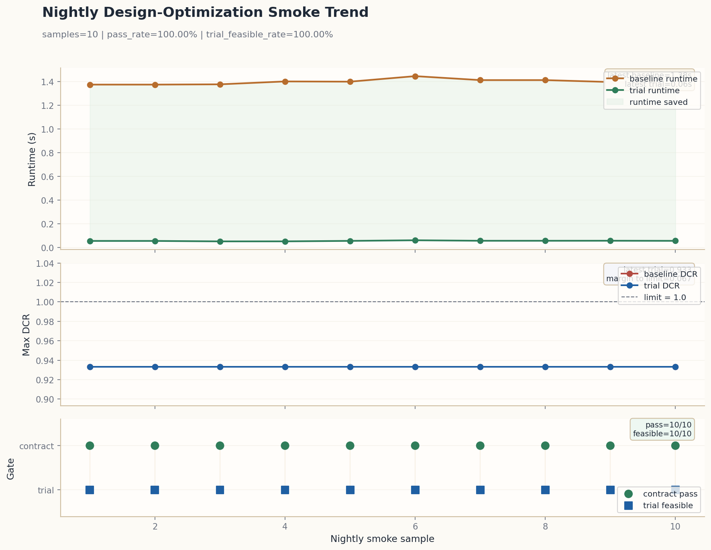
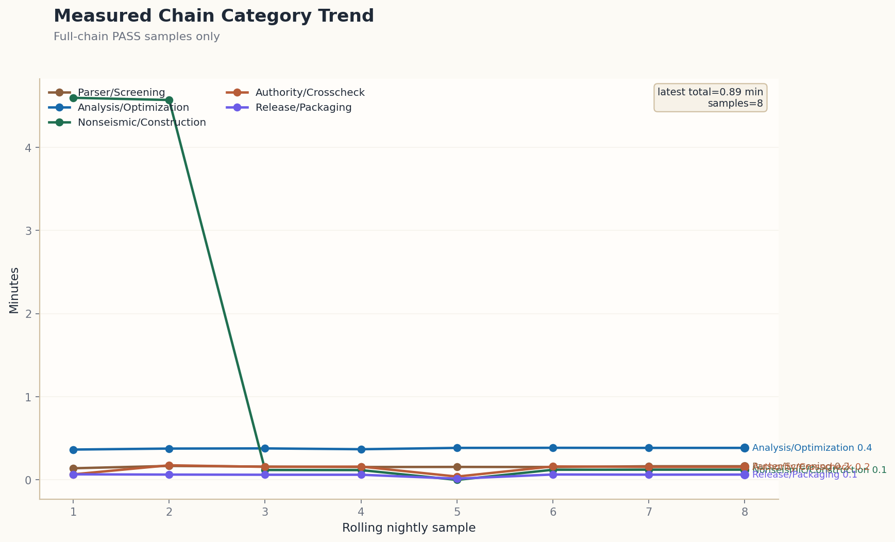

# Release Gap Report

- Generated at: `2026-03-28T18:04:57.579627+00:00`
- Release-candidate gates: `True`
- Commercial readiness grade: `Commercial`
- Deployment model: `engineer_in_the_loop_accelerated_coverage`
- Accelerated coverage target: `95-99%`
- Residual holdout target: `1-5%`
- Estimated time saved: `91-96%`
- Measured accelerated chain wall-clock (comparable rolling N=8): `1.95 min` (range `0.59-5.36 min`)
- Current measured chain wall-clock: `0.89 min`
- Engineer-in-loop accelerated coverage ready: `True`
- Time-saving focus: `Use this engine to automate the dominant, time-consuming 95-99% of repeated analysis, screening, packaging, and optimization workflows. Keep the residual 1-5% under licensed engineer review, legacy-tool cross-check, and formal sign-off workflows.`
- Full commercial replacement ready: `False`
- MIDAS semantic load binding: `True` (use_stld=2, semantic_cases=6, semantic_combinations=8)
- MIDAS bound/unbound load rows: `nodal=12/0`, `selfweight=1/0`, `pressure=7278/0`
- MIDAS section-library validator: `MIDAS section-library: ok | 182/183 used | 183 templates | source=midas_parser_derived | implementation/phase1/open_data/midas/midas_generator_33.json`
- MIDAS KDS geometry-bridge validator: `MIDAS kds-geometry-bridge: ok | mapped_review_ids=12/12 | exact=12 | heuristic=0 | rows=1056 | row_provenance=1056/1056 | row_exact=1056 | row_heuristic=0 | strategies=manual_verified_exact_focus_member:12 | confidence=manual_verified_exact_focus:12 | source=kds_codecheck_bridge_metadata | registry=merged_registry 12/12 | registry_exact=12 | registry_heuristic=0 | registry_sources=manual_review_exact_focus_registry:12 | implementation/phase1/open_data/midas/midas_generator_33.json`
- MIDAS LOADCOMB round-trip validator: `MIDAS loadcomb-roundtrip: ok | entry_row_coverage=midas_generator_33.json=1.00, midas_generator_33.pr_recheck.json=1.00, midas_generator_33.optimized.roundtrip.json=1.00 | artifacts=3`
- Commercial benchmark breadth: `Commercial benchmark breadth: families=3, measured_families=2, measured_cases=51, shell_beam_mix=31`
- Solver breadth: `Solver breadth: PASS | shell=yes(elems=5,cases=31) | wall=yes(rows=2,cases=14,material=rc_composite) | interface=yes(ssi_nonlinear_boundary) | contact=full_structural_contact | general_fe_contact=yes(10/10) | surface_interaction=yes(7/7) | interaction_family=yes(53/53) | interaction_sources=3/3 | groups=shell-shell=15/15,shell-wall=15/15,footing-soil=15/15,ssi=1/1,soil-tunnel=1/1,direct-contact=6/6`
- Element/material breadth: `Element/material breadth: PASS | shell=yes(elems=5,cases=31) | wall=yes(rows=2,cases=14) | contact=full_structural_contact | materials=2(rc_composite,steel_elastic_plastic) | links=6(bearing_bilinear,compression_only_penalty,coulomb_friction,kelvin_voigt_pounding,normal_gap_unilateral,uplift_seat_unilateral) | capabilities=12(contact_bearing_friction_impact,contact_gap_uplift_unilateral,dissipative_device_response,foundation_soil_link_nonlinear,interface_transfer_finite,rc_bond_slip,rc_cracking,rc_creep_shrinkage,shell_surface_transfer,slab_wall_interaction,soil_boundary_nonlinear,wall_compression_damage) | groups=4(rc=5,shell_interface=2,foundation_soil=2,device_contact=3)`
- Material constitutive gate: `Material constitutive gate: PASS | concrete_damage=yes(matrix=21/21,max=1.000) | cyclic_degradation=yes(matrix=20/20,residual_max=1.914%) | bond_interface=yes(matrix=22/22,bond_max=0.980) | matrix=63/63 | groups=concrete_damage=21/21,cyclic_degradation=20/20,bond_interface=22/22 | coverage=cd[t=2,h=2,s=2,sf=3],cyc[t=2,h=2,store=1,sf=3],bond[t=2,h=2,s=2,sf=3]`
- MIDAS KDS row provenance export: `MIDAS KDS row provenance export: PASS | combos=6 | rows=144 | members=12 | clauses=6 | exact_rows=144 | clause_filters=6 | member_filters=12`
- Contact readiness: `Contact readiness: PASS | scope=wheel_rail_hertzian_contact_only | schema=yes | solver=yes(ratio=0.994,max_force=6.52235N) | whitebox=yes(err=0.0048) | structural_contact=undocumented`
- Foundation/soil link: `Foundation/soil link: PASS | foundation_members=76 | optimized_groups=2 | ssi=yes | soil_tunnel=yes | impedance_schema=yes | links=6(bearing_bilinear,compression_only_penalty,coulomb_friction,kelvin_voigt_pounding,normal_gap_unilateral,uplift_seat_unilateral)`
- Structural contact readiness: `Structural contact readiness: PASS | bounded_contact=yes | impl=6/6 | validated=6/6 | ready=6/6 | partial_only=none | missing=none`
- General FE contact matrix: `General FE contact matrix: PASS | ready=10/10 | direct=6/6 | foundation=yes | interface=yes | ssi=yes | soil_tunnel=yes`
- Surface interaction benchmark: `Surface interaction benchmark: PASS | ready=7/7 | family_matrix=53/53 | source_families=3/3 | shell_surface=yes | interface_transfer=yes | interface_gap=yes | foundation=yes | ssi=yes | soil_tunnel=yes | direct_contact=6/6 | groups=shell-shell=15/15,shell-wall=15/15,footing-soil=15/15,ssi=1/1,soil-tunnel=1/1,direct-contact=6/6`
- MIDAS interoperability/export readiness: `MIDAS interoperability/export readiness: PASS | seeds=3/3 | patterns=3/3 | preview=3/3 | roundtrip=3/3 exact_entry_row_min=1.00 | bounded_subset=editor_seed+raw_recovery+preview_roundtrip | limits=solver_ready_reconstruction_pending, normalized_factor_maps_pending, summary_grade_preview_only, primitive_load_cards_pending`
- Commercial readiness: `Commercial readiness: PASS | grade=Commercial | strict_measured=True | families=3 | measured_families=2 | measured_cases=51 | shell_beam_mix=31`
- MIDAS optimized export artifact present: `True` (contract_pass=`True`, support_mode=`bounded_patch_subset`, supported_changes=`36`, unsupported_changes=`0`, direct_patch_changes=`25`, direct_patch_families=`beam_section=1, connection_detailing=6, detailing=5, perimeter_frame=1, rebar=5, slab_thickness=2, wall_thickness=5`, rebar_namespace_mode=`group_local`, rebar_material_namespace_present=`True`, rebar_group_local_namespace_present=`True`, material_rebar_payloads=`3/5`, group_local_rebar_payloads=`6/6`, group_local_connection_detailing_payloads=`6/6`, connection_direct_patch_eligible=`6`, group_local_detailing_payloads=`5/5`, connection_namespace_mode=`group_local`, connection_group_local_namespace_present=`True`, connection_structured_payload_mapped=`6`, connection_delivery_mode=`direct_patch_metadata_plus_sidecar`, detailing_namespace_mode=`group_local`, detailing_group_local_namespace_present=`True`, detailing_direct_patch_eligible=`5`, detailing_structured_payload_mapped=`5`, detailing_delivery_mode=`direct_patch_metadata_plus_sidecar`, rebar_direct_patch_eligible=`6`, patched_material_rows=`24`, cloned_materials=`24`, rebar_delivery_mode=`direct_patch_eligible`, evidence_model=`direct_patch_plus_audit_review_manifest`, rebar_direct_patch_blockers=``, rebar_mapping_sources=`alt_slab_wall_group_id=5, direct_group_id=1`, sidecar_families=``, sidecar_audit=`connection_detailing=6, detailing=5` (11), sidecar_manual=`` (0), audit_manifest=`connection_detailing=6, detailing=5` (11), audit_packets=`connection_detailing=1, detailing=1` (2), audit_packet_files=`connection_detailing=1, detailing=1` (2), audit_queue=`connection_detailing=1, detailing=1` (2), audit_queue_status=`pending_review=2`, audit_followup=`wait_for_review=2` (2), audit_followup_owner=`licensed_engineer=2`, audit_followup_status=`pending_review=2`, audit_followup_review_owner=`licensed_engineer=2`, audit_followup_sla=`within_sla=2`, audit_followup_age=`lt_24h=2`, audit_followup_overdue=`0`, audit_resolution=`await_review_decision=2`, audit_resolution_status=`pending_review=2`, sidecar_priorities=``, sidecar_followups=``, cloned_sections=`0`, cloned_thicknesses=`6`, retargeted_elements=`418`)
- MGT export LOADCOMB evidence: `preview_exists=True` | `roundtrip_pass=True` | `MGT export LOADCOMB roundtrip: ok | entry_row_coverage=1.00 | combos=8`
- MGT delivery boundary: `direct_patch_plus_audit_review_manifest` | `direct_patch=beam_section=1, connection_detailing=6, detailing=5, perimeter_frame=1, rebar=5, slab_thickness=2, wall_thickness=5 | sidecar=n/a | connection_payload=direct_patch_metadata_plus_sidecar | detailing_payload=direct_patch_metadata_plus_sidecar`

## Advanced Holdouts

| Area | Ready | Mode | Why |
|---|---|---|---|
| Dynamic plastic-hinge refresh | True | computed_member_local_hinge_refresh | Dynamic hinge-refresh artifact is attached. |
| Panel-zone 3D clash and anchorage | True | internal_engine_panel_zone_3d_clash_and_anchorage_complete | Internal engine completed panel-zone joint geometry, anchorage, and clash recomputation with validated member overlap; external verification now serves as an optional audit boundary. |
| Foundation / mat / pile optimization | True | active_foundation_member_optimization | foundation optimization artifact is attached and dataset contains foundation members |
| Raw wind-tunnel data mapping | True | raw_hffb_node_pressure_mapping | Raw wind-tunnel HFFB mapping is ready for traceable MIDAS binding. |

## Current Release Status

- `nightly_release_pass`: `True`
- `ci_gate_pass`: `True`
- `midas_section_library_summary_line`: `MIDAS section-library: ok | 182/183 used | 183 templates | source=midas_parser_derived | implementation/phase1/open_data/midas/midas_generator_33.json`
- `midas_kds_geometry_bridge_summary_line`: `MIDAS kds-geometry-bridge: ok | mapped_review_ids=12/12 | exact=12 | heuristic=0 | rows=1056 | row_provenance=1056/1056 | row_exact=1056 | row_heuristic=0 | strategies=manual_verified_exact_focus_member:12 | confidence=manual_verified_exact_focus:12 | source=kds_codecheck_bridge_metadata | registry=merged_registry 12/12 | registry_exact=12 | registry_heuristic=0 | registry_sources=manual_review_exact_focus_registry:12 | implementation/phase1/open_data/midas/midas_generator_33.json`
- `midas_loadcomb_roundtrip_summary_line`: `MIDAS loadcomb-roundtrip: ok | entry_row_coverage=midas_generator_33.json=1.00, midas_generator_33.pr_recheck.json=1.00, midas_generator_33.optimized.roundtrip.json=1.00 | artifacts=3`
- `commercial_benchmark_breadth_summary_line`: `Commercial benchmark breadth: families=3, measured_families=2, measured_cases=51, shell_beam_mix=31`
- `solver_breadth_summary_line`: `Solver breadth: PASS | shell=yes(elems=5,cases=31) | wall=yes(rows=2,cases=14,material=rc_composite) | interface=yes(ssi_nonlinear_boundary) | contact=full_structural_contact | general_fe_contact=yes(10/10) | surface_interaction=yes(7/7) | interaction_family=yes(53/53) | interaction_sources=3/3 | groups=shell-shell=15/15,shell-wall=15/15,footing-soil=15/15,ssi=1/1,soil-tunnel=1/1,direct-contact=6/6`
- `element_material_breadth_summary_line`: `Element/material breadth: PASS | shell=yes(elems=5,cases=31) | wall=yes(rows=2,cases=14) | contact=full_structural_contact | materials=2(rc_composite,steel_elastic_plastic) | links=6(bearing_bilinear,compression_only_penalty,coulomb_friction,kelvin_voigt_pounding,normal_gap_unilateral,uplift_seat_unilateral) | capabilities=12(contact_bearing_friction_impact,contact_gap_uplift_unilateral,dissipative_device_response,foundation_soil_link_nonlinear,interface_transfer_finite,rc_bond_slip,rc_cracking,rc_creep_shrinkage,shell_surface_transfer,slab_wall_interaction,soil_boundary_nonlinear,wall_compression_damage) | groups=4(rc=5,shell_interface=2,foundation_soil=2,device_contact=3)`
- `material_constitutive_summary_line`: `Material constitutive gate: PASS | concrete_damage=yes(matrix=21/21,max=1.000) | cyclic_degradation=yes(matrix=20/20,residual_max=1.914%) | bond_interface=yes(matrix=22/22,bond_max=0.980) | matrix=63/63 | groups=concrete_damage=21/21,cyclic_degradation=20/20,bond_interface=22/22 | coverage=cd[t=2,h=2,s=2,sf=3],cyc[t=2,h=2,store=1,sf=3],bond[t=2,h=2,s=2,sf=3]`
- `midas_kds_row_provenance_export_summary_line`: `MIDAS KDS row provenance export: PASS | combos=6 | rows=144 | members=12 | clauses=6 | exact_rows=144 | clause_filters=6 | member_filters=12`
- `midas_kds_row_provenance_preview_rows`: `[{'combination_name': 'gLCB1', 'member_id': 'C-TST-003', 'case_id': 'C-TST-003', 'clause_label': 'KDS-MOMENT-Y-001', 'baseline_focus_member_id': '27441', 'bridge_row_provenance_mode_label': 'exact row-level provenance', 'clause_provenance_summary_label': 'rows=12 | members=12 | rules=1 | hazards=3', 'bridge_member_inventory_summary_label': 'review=C-TST-003 | case=C-TST-003 | baseline=27441 | member_types=column'}, {'combination_name': 'gLCB1', 'member_id': 'C-TRN-005', 'case_id': 'C-TRN-005', 'clause_label': 'KDS-MOMENT-Y-001', 'baseline_focus_member_id': '27441', 'bridge_row_provenance_mode_label': 'exact row-level provenance', 'clause_provenance_summary_label': 'rows=12 | members=12 | rules=1 | hazards=3', 'bridge_member_inventory_summary_label': 'review=C-TRN-005 | case=C-TRN-005 | baseline=27441 | member_types=column'}, {'combination_name': 'gLCB1', 'member_id': 'C-TST-003', 'case_id': 'C-TST-003', 'clause_label': 'KDS-INT-FRAME-001', 'baseline_focus_member_id': '27441', 'bridge_row_provenance_mode_label': 'exact row-level provenance', 'clause_provenance_summary_label': 'rows=12 | members=12 | rules=1 | hazards=3', 'bridge_member_inventory_summary_label': 'review=C-TST-003 | case=C-TST-003 | baseline=27441 | member_types=column'}, {'combination_name': 'gLCB1', 'member_id': 'C-TST-001', 'case_id': 'C-TST-001', 'clause_label': 'KDS-MOMENT-Y-001', 'baseline_focus_member_id': '27441', 'bridge_row_provenance_mode_label': 'exact row-level provenance', 'clause_provenance_summary_label': 'rows=12 | members=12 | rules=1 | hazards=3', 'bridge_member_inventory_summary_label': 'review=C-TST-001 | case=C-TST-001 | baseline=27441 | member_types=column'}, {'combination_name': 'gLCB1', 'member_id': 'C-TST-003', 'case_id': 'C-TST-003', 'clause_label': 'KDS-SHEAR-Y-001', 'baseline_focus_member_id': '27441', 'bridge_row_provenance_mode_label': 'exact row-level provenance', 'clause_provenance_summary_label': 'rows=12 | members=12 | rules=1 | hazards=3', 'bridge_member_inventory_summary_label': 'review=C-TST-003 | case=C-TST-003 | baseline=27441 | member_types=column'}, {'combination_name': 'gLCB1', 'member_id': 'C-TRN-005', 'case_id': 'C-TRN-005', 'clause_label': 'KDS-INT-FRAME-001', 'baseline_focus_member_id': '27441', 'bridge_row_provenance_mode_label': 'exact row-level provenance', 'clause_provenance_summary_label': 'rows=12 | members=12 | rules=1 | hazards=3', 'bridge_member_inventory_summary_label': 'review=C-TRN-005 | case=C-TRN-005 | baseline=27441 | member_types=column'}, {'combination_name': 'gLCB1', 'member_id': 'C-TRN-007', 'case_id': 'C-TRN-007', 'clause_label': 'KDS-MOMENT-Y-001', 'baseline_focus_member_id': '27425', 'bridge_row_provenance_mode_label': 'exact row-level provenance', 'clause_provenance_summary_label': 'rows=12 | members=12 | rules=1 | hazards=3', 'bridge_member_inventory_summary_label': 'review=C-TRN-007 | case=C-TRN-007 | baseline=27425 | member_types=wall'}, {'combination_name': 'gLCB1', 'member_id': 'C-TST-003', 'case_id': 'C-TST-003', 'clause_label': 'KDS-AXIAL-001', 'baseline_focus_member_id': '27441', 'bridge_row_provenance_mode_label': 'exact row-level provenance', 'clause_provenance_summary_label': 'rows=12 | members=12 | rules=1 | hazards=3', 'bridge_member_inventory_summary_label': 'review=C-TST-003 | case=C-TST-003 | baseline=27441 | member_types=column'}]`
- `midas_kds_row_provenance_clause_filter_rows`: `[]`
- `midas_kds_row_provenance_member_filter_rows`: `[]`
- `contact_readiness_summary_line`: `Contact readiness: PASS | scope=wheel_rail_hertzian_contact_only | schema=yes | solver=yes(ratio=0.994,max_force=6.52235N) | whitebox=yes(err=0.0048) | structural_contact=undocumented`
- `foundation_soil_link_summary_line`: `Foundation/soil link: PASS | foundation_members=76 | optimized_groups=2 | ssi=yes | soil_tunnel=yes | impedance_schema=yes | links=6(bearing_bilinear,compression_only_penalty,coulomb_friction,kelvin_voigt_pounding,normal_gap_unilateral,uplift_seat_unilateral)`
- `structural_contact_summary_line`: `Structural contact readiness: PASS | bounded_contact=yes | impl=6/6 | validated=6/6 | ready=6/6 | partial_only=none | missing=none`
- `general_fe_contact_matrix_summary_line`: `General FE contact matrix: PASS | ready=10/10 | direct=6/6 | foundation=yes | interface=yes | ssi=yes | soil_tunnel=yes`
- `surface_interaction_benchmark_summary_line`: `Surface interaction benchmark: PASS | ready=7/7 | family_matrix=53/53 | source_families=3/3 | shell_surface=yes | interface_transfer=yes | interface_gap=yes | foundation=yes | ssi=yes | soil_tunnel=yes | direct_contact=6/6 | groups=shell-shell=15/15,shell-wall=15/15,footing-soil=15/15,ssi=1/1,soil-tunnel=1/1,direct-contact=6/6`
- `midas_interoperability_summary_line`: `MIDAS interoperability/export readiness: PASS | seeds=3/3 | patterns=3/3 | preview=3/3 | roundtrip=3/3 exact_entry_row_min=1.00 | bounded_subset=editor_seed+raw_recovery+preview_roundtrip | limits=solver_ready_reconstruction_pending, normalized_factor_maps_pending, summary_grade_preview_only, primitive_load_cards_pending`
- `commercial_readiness_summary_line`: `Commercial readiness: PASS | grade=Commercial | strict_measured=True | families=3 | measured_families=2 | measured_cases=51 | shell_beam_mix=31`
- `static_validation_pass`: `True`
- `freeze_snapshot_pass`: `True`
- `promotion_pass`: `True`
- `promotion_reason_code`: `PASS`
- `promotion_hold_for_review`: `False`
- `hold_review_manifest`: `implementation/phase1/release/hold_review_manifest.json`
- `commercial_readiness_pass`: `True`
- `global_authority_pass`: `True`
- `hip_kernel_smoke_pass`: `True`
- `midas_conversion_pass`: `True`
- `construction_sequence_pass`: `True`
- `flexible_diaphragm_pass`: `True`
- `repro_version_lock_pass`: `True`
- `release_registry_pass`: `True`
- `kds_compliance_pass`: `True`
- `solver_hip_e2e_pass`: `True`
- `rc_benchmark_lock_pass`: `True`
- `quality_mgt_corpus_pass`: `True`
- `midas_semantic_load_binding_pass`: `True`
- `mgt_export_artifact_exists`: `True`
- `mgt_export_contract_pass`: `True`
- `mgt_export_support_mode`: `bounded_patch_subset`
- `mgt_export_loadcomb_preview_exists`: `True`
- `mgt_export_loadcomb_roundtrip_report_exists`: `True`
- `mgt_export_loadcomb_roundtrip_pass`: `True`
- `mgt_export_loadcomb_roundtrip_summary_line`: `MGT export LOADCOMB roundtrip: ok | entry_row_coverage=1.00 | combos=8`
- `mgt_export_loadcomb_roundtrip_recovery_mode`: ``
- `mgt_export_loadcomb_combo_count`: `8`
- `mgt_export_supported_change_count`: `36`
- `mgt_export_unsupported_change_count`: `0`
- `mgt_export_direct_patch_change_count`: `25`
- `mgt_export_direct_patch_supported_action_families`: `['beam_section', 'wall_thickness', 'slab_thickness', 'rebar', 'perimeter_frame', 'connection_detailing', 'detailing']`
- `mgt_export_sidecar_supported_action_families`: `['connection_detailing', 'detailing', 'perimeter_frame', 'rebar']`
- `mgt_export_direct_patch_action_family_counts`: `{'beam_section': 1, 'connection_detailing': 6, 'detailing': 5, 'perimeter_frame': 1, 'rebar': 5, 'slab_thickness': 2, 'wall_thickness': 5}`
- `mgt_export_direct_patch_action_family_label`: `beam_section=1, connection_detailing=6, detailing=5, perimeter_frame=1, rebar=5, slab_thickness=2, wall_thickness=5`
- `mgt_export_material_level_rebar_payload_row_count`: `5`
- `mgt_export_material_level_rebar_payload_available_count`: `3`
- `mgt_export_group_local_rebar_payload_row_count`: `6`
- `mgt_export_group_local_rebar_payload_available_count`: `6`
- `mgt_export_group_local_connection_detailing_payload_row_count`: `6`
- `mgt_export_group_local_connection_detailing_payload_available_count`: `6`
- `mgt_export_group_local_detailing_payload_row_count`: `5`
- `mgt_export_group_local_detailing_payload_available_count`: `5`
- `mgt_export_connection_detailing_payload_namespace_mode`: `group_local`
- `mgt_export_connection_detailing_payload_group_local_namespace_present`: `True`
- `mgt_export_detailing_payload_namespace_mode`: `group_local`
- `mgt_export_detailing_payload_group_local_namespace_present`: `True`
- `mgt_export_connection_detailing_structured_payload_mapped_change_count`: `6`
- `mgt_export_connection_detailing_direct_patch_eligible_change_count`: `6`
- `mgt_export_detailing_direct_patch_eligible_change_count`: `5`
- `mgt_export_detailing_structured_payload_mapped_change_count`: `5`
- `mgt_export_connection_detailing_delivery_mode`: `direct_patch_metadata_plus_sidecar`
- `mgt_export_detailing_delivery_mode`: `direct_patch_metadata_plus_sidecar`
- `mgt_export_rebar_payload_namespace_mode`: `group_local`
- `mgt_export_rebar_payload_material_level_namespace_present`: `True`
- `mgt_export_rebar_payload_group_local_namespace_present`: `True`
- `mgt_export_rebar_direct_patch_eligible_change_count`: `6`
- `mgt_export_rebar_direct_patch_ineligible_reason_counts`: `{}`
- `mgt_export_rebar_direct_patch_ineligible_reason_label`: ``
- `mgt_export_rebar_direct_patch_mapping_source_counts`: `{'alt_slab_wall_group_id': 5, 'direct_group_id': 1}`
- `mgt_export_rebar_direct_patch_mapping_source_label`: `alt_slab_wall_group_id=5, direct_group_id=1`
- `mgt_export_rebar_delivery_mode`: `direct_patch_eligible`
- `mgt_export_evidence_model`: `direct_patch_plus_audit_review_manifest`
- `mgt_export_delivery_boundary`: `direct_patch=beam_section=1, connection_detailing=6, detailing=5, perimeter_frame=1, rebar=5, slab_thickness=2, wall_thickness=5 | sidecar=n/a | connection_payload=direct_patch_metadata_plus_sidecar | detailing_payload=direct_patch_metadata_plus_sidecar`
- `mgt_export_instruction_sidecar_change_count`: `0`
- `mgt_export_instruction_sidecar_action_family_counts`: `{}`
- `mgt_export_instruction_sidecar_action_family_label`: ``
- `mgt_export_instruction_sidecar_audit_only_change_count`: `11`
- `mgt_export_instruction_sidecar_audit_only_action_family_counts`: `{'connection_detailing': 6, 'detailing': 5}`
- `mgt_export_instruction_sidecar_audit_only_action_family_label`: `connection_detailing=6, detailing=5`
- `mgt_export_instruction_sidecar_manual_input_change_count`: `0`
- `mgt_export_instruction_sidecar_manual_input_action_family_counts`: `{}`
- `mgt_export_instruction_sidecar_manual_input_action_family_label`: ``
- `mgt_export_audit_review_manifest_change_count`: `11`
- `mgt_export_audit_review_manifest_action_family_counts`: `{'connection_detailing': 6, 'detailing': 5}`
- `mgt_export_audit_review_manifest_action_family_label`: `connection_detailing=6, detailing=5`
- `mgt_export_audit_review_packet_count`: `2`
- `mgt_export_audit_review_packet_action_family_counts`: `{'connection_detailing': 1, 'detailing': 1}`
- `mgt_export_audit_review_packet_action_family_label`: `connection_detailing=1, detailing=1`
- `mgt_export_audit_review_packet_followup_type_counts`: `{'connection_detailing_audit_after_material_patch': 1, 'detailing_audit_after_material_patch': 1}`
- `mgt_export_audit_review_packet_followup_type_label`: `connection_detailing_audit_after_material_patch=1, detailing_audit_after_material_patch=1`
- `mgt_export_audit_review_packet_file_count`: `2`
- `mgt_export_audit_review_packet_file_action_family_counts`: `{'connection_detailing': 1, 'detailing': 1}`
- `mgt_export_audit_review_packet_file_action_family_label`: `connection_detailing=1, detailing=1`
- `mgt_export_audit_review_queue_item_count`: `2`
- `mgt_export_audit_review_queue_pending_count`: `2`
- `mgt_export_audit_review_queue_acknowledged_count`: `0`
- `mgt_export_audit_review_queue_status_counts`: `{'pending_review': 2}`
- `mgt_export_audit_review_queue_status_label`: `pending_review=2`
- `mgt_export_audit_review_queue_action_family_counts`: `{'connection_detailing': 1, 'detailing': 1}`
- `mgt_export_audit_review_queue_action_family_label`: `connection_detailing=1, detailing=1`
- `mgt_export_audit_review_followup_item_count`: `2`
- `mgt_export_audit_review_followup_open_item_count`: `2`
- `mgt_export_audit_review_followup_closed_item_count`: `0`
- `mgt_export_audit_review_followup_action_counts`: `{'wait_for_review': 2}`
- `mgt_export_audit_review_followup_action_label`: `wait_for_review=2`
- `mgt_export_audit_review_followup_owner_counts`: `{'licensed_engineer': 2}`
- `mgt_export_audit_review_followup_owner_label`: `licensed_engineer=2`
- `mgt_export_audit_review_followup_review_owner_counts`: `{'licensed_engineer': 2}`
- `mgt_export_audit_review_followup_review_owner_label`: `licensed_engineer=2`
- `mgt_export_audit_review_followup_status_counts`: `{'pending_review': 2}`
- `mgt_export_audit_review_followup_status_label`: `pending_review=2`
- `mgt_export_audit_review_followup_sla_state_counts`: `{'within_sla': 2}`
- `mgt_export_audit_review_followup_sla_state_label`: `within_sla=2`
- `mgt_export_audit_review_followup_age_bucket_counts`: `{'lt_24h': 2}`
- `mgt_export_audit_review_followup_age_bucket_label`: `lt_24h=2`
- `mgt_export_audit_review_followup_overdue_item_count`: `0`
- `mgt_export_audit_review_followup_oldest_open_age_hours`: `0.0`
- `mgt_export_audit_review_followup_oldest_open_packet_id`: `detailing|detailing_audit_after_material_patch|medium`
- `mgt_export_audit_review_followup_reference_time_utc`: `2026-03-28T17:35:42.744557+00:00`
- `mgt_export_audit_review_followup_sla_policy_label`: `critical=8h, high=24h, low=168h, medium=72h, default=96h`
- `mgt_export_audit_review_followup_mode`: `queue_status_projected_followup_actions`
- `mgt_export_audit_review_resolution_item_count`: `2`
- `mgt_export_audit_review_resolution_file_count`: `2`
- `mgt_export_audit_review_resolution_open_item_count`: `2`
- `mgt_export_audit_review_resolution_closed_item_count`: `0`
- `mgt_export_audit_review_resolution_pending_item_count`: `2`
- `mgt_export_audit_review_resolution_open_revision_count`: `0`
- `mgt_export_audit_review_resolution_closed_packet_count`: `0`
- `mgt_export_audit_review_resolution_action_counts`: `{'await_review_decision': 2}`
- `mgt_export_audit_review_resolution_action_label`: `await_review_decision=2`
- `mgt_export_audit_review_resolution_owner_counts`: `{'licensed_engineer': 2}`
- `mgt_export_audit_review_resolution_owner_label`: `licensed_engineer=2`
- `mgt_export_audit_review_resolution_status_counts`: `{'pending_review': 2}`
- `mgt_export_audit_review_resolution_status_label`: `pending_review=2`
- `mgt_export_audit_review_resolution_mode`: `queue_followup_projected_resolution_actions`
- `mgt_export_instruction_sidecar_review_priority_counts`: `{}`
- `mgt_export_instruction_sidecar_review_priority_label`: ``
- `mgt_export_instruction_sidecar_followup_type_counts`: `{}`
- `mgt_export_instruction_sidecar_followup_type_label`: ``
- `mgt_export_patched_material_row_count`: `24`
- `mgt_export_cloned_section_count`: `0`
- `mgt_export_cloned_thickness_count`: `6`
- `mgt_export_cloned_material_count`: `24`
- `mgt_export_retargeted_element_row_count`: `418`
- `nightly_smoke_pass`: `True`
- `nightly_smoke_pass_rate`: `1.0`
- `nightly_smoke_trial_feasible_rate`: `1.0`
- `nightly_smoke_history_count`: `10`
- `nightly_smoke_strict_ready`: `True`
- `nightly_smoke_strict_recommendation`: `candidate_for_strict_enable`

## Residual Holdout Model

| Category | Owner | Relative Share | Absolute Project % | Scope |
|---|---|---:|---|---|
| Licensed Engineer Review | 기술사 | 50% | 0.5-2.5% | non-standard interpretation, final judgment, exceptional irregularity, and member-level edge cases |
| Legacy Tool Cross-Validation | 기존툴+기술사 | 30% | 0.3-1.5% | novel load paths, authority-critical submodels, and residual niche workflows outside the accelerated envelope |
| Legal Sign-Off | 기술사/기존 승인 workflow | 20% | 0.2-1.0% | formal seal, legal submission, and authority-facing responsibility that remains outside automated scope |

## Time-Saving Coverage

- Estimated time saved for repeated analysis workload: `91-96%`
- Measured accelerated chain wall-clock (comparable rolling N=8): `1.95 min` (range `0.59-5.36 min`)
- Comparable run selection: `current_pipeline_comparable_full_chain_pass` | `full_chain_samples=19` | `comparable_samples=8` | `reference_steps=19` | `overlap_threshold=0.90` | `deployment_model=engineer_in_the_loop_accelerated_coverage` | `strict_smoke=True`
- Current measured chain wall-clock: `0.89 min`
- Basis: `Empirical estimate derived from nightly design-optimization smoke runtime reduction, scaled by the accelerated-coverage target. smoke_mean_runtime_saved=96.03%, sample_count=10.`
- Empirical smoke runtime reduction: `95.8-96.32%` (mean `96.03%`)
- `measured_chain_breakdown_min`: parser/screening `0.16`, analysis/optimization `0.39`, nonseismic/construction `0.12`, authority/crosscheck `0.16`, release/packaging `0.06`
- `measured_chain_breakdown_mean_min`: parser/screening `0.16`, analysis/optimization `0.38`, nonseismic/construction `1.22`, authority/crosscheck `0.13`, release/packaging `0.06`
- Focus: `Use this engine to automate the dominant, time-consuming 95-99% of repeated analysis, screening, packaging, and optimization workflows. Keep the residual 1-5% under licensed engineer review, legacy-tool cross-check, and formal sign-off workflows.`

## Nightly Smoke Trend

- `smoke_history_png`: `implementation/phase1/release/release_gap_smoke_history.png`
- `runtime_drift`: baseline `1.3750s -> 1.3802s` (`+0.0053s`), trial `0.0551s -> 0.0558s` (`+0.0007s`)
- `max_dcr_drift`: baseline `0.9332 -> 0.9332` (`+0.0000`), trial `0.9332 -> 0.9332` (`+0.0000`)

## Measured Chain Category Trend

- `measured_chain_category_png`: `implementation/phase1/release/release_gap_measured_chain_categories.png`

## Observed Strengths

- `Nightly release chain is green`: nightly release, CI, static validation, freeze, and promotion reports all passed in the latest rerun
- `Commercial-readiness gate is green`: grade=Commercial, cases=63, source_families=3, hazards=3
- `Authority-track holdout validation is green`: SAC=3, NHERI=3, OpenSees=2
- `Non-seismic extensions are green`: wind, SSI, damper, construction-sequence, flexible-diaphragm, and reproducibility/version-lock gates all passed
- `MIDAS parser preserves full structural topology`: element_rows_total=12728, element_rows_skipped=0, unknown_rows=0
- `MIDAS load blocks now bind to semantic load cases`: use_stld_blocks=2, semantic_cases=6, semantic_combinations=8, bound_rows=nodal:12/selfweight:1/pressure:7278, unbound_rows=nodal:0/selfweight:0/pressure:0
- `MIDAS exporter now emits bounded optimized patches`: artifact_exists=True, contract_pass=True, support_mode=bounded_patch_subset, supported_changes=36, unsupported_changes=0, cloned_sections=0, cloned_thicknesses=6, retargeted_elements=418, patched_section_scale_rows=1, patched_thickness_rows=7
- `Signed release registry is available`: algorithm=ed25519, artifact_count=9, signature_verified=True
- `Design-optimization cost smoke probe is stable`: reason=PASS, pass_rate=100.00%, trial_feasible_rate=100.00%, history_count=10, strict_recommendation=candidate_for_strict_enable

## Appendix: MIDAS KDS Row Provenance Export

- `summary`: `MIDAS KDS row provenance export: PASS | combos=6 | rows=144 | members=12 | clauses=6 | exact_rows=144 | clause_filters=6 | member_filters=12`
- `artifacts`: json=`implementation/phase1/release/kds_compliance/midas_kds_row_provenance_table.json` | csv=`implementation/phase1/release/kds_compliance/midas_kds_row_provenance_table.csv` | report=`implementation/phase1/release/kds_compliance/midas_kds_row_provenance_table_report.json`

| Combination | Member | Clause | Baseline Focus | Mode | Clause Provenance | Member Inventory |
|---|---|---|---|---|---|---|
| gLCB1 | C-TST-003 | KDS-MOMENT-Y-001 | 27441 | exact row-level provenance | rows=12 | members=12 | rules=1 | hazards=3 | review=C-TST-003 | case=C-TST-003 | baseline=27441 | member_types=column |
| gLCB1 | C-TRN-005 | KDS-MOMENT-Y-001 | 27441 | exact row-level provenance | rows=12 | members=12 | rules=1 | hazards=3 | review=C-TRN-005 | case=C-TRN-005 | baseline=27441 | member_types=column |
| gLCB1 | C-TST-003 | KDS-INT-FRAME-001 | 27441 | exact row-level provenance | rows=12 | members=12 | rules=1 | hazards=3 | review=C-TST-003 | case=C-TST-003 | baseline=27441 | member_types=column |
| gLCB1 | C-TST-001 | KDS-MOMENT-Y-001 | 27441 | exact row-level provenance | rows=12 | members=12 | rules=1 | hazards=3 | review=C-TST-001 | case=C-TST-001 | baseline=27441 | member_types=column |
| gLCB1 | C-TST-003 | KDS-SHEAR-Y-001 | 27441 | exact row-level provenance | rows=12 | members=12 | rules=1 | hazards=3 | review=C-TST-003 | case=C-TST-003 | baseline=27441 | member_types=column |
| gLCB1 | C-TRN-005 | KDS-INT-FRAME-001 | 27441 | exact row-level provenance | rows=12 | members=12 | rules=1 | hazards=3 | review=C-TRN-005 | case=C-TRN-005 | baseline=27441 | member_types=column |
| gLCB1 | C-TRN-007 | KDS-MOMENT-Y-001 | 27425 | exact row-level provenance | rows=12 | members=12 | rules=1 | hazards=3 | review=C-TRN-007 | case=C-TRN-007 | baseline=27425 | member_types=wall |
| gLCB1 | C-TST-003 | KDS-AXIAL-001 | 27441 | exact row-level provenance | rows=12 | members=12 | rules=1 | hazards=3 | review=C-TST-003 | case=C-TST-003 | baseline=27441 | member_types=column |

## Remaining Gaps

### GAP-P0-000 MIDAS MGT exporter is still only a bounded subset

- Severity: `P0`
- Status: `narrowing`
- Why it remains: The release can now emit an optimized .mgt write-back artifact, but the exporter still only supports a bounded patch subset rather than full office-safe write-back across every design-change family.
- Evidence: midas_conversion_pass=True, semantic_load_binding_pass=True, optimized_mgt_export_exists=True, export_contract_pass=True, support_mode=bounded_patch_subset, supported_changes=36, unsupported_changes=0, cloned_sections=0, cloned_thicknesses=6, retargeted_elements=418, design_opt_changes_json=implementation/phase1/release/design_optimization/design_optimization_cost_reduction_changes.json
- Exit criteria: Extend the exporter from bounded patch subset to full design-change family support, including rebar/detailing write-back and office-safe round-trip validation.

### GAP-P0-001 Full solver HIP kernel coverage

- Severity: `P0`
- Status: `closed`
- Why it remains: The release proves HIP compilation and smoke execution, but it still does not prove that the main nonlinear frame, NDTHA, and track solve loops are fully running on production HIP kernels end-to-end.
- Evidence: hip backend kind=hipcc_kernel, beam_kernel_pass=True, solver_gpu_count=3, solver_contract_pass=True
- Exit criteria: Add explicit solver-path reports proving nonlinear frame, NDTHA, and track LF kernels execute on HIP kernels rather than smoke-only or bridge-only paths.

### GAP-P1-001 Public validation breadth is still limited

- Severity: `P1`
- Status: `closed`
- Why it remains: The current release is validated, but the public holdout and real-data breadth is still small to remove the residual 1-5% engineer and legacy-tool holdout boundary.
- Evidence: commercial cases=63, source families=3, SAC=3, NHERI=3, quality_mgt_catalog_sources=5, quality_mgt_accepted=5
- Exit criteria: Expand the public and commercial-grade holdout corpus until the residual 1-5% holdout boundary becomes smaller and more explicit across topology and hazard families.

### GAP-P1-002 MIDAS parser coverage remains partial

- Severity: `P1`
- Status: `closed`
- Why it remains: The MGT parser now handles shell-beam mix, rigid-link coarsening, and semantic load-case binding for USE-STLD/CONLOAD/SELFWEIGHT/PRESSURE, but many sections are still preserved as raw text rather than fully typed runtime data.
- Evidence: typed rows=9331, unknown sections=0, unknown rows=0, element rows skipped=0, use_stld_blocks=2, semantic_load_case_count=6, pressure rows typed=7278
- Exit criteria: Reduce unknown-section volume substantially and convert high-impact sections such as dynamic loads, boundary groups, member metadata, and exporter-critical write-back fields into typed runtime data.

### GAP-P1-003 RC/composite constitutive fidelity is not benchmark-locked yet

- Severity: `P1`
- Status: `closed`
- Why it remains: Construction-stage behavior is now captured at the gate level, but creep/shrinkage and diaphragm effects are still validated through reduced-order structural proxies rather than dedicated RC crack/bond-slip benchmark suites.
- Evidence: construction max differential shortening=38.331 mm, max initial stress=23.241 MPa, diaphragm flex amplification max=1.200, rc_benchmark_cases=4, authority_cases=3, validation_mode=hybrid_authority_locked
- Exit criteria: Add dedicated RC and composite benchmark datasets covering cracking, bond-slip, creep, and slab failure modes, then promote those to first-class release gates.

### GAP-P0-002 PBD hinge properties are not dynamically refreshed

- Severity: `P0`
- Status: `closed`
- Why it remains: Optimized section/rebar changes must re-derive nonlinear hinge properties; the current release still presents hinge proxy views rather than an explicit refreshed hinge-state artifact.
- Evidence: hinge_proxy_artifacts=2, artifact_present=True, artifact_kind=hinge_refresh_projected_from_optimization_changes, source_mode=rebar_sensitive_member_local_refresh, overlap_members=88, rebar_sensitive_members=70, benchmark_assets=5, benchmark_split=train:2/val:2/holdout:1, benchmark_gate_pass=True, benchmark_fixture_regression_pass=True, benchmark_alignment_pass=True, benchmark_fixture_count=5, benchmark_fixture_min_point_count=449, benchmark_fixture_min_peak_drift_ratio=0.036625, benchmark_alignment_refresh_columns=5, benchmark_alignment_rebar_sensitive_columns=5, benchmark_rebar_ratio_range=0.0127-0.0603, refresh_rebar_ratio_range=0.0640-0.0740, response_storage=npz_external+inline_summary, pbd_case_count=7
- Exit criteria: Attach a release artifact proving member-local FEMA/ASCE41 hinge properties are recalculated after section/rebar changes and consumed by NDTHA/PBD review.

### GAP-P0-003 Panel-zone clash and anchorage are still proxy-only

- Severity: `P0`
- Status: `closed`
- Why it remains: Current constructability gates control scalar detailing pressure, but they do not yet prove 3D beam-column joint interference and anchorage feasibility.
- Evidence: proxy_candidates=45, source=design_optimization_dataset_npz:topology_projected_3d_clash_and_anchorage_bridge, validated_rows=135, min_overlap=45, internal_complete=True, external_validation_pending=True, validation_boundary=external_validation_only, inbox_status=empty_without_history, inbox_pending=False, inbox_origin=missing, inbox_release_refresh_allowed=False, latest_consume=False:n/a, sidecar_present=True, sidecar_changes=0, sidecar_mode=none, sidecar_overlap_rows=0, sidecar_overlap_members=0, sidecar_evidence=direct_patch_plus_audit_review_manifest, sidecar_delivery=direct_patch_eligible, bundle_modes=panel_zone_clash_verification_3d:midas_topology_projection,panel_zone_joint_geometry_3d:midas_topology_projection,panel_zone_rebar_anchorage_3d:midas_topology_projection, upstream_tiers=panel_zone_clash_verification_3d:panel_zone_clash_verification_3d_topology_projected_validated_source,panel_zone_joint_geometry_3d:panel_zone_joint_geometry_3d_topology_projected_validated_source,panel_zone_rebar_anchorage_3d:panel_zone_rebar_anchorage_3d_topology_projected_validated_source, scan_modes=panel_zone_clash_verification_3d:npz_full,panel_zone_joint_geometry_3d:npz_full,panel_zone_rebar_anchorage_3d:npz_full, topology_capable=True, missing_3d=none
- Exit criteria: Attach a panel-zone artifact that recomputes 3D clash/anchorage feasibility for accepted design changes and uses that result in release gating.

### GAP-P1-004 Foundation and pile optimization are not active in the release loop

- Severity: `P1`
- Status: `closed`
- Why it remains: Upper-structure VE is active, but the current optimization dataset/state still does not prove mat foundation, pile, or SSI-coupled foundation optimization in the release path.
- Evidence: foundation_member_type_count=76, scope_source=dataset_summary, raw_source_labels=0, upstream_labels=0, upstream_mode=dataset_scope_only
- Exit criteria: Promote foundation member families into the active optimization dataset and attach a green mat/pile optimization report to the release chain.

### GAP-P1-005 Raw wind-tunnel HFFB mapping is not yet verified

- Severity: `P1`
- Status: `closed`
- Why it remains: Semantic pressure binding exists, but the current release does not prove authority-grade ingestion of external wind-tunnel raw data and node/floor mapping.
- Evidence: semantic_pressure_binding=True, bound_pressure_rows=7278, unbound_pressure_rows=0
- Exit criteria: Attach a green raw wind-tunnel mapping artifact proving HFFB raw data is mapped into node/floor pressures without manual preprocessing.

### GAP-P2-001 Code-check coverage is still narrow

- Severity: `P2`
- Status: `closed`
- Why it remains: The KDS package is green, but it currently represents a focused compliance slice rather than a broad multi-code production rule engine.
- Evidence: KDS summary cards=8, compliance rows=511, member check rows=1056, clauses=16, member types=4
- Exit criteria: Expand post-processing to broader design-code families, more member types, more combinations, and deeper governing-clause traceability.

### GAP-P2-002 Reproducibility is locked, but governance is still local

- Severity: `P2`
- Status: `closed`
- Why it remains: Version-lock artifacts must be bound to a signed release registry so model binaries, parser provenance, and artifact hashes stay legally reproducible.
- Evidence: replay runs=3, seed=23, lock manifest written=True, registry_artifacts=9, signature_verified=True, pubkey=implementation/phase1/release/signing/release_registry_ed25519.pub.pem
- Exit criteria: Promote the version-lock manifest into a signed release registry tied to model binaries, parser versions, and package provenance.
