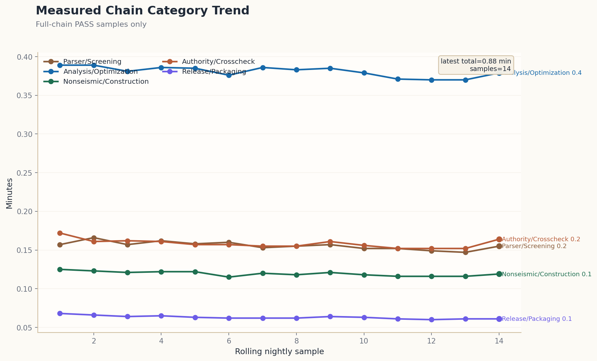

# Release Gap Report

- Generated at: `2026-04-06T13:55:02.080799+00:00`
- Release-candidate gates: `True`
- Commercial readiness grade: `Commercial`
- Deployment model: `engineer_in_the_loop_accelerated_coverage`
- Accelerated coverage target: `95-99%`
- Residual holdout target: `1-5%`
- Estimated time saved: `90-96%`
- Measured accelerated chain wall-clock (comparable rolling N=14): `0.88 min` (range `0.85-0.91 min`)
- Current measured chain wall-clock: `0.88 min`
- Engineer-in-loop accelerated coverage ready: `True`
- Time-saving focus: `Use this engine to automate the dominant, time-consuming 95-99% of repeated analysis, screening, packaging, and optimization workflows. Keep the residual 1-5% under licensed engineer review, legacy-tool cross-check, and formal sign-off workflows.`
- Full commercial replacement ready: `False`
- MIDAS semantic load binding: `True` (use_stld=2, semantic_cases=6, semantic_combinations=8)
- MIDAS bound/unbound load rows: `nodal=12/0`, `selfweight=1/0`, `pressure=7278/0`
- MIDAS section-library validator: `MIDAS section-library: ok | 182/183 used | 183 templates | source=midas_parser_derived | implementation/phase1/open_data/midas/midas_generator_33.json`
- MIDAS KDS geometry-bridge validator: `MIDAS kds-geometry-bridge: ok | mapped_review_ids=12/12 | exact=12 | heuristic=0 | rows=1056 | row_provenance=1056/1056 | row_exact=1056 | row_heuristic=0 | strategies=manual_verified_exact_focus_member:12 | confidence=manual_verified_exact_focus:12 | source=kds_codecheck_bridge_metadata | registry=merged_registry 12/12 | registry_exact=12 | registry_heuristic=0 | registry_sources=manual_review_exact_focus_registry:12 | implementation/phase1/open_data/midas/midas_generator_33.json`
- MIDAS LOADCOMB round-trip validator: `MIDAS loadcomb-roundtrip: ok | entry_row_coverage=midas_generator_33.json=1.00, midas_generator_33.pr_recheck.json=1.00, midas_generator_33.optimized.roundtrip.json=1.00 | artifacts=3`
- Commercial benchmark breadth: `Commercial benchmark breadth: families=3, measured_families=2, measured_cases=51, shell_beam_mix=31`
- Solver breadth: `Solver breadth: PASS | shell=yes(elems=5,cases=31) | wall=yes(rows=2,cases=14,material=rc_composite) | interface=yes(ssi_nonlinear_boundary) | contact=full_structural_contact | general_fe_contact=yes(10/10) | surface_interaction=yes(7/7) | interaction_family=yes(420/420) | interaction_sources=10/10 | groups=modal-transfer=4/4,phase-assimilation-coupling=4/4,streaming-partition-coupling=4/4,integrated-vibration-coupling=4/4,resilience-recovery-coupling=4/4,kinematic-coupling=3/3,constraint-bridge=3/3,wave-radiation=2/2,boundary-absorption-coupling=4/4,attention-guided-transfer=4/4,residual-stabilization-coupling=4/4,solver-feedback-coupling=4/4,multiphysics-coupling=4/4,explicit-shear-transfer=4/4,phase-latency-coupling=4/4,cache-window-coupling=4/4,whitebox-feedback-coupling=4/4,recovery-residual-coupling=4/4,support-contact-modulation-coupling=4/4,lining-recovery-coupling=4/4,panel-feedback-coupling=4/4,pressure-mapping-coupling=4/4,shell-shell=53/53,shell-wall=81/81,footing-soil=62/62,track-slab=8/8,vehicle-track=8/8,tunnel-lining-soil=8/8,joint-panel=8/8,ssi=13/13,soil-tunnel=84/84,direct-contact=11/11`
- Element/material breadth: `Element/material breadth: PASS | shell=yes(elems=5,cases=31) | wall=yes(rows=2,cases=14) | contact=full_structural_contact | materials=2(rc_composite,steel_elastic_plastic) | links=6(bearing_bilinear,compression_only_penalty,coulomb_friction,kelvin_voigt_pounding,normal_gap_unilateral,uplift_seat_unilateral) | capabilities=12(contact_bearing_friction_impact,contact_gap_uplift_unilateral,dissipative_device_response,foundation_soil_link_nonlinear,interface_transfer_finite,rc_bond_slip,rc_cracking,rc_creep_shrinkage,shell_surface_transfer,slab_wall_interaction,soil_boundary_nonlinear,wall_compression_damage) | groups=4(rc=5,shell_interface=2,foundation_soil=2,device_contact=3)`
- Constitutive/interaction families: `expanded constitutive/interaction families are surfaced explicitly as shared summary lines across the release, committee, and external reports; the same lines are reused as-is.`
- Material constitutive gate: `Material constitutive gate: PASS | concrete_damage=yes(matrix=48/48,max=1.000) | cyclic_degradation=yes(matrix=46/46,residual_max=1.914%) | bond_interface=yes(matrix=48/48,bond_max=0.980) | creep_shrinkage=yes(matrix=7/7,mean=1.000/0.617) | soil_boundary_nonlinear=yes(matrix=11/11,profile=dense_sand) | device_dissipation=yes(matrix=10/10,types=3) | foundation_impedance_nonlinear=yes(matrix=19/19,links=6) | contact_link_hysteresis=yes(matrix=15/15,cats=6) | panel_zone_joint_response=yes(matrix=12/12,rows=12) | wind_dynamic_response=yes(matrix=16/16,topo=4) | track_support_viscoelasticity=yes(matrix=11/11,class=B) | vehicle_track_transient_coupling=yes(matrix=19/19,iters=1.64) | tunnel_soil_wave_attenuation=yes(matrix=13/13,dist=24) | serviceability_velocity_response=yes(matrix=8/8,pass_ratio=1.000) | construction_stage_redistribution=yes(matrix=6/6,diff=1) | joint_constraint_transfer=yes(matrix=5/5,rows=135) | aeroelastic_serviceability=yes(matrix=7/7,pass_ratio=1.000) | heterogeneous_soil_adaptation=yes(matrix=5/5,recall=1.000) | segment_joint_softening=yes(matrix=5/5,yield=53.000) | longitudinal_wave_strain_transfer=yes(matrix=5/5,strain=0.000000) | raw_pressure_field_mapping=yes(matrix=5/5,mapped=7278) | phase_assimilation_correction=yes(matrix=5/5,ratio=0.964) | multiscale_streaming_refinement=yes(matrix=5/5,chunk=16) | integrated_vibration_transfer=yes(matrix=5/5,checks=4) | resilience_ood_recovery=yes(matrix=5/5,steps=3) | boundary_absorption_nonlinear=yes(matrix=6/6,supports=2) | attention_load_localization=yes(matrix=6/6,peak=0.350) | residual_energy_stabilization=yes(matrix=7/7,solver=FIRE) | matrix=400/400 | groups=concrete_damage=48/48,cyclic_degradation=46/46,bond_interface=48/48,creep_shrinkage=7/7,soil_boundary_nonlinear=11/11,device_dissipation=10/10,foundation_impedance_nonlinear=19/19,contact_link_hysteresis=15/15,panel_zone_joint_response=12/12,wind_dynamic_response=16/16,track_support_viscoelasticity=11/11,vehicle_track_transient_coupling=19/19,tunnel_soil_wave_attenuation=13/13,serviceability_velocity_response=8/8,construction_stage_redistribution=6/6,joint_constraint_transfer=5/5,aeroelastic_serviceability=7/7,heterogeneous_soil_adaptation=5/5,segment_joint_softening=5/5,longitudinal_wave_strain_transfer=5/5,raw_pressure_field_mapping=5/5,phase_assimilation_correction=5/5,multiscale_streaming_refinement=5/5,integrated_vibration_transfer=5/5,resilience_ood_recovery=5/5,boundary_absorption_nonlinear=6/6,attention_load_localization=6/6,residual_energy_stabilization=7/7,phase_latency_projection=5/5,cache_window_adaptation=5/5,whitebox_feedback_stitching=5/5,recovery_residual_relock=5/5,rail_support_contact_modulation=5/5,tunnel_lining_interface_recovery=5/5,panel_feedback_residual_transfer=5/5,wind_pressure_coupled_transfer=5/5 | coverage=cd[t=2,h=2,s=2,sf=19],cyc[t=2,h=2,store=1,sf=18],bond[t=2,h=2,s=2,sf=18]`
- MIDAS KDS row provenance export: `MIDAS KDS row provenance export: PASS | combos=6 | rows=144 | members=12 | clauses=6 | exact_rows=144 | clause_filters=6 | member_filters=12 | reverse_jump=viewer_subset_reverse_jump_v11`
- Contact readiness: `Contact readiness: PASS | scope=wheel_rail_hertzian_contact_only | schema=yes | solver=yes(ratio=0.994,max_force=6.52235N) | whitebox=yes(err=0.0048) | structural_contact=undocumented`
- Foundation/soil link: `Foundation/soil link: PASS | foundation_members=76 | optimized_groups=2 | ssi=yes | soil_tunnel=yes | impedance_schema=yes | links=6(bearing_bilinear,compression_only_penalty,coulomb_friction,kelvin_voigt_pounding,normal_gap_unilateral,uplift_seat_unilateral)`
- Structural contact readiness: `Structural contact readiness: PASS | bounded_contact=yes | impl=6/6 | validated=6/6 | ready=6/6 | partial_only=none | missing=none`
- General FE contact matrix: `General FE contact matrix: PASS | ready=10/10 | direct=6/6 | foundation=yes | interface=yes | ssi=yes | soil_tunnel=yes`
- Surface interaction benchmark: `Surface interaction benchmark: PASS | ready=7/7 | family_matrix=420/420 | source_families=10/10 | shell_surface=yes | interface_transfer=yes | interface_gap=yes | foundation=yes | track_slab=yes | vehicle_track=yes | tunnel_lining_soil=yes | joint_panel=yes | ssi=yes | soil_tunnel=yes | direct_contact=6/6 | general_fe_coupling=yes | groups=modal-transfer=4/4,phase-assimilation-coupling=4/4,streaming-partition-coupling=4/4,integrated-vibration-coupling=4/4,resilience-recovery-coupling=4/4,kinematic-coupling=3/3,constraint-bridge=3/3,wave-radiation=2/2,boundary-absorption-coupling=4/4,attention-guided-transfer=4/4,residual-stabilization-coupling=4/4,solver-feedback-coupling=4/4,multiphysics-coupling=4/4,explicit-shear-transfer=4/4,phase-latency-coupling=4/4,cache-window-coupling=4/4,whitebox-feedback-coupling=4/4,recovery-residual-coupling=4/4,support-contact-modulation-coupling=4/4,lining-recovery-coupling=4/4,panel-feedback-coupling=4/4,pressure-mapping-coupling=4/4,shell-shell=53/53,shell-wall=81/81,footing-soil=62/62,track-slab=8/8,vehicle-track=8/8,tunnel-lining-soil=8/8,joint-panel=8/8,ssi=13/13,soil-tunnel=84/84,direct-contact=11/11`
- MIDAS interoperability/export readiness: `MIDAS interoperability/export readiness: PASS | seeds=3/3 | patterns=3/3 | preview=3/3 | roundtrip=3/3 exact_entry_row_min=1.00 | bounded_subset=editor_seed+raw_recovery+preview_roundtrip | limits=solver_ready_reconstruction_pending, normalized_factor_maps_pending, summary_grade_preview_only, primitive_load_cards_pending`
- MIDAS native roundtrip/write-back: `MIDAS native roundtrip: PASS | corpus=57 | native_text=25 | public_native=4 | public_raw_native=3 | public_bridge_native=1 | public_preview_native=7 | public_structural_preview_native=3 | fixture_native=4 | repo_native=3 | experiment_native=3 | archives=7 | ready=25 | public_ready=15 | public_native_ready=4 | public_raw_ready=3 | public_bridge_ready=1 | public_preview_ready=7 | public_structural_preview_ready=3 | fixture_ready=4 | repo_ready=3 | experiment_ready=3 | receipts=25/25 | topology=25/25 | load=25/25 | loadcomb=25/25 exact | types=8 | taxonomy=exact:24,canonical:1,lossy:0,unsupported:0,manual:0 | pending_review=0`
- Performance profiling: `Performance profiling: PASS | ndtha=106.34s(solver=92.93,state=7.81,iface=5.12,halo=0.47) | ssi_contact=160steps/1.01iters/newton=0/zero_gap_skip=1.00/pairs=290:354/sweep=4/4 | moving_load=warm=0.001/0.001s,steady=0.001/0.001s,scale=0.619/1.226/2.464s | gpu_host_ops=2 unavoidable/0 optimizable | sprint=3(ndtha_partitioned_runtime,ssi_contact_convergence_path,moving_load_kernel_warmup_observability)`
- Performance detail: `moving_load_scale=0.619/1.226/2.464s | cached_inverse=True/True | ssi_variant_sweep=4/4 zero_gap=4/4 pruned=4/4`
- Solver truthfulness gate: `Solver truthfulness: PASS | reports=4/4 | explicit=4/4 | production_seeded=4/4 | surrogate_free=4/4 | cpu_fallback=0/4 | solver_hip_variants=20/20 | hazards=20 | topologies=17 | load_paths=15`
- Hardest external 10-case kickoff: `Hardest external 10-case kickoff: PASS | ready=10/10 | start_now=yes | mode=start_now_limited_external_benchmark | full_submission=no | review_pending=0 | measured_families=2 | measured_cases=51`
- Nonlinear generalization: `Nonlinear generalization: PASS | beam=yes(formulations=3:corotational_proxy,displacement_based,force_based,families=6:composite_transfer_girder,outrigger_link_beam,perimeter_frame_column,rectangular_rc_frame,slender_pdelta_column,steel_moment_column) | fiber=yes(families=6:rectangular_rc,rectangular_rc_wall_boundary,wide_flange_steel,wide_flange_transfer,composite_beam,composite_transfer_girder) | layered=yes(families=6:wall,slab,shell,coupling_wall,bridge_deck,tunnel_lining) | joint_panel=yes(families=4:panel_zone_rc_core,knee_joint_rc,brace_gusset_panel,joint_transfer_composite) | foundation_sections=yes(families=4:mat_foundation_strip,pilecap_block,embedded_raft_shell,caisson_lining) | connection_sections=yes(families=4:buckling_restrained_core,viscous_link_cartridge,yielding_fuse_plate,base_isolation_slider) | substructure_sections=yes(families=4:diaphragm_wall_panel,retaining_toe_shell,track_slab_interface_shell,embedded_lining_transition) | device_sections=yes(families=4:viscous_damper_link,buckling_restrained_damper,tuned_mass_transfer_beam,metal_yield_fuse) | isolation_sections=yes(families=4:lead_rubber_bearing,friction_pendulum_slider,moat_edge_restrainer,uplift_isolation_keeper) | soil_interface_sections=yes(families=4:pile_soil_interface_ring,raft_contact_transition,tunnel_grout_interface,retaining_backfill_interface) | bearing_sections=yes(families=4:pot_bearing_cap,guided_bearing_girder_seat,rocker_bearing_transfer,restrainer_bearing_block) | retrofit_sections=yes(families=4:frp_wrapped_column,steel_jacket_column,pt_clamp_transfer_beam,rc_encased_joint_core) | ground_improvement_sections=yes(families=4:jet_grout_block,deep_soil_mixing_panel,stone_column_raft,geogrid_mattress_transition) | foundation=yes(models=6) | engine=yes`
- Workflow/interoperability productization: `Workflow/interoperability productization: PASS | authoring=yes(direct_patch=25,payloads=17,generated=6,special_members=10/10,zero_touch_special=3) | signed=yes(artifacts=9) | audit=yes(mode=zero_touch_native_authoring,packets=0,followup=0,resolution=0,zero_touch=11) | audit_actions=yes(queue=0,generated=8,zero_touch=11) | case_attestation=yes(cases=10,manifests=10,templates=0,receipts=10,attested=10,status=MANIFEST_ATTESTED_AND_AUTHORITY_RECEIPTED=10) | auto_approved=yes(reason=PASS_NO_OPEN_DECISION_ITEMS,generated=3) | submission_bundle=yes(bundle=20260406T135255Z,generated=7) | approval=yes(approve_all_ready=True) | viewer=yes(results+review) | native_roundtrip=yes(corpus=57,ready=25,public=15,native_public=4,preview_public=7,structural_preview_public=3,fixture=4,repo=3,experiment=3,receipts=25,types=8,taxonomy=exact:24,canonical:1,lossy:0) | irregular_structure_track=yes(families=20,sources=32,local_ready=15,remote_candidates=17,native_candidates=18,solver_candidates=13,ai_candidates=32,top5=5,exec_ready=5,exec_blocked=0,exec_canonical=4,exec_bridged=1,exec_proxy=0,gate=irregular_structure_collection_gate_report.json,manifest=irregular_top5_execution_manifest.json,exec_manifest=irregular_benchmark_execution_manifest.json) | roundtrip=editor_seed+raw_recovery+preview_roundtrip | exact_rows=144`
- Commercial readiness: `Commercial readiness: PASS | grade=Commercial | strict_measured=True | families=3 | measured_families=2 | measured_cases=51 | shell_beam_mix=31`
- MIDAS optimized export artifact present: `True` (contract_pass=`True`, support_mode=`native_authoring_supported_changeset`, supported_changes=`36`, unsupported_changes=`0`, direct_patch_changes=`25`, direct_patch_families=`beam_section=1, connection_detailing=6, detailing=5, perimeter_frame=1, rebar=5, slab_thickness=2, wall_thickness=5`, special_member_families=``, special_member_zero_touch=``, rebar_namespace_mode=`group_local`, rebar_material_namespace_present=`True`, rebar_group_local_namespace_present=`True`, material_rebar_payloads=`3/5`, group_local_rebar_payloads=`6/6`, group_local_connection_detailing_payloads=`6/6`, connection_direct_patch_eligible=`6`, group_local_detailing_payloads=`5/5`, connection_namespace_mode=`group_local`, connection_group_local_namespace_present=`True`, connection_structured_payload_mapped=`6`, connection_delivery_mode=`direct_patch_native_authoring_zero_touch_verified`, detailing_namespace_mode=`group_local`, detailing_group_local_namespace_present=`True`, detailing_direct_patch_eligible=`5`, detailing_structured_payload_mapped=`5`, detailing_delivery_mode=`direct_patch_native_authoring_zero_touch_verified`, rebar_direct_patch_eligible=`6`, patched_material_rows=`24`, cloned_materials=`24`, rebar_delivery_mode=`direct_patch_eligible`, evidence_model=`direct_patch_plus_zero_touch_verification_manifest`, rebar_direct_patch_blockers=``, rebar_mapping_sources=`alt_slab_wall_group_id=5, direct_group_id=1`, sidecar_families=``, sidecar_audit=`` (0), sidecar_manual=`` (0), audit_manifest=`` (0), audit_packets=`` (0), audit_packet_files=`` (0), audit_queue=`` (0), audit_queue_status=``, audit_followup=`` (0), audit_followup_owner=``, audit_followup_status=``, audit_followup_review_owner=``, audit_followup_sla=``, audit_followup_age=``, audit_followup_overdue=`0`, audit_resolution=``, audit_resolution_status=``, sidecar_priorities=``, sidecar_followups=``, cloned_sections=`0`, cloned_thicknesses=`6`, retargeted_elements=`418`)
- MGT export LOADCOMB evidence: `preview_exists=True` | `roundtrip_pass=True` | `MGT export LOADCOMB roundtrip: ok | entry_row_coverage=1.00 | combos=8`
- MGT delivery boundary: `direct_patch_plus_zero_touch_verification_manifest` | `direct_patch=beam_section=1, connection_detailing=6, detailing=5, perimeter_frame=1, rebar=5, slab_thickness=2, wall_thickness=5 | sidecar=n/a | connection_payload=direct_patch_native_authoring_zero_touch_verified | detailing_payload=direct_patch_native_authoring_zero_touch_verified`

## Advanced Holdouts

| Area | Ready | Mode | Why |
|---|---|---|---|
| Dynamic plastic-hinge refresh | True | computed_member_local_hinge_refresh | Dynamic hinge-refresh artifact is attached. |
| Panel-zone 3D clash and anchorage | True | internal_engine_panel_zone_3d_clash_and_anchorage_complete | Internal engine completed panel-zone joint geometry, anchorage, and clash recomputation with validated member overlap; external verification now serves as an optional audit boundary. |
| Foundation / mat / pile optimization | True | active_foundation_member_optimization | foundation optimization artifact is attached and dataset contains foundation members |
| Raw wind-tunnel data mapping | True | raw_hffb_node_pressure_mapping | Raw wind-tunnel HFFB mapping is ready for traceable MIDAS binding. |

## Current Release Status

- `nightly_release_pass`: `True`
- `ci_gate_pass`: `True`
- `midas_section_library_summary_line`: `MIDAS section-library: ok | 182/183 used | 183 templates | source=midas_parser_derived | implementation/phase1/open_data/midas/midas_generator_33.json`
- `midas_kds_geometry_bridge_summary_line`: `MIDAS kds-geometry-bridge: ok | mapped_review_ids=12/12 | exact=12 | heuristic=0 | rows=1056 | row_provenance=1056/1056 | row_exact=1056 | row_heuristic=0 | strategies=manual_verified_exact_focus_member:12 | confidence=manual_verified_exact_focus:12 | source=kds_codecheck_bridge_metadata | registry=merged_registry 12/12 | registry_exact=12 | registry_heuristic=0 | registry_sources=manual_review_exact_focus_registry:12 | implementation/phase1/open_data/midas/midas_generator_33.json`
- `midas_loadcomb_roundtrip_summary_line`: `MIDAS loadcomb-roundtrip: ok | entry_row_coverage=midas_generator_33.json=1.00, midas_generator_33.pr_recheck.json=1.00, midas_generator_33.optimized.roundtrip.json=1.00 | artifacts=3`
- `commercial_benchmark_breadth_summary_line`: `Commercial benchmark breadth: families=3, measured_families=2, measured_cases=51, shell_beam_mix=31`
- `solver_breadth_summary_line`: `Solver breadth: PASS | shell=yes(elems=5,cases=31) | wall=yes(rows=2,cases=14,material=rc_composite) | interface=yes(ssi_nonlinear_boundary) | contact=full_structural_contact | general_fe_contact=yes(10/10) | surface_interaction=yes(7/7) | interaction_family=yes(420/420) | interaction_sources=10/10 | groups=modal-transfer=4/4,phase-assimilation-coupling=4/4,streaming-partition-coupling=4/4,integrated-vibration-coupling=4/4,resilience-recovery-coupling=4/4,kinematic-coupling=3/3,constraint-bridge=3/3,wave-radiation=2/2,boundary-absorption-coupling=4/4,attention-guided-transfer=4/4,residual-stabilization-coupling=4/4,solver-feedback-coupling=4/4,multiphysics-coupling=4/4,explicit-shear-transfer=4/4,phase-latency-coupling=4/4,cache-window-coupling=4/4,whitebox-feedback-coupling=4/4,recovery-residual-coupling=4/4,support-contact-modulation-coupling=4/4,lining-recovery-coupling=4/4,panel-feedback-coupling=4/4,pressure-mapping-coupling=4/4,shell-shell=53/53,shell-wall=81/81,footing-soil=62/62,track-slab=8/8,vehicle-track=8/8,tunnel-lining-soil=8/8,joint-panel=8/8,ssi=13/13,soil-tunnel=84/84,direct-contact=11/11`
- `element_material_breadth_summary_line`: `Element/material breadth: PASS | shell=yes(elems=5,cases=31) | wall=yes(rows=2,cases=14) | contact=full_structural_contact | materials=2(rc_composite,steel_elastic_plastic) | links=6(bearing_bilinear,compression_only_penalty,coulomb_friction,kelvin_voigt_pounding,normal_gap_unilateral,uplift_seat_unilateral) | capabilities=12(contact_bearing_friction_impact,contact_gap_uplift_unilateral,dissipative_device_response,foundation_soil_link_nonlinear,interface_transfer_finite,rc_bond_slip,rc_cracking,rc_creep_shrinkage,shell_surface_transfer,slab_wall_interaction,soil_boundary_nonlinear,wall_compression_damage) | groups=4(rc=5,shell_interface=2,foundation_soil=2,device_contact=3)`
- `material_constitutive_summary_line`: `Material constitutive gate: PASS | concrete_damage=yes(matrix=48/48,max=1.000) | cyclic_degradation=yes(matrix=46/46,residual_max=1.914%) | bond_interface=yes(matrix=48/48,bond_max=0.980) | creep_shrinkage=yes(matrix=7/7,mean=1.000/0.617) | soil_boundary_nonlinear=yes(matrix=11/11,profile=dense_sand) | device_dissipation=yes(matrix=10/10,types=3) | foundation_impedance_nonlinear=yes(matrix=19/19,links=6) | contact_link_hysteresis=yes(matrix=15/15,cats=6) | panel_zone_joint_response=yes(matrix=12/12,rows=12) | wind_dynamic_response=yes(matrix=16/16,topo=4) | track_support_viscoelasticity=yes(matrix=11/11,class=B) | vehicle_track_transient_coupling=yes(matrix=19/19,iters=1.64) | tunnel_soil_wave_attenuation=yes(matrix=13/13,dist=24) | serviceability_velocity_response=yes(matrix=8/8,pass_ratio=1.000) | construction_stage_redistribution=yes(matrix=6/6,diff=1) | joint_constraint_transfer=yes(matrix=5/5,rows=135) | aeroelastic_serviceability=yes(matrix=7/7,pass_ratio=1.000) | heterogeneous_soil_adaptation=yes(matrix=5/5,recall=1.000) | segment_joint_softening=yes(matrix=5/5,yield=53.000) | longitudinal_wave_strain_transfer=yes(matrix=5/5,strain=0.000000) | raw_pressure_field_mapping=yes(matrix=5/5,mapped=7278) | phase_assimilation_correction=yes(matrix=5/5,ratio=0.964) | multiscale_streaming_refinement=yes(matrix=5/5,chunk=16) | integrated_vibration_transfer=yes(matrix=5/5,checks=4) | resilience_ood_recovery=yes(matrix=5/5,steps=3) | boundary_absorption_nonlinear=yes(matrix=6/6,supports=2) | attention_load_localization=yes(matrix=6/6,peak=0.350) | residual_energy_stabilization=yes(matrix=7/7,solver=FIRE) | matrix=400/400 | groups=concrete_damage=48/48,cyclic_degradation=46/46,bond_interface=48/48,creep_shrinkage=7/7,soil_boundary_nonlinear=11/11,device_dissipation=10/10,foundation_impedance_nonlinear=19/19,contact_link_hysteresis=15/15,panel_zone_joint_response=12/12,wind_dynamic_response=16/16,track_support_viscoelasticity=11/11,vehicle_track_transient_coupling=19/19,tunnel_soil_wave_attenuation=13/13,serviceability_velocity_response=8/8,construction_stage_redistribution=6/6,joint_constraint_transfer=5/5,aeroelastic_serviceability=7/7,heterogeneous_soil_adaptation=5/5,segment_joint_softening=5/5,longitudinal_wave_strain_transfer=5/5,raw_pressure_field_mapping=5/5,phase_assimilation_correction=5/5,multiscale_streaming_refinement=5/5,integrated_vibration_transfer=5/5,resilience_ood_recovery=5/5,boundary_absorption_nonlinear=6/6,attention_load_localization=6/6,residual_energy_stabilization=7/7,phase_latency_projection=5/5,cache_window_adaptation=5/5,whitebox_feedback_stitching=5/5,recovery_residual_relock=5/5,rail_support_contact_modulation=5/5,tunnel_lining_interface_recovery=5/5,panel_feedback_residual_transfer=5/5,wind_pressure_coupled_transfer=5/5 | coverage=cd[t=2,h=2,s=2,sf=19],cyc[t=2,h=2,store=1,sf=18],bond[t=2,h=2,s=2,sf=18]`
- `midas_kds_row_provenance_export_summary_line`: `MIDAS KDS row provenance export: PASS | combos=6 | rows=144 | members=12 | clauses=6 | exact_rows=144 | clause_filters=6 | member_filters=12 | reverse_jump=viewer_subset_reverse_jump_v11`
- `midas_kds_row_provenance_preview_rows`: `[{'combination_name': 'gLCB1', 'member_id': 'C-TST-003', 'case_id': 'C-TST-003', 'clause_label': 'KDS-MOMENT-Y-001', 'baseline_focus_member_id': '27441', 'bridge_row_provenance_mode_label': 'exact row-level provenance', 'clause_provenance_summary_label': 'rows=12 | members=12 | rules=1 | hazards=3', 'bridge_member_inventory_summary_label': 'review=C-TST-003 | case=C-TST-003 | baseline=27441 | member_types=column'}, {'combination_name': 'gLCB1', 'member_id': 'C-TRN-005', 'case_id': 'C-TRN-005', 'clause_label': 'KDS-MOMENT-Y-001', 'baseline_focus_member_id': '27441', 'bridge_row_provenance_mode_label': 'exact row-level provenance', 'clause_provenance_summary_label': 'rows=12 | members=12 | rules=1 | hazards=3', 'bridge_member_inventory_summary_label': 'review=C-TRN-005 | case=C-TRN-005 | baseline=27441 | member_types=column'}, {'combination_name': 'gLCB1', 'member_id': 'C-TST-003', 'case_id': 'C-TST-003', 'clause_label': 'KDS-INT-FRAME-001', 'baseline_focus_member_id': '27441', 'bridge_row_provenance_mode_label': 'exact row-level provenance', 'clause_provenance_summary_label': 'rows=12 | members=12 | rules=1 | hazards=3', 'bridge_member_inventory_summary_label': 'review=C-TST-003 | case=C-TST-003 | baseline=27441 | member_types=column'}, {'combination_name': 'gLCB1', 'member_id': 'C-TST-001', 'case_id': 'C-TST-001', 'clause_label': 'KDS-MOMENT-Y-001', 'baseline_focus_member_id': '27441', 'bridge_row_provenance_mode_label': 'exact row-level provenance', 'clause_provenance_summary_label': 'rows=12 | members=12 | rules=1 | hazards=3', 'bridge_member_inventory_summary_label': 'review=C-TST-001 | case=C-TST-001 | baseline=27441 | member_types=column'}, {'combination_name': 'gLCB1', 'member_id': 'C-TST-003', 'case_id': 'C-TST-003', 'clause_label': 'KDS-SHEAR-Y-001', 'baseline_focus_member_id': '27441', 'bridge_row_provenance_mode_label': 'exact row-level provenance', 'clause_provenance_summary_label': 'rows=12 | members=12 | rules=1 | hazards=3', 'bridge_member_inventory_summary_label': 'review=C-TST-003 | case=C-TST-003 | baseline=27441 | member_types=column'}, {'combination_name': 'gLCB1', 'member_id': 'C-TRN-005', 'case_id': 'C-TRN-005', 'clause_label': 'KDS-INT-FRAME-001', 'baseline_focus_member_id': '27441', 'bridge_row_provenance_mode_label': 'exact row-level provenance', 'clause_provenance_summary_label': 'rows=12 | members=12 | rules=1 | hazards=3', 'bridge_member_inventory_summary_label': 'review=C-TRN-005 | case=C-TRN-005 | baseline=27441 | member_types=column'}, {'combination_name': 'gLCB1', 'member_id': 'C-TRN-007', 'case_id': 'C-TRN-007', 'clause_label': 'KDS-MOMENT-Y-001', 'baseline_focus_member_id': '27425', 'bridge_row_provenance_mode_label': 'exact row-level provenance', 'clause_provenance_summary_label': 'rows=12 | members=12 | rules=1 | hazards=3', 'bridge_member_inventory_summary_label': 'review=C-TRN-007 | case=C-TRN-007 | baseline=27425 | member_types=wall'}, {'combination_name': 'gLCB1', 'member_id': 'C-TST-003', 'case_id': 'C-TST-003', 'clause_label': 'KDS-AXIAL-001', 'baseline_focus_member_id': '27441', 'bridge_row_provenance_mode_label': 'exact row-level provenance', 'clause_provenance_summary_label': 'rows=12 | members=12 | rules=1 | hazards=3', 'bridge_member_inventory_summary_label': 'review=C-TST-003 | case=C-TST-003 | baseline=27441 | member_types=column'}]`
- `midas_kds_row_provenance_clause_filter_rows`: `[{'clause_label': 'KDS-AXIAL-001', 'clause_title_label': 'Axial strength check', 'clause_family_label': 'strength', 'row_count': 24, 'member_count': 12, 'combination_count': 2, 'top_combination_name': 'gLCB1', 'top_member_id': 'C-TST-003', 'top_case_id': 'C-TST-003', 'top_dcr_label': '1.065', 'viewer_row_url': 'file:///home/betelgeuze/%EA%B1%B4%EC%B6%95%EA%B5%AC%EC%A1%B0%EB%B6%84%EC%84%9D/implementation/phase1/release/visualization/structural_optimization_viewer.html?source=row_provenance_csv&combination=gLCB1&row=7&clause=KDS-AXIAL-001&hazard=combined&rule_family=strength&subset_key=combination%3AgLCB1&subset_type=combination&row_ref=gLCB1%3A%3A7%3A%3AC-TST-003%3A%3AC-TST-003&focus_member=27441&member_id=C-TST-003&case_id=C-TST-003&baseline_focus_member_id=27441&view=midas&focus=interactive3d&results_card=envelope&results_series=0&results_sample=0&results_detail_item_index=0&results_companion_item_index=0&results_companion_focus_key=chart-marker%3A0&results_companion_selection_key=results-companion%3Ainteractive&results_detail_focus_key=chart-marker%3A0&results_detail_selection_key=results-detail%3Achart&codecheck_filtered_row=0&codecheck_clause_index=0&codecheck_hazard_index=0&codecheck_rule_family_index=0&results_companion=interactive&results_detail_block=chart&codecheck_surface=drilldown&codecheck_companion=detail&codecheck_companion_item_index=0&codecheck_companion_focus_key=row-provenance%3Ajump-row&codecheck_companion_selection_key=row%3AgLCB1%3A%3A7%3A%3AC-TST-003%3A%3AC-TST-003&codecheck_detail_block=row-provenance&codecheck_appendix_block=subset-summary&codecheck_detail_item_index=0&codecheck_appendix_item_index=0&codecheck_detail_focus_key=row-provenance%3Ajump-row&codecheck_appendix_focus_key=subset%3Acurrent-slice&codecheck_detail_selection_key=row%3AgLCB1%3A%3A7%3A%3AC-TST-003%3A%3AC-TST-003&codecheck_appendix_selection_key=subset%3Acombination%3AgLCB1&interactive_detail_more=open&overlay_detail_more=open&baseline_secondary=elevation', 'viewer_slice_url': 'file:///home/betelgeuze/%EA%B1%B4%EC%B6%95%EA%B5%AC%EC%A1%B0%EB%B6%84%EC%84%9D/implementation/phase1/release/visualization/structural_optimization_viewer.html?source=row_provenance_csv&combination=gLCB1&subset_key=combination%3AgLCB1&subset_type=combination&row_ref=gLCB1%3A%3A7%3A%3AC-TST-003%3A%3AC-TST-003&focus_member=27441&member_id=C-TST-003&case_id=C-TST-003&baseline_focus_member_id=27441&view=midas&focus=interactive3d&results_card=envelope&results_series=0&results_sample=0&results_detail_item_index=0&results_companion_item_index=0&results_companion_focus_key=check%3A0&results_companion_selection_key=results-companion%3Achecks&results_detail_focus_key=chart-marker%3A0&results_detail_selection_key=results-detail%3Achart&codecheck_filtered_row=0&codecheck_clause_index=0&codecheck_hazard_index=0&codecheck_rule_family_index=0&results_companion=checks&results_detail_block=chart&codecheck_surface=drilldown&codecheck_companion=reviewer-appendix&codecheck_companion_item_index=0&codecheck_companion_focus_key=subset%3Acurrent-slice&codecheck_companion_selection_key=row%3AgLCB1%3A%3A7%3A%3AC-TST-003%3A%3AC-TST-003&codecheck_detail_block=row-provenance&codecheck_appendix_block=subset-summary&codecheck_detail_item_index=0&codecheck_appendix_item_index=0&codecheck_detail_focus_key=row-provenance%3Ajump-row&codecheck_appendix_focus_key=subset%3Acurrent-slice&codecheck_detail_selection_key=row%3AgLCB1%3A%3A7%3A%3AC-TST-003%3A%3AC-TST-003&codecheck_appendix_selection_key=subset%3Acombination%3AgLCB1&interactive_detail_more=open&overlay_detail_more=open&baseline_secondary=elevation', 'preview_rows': [{'combination_name': 'gLCB1', 'member_id': 'C-TST-003', 'case_id': 'C-TST-003', 'clause_label': 'KDS-AXIAL-001', 'baseline_focus_member_id': '27441', 'bridge_row_provenance_mode_label': 'exact row-level provenance', 'clause_provenance_summary_label': 'rows=12 | members=12 | rules=1 | hazards=3', 'bridge_member_inventory_summary_label': 'review=C-TST-003 | case=C-TST-003 | baseline=27441 | member_types=column'}, {'combination_name': 'gLCB1', 'member_id': 'C-TRN-005', 'case_id': 'C-TRN-005', 'clause_label': 'KDS-AXIAL-001', 'baseline_focus_member_id': '27441', 'bridge_row_provenance_mode_label': 'exact row-level provenance', 'clause_provenance_summary_label': 'rows=12 | members=12 | rules=1 | hazards=3', 'bridge_member_inventory_summary_label': 'review=C-TRN-005 | case=C-TRN-005 | baseline=27441 | member_types=column'}, {'combination_name': 'gLCB1', 'member_id': 'C-TST-001', 'case_id': 'C-TST-001', 'clause_label': 'KDS-AXIAL-001', 'baseline_focus_member_id': '27441', 'bridge_row_provenance_mode_label': 'exact row-level provenance', 'clause_provenance_summary_label': 'rows=12 | members=12 | rules=1 | hazards=3', 'bridge_member_inventory_summary_label': 'review=C-TST-001 | case=C-TST-001 | baseline=27441 | member_types=column'}]}, {'clause_label': 'KDS-INT-FRAME-001', 'clause_title_label': 'Frame interaction check', 'clause_family_label': 'interaction', 'row_count': 24, 'member_count': 12, 'combination_count': 2, 'top_combination_name': 'gLCB1', 'top_member_id': 'C-TST-003', 'top_case_id': 'C-TST-003', 'top_dcr_label': '1.137', 'viewer_row_url': 'file:///home/betelgeuze/%EA%B1%B4%EC%B6%95%EA%B5%AC%EC%A1%B0%EB%B6%84%EC%84%9D/implementation/phase1/release/visualization/structural_optimization_viewer.html?source=row_provenance_csv&combination=gLCB1&row=2&clause=KDS-INT-FRAME-001&hazard=combined&rule_family=strength_interaction&subset_key=combination%3AgLCB1&subset_type=combination&row_ref=gLCB1%3A%3A2%3A%3AC-TST-003%3A%3AC-TST-003&focus_member=27441&member_id=C-TST-003&case_id=C-TST-003&baseline_focus_member_id=27441&view=midas&focus=interactive3d&results_card=envelope&results_series=0&results_sample=0&results_detail_item_index=0&results_companion_item_index=0&results_companion_focus_key=chart-marker%3A0&results_companion_selection_key=results-companion%3Ainteractive&results_detail_focus_key=chart-marker%3A0&results_detail_selection_key=results-detail%3Achart&codecheck_filtered_row=0&codecheck_clause_index=1&codecheck_hazard_index=0&codecheck_rule_family_index=1&results_companion=interactive&results_detail_block=chart&codecheck_surface=drilldown&codecheck_companion=detail&codecheck_companion_item_index=0&codecheck_companion_focus_key=row-provenance%3Ajump-row&codecheck_companion_selection_key=row%3AgLCB1%3A%3A2%3A%3AC-TST-003%3A%3AC-TST-003&codecheck_detail_block=row-provenance&codecheck_appendix_block=subset-summary&codecheck_detail_item_index=0&codecheck_appendix_item_index=0&codecheck_detail_focus_key=row-provenance%3Ajump-row&codecheck_appendix_focus_key=subset%3Acurrent-slice&codecheck_detail_selection_key=row%3AgLCB1%3A%3A2%3A%3AC-TST-003%3A%3AC-TST-003&codecheck_appendix_selection_key=subset%3Acombination%3AgLCB1&interactive_detail_more=open&overlay_detail_more=open&baseline_secondary=elevation', 'viewer_slice_url': 'file:///home/betelgeuze/%EA%B1%B4%EC%B6%95%EA%B5%AC%EC%A1%B0%EB%B6%84%EC%84%9D/implementation/phase1/release/visualization/structural_optimization_viewer.html?source=row_provenance_csv&combination=gLCB1&subset_key=combination%3AgLCB1&subset_type=combination&row_ref=gLCB1%3A%3A2%3A%3AC-TST-003%3A%3AC-TST-003&focus_member=27441&member_id=C-TST-003&case_id=C-TST-003&baseline_focus_member_id=27441&view=midas&focus=interactive3d&results_card=envelope&results_series=0&results_sample=0&results_detail_item_index=0&results_companion_item_index=0&results_companion_focus_key=check%3A0&results_companion_selection_key=results-companion%3Achecks&results_detail_focus_key=chart-marker%3A0&results_detail_selection_key=results-detail%3Achart&codecheck_filtered_row=0&codecheck_clause_index=1&codecheck_hazard_index=0&codecheck_rule_family_index=1&results_companion=checks&results_detail_block=chart&codecheck_surface=drilldown&codecheck_companion=reviewer-appendix&codecheck_companion_item_index=0&codecheck_companion_focus_key=subset%3Acurrent-slice&codecheck_companion_selection_key=row%3AgLCB1%3A%3A2%3A%3AC-TST-003%3A%3AC-TST-003&codecheck_detail_block=row-provenance&codecheck_appendix_block=subset-summary&codecheck_detail_item_index=0&codecheck_appendix_item_index=0&codecheck_detail_focus_key=row-provenance%3Ajump-row&codecheck_appendix_focus_key=subset%3Acurrent-slice&codecheck_detail_selection_key=row%3AgLCB1%3A%3A2%3A%3AC-TST-003%3A%3AC-TST-003&codecheck_appendix_selection_key=subset%3Acombination%3AgLCB1&interactive_detail_more=open&overlay_detail_more=open&baseline_secondary=elevation', 'preview_rows': [{'combination_name': 'gLCB1', 'member_id': 'C-TST-003', 'case_id': 'C-TST-003', 'clause_label': 'KDS-INT-FRAME-001', 'baseline_focus_member_id': '27441', 'bridge_row_provenance_mode_label': 'exact row-level provenance', 'clause_provenance_summary_label': 'rows=12 | members=12 | rules=1 | hazards=3', 'bridge_member_inventory_summary_label': 'review=C-TST-003 | case=C-TST-003 | baseline=27441 | member_types=column'}, {'combination_name': 'gLCB1', 'member_id': 'C-TRN-005', 'case_id': 'C-TRN-005', 'clause_label': 'KDS-INT-FRAME-001', 'baseline_focus_member_id': '27441', 'bridge_row_provenance_mode_label': 'exact row-level provenance', 'clause_provenance_summary_label': 'rows=12 | members=12 | rules=1 | hazards=3', 'bridge_member_inventory_summary_label': 'review=C-TRN-005 | case=C-TRN-005 | baseline=27441 | member_types=column'}, {'combination_name': 'gLCB1', 'member_id': 'C-TST-001', 'case_id': 'C-TST-001', 'clause_label': 'KDS-INT-FRAME-001', 'baseline_focus_member_id': '27441', 'bridge_row_provenance_mode_label': 'exact row-level provenance', 'clause_provenance_summary_label': 'rows=12 | members=12 | rules=1 | hazards=3', 'bridge_member_inventory_summary_label': 'review=C-TST-001 | case=C-TST-001 | baseline=27441 | member_types=column'}]}, {'clause_label': 'KDS-MOMENT-Y-001', 'clause_title_label': 'Major-axis flexure check', 'clause_family_label': 'strength', 'row_count': 24, 'member_count': 12, 'combination_count': 2, 'top_combination_name': 'gLCB1', 'top_member_id': 'C-TST-003', 'top_case_id': 'C-TST-003', 'top_dcr_label': '1.216', 'viewer_row_url': 'file:///home/betelgeuze/%EA%B1%B4%EC%B6%95%EA%B5%AC%EC%A1%B0%EB%B6%84%EC%84%9D/implementation/phase1/release/visualization/structural_optimization_viewer.html?source=row_provenance_csv&combination=gLCB1&row=0&clause=KDS-MOMENT-Y-001&hazard=combined&rule_family=strength&subset_key=combination%3AgLCB1&subset_type=combination&row_ref=gLCB1%3A%3A0%3A%3AC-TST-003%3A%3AC-TST-003&focus_member=27441&member_id=C-TST-003&case_id=C-TST-003&baseline_focus_member_id=27441&view=midas&focus=interactive3d&results_card=envelope&results_series=0&results_sample=0&results_detail_item_index=0&results_companion_item_index=0&results_companion_focus_key=chart-marker%3A0&results_companion_selection_key=results-companion%3Ainteractive&results_detail_focus_key=chart-marker%3A0&results_detail_selection_key=results-detail%3Achart&codecheck_filtered_row=0&codecheck_clause_index=2&codecheck_hazard_index=0&codecheck_rule_family_index=0&results_companion=interactive&results_detail_block=chart&codecheck_surface=drilldown&codecheck_companion=detail&codecheck_companion_item_index=0&codecheck_companion_focus_key=row-provenance%3Ajump-row&codecheck_companion_selection_key=row%3AgLCB1%3A%3A0%3A%3AC-TST-003%3A%3AC-TST-003&codecheck_detail_block=row-provenance&codecheck_appendix_block=subset-summary&codecheck_detail_item_index=0&codecheck_appendix_item_index=0&codecheck_detail_focus_key=row-provenance%3Ajump-row&codecheck_appendix_focus_key=subset%3Acurrent-slice&codecheck_detail_selection_key=row%3AgLCB1%3A%3A0%3A%3AC-TST-003%3A%3AC-TST-003&codecheck_appendix_selection_key=subset%3Acombination%3AgLCB1&interactive_detail_more=open&overlay_detail_more=open&baseline_secondary=elevation', 'viewer_slice_url': 'file:///home/betelgeuze/%EA%B1%B4%EC%B6%95%EA%B5%AC%EC%A1%B0%EB%B6%84%EC%84%9D/implementation/phase1/release/visualization/structural_optimization_viewer.html?source=row_provenance_csv&combination=gLCB1&subset_key=combination%3AgLCB1&subset_type=combination&row_ref=gLCB1%3A%3A0%3A%3AC-TST-003%3A%3AC-TST-003&focus_member=27441&member_id=C-TST-003&case_id=C-TST-003&baseline_focus_member_id=27441&view=midas&focus=interactive3d&results_card=envelope&results_series=0&results_sample=0&results_detail_item_index=0&results_companion_item_index=0&results_companion_focus_key=check%3A0&results_companion_selection_key=results-companion%3Achecks&results_detail_focus_key=chart-marker%3A0&results_detail_selection_key=results-detail%3Achart&codecheck_filtered_row=0&codecheck_clause_index=2&codecheck_hazard_index=0&codecheck_rule_family_index=0&results_companion=checks&results_detail_block=chart&codecheck_surface=drilldown&codecheck_companion=reviewer-appendix&codecheck_companion_item_index=0&codecheck_companion_focus_key=subset%3Acurrent-slice&codecheck_companion_selection_key=row%3AgLCB1%3A%3A0%3A%3AC-TST-003%3A%3AC-TST-003&codecheck_detail_block=row-provenance&codecheck_appendix_block=subset-summary&codecheck_detail_item_index=0&codecheck_appendix_item_index=0&codecheck_detail_focus_key=row-provenance%3Ajump-row&codecheck_appendix_focus_key=subset%3Acurrent-slice&codecheck_detail_selection_key=row%3AgLCB1%3A%3A0%3A%3AC-TST-003%3A%3AC-TST-003&codecheck_appendix_selection_key=subset%3Acombination%3AgLCB1&interactive_detail_more=open&overlay_detail_more=open&baseline_secondary=elevation', 'preview_rows': [{'combination_name': 'gLCB1', 'member_id': 'C-TST-003', 'case_id': 'C-TST-003', 'clause_label': 'KDS-MOMENT-Y-001', 'baseline_focus_member_id': '27441', 'bridge_row_provenance_mode_label': 'exact row-level provenance', 'clause_provenance_summary_label': 'rows=12 | members=12 | rules=1 | hazards=3', 'bridge_member_inventory_summary_label': 'review=C-TST-003 | case=C-TST-003 | baseline=27441 | member_types=column'}, {'combination_name': 'gLCB1', 'member_id': 'C-TRN-005', 'case_id': 'C-TRN-005', 'clause_label': 'KDS-MOMENT-Y-001', 'baseline_focus_member_id': '27441', 'bridge_row_provenance_mode_label': 'exact row-level provenance', 'clause_provenance_summary_label': 'rows=12 | members=12 | rules=1 | hazards=3', 'bridge_member_inventory_summary_label': 'review=C-TRN-005 | case=C-TRN-005 | baseline=27441 | member_types=column'}, {'combination_name': 'gLCB1', 'member_id': 'C-TST-001', 'case_id': 'C-TST-001', 'clause_label': 'KDS-MOMENT-Y-001', 'baseline_focus_member_id': '27441', 'bridge_row_provenance_mode_label': 'exact row-level provenance', 'clause_provenance_summary_label': 'rows=12 | members=12 | rules=1 | hazards=3', 'bridge_member_inventory_summary_label': 'review=C-TST-001 | case=C-TST-001 | baseline=27441 | member_types=column'}]}, {'clause_label': 'KDS-MOMENT-Z-001', 'clause_title_label': 'Minor-axis flexure check', 'clause_family_label': 'strength', 'row_count': 24, 'member_count': 12, 'combination_count': 2, 'top_combination_name': 'gLCB1', 'top_member_id': 'C-TST-003', 'top_case_id': 'C-TST-003', 'top_dcr_label': '0.991', 'viewer_row_url': 'file:///home/betelgeuze/%EA%B1%B4%EC%B6%95%EA%B5%AC%EC%A1%B0%EB%B6%84%EC%84%9D/implementation/phase1/release/visualization/structural_optimization_viewer.html?source=row_provenance_csv&combination=gLCB1&row=13&clause=KDS-MOMENT-Z-001&hazard=combined&rule_family=strength&subset_key=combination%3AgLCB1&subset_type=combination&row_ref=gLCB1%3A%3A13%3A%3AC-TST-003%3A%3AC-TST-003&focus_member=27441&member_id=C-TST-003&case_id=C-TST-003&baseline_focus_member_id=27441&view=midas&focus=interactive3d&results_card=envelope&results_series=0&results_sample=0&results_detail_item_index=0&results_companion_item_index=0&results_companion_focus_key=chart-marker%3A0&results_companion_selection_key=results-companion%3Ainteractive&results_detail_focus_key=chart-marker%3A0&results_detail_selection_key=results-detail%3Achart&codecheck_filtered_row=0&codecheck_clause_index=3&codecheck_hazard_index=0&codecheck_rule_family_index=0&results_companion=interactive&results_detail_block=chart&codecheck_surface=drilldown&codecheck_companion=detail&codecheck_companion_item_index=0&codecheck_companion_focus_key=row-provenance%3Ajump-row&codecheck_companion_selection_key=row%3AgLCB1%3A%3A13%3A%3AC-TST-003%3A%3AC-TST-003&codecheck_detail_block=row-provenance&codecheck_appendix_block=subset-summary&codecheck_detail_item_index=0&codecheck_appendix_item_index=0&codecheck_detail_focus_key=row-provenance%3Ajump-row&codecheck_appendix_focus_key=subset%3Acurrent-slice&codecheck_detail_selection_key=row%3AgLCB1%3A%3A13%3A%3AC-TST-003%3A%3AC-TST-003&codecheck_appendix_selection_key=subset%3Acombination%3AgLCB1&interactive_detail_more=open&overlay_detail_more=open&baseline_secondary=elevation', 'viewer_slice_url': 'file:///home/betelgeuze/%EA%B1%B4%EC%B6%95%EA%B5%AC%EC%A1%B0%EB%B6%84%EC%84%9D/implementation/phase1/release/visualization/structural_optimization_viewer.html?source=row_provenance_csv&combination=gLCB1&subset_key=combination%3AgLCB1&subset_type=combination&row_ref=gLCB1%3A%3A13%3A%3AC-TST-003%3A%3AC-TST-003&focus_member=27441&member_id=C-TST-003&case_id=C-TST-003&baseline_focus_member_id=27441&view=midas&focus=interactive3d&results_card=envelope&results_series=0&results_sample=0&results_detail_item_index=0&results_companion_item_index=0&results_companion_focus_key=check%3A0&results_companion_selection_key=results-companion%3Achecks&results_detail_focus_key=chart-marker%3A0&results_detail_selection_key=results-detail%3Achart&codecheck_filtered_row=0&codecheck_clause_index=3&codecheck_hazard_index=0&codecheck_rule_family_index=0&results_companion=checks&results_detail_block=chart&codecheck_surface=drilldown&codecheck_companion=reviewer-appendix&codecheck_companion_item_index=0&codecheck_companion_focus_key=subset%3Acurrent-slice&codecheck_companion_selection_key=row%3AgLCB1%3A%3A13%3A%3AC-TST-003%3A%3AC-TST-003&codecheck_detail_block=row-provenance&codecheck_appendix_block=subset-summary&codecheck_detail_item_index=0&codecheck_appendix_item_index=0&codecheck_detail_focus_key=row-provenance%3Ajump-row&codecheck_appendix_focus_key=subset%3Acurrent-slice&codecheck_detail_selection_key=row%3AgLCB1%3A%3A13%3A%3AC-TST-003%3A%3AC-TST-003&codecheck_appendix_selection_key=subset%3Acombination%3AgLCB1&interactive_detail_more=open&overlay_detail_more=open&baseline_secondary=elevation', 'preview_rows': [{'combination_name': 'gLCB1', 'member_id': 'C-TST-003', 'case_id': 'C-TST-003', 'clause_label': 'KDS-MOMENT-Z-001', 'baseline_focus_member_id': '27441', 'bridge_row_provenance_mode_label': 'exact row-level provenance', 'clause_provenance_summary_label': 'rows=12 | members=12 | rules=1 | hazards=3', 'bridge_member_inventory_summary_label': 'review=C-TST-003 | case=C-TST-003 | baseline=27441 | member_types=column'}, {'combination_name': 'gLCB1', 'member_id': 'C-TRN-005', 'case_id': 'C-TRN-005', 'clause_label': 'KDS-MOMENT-Z-001', 'baseline_focus_member_id': '27441', 'bridge_row_provenance_mode_label': 'exact row-level provenance', 'clause_provenance_summary_label': 'rows=12 | members=12 | rules=1 | hazards=3', 'bridge_member_inventory_summary_label': 'review=C-TRN-005 | case=C-TRN-005 | baseline=27441 | member_types=column'}, {'combination_name': 'gLCB1', 'member_id': 'C-TST-001', 'case_id': 'C-TST-001', 'clause_label': 'KDS-MOMENT-Z-001', 'baseline_focus_member_id': '27441', 'bridge_row_provenance_mode_label': 'exact row-level provenance', 'clause_provenance_summary_label': 'rows=12 | members=12 | rules=1 | hazards=3', 'bridge_member_inventory_summary_label': 'review=C-TST-001 | case=C-TST-001 | baseline=27441 | member_types=column'}]}, {'clause_label': 'KDS-SHEAR-Y-001', 'clause_title_label': 'Major-axis shear check', 'clause_family_label': 'strength', 'row_count': 24, 'member_count': 12, 'combination_count': 2, 'top_combination_name': 'gLCB1', 'top_member_id': 'C-TST-003', 'top_case_id': 'C-TST-003', 'top_dcr_label': '1.110', 'viewer_row_url': 'file:///home/betelgeuze/%EA%B1%B4%EC%B6%95%EA%B5%AC%EC%A1%B0%EB%B6%84%EC%84%9D/implementation/phase1/release/visualization/structural_optimization_viewer.html?source=row_provenance_csv&combination=gLCB1&row=4&clause=KDS-SHEAR-Y-001&hazard=combined&rule_family=strength&subset_key=combination%3AgLCB1&subset_type=combination&row_ref=gLCB1%3A%3A4%3A%3AC-TST-003%3A%3AC-TST-003&focus_member=27441&member_id=C-TST-003&case_id=C-TST-003&baseline_focus_member_id=27441&view=midas&focus=interactive3d&results_card=envelope&results_series=0&results_sample=0&results_detail_item_index=0&results_companion_item_index=0&results_companion_focus_key=chart-marker%3A0&results_companion_selection_key=results-companion%3Ainteractive&results_detail_focus_key=chart-marker%3A0&results_detail_selection_key=results-detail%3Achart&codecheck_filtered_row=0&codecheck_clause_index=4&codecheck_hazard_index=0&codecheck_rule_family_index=0&results_companion=interactive&results_detail_block=chart&codecheck_surface=drilldown&codecheck_companion=detail&codecheck_companion_item_index=0&codecheck_companion_focus_key=row-provenance%3Ajump-row&codecheck_companion_selection_key=row%3AgLCB1%3A%3A4%3A%3AC-TST-003%3A%3AC-TST-003&codecheck_detail_block=row-provenance&codecheck_appendix_block=subset-summary&codecheck_detail_item_index=0&codecheck_appendix_item_index=0&codecheck_detail_focus_key=row-provenance%3Ajump-row&codecheck_appendix_focus_key=subset%3Acurrent-slice&codecheck_detail_selection_key=row%3AgLCB1%3A%3A4%3A%3AC-TST-003%3A%3AC-TST-003&codecheck_appendix_selection_key=subset%3Acombination%3AgLCB1&interactive_detail_more=open&overlay_detail_more=open&baseline_secondary=elevation', 'viewer_slice_url': 'file:///home/betelgeuze/%EA%B1%B4%EC%B6%95%EA%B5%AC%EC%A1%B0%EB%B6%84%EC%84%9D/implementation/phase1/release/visualization/structural_optimization_viewer.html?source=row_provenance_csv&combination=gLCB1&subset_key=combination%3AgLCB1&subset_type=combination&row_ref=gLCB1%3A%3A4%3A%3AC-TST-003%3A%3AC-TST-003&focus_member=27441&member_id=C-TST-003&case_id=C-TST-003&baseline_focus_member_id=27441&view=midas&focus=interactive3d&results_card=envelope&results_series=0&results_sample=0&results_detail_item_index=0&results_companion_item_index=0&results_companion_focus_key=check%3A0&results_companion_selection_key=results-companion%3Achecks&results_detail_focus_key=chart-marker%3A0&results_detail_selection_key=results-detail%3Achart&codecheck_filtered_row=0&codecheck_clause_index=4&codecheck_hazard_index=0&codecheck_rule_family_index=0&results_companion=checks&results_detail_block=chart&codecheck_surface=drilldown&codecheck_companion=reviewer-appendix&codecheck_companion_item_index=0&codecheck_companion_focus_key=subset%3Acurrent-slice&codecheck_companion_selection_key=row%3AgLCB1%3A%3A4%3A%3AC-TST-003%3A%3AC-TST-003&codecheck_detail_block=row-provenance&codecheck_appendix_block=subset-summary&codecheck_detail_item_index=0&codecheck_appendix_item_index=0&codecheck_detail_focus_key=row-provenance%3Ajump-row&codecheck_appendix_focus_key=subset%3Acurrent-slice&codecheck_detail_selection_key=row%3AgLCB1%3A%3A4%3A%3AC-TST-003%3A%3AC-TST-003&codecheck_appendix_selection_key=subset%3Acombination%3AgLCB1&interactive_detail_more=open&overlay_detail_more=open&baseline_secondary=elevation', 'preview_rows': [{'combination_name': 'gLCB1', 'member_id': 'C-TST-003', 'case_id': 'C-TST-003', 'clause_label': 'KDS-SHEAR-Y-001', 'baseline_focus_member_id': '27441', 'bridge_row_provenance_mode_label': 'exact row-level provenance', 'clause_provenance_summary_label': 'rows=12 | members=12 | rules=1 | hazards=3', 'bridge_member_inventory_summary_label': 'review=C-TST-003 | case=C-TST-003 | baseline=27441 | member_types=column'}, {'combination_name': 'gLCB1', 'member_id': 'C-TRN-005', 'case_id': 'C-TRN-005', 'clause_label': 'KDS-SHEAR-Y-001', 'baseline_focus_member_id': '27441', 'bridge_row_provenance_mode_label': 'exact row-level provenance', 'clause_provenance_summary_label': 'rows=12 | members=12 | rules=1 | hazards=3', 'bridge_member_inventory_summary_label': 'review=C-TRN-005 | case=C-TRN-005 | baseline=27441 | member_types=column'}, {'combination_name': 'gLCB1', 'member_id': 'C-TST-001', 'case_id': 'C-TST-001', 'clause_label': 'KDS-SHEAR-Y-001', 'baseline_focus_member_id': '27441', 'bridge_row_provenance_mode_label': 'exact row-level provenance', 'clause_provenance_summary_label': 'rows=12 | members=12 | rules=1 | hazards=3', 'bridge_member_inventory_summary_label': 'review=C-TST-001 | case=C-TST-001 | baseline=27441 | member_types=column'}]}, {'clause_label': 'KDS-SHEAR-Z-001', 'clause_title_label': 'Minor-axis shear check', 'clause_family_label': 'strength', 'row_count': 24, 'member_count': 12, 'combination_count': 2, 'top_combination_name': 'gLCB1', 'top_member_id': 'C-TST-003', 'top_case_id': 'C-TST-003', 'top_dcr_label': '0.863', 'viewer_row_url': 'file:///home/betelgeuze/%EA%B1%B4%EC%B6%95%EA%B5%AC%EC%A1%B0%EB%B6%84%EC%84%9D/implementation/phase1/release/visualization/structural_optimization_viewer.html?source=row_provenance_csv&combination=gLCB1&row=26&clause=KDS-SHEAR-Z-001&hazard=combined&rule_family=strength&subset_key=combination%3AgLCB1&subset_type=combination&row_ref=gLCB1%3A%3A26%3A%3AC-TST-003%3A%3AC-TST-003&focus_member=27441&member_id=C-TST-003&case_id=C-TST-003&baseline_focus_member_id=27441&view=midas&focus=interactive3d&results_card=envelope&results_series=0&results_sample=0&results_detail_item_index=0&results_companion_item_index=0&results_companion_focus_key=chart-marker%3A0&results_companion_selection_key=results-companion%3Ainteractive&results_detail_focus_key=chart-marker%3A0&results_detail_selection_key=results-detail%3Achart&codecheck_filtered_row=0&codecheck_clause_index=5&codecheck_hazard_index=0&codecheck_rule_family_index=0&results_companion=interactive&results_detail_block=chart&codecheck_surface=drilldown&codecheck_companion=detail&codecheck_companion_item_index=0&codecheck_companion_focus_key=row-provenance%3Ajump-row&codecheck_companion_selection_key=row%3AgLCB1%3A%3A26%3A%3AC-TST-003%3A%3AC-TST-003&codecheck_detail_block=row-provenance&codecheck_appendix_block=subset-summary&codecheck_detail_item_index=0&codecheck_appendix_item_index=0&codecheck_detail_focus_key=row-provenance%3Ajump-row&codecheck_appendix_focus_key=subset%3Acurrent-slice&codecheck_detail_selection_key=row%3AgLCB1%3A%3A26%3A%3AC-TST-003%3A%3AC-TST-003&codecheck_appendix_selection_key=subset%3Acombination%3AgLCB1&interactive_detail_more=open&overlay_detail_more=open&baseline_secondary=elevation', 'viewer_slice_url': 'file:///home/betelgeuze/%EA%B1%B4%EC%B6%95%EA%B5%AC%EC%A1%B0%EB%B6%84%EC%84%9D/implementation/phase1/release/visualization/structural_optimization_viewer.html?source=row_provenance_csv&combination=gLCB1&subset_key=combination%3AgLCB1&subset_type=combination&row_ref=gLCB1%3A%3A26%3A%3AC-TST-003%3A%3AC-TST-003&focus_member=27441&member_id=C-TST-003&case_id=C-TST-003&baseline_focus_member_id=27441&view=midas&focus=interactive3d&results_card=envelope&results_series=0&results_sample=0&results_detail_item_index=0&results_companion_item_index=0&results_companion_focus_key=check%3A0&results_companion_selection_key=results-companion%3Achecks&results_detail_focus_key=chart-marker%3A0&results_detail_selection_key=results-detail%3Achart&codecheck_filtered_row=0&codecheck_clause_index=5&codecheck_hazard_index=0&codecheck_rule_family_index=0&results_companion=checks&results_detail_block=chart&codecheck_surface=drilldown&codecheck_companion=reviewer-appendix&codecheck_companion_item_index=0&codecheck_companion_focus_key=subset%3Acurrent-slice&codecheck_companion_selection_key=row%3AgLCB1%3A%3A26%3A%3AC-TST-003%3A%3AC-TST-003&codecheck_detail_block=row-provenance&codecheck_appendix_block=subset-summary&codecheck_detail_item_index=0&codecheck_appendix_item_index=0&codecheck_detail_focus_key=row-provenance%3Ajump-row&codecheck_appendix_focus_key=subset%3Acurrent-slice&codecheck_detail_selection_key=row%3AgLCB1%3A%3A26%3A%3AC-TST-003%3A%3AC-TST-003&codecheck_appendix_selection_key=subset%3Acombination%3AgLCB1&interactive_detail_more=open&overlay_detail_more=open&baseline_secondary=elevation', 'preview_rows': [{'combination_name': 'gLCB1', 'member_id': 'C-TST-003', 'case_id': 'C-TST-003', 'clause_label': 'KDS-SHEAR-Z-001', 'baseline_focus_member_id': '27441', 'bridge_row_provenance_mode_label': 'exact row-level provenance', 'clause_provenance_summary_label': 'rows=12 | members=12 | rules=1 | hazards=3', 'bridge_member_inventory_summary_label': 'review=C-TST-003 | case=C-TST-003 | baseline=27441 | member_types=column'}, {'combination_name': 'gLCB1', 'member_id': 'C-TRN-005', 'case_id': 'C-TRN-005', 'clause_label': 'KDS-SHEAR-Z-001', 'baseline_focus_member_id': '27441', 'bridge_row_provenance_mode_label': 'exact row-level provenance', 'clause_provenance_summary_label': 'rows=12 | members=12 | rules=1 | hazards=3', 'bridge_member_inventory_summary_label': 'review=C-TRN-005 | case=C-TRN-005 | baseline=27441 | member_types=column'}, {'combination_name': 'gLCB1', 'member_id': 'C-TST-001', 'case_id': 'C-TST-001', 'clause_label': 'KDS-SHEAR-Z-001', 'baseline_focus_member_id': '27441', 'bridge_row_provenance_mode_label': 'exact row-level provenance', 'clause_provenance_summary_label': 'rows=12 | members=12 | rules=1 | hazards=3', 'bridge_member_inventory_summary_label': 'review=C-TST-001 | case=C-TST-001 | baseline=27441 | member_types=column'}]}]`
- `midas_kds_row_provenance_member_filter_rows`: `[{'member_id': 'C-TRN-001', 'baseline_focus_member_id': '26878', 'member_type_label': 'beam', 'row_count': 12, 'clause_count': 6, 'combination_count': 2, 'top_combination_name': 'gLCB1', 'top_clause_label': 'KDS-MOMENT-Y-001', 'top_case_id': 'C-TRN-001', 'viewer_row_url': 'file:///home/betelgeuze/%EA%B1%B4%EC%B6%95%EA%B5%AC%EC%A1%B0%EB%B6%84%EC%84%9D/implementation/phase1/release/visualization/structural_optimization_viewer.html?source=row_provenance_csv&combination=gLCB1&row=49&clause=KDS-MOMENT-Y-001&hazard=wind&rule_family=strength&subset_key=combination%3AgLCB1&subset_type=combination&row_ref=gLCB1%3A%3A49%3A%3AC-TRN-001%3A%3AC-TRN-001&focus_member=26878&member_id=C-TRN-001&case_id=C-TRN-001&baseline_focus_member_id=26878&view=midas&focus=interactive3d&results_card=envelope&results_series=0&results_sample=0&results_detail_item_index=0&results_companion_item_index=0&results_companion_focus_key=chart-marker%3A0&results_companion_selection_key=results-companion%3Ainteractive&results_detail_focus_key=chart-marker%3A0&results_detail_selection_key=results-detail%3Achart&codecheck_filtered_row=1&codecheck_clause_index=2&codecheck_hazard_index=2&codecheck_rule_family_index=0&results_companion=interactive&results_detail_block=chart&codecheck_surface=drilldown&codecheck_companion=detail&codecheck_companion_item_index=0&codecheck_companion_focus_key=row-provenance%3Ajump-row&codecheck_companion_selection_key=row%3AgLCB1%3A%3A49%3A%3AC-TRN-001%3A%3AC-TRN-001&codecheck_detail_block=row-provenance&codecheck_appendix_block=subset-summary&codecheck_detail_item_index=0&codecheck_appendix_item_index=0&codecheck_detail_focus_key=row-provenance%3Ajump-row&codecheck_appendix_focus_key=subset%3Acurrent-slice&codecheck_detail_selection_key=row%3AgLCB1%3A%3A49%3A%3AC-TRN-001%3A%3AC-TRN-001&codecheck_appendix_selection_key=subset%3Acombination%3AgLCB1&interactive_detail_more=open&overlay_detail_more=open&baseline_secondary=elevation', 'viewer_slice_url': 'file:///home/betelgeuze/%EA%B1%B4%EC%B6%95%EA%B5%AC%EC%A1%B0%EB%B6%84%EC%84%9D/implementation/phase1/release/visualization/structural_optimization_viewer.html?source=row_provenance_csv&combination=gLCB1&subset_key=combination%3AgLCB1&subset_type=combination&row_ref=gLCB1%3A%3A49%3A%3AC-TRN-001%3A%3AC-TRN-001&focus_member=26878&member_id=C-TRN-001&case_id=C-TRN-001&baseline_focus_member_id=26878&view=midas&focus=interactive3d&results_card=envelope&results_series=0&results_sample=0&results_detail_item_index=0&results_companion_item_index=0&results_companion_focus_key=check%3A0&results_companion_selection_key=results-companion%3Achecks&results_detail_focus_key=chart-marker%3A0&results_detail_selection_key=results-detail%3Achart&codecheck_filtered_row=1&codecheck_clause_index=2&codecheck_hazard_index=2&codecheck_rule_family_index=0&results_companion=checks&results_detail_block=chart&codecheck_surface=drilldown&codecheck_companion=reviewer-appendix&codecheck_companion_item_index=0&codecheck_companion_focus_key=subset%3Acurrent-slice&codecheck_companion_selection_key=row%3AgLCB1%3A%3A49%3A%3AC-TRN-001%3A%3AC-TRN-001&codecheck_detail_block=row-provenance&codecheck_appendix_block=subset-summary&codecheck_detail_item_index=0&codecheck_appendix_item_index=0&codecheck_detail_focus_key=row-provenance%3Ajump-row&codecheck_appendix_focus_key=subset%3Acurrent-slice&codecheck_detail_selection_key=row%3AgLCB1%3A%3A49%3A%3AC-TRN-001%3A%3AC-TRN-001&codecheck_appendix_selection_key=subset%3Acombination%3AgLCB1&interactive_detail_more=open&overlay_detail_more=open&baseline_secondary=elevation', 'preview_rows': [{'combination_name': 'gLCB1', 'member_id': 'C-TRN-001', 'case_id': 'C-TRN-001', 'clause_label': 'KDS-MOMENT-Y-001', 'baseline_focus_member_id': '26878', 'bridge_row_provenance_mode_label': 'exact row-level provenance', 'clause_provenance_summary_label': 'rows=12 | members=12 | rules=1 | hazards=3', 'bridge_member_inventory_summary_label': 'review=C-TRN-001 | case=C-TRN-001 | baseline=26878 | member_types=beam'}, {'combination_name': 'gLCB1', 'member_id': 'C-TRN-001', 'case_id': 'C-TRN-001', 'clause_label': 'KDS-INT-FRAME-001', 'baseline_focus_member_id': '26878', 'bridge_row_provenance_mode_label': 'exact row-level provenance', 'clause_provenance_summary_label': 'rows=12 | members=12 | rules=1 | hazards=3', 'bridge_member_inventory_summary_label': 'review=C-TRN-001 | case=C-TRN-001 | baseline=26878 | member_types=beam'}, {'combination_name': 'gLCB1', 'member_id': 'C-TRN-001', 'case_id': 'C-TRN-001', 'clause_label': 'KDS-SHEAR-Y-001', 'baseline_focus_member_id': '26878', 'bridge_row_provenance_mode_label': 'exact row-level provenance', 'clause_provenance_summary_label': 'rows=12 | members=12 | rules=1 | hazards=3', 'bridge_member_inventory_summary_label': 'review=C-TRN-001 | case=C-TRN-001 | baseline=26878 | member_types=beam'}]}, {'member_id': 'C-TRN-002', 'baseline_focus_member_id': '27287', 'member_type_label': 'brace', 'row_count': 12, 'clause_count': 6, 'combination_count': 2, 'top_combination_name': 'gLCB1', 'top_clause_label': 'KDS-MOMENT-Y-001', 'top_case_id': 'C-TRN-002', 'viewer_row_url': 'file:///home/betelgeuze/%EA%B1%B4%EC%B6%95%EA%B5%AC%EC%A1%B0%EB%B6%84%EC%84%9D/implementation/phase1/release/visualization/structural_optimization_viewer.html?source=row_provenance_csv&combination=gLCB1&row=58&clause=KDS-MOMENT-Y-001&hazard=wind&rule_family=strength&subset_key=combination%3AgLCB1&subset_type=combination&row_ref=gLCB1%3A%3A58%3A%3AC-TRN-002%3A%3AC-TRN-002&focus_member=27287&member_id=C-TRN-002&case_id=C-TRN-002&baseline_focus_member_id=27287&view=midas&focus=interactive3d&results_card=envelope&results_series=0&results_sample=0&results_detail_item_index=0&results_companion_item_index=0&results_companion_focus_key=chart-marker%3A0&results_companion_selection_key=results-companion%3Ainteractive&results_detail_focus_key=chart-marker%3A0&results_detail_selection_key=results-detail%3Achart&codecheck_filtered_row=3&codecheck_clause_index=2&codecheck_hazard_index=2&codecheck_rule_family_index=0&results_companion=interactive&results_detail_block=chart&codecheck_surface=drilldown&codecheck_companion=detail&codecheck_companion_item_index=0&codecheck_companion_focus_key=row-provenance%3Ajump-row&codecheck_companion_selection_key=row%3AgLCB1%3A%3A58%3A%3AC-TRN-002%3A%3AC-TRN-002&codecheck_detail_block=row-provenance&codecheck_appendix_block=subset-summary&codecheck_detail_item_index=0&codecheck_appendix_item_index=0&codecheck_detail_focus_key=row-provenance%3Ajump-row&codecheck_appendix_focus_key=subset%3Acurrent-slice&codecheck_detail_selection_key=row%3AgLCB1%3A%3A58%3A%3AC-TRN-002%3A%3AC-TRN-002&codecheck_appendix_selection_key=subset%3Acombination%3AgLCB1&interactive_detail_more=open&overlay_detail_more=open&baseline_secondary=elevation', 'viewer_slice_url': 'file:///home/betelgeuze/%EA%B1%B4%EC%B6%95%EA%B5%AC%EC%A1%B0%EB%B6%84%EC%84%9D/implementation/phase1/release/visualization/structural_optimization_viewer.html?source=row_provenance_csv&combination=gLCB1&subset_key=combination%3AgLCB1&subset_type=combination&row_ref=gLCB1%3A%3A58%3A%3AC-TRN-002%3A%3AC-TRN-002&focus_member=27287&member_id=C-TRN-002&case_id=C-TRN-002&baseline_focus_member_id=27287&view=midas&focus=interactive3d&results_card=envelope&results_series=0&results_sample=0&results_detail_item_index=0&results_companion_item_index=0&results_companion_focus_key=check%3A0&results_companion_selection_key=results-companion%3Achecks&results_detail_focus_key=chart-marker%3A0&results_detail_selection_key=results-detail%3Achart&codecheck_filtered_row=3&codecheck_clause_index=2&codecheck_hazard_index=2&codecheck_rule_family_index=0&results_companion=checks&results_detail_block=chart&codecheck_surface=drilldown&codecheck_companion=reviewer-appendix&codecheck_companion_item_index=0&codecheck_companion_focus_key=subset%3Acurrent-slice&codecheck_companion_selection_key=row%3AgLCB1%3A%3A58%3A%3AC-TRN-002%3A%3AC-TRN-002&codecheck_detail_block=row-provenance&codecheck_appendix_block=subset-summary&codecheck_detail_item_index=0&codecheck_appendix_item_index=0&codecheck_detail_focus_key=row-provenance%3Ajump-row&codecheck_appendix_focus_key=subset%3Acurrent-slice&codecheck_detail_selection_key=row%3AgLCB1%3A%3A58%3A%3AC-TRN-002%3A%3AC-TRN-002&codecheck_appendix_selection_key=subset%3Acombination%3AgLCB1&interactive_detail_more=open&overlay_detail_more=open&baseline_secondary=elevation', 'preview_rows': [{'combination_name': 'gLCB1', 'member_id': 'C-TRN-002', 'case_id': 'C-TRN-002', 'clause_label': 'KDS-MOMENT-Y-001', 'baseline_focus_member_id': '27287', 'bridge_row_provenance_mode_label': 'exact row-level provenance', 'clause_provenance_summary_label': 'rows=12 | members=12 | rules=1 | hazards=3', 'bridge_member_inventory_summary_label': 'review=C-TRN-002 | case=C-TRN-002 | baseline=27287 | member_types=brace'}, {'combination_name': 'gLCB1', 'member_id': 'C-TRN-002', 'case_id': 'C-TRN-002', 'clause_label': 'KDS-INT-FRAME-001', 'baseline_focus_member_id': '27287', 'bridge_row_provenance_mode_label': 'exact row-level provenance', 'clause_provenance_summary_label': 'rows=12 | members=12 | rules=1 | hazards=3', 'bridge_member_inventory_summary_label': 'review=C-TRN-002 | case=C-TRN-002 | baseline=27287 | member_types=brace'}, {'combination_name': 'gLCB1', 'member_id': 'C-TRN-002', 'case_id': 'C-TRN-002', 'clause_label': 'KDS-SHEAR-Y-001', 'baseline_focus_member_id': '27287', 'bridge_row_provenance_mode_label': 'exact row-level provenance', 'clause_provenance_summary_label': 'rows=12 | members=12 | rules=1 | hazards=3', 'bridge_member_inventory_summary_label': 'review=C-TRN-002 | case=C-TRN-002 | baseline=27287 | member_types=brace'}]}, {'member_id': 'C-TRN-003', 'baseline_focus_member_id': '26878', 'member_type_label': 'beam', 'row_count': 12, 'clause_count': 6, 'combination_count': 2, 'top_combination_name': 'gLCB1', 'top_clause_label': 'KDS-MOMENT-Y-001', 'top_case_id': 'C-TRN-003', 'viewer_row_url': 'file:///home/betelgeuze/%EA%B1%B4%EC%B6%95%EA%B5%AC%EC%A1%B0%EB%B6%84%EC%84%9D/implementation/phase1/release/visualization/structural_optimization_viewer.html?source=row_provenance_csv&combination=gLCB1&row=23&clause=KDS-MOMENT-Y-001&hazard=seismic&rule_family=strength&subset_key=combination%3AgLCB1&subset_type=combination&row_ref=gLCB1%3A%3A23%3A%3AC-TRN-003%3A%3AC-TRN-003&focus_member=26878&member_id=C-TRN-003&case_id=C-TRN-003&baseline_focus_member_id=26878&view=midas&focus=interactive3d&results_card=envelope&results_series=0&results_sample=0&results_detail_item_index=0&results_companion_item_index=0&results_companion_focus_key=chart-marker%3A0&results_companion_selection_key=results-companion%3Ainteractive&results_detail_focus_key=chart-marker%3A0&results_detail_selection_key=results-detail%3Achart&codecheck_filtered_row=2&codecheck_clause_index=2&codecheck_hazard_index=1&codecheck_rule_family_index=0&results_companion=interactive&results_detail_block=chart&codecheck_surface=drilldown&codecheck_companion=detail&codecheck_companion_item_index=0&codecheck_companion_focus_key=row-provenance%3Ajump-row&codecheck_companion_selection_key=row%3AgLCB1%3A%3A23%3A%3AC-TRN-003%3A%3AC-TRN-003&codecheck_detail_block=row-provenance&codecheck_appendix_block=subset-summary&codecheck_detail_item_index=0&codecheck_appendix_item_index=0&codecheck_detail_focus_key=row-provenance%3Ajump-row&codecheck_appendix_focus_key=subset%3Acurrent-slice&codecheck_detail_selection_key=row%3AgLCB1%3A%3A23%3A%3AC-TRN-003%3A%3AC-TRN-003&codecheck_appendix_selection_key=subset%3Acombination%3AgLCB1&interactive_detail_more=open&overlay_detail_more=open&baseline_secondary=elevation', 'viewer_slice_url': 'file:///home/betelgeuze/%EA%B1%B4%EC%B6%95%EA%B5%AC%EC%A1%B0%EB%B6%84%EC%84%9D/implementation/phase1/release/visualization/structural_optimization_viewer.html?source=row_provenance_csv&combination=gLCB1&subset_key=combination%3AgLCB1&subset_type=combination&row_ref=gLCB1%3A%3A23%3A%3AC-TRN-003%3A%3AC-TRN-003&focus_member=26878&member_id=C-TRN-003&case_id=C-TRN-003&baseline_focus_member_id=26878&view=midas&focus=interactive3d&results_card=envelope&results_series=0&results_sample=0&results_detail_item_index=0&results_companion_item_index=0&results_companion_focus_key=check%3A0&results_companion_selection_key=results-companion%3Achecks&results_detail_focus_key=chart-marker%3A0&results_detail_selection_key=results-detail%3Achart&codecheck_filtered_row=2&codecheck_clause_index=2&codecheck_hazard_index=1&codecheck_rule_family_index=0&results_companion=checks&results_detail_block=chart&codecheck_surface=drilldown&codecheck_companion=reviewer-appendix&codecheck_companion_item_index=0&codecheck_companion_focus_key=subset%3Acurrent-slice&codecheck_companion_selection_key=row%3AgLCB1%3A%3A23%3A%3AC-TRN-003%3A%3AC-TRN-003&codecheck_detail_block=row-provenance&codecheck_appendix_block=subset-summary&codecheck_detail_item_index=0&codecheck_appendix_item_index=0&codecheck_detail_focus_key=row-provenance%3Ajump-row&codecheck_appendix_focus_key=subset%3Acurrent-slice&codecheck_detail_selection_key=row%3AgLCB1%3A%3A23%3A%3AC-TRN-003%3A%3AC-TRN-003&codecheck_appendix_selection_key=subset%3Acombination%3AgLCB1&interactive_detail_more=open&overlay_detail_more=open&baseline_secondary=elevation', 'preview_rows': [{'combination_name': 'gLCB1', 'member_id': 'C-TRN-003', 'case_id': 'C-TRN-003', 'clause_label': 'KDS-MOMENT-Y-001', 'baseline_focus_member_id': '26878', 'bridge_row_provenance_mode_label': 'exact row-level provenance', 'clause_provenance_summary_label': 'rows=12 | members=12 | rules=1 | hazards=3', 'bridge_member_inventory_summary_label': 'review=C-TRN-003 | case=C-TRN-003 | baseline=26878 | member_types=beam'}, {'combination_name': 'gLCB1', 'member_id': 'C-TRN-003', 'case_id': 'C-TRN-003', 'clause_label': 'KDS-INT-FRAME-001', 'baseline_focus_member_id': '26878', 'bridge_row_provenance_mode_label': 'exact row-level provenance', 'clause_provenance_summary_label': 'rows=12 | members=12 | rules=1 | hazards=3', 'bridge_member_inventory_summary_label': 'review=C-TRN-003 | case=C-TRN-003 | baseline=26878 | member_types=beam'}, {'combination_name': 'gLCB1', 'member_id': 'C-TRN-003', 'case_id': 'C-TRN-003', 'clause_label': 'KDS-SHEAR-Y-001', 'baseline_focus_member_id': '26878', 'bridge_row_provenance_mode_label': 'exact row-level provenance', 'clause_provenance_summary_label': 'rows=12 | members=12 | rules=1 | hazards=3', 'bridge_member_inventory_summary_label': 'review=C-TRN-003 | case=C-TRN-003 | baseline=26878 | member_types=beam'}]}, {'member_id': 'C-TRN-004', 'baseline_focus_member_id': '27425', 'member_type_label': 'wall', 'row_count': 12, 'clause_count': 6, 'combination_count': 2, 'top_combination_name': 'gLCB1', 'top_clause_label': 'KDS-MOMENT-Y-001', 'top_case_id': 'C-TRN-004', 'viewer_row_url': 'file:///home/betelgeuze/%EA%B1%B4%EC%B6%95%EA%B5%AC%EC%A1%B0%EB%B6%84%EC%84%9D/implementation/phase1/release/visualization/structural_optimization_viewer.html?source=row_provenance_csv&combination=gLCB1&row=33&clause=KDS-MOMENT-Y-001&hazard=wind&rule_family=strength&subset_key=combination%3AgLCB1&subset_type=combination&row_ref=gLCB1%3A%3A33%3A%3AC-TRN-004%3A%3AC-TRN-004&focus_member=27425&member_id=C-TRN-004&case_id=C-TRN-004&baseline_focus_member_id=27425&view=midas&focus=interactive3d&results_card=envelope&results_series=0&results_sample=0&results_detail_item_index=0&results_companion_item_index=0&results_companion_focus_key=chart-marker%3A0&results_companion_selection_key=results-companion%3Ainteractive&results_detail_focus_key=chart-marker%3A0&results_detail_selection_key=results-detail%3Achart&codecheck_filtered_row=0&codecheck_clause_index=2&codecheck_hazard_index=2&codecheck_rule_family_index=0&results_companion=interactive&results_detail_block=chart&codecheck_surface=drilldown&codecheck_companion=detail&codecheck_companion_item_index=0&codecheck_companion_focus_key=row-provenance%3Ajump-row&codecheck_companion_selection_key=row%3AgLCB1%3A%3A33%3A%3AC-TRN-004%3A%3AC-TRN-004&codecheck_detail_block=row-provenance&codecheck_appendix_block=subset-summary&codecheck_detail_item_index=0&codecheck_appendix_item_index=0&codecheck_detail_focus_key=row-provenance%3Ajump-row&codecheck_appendix_focus_key=subset%3Acurrent-slice&codecheck_detail_selection_key=row%3AgLCB1%3A%3A33%3A%3AC-TRN-004%3A%3AC-TRN-004&codecheck_appendix_selection_key=subset%3Acombination%3AgLCB1&interactive_detail_more=open&overlay_detail_more=open&baseline_secondary=elevation', 'viewer_slice_url': 'file:///home/betelgeuze/%EA%B1%B4%EC%B6%95%EA%B5%AC%EC%A1%B0%EB%B6%84%EC%84%9D/implementation/phase1/release/visualization/structural_optimization_viewer.html?source=row_provenance_csv&combination=gLCB1&subset_key=combination%3AgLCB1&subset_type=combination&row_ref=gLCB1%3A%3A33%3A%3AC-TRN-004%3A%3AC-TRN-004&focus_member=27425&member_id=C-TRN-004&case_id=C-TRN-004&baseline_focus_member_id=27425&view=midas&focus=interactive3d&results_card=envelope&results_series=0&results_sample=0&results_detail_item_index=0&results_companion_item_index=0&results_companion_focus_key=check%3A0&results_companion_selection_key=results-companion%3Achecks&results_detail_focus_key=chart-marker%3A0&results_detail_selection_key=results-detail%3Achart&codecheck_filtered_row=0&codecheck_clause_index=2&codecheck_hazard_index=2&codecheck_rule_family_index=0&results_companion=checks&results_detail_block=chart&codecheck_surface=drilldown&codecheck_companion=reviewer-appendix&codecheck_companion_item_index=0&codecheck_companion_focus_key=subset%3Acurrent-slice&codecheck_companion_selection_key=row%3AgLCB1%3A%3A33%3A%3AC-TRN-004%3A%3AC-TRN-004&codecheck_detail_block=row-provenance&codecheck_appendix_block=subset-summary&codecheck_detail_item_index=0&codecheck_appendix_item_index=0&codecheck_detail_focus_key=row-provenance%3Ajump-row&codecheck_appendix_focus_key=subset%3Acurrent-slice&codecheck_detail_selection_key=row%3AgLCB1%3A%3A33%3A%3AC-TRN-004%3A%3AC-TRN-004&codecheck_appendix_selection_key=subset%3Acombination%3AgLCB1&interactive_detail_more=open&overlay_detail_more=open&baseline_secondary=elevation', 'preview_rows': [{'combination_name': 'gLCB1', 'member_id': 'C-TRN-004', 'case_id': 'C-TRN-004', 'clause_label': 'KDS-MOMENT-Y-001', 'baseline_focus_member_id': '27425', 'bridge_row_provenance_mode_label': 'exact row-level provenance', 'clause_provenance_summary_label': 'rows=12 | members=12 | rules=1 | hazards=3', 'bridge_member_inventory_summary_label': 'review=C-TRN-004 | case=C-TRN-004 | baseline=27425 | member_types=wall'}, {'combination_name': 'gLCB1', 'member_id': 'C-TRN-004', 'case_id': 'C-TRN-004', 'clause_label': 'KDS-INT-FRAME-001', 'baseline_focus_member_id': '27425', 'bridge_row_provenance_mode_label': 'exact row-level provenance', 'clause_provenance_summary_label': 'rows=12 | members=12 | rules=1 | hazards=3', 'bridge_member_inventory_summary_label': 'review=C-TRN-004 | case=C-TRN-004 | baseline=27425 | member_types=wall'}, {'combination_name': 'gLCB1', 'member_id': 'C-TRN-004', 'case_id': 'C-TRN-004', 'clause_label': 'KDS-SHEAR-Y-001', 'baseline_focus_member_id': '27425', 'bridge_row_provenance_mode_label': 'exact row-level provenance', 'clause_provenance_summary_label': 'rows=12 | members=12 | rules=1 | hazards=3', 'bridge_member_inventory_summary_label': 'review=C-TRN-004 | case=C-TRN-004 | baseline=27425 | member_types=wall'}]}, {'member_id': 'C-TRN-005', 'baseline_focus_member_id': '27441', 'member_type_label': 'column', 'row_count': 12, 'clause_count': 6, 'combination_count': 2, 'top_combination_name': 'gLCB1', 'top_clause_label': 'KDS-MOMENT-Y-001', 'top_case_id': 'C-TRN-005', 'viewer_row_url': 'file:///home/betelgeuze/%EA%B1%B4%EC%B6%95%EA%B5%AC%EC%A1%B0%EB%B6%84%EC%84%9D/implementation/phase1/release/visualization/structural_optimization_viewer.html?source=row_provenance_csv&combination=gLCB1&row=1&clause=KDS-MOMENT-Y-001&hazard=combined&rule_family=strength&subset_key=combination%3AgLCB1&subset_type=combination&row_ref=gLCB1%3A%3A1%3A%3AC-TRN-005%3A%3AC-TRN-005&focus_member=27441&member_id=C-TRN-005&case_id=C-TRN-005&baseline_focus_member_id=27441&view=midas&focus=interactive3d&results_card=envelope&results_series=0&results_sample=0&results_detail_item_index=0&results_companion_item_index=0&results_companion_focus_key=chart-marker%3A0&results_companion_selection_key=results-companion%3Ainteractive&results_detail_focus_key=chart-marker%3A0&results_detail_selection_key=results-detail%3Achart&codecheck_filtered_row=1&codecheck_clause_index=2&codecheck_hazard_index=0&codecheck_rule_family_index=0&results_companion=interactive&results_detail_block=chart&codecheck_surface=drilldown&codecheck_companion=detail&codecheck_companion_item_index=0&codecheck_companion_focus_key=row-provenance%3Ajump-row&codecheck_companion_selection_key=row%3AgLCB1%3A%3A1%3A%3AC-TRN-005%3A%3AC-TRN-005&codecheck_detail_block=row-provenance&codecheck_appendix_block=subset-summary&codecheck_detail_item_index=0&codecheck_appendix_item_index=0&codecheck_detail_focus_key=row-provenance%3Ajump-row&codecheck_appendix_focus_key=subset%3Acurrent-slice&codecheck_detail_selection_key=row%3AgLCB1%3A%3A1%3A%3AC-TRN-005%3A%3AC-TRN-005&codecheck_appendix_selection_key=subset%3Acombination%3AgLCB1&interactive_detail_more=open&overlay_detail_more=open&baseline_secondary=elevation', 'viewer_slice_url': 'file:///home/betelgeuze/%EA%B1%B4%EC%B6%95%EA%B5%AC%EC%A1%B0%EB%B6%84%EC%84%9D/implementation/phase1/release/visualization/structural_optimization_viewer.html?source=row_provenance_csv&combination=gLCB1&subset_key=combination%3AgLCB1&subset_type=combination&row_ref=gLCB1%3A%3A1%3A%3AC-TRN-005%3A%3AC-TRN-005&focus_member=27441&member_id=C-TRN-005&case_id=C-TRN-005&baseline_focus_member_id=27441&view=midas&focus=interactive3d&results_card=envelope&results_series=0&results_sample=0&results_detail_item_index=0&results_companion_item_index=0&results_companion_focus_key=check%3A0&results_companion_selection_key=results-companion%3Achecks&results_detail_focus_key=chart-marker%3A0&results_detail_selection_key=results-detail%3Achart&codecheck_filtered_row=1&codecheck_clause_index=2&codecheck_hazard_index=0&codecheck_rule_family_index=0&results_companion=checks&results_detail_block=chart&codecheck_surface=drilldown&codecheck_companion=reviewer-appendix&codecheck_companion_item_index=0&codecheck_companion_focus_key=subset%3Acurrent-slice&codecheck_companion_selection_key=row%3AgLCB1%3A%3A1%3A%3AC-TRN-005%3A%3AC-TRN-005&codecheck_detail_block=row-provenance&codecheck_appendix_block=subset-summary&codecheck_detail_item_index=0&codecheck_appendix_item_index=0&codecheck_detail_focus_key=row-provenance%3Ajump-row&codecheck_appendix_focus_key=subset%3Acurrent-slice&codecheck_detail_selection_key=row%3AgLCB1%3A%3A1%3A%3AC-TRN-005%3A%3AC-TRN-005&codecheck_appendix_selection_key=subset%3Acombination%3AgLCB1&interactive_detail_more=open&overlay_detail_more=open&baseline_secondary=elevation', 'preview_rows': [{'combination_name': 'gLCB1', 'member_id': 'C-TRN-005', 'case_id': 'C-TRN-005', 'clause_label': 'KDS-MOMENT-Y-001', 'baseline_focus_member_id': '27441', 'bridge_row_provenance_mode_label': 'exact row-level provenance', 'clause_provenance_summary_label': 'rows=12 | members=12 | rules=1 | hazards=3', 'bridge_member_inventory_summary_label': 'review=C-TRN-005 | case=C-TRN-005 | baseline=27441 | member_types=column'}, {'combination_name': 'gLCB1', 'member_id': 'C-TRN-005', 'case_id': 'C-TRN-005', 'clause_label': 'KDS-INT-FRAME-001', 'baseline_focus_member_id': '27441', 'bridge_row_provenance_mode_label': 'exact row-level provenance', 'clause_provenance_summary_label': 'rows=12 | members=12 | rules=1 | hazards=3', 'bridge_member_inventory_summary_label': 'review=C-TRN-005 | case=C-TRN-005 | baseline=27441 | member_types=column'}, {'combination_name': 'gLCB1', 'member_id': 'C-TRN-005', 'case_id': 'C-TRN-005', 'clause_label': 'KDS-SHEAR-Y-001', 'baseline_focus_member_id': '27441', 'bridge_row_provenance_mode_label': 'exact row-level provenance', 'clause_provenance_summary_label': 'rows=12 | members=12 | rules=1 | hazards=3', 'bridge_member_inventory_summary_label': 'review=C-TRN-005 | case=C-TRN-005 | baseline=27441 | member_types=column'}]}, {'member_id': 'C-TRN-006', 'baseline_focus_member_id': '27287', 'member_type_label': 'brace', 'row_count': 12, 'clause_count': 6, 'combination_count': 2, 'top_combination_name': 'gLCB1', 'top_clause_label': 'KDS-MOMENT-Y-001', 'top_case_id': 'C-TRN-006', 'viewer_row_url': 'file:///home/betelgeuze/%EA%B1%B4%EC%B6%95%EA%B5%AC%EC%A1%B0%EB%B6%84%EC%84%9D/implementation/phase1/release/visualization/structural_optimization_viewer.html?source=row_provenance_csv&combination=gLCB1&row=28&clause=KDS-MOMENT-Y-001&hazard=seismic&rule_family=strength&subset_key=combination%3AgLCB1&subset_type=combination&row_ref=gLCB1%3A%3A28%3A%3AC-TRN-006%3A%3AC-TRN-006&focus_member=27287&member_id=C-TRN-006&case_id=C-TRN-006&baseline_focus_member_id=27287&view=midas&focus=interactive3d&results_card=envelope&results_series=0&results_sample=0&results_detail_item_index=0&results_companion_item_index=0&results_companion_focus_key=chart-marker%3A0&results_companion_selection_key=results-companion%3Ainteractive&results_detail_focus_key=chart-marker%3A0&results_detail_selection_key=results-detail%3Achart&codecheck_filtered_row=3&codecheck_clause_index=2&codecheck_hazard_index=1&codecheck_rule_family_index=0&results_companion=interactive&results_detail_block=chart&codecheck_surface=drilldown&codecheck_companion=detail&codecheck_companion_item_index=0&codecheck_companion_focus_key=row-provenance%3Ajump-row&codecheck_companion_selection_key=row%3AgLCB1%3A%3A28%3A%3AC-TRN-006%3A%3AC-TRN-006&codecheck_detail_block=row-provenance&codecheck_appendix_block=subset-summary&codecheck_detail_item_index=0&codecheck_appendix_item_index=0&codecheck_detail_focus_key=row-provenance%3Ajump-row&codecheck_appendix_focus_key=subset%3Acurrent-slice&codecheck_detail_selection_key=row%3AgLCB1%3A%3A28%3A%3AC-TRN-006%3A%3AC-TRN-006&codecheck_appendix_selection_key=subset%3Acombination%3AgLCB1&interactive_detail_more=open&overlay_detail_more=open&baseline_secondary=elevation', 'viewer_slice_url': 'file:///home/betelgeuze/%EA%B1%B4%EC%B6%95%EA%B5%AC%EC%A1%B0%EB%B6%84%EC%84%9D/implementation/phase1/release/visualization/structural_optimization_viewer.html?source=row_provenance_csv&combination=gLCB1&subset_key=combination%3AgLCB1&subset_type=combination&row_ref=gLCB1%3A%3A28%3A%3AC-TRN-006%3A%3AC-TRN-006&focus_member=27287&member_id=C-TRN-006&case_id=C-TRN-006&baseline_focus_member_id=27287&view=midas&focus=interactive3d&results_card=envelope&results_series=0&results_sample=0&results_detail_item_index=0&results_companion_item_index=0&results_companion_focus_key=check%3A0&results_companion_selection_key=results-companion%3Achecks&results_detail_focus_key=chart-marker%3A0&results_detail_selection_key=results-detail%3Achart&codecheck_filtered_row=3&codecheck_clause_index=2&codecheck_hazard_index=1&codecheck_rule_family_index=0&results_companion=checks&results_detail_block=chart&codecheck_surface=drilldown&codecheck_companion=reviewer-appendix&codecheck_companion_item_index=0&codecheck_companion_focus_key=subset%3Acurrent-slice&codecheck_companion_selection_key=row%3AgLCB1%3A%3A28%3A%3AC-TRN-006%3A%3AC-TRN-006&codecheck_detail_block=row-provenance&codecheck_appendix_block=subset-summary&codecheck_detail_item_index=0&codecheck_appendix_item_index=0&codecheck_detail_focus_key=row-provenance%3Ajump-row&codecheck_appendix_focus_key=subset%3Acurrent-slice&codecheck_detail_selection_key=row%3AgLCB1%3A%3A28%3A%3AC-TRN-006%3A%3AC-TRN-006&codecheck_appendix_selection_key=subset%3Acombination%3AgLCB1&interactive_detail_more=open&overlay_detail_more=open&baseline_secondary=elevation', 'preview_rows': [{'combination_name': 'gLCB1', 'member_id': 'C-TRN-006', 'case_id': 'C-TRN-006', 'clause_label': 'KDS-MOMENT-Y-001', 'baseline_focus_member_id': '27287', 'bridge_row_provenance_mode_label': 'exact row-level provenance', 'clause_provenance_summary_label': 'rows=12 | members=12 | rules=1 | hazards=3', 'bridge_member_inventory_summary_label': 'review=C-TRN-006 | case=C-TRN-006 | baseline=27287 | member_types=brace'}, {'combination_name': 'gLCB1', 'member_id': 'C-TRN-006', 'case_id': 'C-TRN-006', 'clause_label': 'KDS-INT-FRAME-001', 'baseline_focus_member_id': '27287', 'bridge_row_provenance_mode_label': 'exact row-level provenance', 'clause_provenance_summary_label': 'rows=12 | members=12 | rules=1 | hazards=3', 'bridge_member_inventory_summary_label': 'review=C-TRN-006 | case=C-TRN-006 | baseline=27287 | member_types=brace'}, {'combination_name': 'gLCB1', 'member_id': 'C-TRN-006', 'case_id': 'C-TRN-006', 'clause_label': 'KDS-SHEAR-Y-001', 'baseline_focus_member_id': '27287', 'bridge_row_provenance_mode_label': 'exact row-level provenance', 'clause_provenance_summary_label': 'rows=12 | members=12 | rules=1 | hazards=3', 'bridge_member_inventory_summary_label': 'review=C-TRN-006 | case=C-TRN-006 | baseline=27287 | member_types=brace'}]}, {'member_id': 'C-TRN-007', 'baseline_focus_member_id': '27425', 'member_type_label': 'wall', 'row_count': 12, 'clause_count': 6, 'combination_count': 2, 'top_combination_name': 'gLCB1', 'top_clause_label': 'KDS-MOMENT-Y-001', 'top_case_id': 'C-TRN-007', 'viewer_row_url': 'file:///home/betelgeuze/%EA%B1%B4%EC%B6%95%EA%B5%AC%EC%A1%B0%EB%B6%84%EC%84%9D/implementation/phase1/release/visualization/structural_optimization_viewer.html?source=row_provenance_csv&combination=gLCB1&row=6&clause=KDS-MOMENT-Y-001&hazard=combined&rule_family=strength&subset_key=combination%3AgLCB1&subset_type=combination&row_ref=gLCB1%3A%3A6%3A%3AC-TRN-007%3A%3AC-TRN-007&focus_member=27425&member_id=C-TRN-007&case_id=C-TRN-007&baseline_focus_member_id=27425&view=midas&focus=interactive3d&results_card=envelope&results_series=0&results_sample=0&results_detail_item_index=0&results_companion_item_index=0&results_companion_focus_key=chart-marker%3A0&results_companion_selection_key=results-companion%3Ainteractive&results_detail_focus_key=chart-marker%3A0&results_detail_selection_key=results-detail%3Achart&codecheck_filtered_row=2&codecheck_clause_index=2&codecheck_hazard_index=0&codecheck_rule_family_index=0&results_companion=interactive&results_detail_block=chart&codecheck_surface=drilldown&codecheck_companion=detail&codecheck_companion_item_index=0&codecheck_companion_focus_key=row-provenance%3Ajump-row&codecheck_companion_selection_key=row%3AgLCB1%3A%3A6%3A%3AC-TRN-007%3A%3AC-TRN-007&codecheck_detail_block=row-provenance&codecheck_appendix_block=subset-summary&codecheck_detail_item_index=0&codecheck_appendix_item_index=0&codecheck_detail_focus_key=row-provenance%3Ajump-row&codecheck_appendix_focus_key=subset%3Acurrent-slice&codecheck_detail_selection_key=row%3AgLCB1%3A%3A6%3A%3AC-TRN-007%3A%3AC-TRN-007&codecheck_appendix_selection_key=subset%3Acombination%3AgLCB1&interactive_detail_more=open&overlay_detail_more=open&baseline_secondary=elevation', 'viewer_slice_url': 'file:///home/betelgeuze/%EA%B1%B4%EC%B6%95%EA%B5%AC%EC%A1%B0%EB%B6%84%EC%84%9D/implementation/phase1/release/visualization/structural_optimization_viewer.html?source=row_provenance_csv&combination=gLCB1&subset_key=combination%3AgLCB1&subset_type=combination&row_ref=gLCB1%3A%3A6%3A%3AC-TRN-007%3A%3AC-TRN-007&focus_member=27425&member_id=C-TRN-007&case_id=C-TRN-007&baseline_focus_member_id=27425&view=midas&focus=interactive3d&results_card=envelope&results_series=0&results_sample=0&results_detail_item_index=0&results_companion_item_index=0&results_companion_focus_key=check%3A0&results_companion_selection_key=results-companion%3Achecks&results_detail_focus_key=chart-marker%3A0&results_detail_selection_key=results-detail%3Achart&codecheck_filtered_row=2&codecheck_clause_index=2&codecheck_hazard_index=0&codecheck_rule_family_index=0&results_companion=checks&results_detail_block=chart&codecheck_surface=drilldown&codecheck_companion=reviewer-appendix&codecheck_companion_item_index=0&codecheck_companion_focus_key=subset%3Acurrent-slice&codecheck_companion_selection_key=row%3AgLCB1%3A%3A6%3A%3AC-TRN-007%3A%3AC-TRN-007&codecheck_detail_block=row-provenance&codecheck_appendix_block=subset-summary&codecheck_detail_item_index=0&codecheck_appendix_item_index=0&codecheck_detail_focus_key=row-provenance%3Ajump-row&codecheck_appendix_focus_key=subset%3Acurrent-slice&codecheck_detail_selection_key=row%3AgLCB1%3A%3A6%3A%3AC-TRN-007%3A%3AC-TRN-007&codecheck_appendix_selection_key=subset%3Acombination%3AgLCB1&interactive_detail_more=open&overlay_detail_more=open&baseline_secondary=elevation', 'preview_rows': [{'combination_name': 'gLCB1', 'member_id': 'C-TRN-007', 'case_id': 'C-TRN-007', 'clause_label': 'KDS-MOMENT-Y-001', 'baseline_focus_member_id': '27425', 'bridge_row_provenance_mode_label': 'exact row-level provenance', 'clause_provenance_summary_label': 'rows=12 | members=12 | rules=1 | hazards=3', 'bridge_member_inventory_summary_label': 'review=C-TRN-007 | case=C-TRN-007 | baseline=27425 | member_types=wall'}, {'combination_name': 'gLCB1', 'member_id': 'C-TRN-007', 'case_id': 'C-TRN-007', 'clause_label': 'KDS-INT-FRAME-001', 'baseline_focus_member_id': '27425', 'bridge_row_provenance_mode_label': 'exact row-level provenance', 'clause_provenance_summary_label': 'rows=12 | members=12 | rules=1 | hazards=3', 'bridge_member_inventory_summary_label': 'review=C-TRN-007 | case=C-TRN-007 | baseline=27425 | member_types=wall'}, {'combination_name': 'gLCB1', 'member_id': 'C-TRN-007', 'case_id': 'C-TRN-007', 'clause_label': 'KDS-SHEAR-Y-001', 'baseline_focus_member_id': '27425', 'bridge_row_provenance_mode_label': 'exact row-level provenance', 'clause_provenance_summary_label': 'rows=12 | members=12 | rules=1 | hazards=3', 'bridge_member_inventory_summary_label': 'review=C-TRN-007 | case=C-TRN-007 | baseline=27425 | member_types=wall'}]}, {'member_id': 'C-TST-001', 'baseline_focus_member_id': '27441', 'member_type_label': 'column', 'row_count': 12, 'clause_count': 6, 'combination_count': 2, 'top_combination_name': 'gLCB1', 'top_clause_label': 'KDS-MOMENT-Y-001', 'top_case_id': 'C-TST-001', 'viewer_row_url': 'file:///home/betelgeuze/%EA%B1%B4%EC%B6%95%EA%B5%AC%EC%A1%B0%EB%B6%84%EC%84%9D/implementation/phase1/release/visualization/structural_optimization_viewer.html?source=row_provenance_csv&combination=gLCB1&row=3&clause=KDS-MOMENT-Y-001&hazard=seismic&rule_family=strength&subset_key=combination%3AgLCB1&subset_type=combination&row_ref=gLCB1%3A%3A3%3A%3AC-TST-001%3A%3AC-TST-001&focus_member=27441&member_id=C-TST-001&case_id=C-TST-001&baseline_focus_member_id=27441&view=midas&focus=interactive3d&results_card=envelope&results_series=0&results_sample=0&results_detail_item_index=0&results_companion_item_index=0&results_companion_focus_key=chart-marker%3A0&results_companion_selection_key=results-companion%3Ainteractive&results_detail_focus_key=chart-marker%3A0&results_detail_selection_key=results-detail%3Achart&codecheck_filtered_row=0&codecheck_clause_index=2&codecheck_hazard_index=1&codecheck_rule_family_index=0&results_companion=interactive&results_detail_block=chart&codecheck_surface=drilldown&codecheck_companion=detail&codecheck_companion_item_index=0&codecheck_companion_focus_key=row-provenance%3Ajump-row&codecheck_companion_selection_key=row%3AgLCB1%3A%3A3%3A%3AC-TST-001%3A%3AC-TST-001&codecheck_detail_block=row-provenance&codecheck_appendix_block=subset-summary&codecheck_detail_item_index=0&codecheck_appendix_item_index=0&codecheck_detail_focus_key=row-provenance%3Ajump-row&codecheck_appendix_focus_key=subset%3Acurrent-slice&codecheck_detail_selection_key=row%3AgLCB1%3A%3A3%3A%3AC-TST-001%3A%3AC-TST-001&codecheck_appendix_selection_key=subset%3Acombination%3AgLCB1&interactive_detail_more=open&overlay_detail_more=open&baseline_secondary=elevation', 'viewer_slice_url': 'file:///home/betelgeuze/%EA%B1%B4%EC%B6%95%EA%B5%AC%EC%A1%B0%EB%B6%84%EC%84%9D/implementation/phase1/release/visualization/structural_optimization_viewer.html?source=row_provenance_csv&combination=gLCB1&subset_key=combination%3AgLCB1&subset_type=combination&row_ref=gLCB1%3A%3A3%3A%3AC-TST-001%3A%3AC-TST-001&focus_member=27441&member_id=C-TST-001&case_id=C-TST-001&baseline_focus_member_id=27441&view=midas&focus=interactive3d&results_card=envelope&results_series=0&results_sample=0&results_detail_item_index=0&results_companion_item_index=0&results_companion_focus_key=check%3A0&results_companion_selection_key=results-companion%3Achecks&results_detail_focus_key=chart-marker%3A0&results_detail_selection_key=results-detail%3Achart&codecheck_filtered_row=0&codecheck_clause_index=2&codecheck_hazard_index=1&codecheck_rule_family_index=0&results_companion=checks&results_detail_block=chart&codecheck_surface=drilldown&codecheck_companion=reviewer-appendix&codecheck_companion_item_index=0&codecheck_companion_focus_key=subset%3Acurrent-slice&codecheck_companion_selection_key=row%3AgLCB1%3A%3A3%3A%3AC-TST-001%3A%3AC-TST-001&codecheck_detail_block=row-provenance&codecheck_appendix_block=subset-summary&codecheck_detail_item_index=0&codecheck_appendix_item_index=0&codecheck_detail_focus_key=row-provenance%3Ajump-row&codecheck_appendix_focus_key=subset%3Acurrent-slice&codecheck_detail_selection_key=row%3AgLCB1%3A%3A3%3A%3AC-TST-001%3A%3AC-TST-001&codecheck_appendix_selection_key=subset%3Acombination%3AgLCB1&interactive_detail_more=open&overlay_detail_more=open&baseline_secondary=elevation', 'preview_rows': [{'combination_name': 'gLCB1', 'member_id': 'C-TST-001', 'case_id': 'C-TST-001', 'clause_label': 'KDS-MOMENT-Y-001', 'baseline_focus_member_id': '27441', 'bridge_row_provenance_mode_label': 'exact row-level provenance', 'clause_provenance_summary_label': 'rows=12 | members=12 | rules=1 | hazards=3', 'bridge_member_inventory_summary_label': 'review=C-TST-001 | case=C-TST-001 | baseline=27441 | member_types=column'}, {'combination_name': 'gLCB1', 'member_id': 'C-TST-001', 'case_id': 'C-TST-001', 'clause_label': 'KDS-INT-FRAME-001', 'baseline_focus_member_id': '27441', 'bridge_row_provenance_mode_label': 'exact row-level provenance', 'clause_provenance_summary_label': 'rows=12 | members=12 | rules=1 | hazards=3', 'bridge_member_inventory_summary_label': 'review=C-TST-001 | case=C-TST-001 | baseline=27441 | member_types=column'}, {'combination_name': 'gLCB1', 'member_id': 'C-TST-001', 'case_id': 'C-TST-001', 'clause_label': 'KDS-SHEAR-Y-001', 'baseline_focus_member_id': '27441', 'bridge_row_provenance_mode_label': 'exact row-level provenance', 'clause_provenance_summary_label': 'rows=12 | members=12 | rules=1 | hazards=3', 'bridge_member_inventory_summary_label': 'review=C-TST-001 | case=C-TST-001 | baseline=27441 | member_types=column'}]}]`
- `midas_kds_row_provenance_hazard_filter_rows`: `[{'hazard_type': 'combined', 'row_count': 48, 'member_count': 4, 'clause_count': 6, 'combination_count': 2, 'top_combination_name': 'gLCB1', 'top_member_id': 'C-TST-003', 'top_clause_label': 'KDS-MOMENT-Y-001', 'top_dcr_label': '1.216', 'viewer_row_url': 'file:///home/betelgeuze/%EA%B1%B4%EC%B6%95%EA%B5%AC%EC%A1%B0%EB%B6%84%EC%84%9D/implementation/phase1/release/visualization/structural_optimization_viewer.html?source=row_provenance_csv&combination=gLCB1&row=0&clause=KDS-MOMENT-Y-001&hazard=combined&rule_family=strength&subset_key=combination%3AgLCB1&subset_type=combination&row_ref=gLCB1%3A%3A0%3A%3AC-TST-003%3A%3AC-TST-003&focus_member=27441&member_id=C-TST-003&case_id=C-TST-003&baseline_focus_member_id=27441&view=midas&focus=interactive3d&results_card=envelope&results_series=0&results_sample=0&results_detail_item_index=0&results_companion_item_index=0&results_companion_focus_key=chart-marker%3A0&results_companion_selection_key=results-companion%3Ainteractive&results_detail_focus_key=chart-marker%3A0&results_detail_selection_key=results-detail%3Achart&codecheck_filtered_row=0&codecheck_clause_index=2&codecheck_hazard_index=0&codecheck_rule_family_index=0&results_companion=interactive&results_detail_block=chart&codecheck_surface=drilldown&codecheck_companion=detail&codecheck_companion_item_index=0&codecheck_companion_focus_key=row-provenance%3Ajump-row&codecheck_companion_selection_key=row%3AgLCB1%3A%3A0%3A%3AC-TST-003%3A%3AC-TST-003&codecheck_detail_block=row-provenance&codecheck_appendix_block=subset-summary&codecheck_detail_item_index=0&codecheck_appendix_item_index=0&codecheck_detail_focus_key=row-provenance%3Ajump-row&codecheck_appendix_focus_key=subset%3Acurrent-slice&codecheck_detail_selection_key=row%3AgLCB1%3A%3A0%3A%3AC-TST-003%3A%3AC-TST-003&codecheck_appendix_selection_key=subset%3Acombination%3AgLCB1&interactive_detail_more=open&overlay_detail_more=open&baseline_secondary=elevation', 'viewer_slice_url': 'file:///home/betelgeuze/%EA%B1%B4%EC%B6%95%EA%B5%AC%EC%A1%B0%EB%B6%84%EC%84%9D/implementation/phase1/release/visualization/structural_optimization_viewer.html?source=row_provenance_csv&combination=gLCB1&subset_key=combination%3AgLCB1&subset_type=combination&row_ref=gLCB1%3A%3A0%3A%3AC-TST-003%3A%3AC-TST-003&focus_member=27441&member_id=C-TST-003&case_id=C-TST-003&baseline_focus_member_id=27441&view=midas&focus=interactive3d&results_card=envelope&results_series=0&results_sample=0&results_detail_item_index=0&results_companion_item_index=0&results_companion_focus_key=check%3A0&results_companion_selection_key=results-companion%3Achecks&results_detail_focus_key=chart-marker%3A0&results_detail_selection_key=results-detail%3Achart&codecheck_filtered_row=0&codecheck_clause_index=2&codecheck_hazard_index=0&codecheck_rule_family_index=0&results_companion=checks&results_detail_block=chart&codecheck_surface=drilldown&codecheck_companion=reviewer-appendix&codecheck_companion_item_index=0&codecheck_companion_focus_key=subset%3Acurrent-slice&codecheck_companion_selection_key=row%3AgLCB1%3A%3A0%3A%3AC-TST-003%3A%3AC-TST-003&codecheck_detail_block=row-provenance&codecheck_appendix_block=subset-summary&codecheck_detail_item_index=0&codecheck_appendix_item_index=0&codecheck_detail_focus_key=row-provenance%3Ajump-row&codecheck_appendix_focus_key=subset%3Acurrent-slice&codecheck_detail_selection_key=row%3AgLCB1%3A%3A0%3A%3AC-TST-003%3A%3AC-TST-003&codecheck_appendix_selection_key=subset%3Acombination%3AgLCB1&interactive_detail_more=open&overlay_detail_more=open&baseline_secondary=elevation', 'preview_rows': [{'combination_name': 'gLCB1', 'member_id': 'C-TST-003', 'case_id': 'C-TST-003', 'clause_label': 'KDS-MOMENT-Y-001', 'baseline_focus_member_id': '27441', 'bridge_row_provenance_mode_label': 'exact row-level provenance', 'clause_provenance_summary_label': 'rows=12 | members=12 | rules=1 | hazards=3', 'bridge_member_inventory_summary_label': 'review=C-TST-003 | case=C-TST-003 | baseline=27441 | member_types=column'}, {'combination_name': 'gLCB1', 'member_id': 'C-TRN-005', 'case_id': 'C-TRN-005', 'clause_label': 'KDS-MOMENT-Y-001', 'baseline_focus_member_id': '27441', 'bridge_row_provenance_mode_label': 'exact row-level provenance', 'clause_provenance_summary_label': 'rows=12 | members=12 | rules=1 | hazards=3', 'bridge_member_inventory_summary_label': 'review=C-TRN-005 | case=C-TRN-005 | baseline=27441 | member_types=column'}, {'combination_name': 'gLCB1', 'member_id': 'C-TST-003', 'case_id': 'C-TST-003', 'clause_label': 'KDS-INT-FRAME-001', 'baseline_focus_member_id': '27441', 'bridge_row_provenance_mode_label': 'exact row-level provenance', 'clause_provenance_summary_label': 'rows=12 | members=12 | rules=1 | hazards=3', 'bridge_member_inventory_summary_label': 'review=C-TST-003 | case=C-TST-003 | baseline=27441 | member_types=column'}]}, {'hazard_type': 'seismic', 'row_count': 48, 'member_count': 4, 'clause_count': 6, 'combination_count': 2, 'top_combination_name': 'gLCB1', 'top_member_id': 'C-TST-001', 'top_clause_label': 'KDS-MOMENT-Y-001', 'top_dcr_label': '1.112', 'viewer_row_url': 'file:///home/betelgeuze/%EA%B1%B4%EC%B6%95%EA%B5%AC%EC%A1%B0%EB%B6%84%EC%84%9D/implementation/phase1/release/visualization/structural_optimization_viewer.html?source=row_provenance_csv&combination=gLCB1&row=3&clause=KDS-MOMENT-Y-001&hazard=seismic&rule_family=strength&subset_key=combination%3AgLCB1&subset_type=combination&row_ref=gLCB1%3A%3A3%3A%3AC-TST-001%3A%3AC-TST-001&focus_member=27441&member_id=C-TST-001&case_id=C-TST-001&baseline_focus_member_id=27441&view=midas&focus=interactive3d&results_card=envelope&results_series=0&results_sample=0&results_detail_item_index=0&results_companion_item_index=0&results_companion_focus_key=chart-marker%3A0&results_companion_selection_key=results-companion%3Ainteractive&results_detail_focus_key=chart-marker%3A0&results_detail_selection_key=results-detail%3Achart&codecheck_filtered_row=0&codecheck_clause_index=2&codecheck_hazard_index=1&codecheck_rule_family_index=0&results_companion=interactive&results_detail_block=chart&codecheck_surface=drilldown&codecheck_companion=detail&codecheck_companion_item_index=0&codecheck_companion_focus_key=row-provenance%3Ajump-row&codecheck_companion_selection_key=row%3AgLCB1%3A%3A3%3A%3AC-TST-001%3A%3AC-TST-001&codecheck_detail_block=row-provenance&codecheck_appendix_block=subset-summary&codecheck_detail_item_index=0&codecheck_appendix_item_index=0&codecheck_detail_focus_key=row-provenance%3Ajump-row&codecheck_appendix_focus_key=subset%3Acurrent-slice&codecheck_detail_selection_key=row%3AgLCB1%3A%3A3%3A%3AC-TST-001%3A%3AC-TST-001&codecheck_appendix_selection_key=subset%3Acombination%3AgLCB1&interactive_detail_more=open&overlay_detail_more=open&baseline_secondary=elevation', 'viewer_slice_url': 'file:///home/betelgeuze/%EA%B1%B4%EC%B6%95%EA%B5%AC%EC%A1%B0%EB%B6%84%EC%84%9D/implementation/phase1/release/visualization/structural_optimization_viewer.html?source=row_provenance_csv&combination=gLCB1&subset_key=combination%3AgLCB1&subset_type=combination&row_ref=gLCB1%3A%3A3%3A%3AC-TST-001%3A%3AC-TST-001&focus_member=27441&member_id=C-TST-001&case_id=C-TST-001&baseline_focus_member_id=27441&view=midas&focus=interactive3d&results_card=envelope&results_series=0&results_sample=0&results_detail_item_index=0&results_companion_item_index=0&results_companion_focus_key=check%3A0&results_companion_selection_key=results-companion%3Achecks&results_detail_focus_key=chart-marker%3A0&results_detail_selection_key=results-detail%3Achart&codecheck_filtered_row=0&codecheck_clause_index=2&codecheck_hazard_index=1&codecheck_rule_family_index=0&results_companion=checks&results_detail_block=chart&codecheck_surface=drilldown&codecheck_companion=reviewer-appendix&codecheck_companion_item_index=0&codecheck_companion_focus_key=subset%3Acurrent-slice&codecheck_companion_selection_key=row%3AgLCB1%3A%3A3%3A%3AC-TST-001%3A%3AC-TST-001&codecheck_detail_block=row-provenance&codecheck_appendix_block=subset-summary&codecheck_detail_item_index=0&codecheck_appendix_item_index=0&codecheck_detail_focus_key=row-provenance%3Ajump-row&codecheck_appendix_focus_key=subset%3Acurrent-slice&codecheck_detail_selection_key=row%3AgLCB1%3A%3A3%3A%3AC-TST-001%3A%3AC-TST-001&codecheck_appendix_selection_key=subset%3Acombination%3AgLCB1&interactive_detail_more=open&overlay_detail_more=open&baseline_secondary=elevation', 'preview_rows': [{'combination_name': 'gLCB1', 'member_id': 'C-TST-001', 'case_id': 'C-TST-001', 'clause_label': 'KDS-MOMENT-Y-001', 'baseline_focus_member_id': '27441', 'bridge_row_provenance_mode_label': 'exact row-level provenance', 'clause_provenance_summary_label': 'rows=12 | members=12 | rules=1 | hazards=3', 'bridge_member_inventory_summary_label': 'review=C-TST-001 | case=C-TST-001 | baseline=27441 | member_types=column'}, {'combination_name': 'gLCB1', 'member_id': 'C-TST-001', 'case_id': 'C-TST-001', 'clause_label': 'KDS-INT-FRAME-001', 'baseline_focus_member_id': '27441', 'bridge_row_provenance_mode_label': 'exact row-level provenance', 'clause_provenance_summary_label': 'rows=12 | members=12 | rules=1 | hazards=3', 'bridge_member_inventory_summary_label': 'review=C-TST-001 | case=C-TST-001 | baseline=27441 | member_types=column'}, {'combination_name': 'gLCB1', 'member_id': 'C-TST-001', 'case_id': 'C-TST-001', 'clause_label': 'KDS-SHEAR-Y-001', 'baseline_focus_member_id': '27441', 'bridge_row_provenance_mode_label': 'exact row-level provenance', 'clause_provenance_summary_label': 'rows=12 | members=12 | rules=1 | hazards=3', 'bridge_member_inventory_summary_label': 'review=C-TST-001 | case=C-TST-001 | baseline=27441 | member_types=column'}]}, {'hazard_type': 'wind', 'row_count': 48, 'member_count': 4, 'clause_count': 6, 'combination_count': 2, 'top_combination_name': 'gLCB1', 'top_member_id': 'C-TRN-004', 'top_clause_label': 'KDS-MOMENT-Y-001', 'top_dcr_label': '0.809', 'viewer_row_url': 'file:///home/betelgeuze/%EA%B1%B4%EC%B6%95%EA%B5%AC%EC%A1%B0%EB%B6%84%EC%84%9D/implementation/phase1/release/visualization/structural_optimization_viewer.html?source=row_provenance_csv&combination=gLCB1&row=33&clause=KDS-MOMENT-Y-001&hazard=wind&rule_family=strength&subset_key=combination%3AgLCB1&subset_type=combination&row_ref=gLCB1%3A%3A33%3A%3AC-TRN-004%3A%3AC-TRN-004&focus_member=27425&member_id=C-TRN-004&case_id=C-TRN-004&baseline_focus_member_id=27425&view=midas&focus=interactive3d&results_card=envelope&results_series=0&results_sample=0&results_detail_item_index=0&results_companion_item_index=0&results_companion_focus_key=chart-marker%3A0&results_companion_selection_key=results-companion%3Ainteractive&results_detail_focus_key=chart-marker%3A0&results_detail_selection_key=results-detail%3Achart&codecheck_filtered_row=0&codecheck_clause_index=2&codecheck_hazard_index=2&codecheck_rule_family_index=0&results_companion=interactive&results_detail_block=chart&codecheck_surface=drilldown&codecheck_companion=detail&codecheck_companion_item_index=0&codecheck_companion_focus_key=row-provenance%3Ajump-row&codecheck_companion_selection_key=row%3AgLCB1%3A%3A33%3A%3AC-TRN-004%3A%3AC-TRN-004&codecheck_detail_block=row-provenance&codecheck_appendix_block=subset-summary&codecheck_detail_item_index=0&codecheck_appendix_item_index=0&codecheck_detail_focus_key=row-provenance%3Ajump-row&codecheck_appendix_focus_key=subset%3Acurrent-slice&codecheck_detail_selection_key=row%3AgLCB1%3A%3A33%3A%3AC-TRN-004%3A%3AC-TRN-004&codecheck_appendix_selection_key=subset%3Acombination%3AgLCB1&interactive_detail_more=open&overlay_detail_more=open&baseline_secondary=elevation', 'viewer_slice_url': 'file:///home/betelgeuze/%EA%B1%B4%EC%B6%95%EA%B5%AC%EC%A1%B0%EB%B6%84%EC%84%9D/implementation/phase1/release/visualization/structural_optimization_viewer.html?source=row_provenance_csv&combination=gLCB1&subset_key=combination%3AgLCB1&subset_type=combination&row_ref=gLCB1%3A%3A33%3A%3AC-TRN-004%3A%3AC-TRN-004&focus_member=27425&member_id=C-TRN-004&case_id=C-TRN-004&baseline_focus_member_id=27425&view=midas&focus=interactive3d&results_card=envelope&results_series=0&results_sample=0&results_detail_item_index=0&results_companion_item_index=0&results_companion_focus_key=check%3A0&results_companion_selection_key=results-companion%3Achecks&results_detail_focus_key=chart-marker%3A0&results_detail_selection_key=results-detail%3Achart&codecheck_filtered_row=0&codecheck_clause_index=2&codecheck_hazard_index=2&codecheck_rule_family_index=0&results_companion=checks&results_detail_block=chart&codecheck_surface=drilldown&codecheck_companion=reviewer-appendix&codecheck_companion_item_index=0&codecheck_companion_focus_key=subset%3Acurrent-slice&codecheck_companion_selection_key=row%3AgLCB1%3A%3A33%3A%3AC-TRN-004%3A%3AC-TRN-004&codecheck_detail_block=row-provenance&codecheck_appendix_block=subset-summary&codecheck_detail_item_index=0&codecheck_appendix_item_index=0&codecheck_detail_focus_key=row-provenance%3Ajump-row&codecheck_appendix_focus_key=subset%3Acurrent-slice&codecheck_detail_selection_key=row%3AgLCB1%3A%3A33%3A%3AC-TRN-004%3A%3AC-TRN-004&codecheck_appendix_selection_key=subset%3Acombination%3AgLCB1&interactive_detail_more=open&overlay_detail_more=open&baseline_secondary=elevation', 'preview_rows': [{'combination_name': 'gLCB1', 'member_id': 'C-TRN-004', 'case_id': 'C-TRN-004', 'clause_label': 'KDS-MOMENT-Y-001', 'baseline_focus_member_id': '27425', 'bridge_row_provenance_mode_label': 'exact row-level provenance', 'clause_provenance_summary_label': 'rows=12 | members=12 | rules=1 | hazards=3', 'bridge_member_inventory_summary_label': 'review=C-TRN-004 | case=C-TRN-004 | baseline=27425 | member_types=wall'}, {'combination_name': 'gLCB1', 'member_id': 'C-TRN-004', 'case_id': 'C-TRN-004', 'clause_label': 'KDS-INT-FRAME-001', 'baseline_focus_member_id': '27425', 'bridge_row_provenance_mode_label': 'exact row-level provenance', 'clause_provenance_summary_label': 'rows=12 | members=12 | rules=1 | hazards=3', 'bridge_member_inventory_summary_label': 'review=C-TRN-004 | case=C-TRN-004 | baseline=27425 | member_types=wall'}, {'combination_name': 'gLCB1', 'member_id': 'C-TRN-004', 'case_id': 'C-TRN-004', 'clause_label': 'KDS-SHEAR-Y-001', 'baseline_focus_member_id': '27425', 'bridge_row_provenance_mode_label': 'exact row-level provenance', 'clause_provenance_summary_label': 'rows=12 | members=12 | rules=1 | hazards=3', 'bridge_member_inventory_summary_label': 'review=C-TRN-004 | case=C-TRN-004 | baseline=27425 | member_types=wall'}]}]`
- `midas_kds_row_provenance_rule_family_filter_rows`: `[{'rule_family': 'strength', 'row_count': 120, 'member_count': 12, 'hazard_count': 3, 'combination_count': 2, 'top_combination_name': 'gLCB1', 'top_member_id': 'C-TST-003', 'top_clause_label': 'KDS-MOMENT-Y-001', 'top_dcr_label': '1.216', 'viewer_row_url': 'file:///home/betelgeuze/%EA%B1%B4%EC%B6%95%EA%B5%AC%EC%A1%B0%EB%B6%84%EC%84%9D/implementation/phase1/release/visualization/structural_optimization_viewer.html?source=row_provenance_csv&combination=gLCB1&row=0&clause=KDS-MOMENT-Y-001&hazard=combined&rule_family=strength&subset_key=combination%3AgLCB1&subset_type=combination&row_ref=gLCB1%3A%3A0%3A%3AC-TST-003%3A%3AC-TST-003&focus_member=27441&member_id=C-TST-003&case_id=C-TST-003&baseline_focus_member_id=27441&view=midas&focus=interactive3d&results_card=envelope&results_series=0&results_sample=0&results_detail_item_index=0&results_companion_item_index=0&results_companion_focus_key=chart-marker%3A0&results_companion_selection_key=results-companion%3Ainteractive&results_detail_focus_key=chart-marker%3A0&results_detail_selection_key=results-detail%3Achart&codecheck_filtered_row=0&codecheck_clause_index=2&codecheck_hazard_index=0&codecheck_rule_family_index=0&results_companion=interactive&results_detail_block=chart&codecheck_surface=drilldown&codecheck_companion=detail&codecheck_companion_item_index=0&codecheck_companion_focus_key=row-provenance%3Ajump-row&codecheck_companion_selection_key=row%3AgLCB1%3A%3A0%3A%3AC-TST-003%3A%3AC-TST-003&codecheck_detail_block=row-provenance&codecheck_appendix_block=subset-summary&codecheck_detail_item_index=0&codecheck_appendix_item_index=0&codecheck_detail_focus_key=row-provenance%3Ajump-row&codecheck_appendix_focus_key=subset%3Acurrent-slice&codecheck_detail_selection_key=row%3AgLCB1%3A%3A0%3A%3AC-TST-003%3A%3AC-TST-003&codecheck_appendix_selection_key=subset%3Acombination%3AgLCB1&interactive_detail_more=open&overlay_detail_more=open&baseline_secondary=elevation', 'viewer_slice_url': 'file:///home/betelgeuze/%EA%B1%B4%EC%B6%95%EA%B5%AC%EC%A1%B0%EB%B6%84%EC%84%9D/implementation/phase1/release/visualization/structural_optimization_viewer.html?source=row_provenance_csv&combination=gLCB1&subset_key=combination%3AgLCB1&subset_type=combination&row_ref=gLCB1%3A%3A0%3A%3AC-TST-003%3A%3AC-TST-003&focus_member=27441&member_id=C-TST-003&case_id=C-TST-003&baseline_focus_member_id=27441&view=midas&focus=interactive3d&results_card=envelope&results_series=0&results_sample=0&results_detail_item_index=0&results_companion_item_index=0&results_companion_focus_key=check%3A0&results_companion_selection_key=results-companion%3Achecks&results_detail_focus_key=chart-marker%3A0&results_detail_selection_key=results-detail%3Achart&codecheck_filtered_row=0&codecheck_clause_index=2&codecheck_hazard_index=0&codecheck_rule_family_index=0&results_companion=checks&results_detail_block=chart&codecheck_surface=drilldown&codecheck_companion=reviewer-appendix&codecheck_companion_item_index=0&codecheck_companion_focus_key=subset%3Acurrent-slice&codecheck_companion_selection_key=row%3AgLCB1%3A%3A0%3A%3AC-TST-003%3A%3AC-TST-003&codecheck_detail_block=row-provenance&codecheck_appendix_block=subset-summary&codecheck_detail_item_index=0&codecheck_appendix_item_index=0&codecheck_detail_focus_key=row-provenance%3Ajump-row&codecheck_appendix_focus_key=subset%3Acurrent-slice&codecheck_detail_selection_key=row%3AgLCB1%3A%3A0%3A%3AC-TST-003%3A%3AC-TST-003&codecheck_appendix_selection_key=subset%3Acombination%3AgLCB1&interactive_detail_more=open&overlay_detail_more=open&baseline_secondary=elevation', 'preview_rows': [{'combination_name': 'gLCB1', 'member_id': 'C-TST-003', 'case_id': 'C-TST-003', 'clause_label': 'KDS-MOMENT-Y-001', 'baseline_focus_member_id': '27441', 'bridge_row_provenance_mode_label': 'exact row-level provenance', 'clause_provenance_summary_label': 'rows=12 | members=12 | rules=1 | hazards=3', 'bridge_member_inventory_summary_label': 'review=C-TST-003 | case=C-TST-003 | baseline=27441 | member_types=column'}, {'combination_name': 'gLCB1', 'member_id': 'C-TRN-005', 'case_id': 'C-TRN-005', 'clause_label': 'KDS-MOMENT-Y-001', 'baseline_focus_member_id': '27441', 'bridge_row_provenance_mode_label': 'exact row-level provenance', 'clause_provenance_summary_label': 'rows=12 | members=12 | rules=1 | hazards=3', 'bridge_member_inventory_summary_label': 'review=C-TRN-005 | case=C-TRN-005 | baseline=27441 | member_types=column'}, {'combination_name': 'gLCB1', 'member_id': 'C-TST-001', 'case_id': 'C-TST-001', 'clause_label': 'KDS-MOMENT-Y-001', 'baseline_focus_member_id': '27441', 'bridge_row_provenance_mode_label': 'exact row-level provenance', 'clause_provenance_summary_label': 'rows=12 | members=12 | rules=1 | hazards=3', 'bridge_member_inventory_summary_label': 'review=C-TST-001 | case=C-TST-001 | baseline=27441 | member_types=column'}]}, {'rule_family': 'strength_interaction', 'row_count': 24, 'member_count': 12, 'hazard_count': 3, 'combination_count': 2, 'top_combination_name': 'gLCB1', 'top_member_id': 'C-TST-003', 'top_clause_label': 'KDS-INT-FRAME-001', 'top_dcr_label': '1.137', 'viewer_row_url': 'file:///home/betelgeuze/%EA%B1%B4%EC%B6%95%EA%B5%AC%EC%A1%B0%EB%B6%84%EC%84%9D/implementation/phase1/release/visualization/structural_optimization_viewer.html?source=row_provenance_csv&combination=gLCB1&row=2&clause=KDS-INT-FRAME-001&hazard=combined&rule_family=strength_interaction&subset_key=combination%3AgLCB1&subset_type=combination&row_ref=gLCB1%3A%3A2%3A%3AC-TST-003%3A%3AC-TST-003&focus_member=27441&member_id=C-TST-003&case_id=C-TST-003&baseline_focus_member_id=27441&view=midas&focus=interactive3d&results_card=envelope&results_series=0&results_sample=0&results_detail_item_index=0&results_companion_item_index=0&results_companion_focus_key=chart-marker%3A0&results_companion_selection_key=results-companion%3Ainteractive&results_detail_focus_key=chart-marker%3A0&results_detail_selection_key=results-detail%3Achart&codecheck_filtered_row=0&codecheck_clause_index=1&codecheck_hazard_index=0&codecheck_rule_family_index=1&results_companion=interactive&results_detail_block=chart&codecheck_surface=drilldown&codecheck_companion=detail&codecheck_companion_item_index=0&codecheck_companion_focus_key=row-provenance%3Ajump-row&codecheck_companion_selection_key=row%3AgLCB1%3A%3A2%3A%3AC-TST-003%3A%3AC-TST-003&codecheck_detail_block=row-provenance&codecheck_appendix_block=subset-summary&codecheck_detail_item_index=0&codecheck_appendix_item_index=0&codecheck_detail_focus_key=row-provenance%3Ajump-row&codecheck_appendix_focus_key=subset%3Acurrent-slice&codecheck_detail_selection_key=row%3AgLCB1%3A%3A2%3A%3AC-TST-003%3A%3AC-TST-003&codecheck_appendix_selection_key=subset%3Acombination%3AgLCB1&interactive_detail_more=open&overlay_detail_more=open&baseline_secondary=elevation', 'viewer_slice_url': 'file:///home/betelgeuze/%EA%B1%B4%EC%B6%95%EA%B5%AC%EC%A1%B0%EB%B6%84%EC%84%9D/implementation/phase1/release/visualization/structural_optimization_viewer.html?source=row_provenance_csv&combination=gLCB1&subset_key=combination%3AgLCB1&subset_type=combination&row_ref=gLCB1%3A%3A2%3A%3AC-TST-003%3A%3AC-TST-003&focus_member=27441&member_id=C-TST-003&case_id=C-TST-003&baseline_focus_member_id=27441&view=midas&focus=interactive3d&results_card=envelope&results_series=0&results_sample=0&results_detail_item_index=0&results_companion_item_index=0&results_companion_focus_key=check%3A0&results_companion_selection_key=results-companion%3Achecks&results_detail_focus_key=chart-marker%3A0&results_detail_selection_key=results-detail%3Achart&codecheck_filtered_row=0&codecheck_clause_index=1&codecheck_hazard_index=0&codecheck_rule_family_index=1&results_companion=checks&results_detail_block=chart&codecheck_surface=drilldown&codecheck_companion=reviewer-appendix&codecheck_companion_item_index=0&codecheck_companion_focus_key=subset%3Acurrent-slice&codecheck_companion_selection_key=row%3AgLCB1%3A%3A2%3A%3AC-TST-003%3A%3AC-TST-003&codecheck_detail_block=row-provenance&codecheck_appendix_block=subset-summary&codecheck_detail_item_index=0&codecheck_appendix_item_index=0&codecheck_detail_focus_key=row-provenance%3Ajump-row&codecheck_appendix_focus_key=subset%3Acurrent-slice&codecheck_detail_selection_key=row%3AgLCB1%3A%3A2%3A%3AC-TST-003%3A%3AC-TST-003&codecheck_appendix_selection_key=subset%3Acombination%3AgLCB1&interactive_detail_more=open&overlay_detail_more=open&baseline_secondary=elevation', 'preview_rows': [{'combination_name': 'gLCB1', 'member_id': 'C-TST-003', 'case_id': 'C-TST-003', 'clause_label': 'KDS-INT-FRAME-001', 'baseline_focus_member_id': '27441', 'bridge_row_provenance_mode_label': 'exact row-level provenance', 'clause_provenance_summary_label': 'rows=12 | members=12 | rules=1 | hazards=3', 'bridge_member_inventory_summary_label': 'review=C-TST-003 | case=C-TST-003 | baseline=27441 | member_types=column'}, {'combination_name': 'gLCB1', 'member_id': 'C-TRN-005', 'case_id': 'C-TRN-005', 'clause_label': 'KDS-INT-FRAME-001', 'baseline_focus_member_id': '27441', 'bridge_row_provenance_mode_label': 'exact row-level provenance', 'clause_provenance_summary_label': 'rows=12 | members=12 | rules=1 | hazards=3', 'bridge_member_inventory_summary_label': 'review=C-TRN-005 | case=C-TRN-005 | baseline=27441 | member_types=column'}, {'combination_name': 'gLCB1', 'member_id': 'C-TST-001', 'case_id': 'C-TST-001', 'clause_label': 'KDS-INT-FRAME-001', 'baseline_focus_member_id': '27441', 'bridge_row_provenance_mode_label': 'exact row-level provenance', 'clause_provenance_summary_label': 'rows=12 | members=12 | rules=1 | hazards=3', 'bridge_member_inventory_summary_label': 'review=C-TST-001 | case=C-TST-001 | baseline=27441 | member_types=column'}]}]`
- `contact_readiness_summary_line`: `Contact readiness: PASS | scope=wheel_rail_hertzian_contact_only | schema=yes | solver=yes(ratio=0.994,max_force=6.52235N) | whitebox=yes(err=0.0048) | structural_contact=undocumented`
- `foundation_soil_link_summary_line`: `Foundation/soil link: PASS | foundation_members=76 | optimized_groups=2 | ssi=yes | soil_tunnel=yes | impedance_schema=yes | links=6(bearing_bilinear,compression_only_penalty,coulomb_friction,kelvin_voigt_pounding,normal_gap_unilateral,uplift_seat_unilateral)`
- `structural_contact_summary_line`: `Structural contact readiness: PASS | bounded_contact=yes | impl=6/6 | validated=6/6 | ready=6/6 | partial_only=none | missing=none`
- `general_fe_contact_matrix_summary_line`: `General FE contact matrix: PASS | ready=10/10 | direct=6/6 | foundation=yes | interface=yes | ssi=yes | soil_tunnel=yes`
- `surface_interaction_benchmark_summary_line`: `Surface interaction benchmark: PASS | ready=7/7 | family_matrix=420/420 | source_families=10/10 | shell_surface=yes | interface_transfer=yes | interface_gap=yes | foundation=yes | track_slab=yes | vehicle_track=yes | tunnel_lining_soil=yes | joint_panel=yes | ssi=yes | soil_tunnel=yes | direct_contact=6/6 | general_fe_coupling=yes | groups=modal-transfer=4/4,phase-assimilation-coupling=4/4,streaming-partition-coupling=4/4,integrated-vibration-coupling=4/4,resilience-recovery-coupling=4/4,kinematic-coupling=3/3,constraint-bridge=3/3,wave-radiation=2/2,boundary-absorption-coupling=4/4,attention-guided-transfer=4/4,residual-stabilization-coupling=4/4,solver-feedback-coupling=4/4,multiphysics-coupling=4/4,explicit-shear-transfer=4/4,phase-latency-coupling=4/4,cache-window-coupling=4/4,whitebox-feedback-coupling=4/4,recovery-residual-coupling=4/4,support-contact-modulation-coupling=4/4,lining-recovery-coupling=4/4,panel-feedback-coupling=4/4,pressure-mapping-coupling=4/4,shell-shell=53/53,shell-wall=81/81,footing-soil=62/62,track-slab=8/8,vehicle-track=8/8,tunnel-lining-soil=8/8,joint-panel=8/8,ssi=13/13,soil-tunnel=84/84,direct-contact=11/11`
- `midas_interoperability_summary_line`: `MIDAS interoperability/export readiness: PASS | seeds=3/3 | patterns=3/3 | preview=3/3 | roundtrip=3/3 exact_entry_row_min=1.00 | bounded_subset=editor_seed+raw_recovery+preview_roundtrip | limits=solver_ready_reconstruction_pending, normalized_factor_maps_pending, summary_grade_preview_only, primitive_load_cards_pending`
- `midas_native_roundtrip_summary_line`: `MIDAS native roundtrip: PASS | corpus=57 | native_text=25 | public_native=4 | public_raw_native=3 | public_bridge_native=1 | public_preview_native=7 | public_structural_preview_native=3 | fixture_native=4 | repo_native=3 | experiment_native=3 | archives=7 | ready=25 | public_ready=15 | public_native_ready=4 | public_raw_ready=3 | public_bridge_ready=1 | public_preview_ready=7 | public_structural_preview_ready=3 | fixture_ready=4 | repo_ready=3 | experiment_ready=3 | receipts=25/25 | topology=25/25 | load=25/25 | loadcomb=25/25 exact | types=8 | taxonomy=exact:24,canonical:1,lossy:0,unsupported:0,manual:0 | pending_review=0`
- `midas_native_roundtrip_public_native_writeback_ready_count`: `4`
- `midas_native_roundtrip_public_raw_native_writeback_ready_count`: `3`
- `midas_native_roundtrip_public_bridge_writeback_ready_count`: `1`
- `midas_native_roundtrip_public_archive_preview_writeback_ready_count`: `7`
- `midas_native_roundtrip_public_archive_structural_preview_writeback_ready_count`: `3`
- `midas_native_roundtrip_public_source_writeback_ready_count`: `15`
- `midas_native_roundtrip_taxonomy_case_counts`: `{'preserved_exact': 24, 'canonical_rewrite': 1, 'lossy_rewrite': 0, 'unsupported_card': 0, 'manual_review_required': 0, 'parser_drop_suspected': 1}`
- `midas_native_roundtrip_taxonomy_card_family_histogram`: `{'supported_action_families': {'beam_section': 1, 'connection_detailing': 12, 'detailing': 10, 'perimeter_frame': 1, 'rebar': 5, 'slab_thickness': 2, 'wall_thickness': 5}, 'direct_patch_action_families': {'beam_section': 1, 'connection_detailing': 6, 'detailing': 5, 'perimeter_frame': 1, 'rebar': 5, 'slab_thickness': 2, 'wall_thickness': 5}, 'audit_only_action_families': {}, 'audit_manifest_action_families': {}, 'unsupported_reason_counts': {}}`
- `midas_native_roundtrip_structure_type_batch_markdowns`: `['implementation/phase1/release/midas_native_roundtrip/beam.diff_batch.md', 'implementation/phase1/release/midas_native_roundtrip/bearing.diff_batch.md', 'implementation/phase1/release/midas_native_roundtrip/bridge.diff_batch.md', 'implementation/phase1/release/midas_native_roundtrip/bridge_section.diff_batch.md', 'implementation/phase1/release/midas_native_roundtrip/building.diff_batch.md', 'implementation/phase1/release/midas_native_roundtrip/foundation.diff_batch.md', 'implementation/phase1/release/midas_native_roundtrip/ramp.diff_batch.md', 'implementation/phase1/release/midas_native_roundtrip/stair.diff_batch.md']`
- `performance_profiling_summary_line`: `Performance profiling: PASS | ndtha=106.34s(solver=92.93,state=7.81,iface=5.12,halo=0.47) | ssi_contact=160steps/1.01iters/newton=0/zero_gap_skip=1.00/pairs=290:354/sweep=4/4 | moving_load=warm=0.001/0.001s,steady=0.001/0.001s,scale=0.619/1.226/2.464s | gpu_host_ops=2 unavoidable/0 optimizable | sprint=3(ndtha_partitioned_runtime,ssi_contact_convergence_path,moving_load_kernel_warmup_observability)`
- `performance_profiling_detail_line`: `moving_load_scale=0.619/1.226/2.464s | cached_inverse=True/True | ssi_variant_sweep=4/4 zero_gap=4/4 pruned=4/4`
- `solver_truthfulness_summary_line`: `Solver truthfulness: PASS | reports=4/4 | explicit=4/4 | production_seeded=4/4 | surrogate_free=4/4 | cpu_fallback=0/4 | solver_hip_variants=20/20 | hazards=20 | topologies=17 | load_paths=15`
- `hardest_external_10case_kickoff_summary_line`: `Hardest external 10-case kickoff: PASS | ready=10/10 | start_now=yes | mode=start_now_limited_external_benchmark | full_submission=no | review_pending=0 | measured_families=2 | measured_cases=51`
- `nonlinear_generalization_summary_line`: `Nonlinear generalization: PASS | beam=yes(formulations=3:corotational_proxy,displacement_based,force_based,families=6:composite_transfer_girder,outrigger_link_beam,perimeter_frame_column,rectangular_rc_frame,slender_pdelta_column,steel_moment_column) | fiber=yes(families=6:rectangular_rc,rectangular_rc_wall_boundary,wide_flange_steel,wide_flange_transfer,composite_beam,composite_transfer_girder) | layered=yes(families=6:wall,slab,shell,coupling_wall,bridge_deck,tunnel_lining) | joint_panel=yes(families=4:panel_zone_rc_core,knee_joint_rc,brace_gusset_panel,joint_transfer_composite) | foundation_sections=yes(families=4:mat_foundation_strip,pilecap_block,embedded_raft_shell,caisson_lining) | connection_sections=yes(families=4:buckling_restrained_core,viscous_link_cartridge,yielding_fuse_plate,base_isolation_slider) | substructure_sections=yes(families=4:diaphragm_wall_panel,retaining_toe_shell,track_slab_interface_shell,embedded_lining_transition) | device_sections=yes(families=4:viscous_damper_link,buckling_restrained_damper,tuned_mass_transfer_beam,metal_yield_fuse) | isolation_sections=yes(families=4:lead_rubber_bearing,friction_pendulum_slider,moat_edge_restrainer,uplift_isolation_keeper) | soil_interface_sections=yes(families=4:pile_soil_interface_ring,raft_contact_transition,tunnel_grout_interface,retaining_backfill_interface) | bearing_sections=yes(families=4:pot_bearing_cap,guided_bearing_girder_seat,rocker_bearing_transfer,restrainer_bearing_block) | retrofit_sections=yes(families=4:frp_wrapped_column,steel_jacket_column,pt_clamp_transfer_beam,rc_encased_joint_core) | ground_improvement_sections=yes(families=4:jet_grout_block,deep_soil_mixing_panel,stone_column_raft,geogrid_mattress_transition) | foundation=yes(models=6) | engine=yes`
- `workflow_productization_summary_line`: `Workflow/interoperability productization: PASS | authoring=yes(direct_patch=25,payloads=17,generated=6,special_members=10/10,zero_touch_special=3) | signed=yes(artifacts=9) | audit=yes(mode=zero_touch_native_authoring,packets=0,followup=0,resolution=0,zero_touch=11) | audit_actions=yes(queue=0,generated=8,zero_touch=11) | case_attestation=yes(cases=10,manifests=10,templates=0,receipts=10,attested=10,status=MANIFEST_ATTESTED_AND_AUTHORITY_RECEIPTED=10) | auto_approved=yes(reason=PASS_NO_OPEN_DECISION_ITEMS,generated=3) | submission_bundle=yes(bundle=20260406T135255Z,generated=7) | approval=yes(approve_all_ready=True) | viewer=yes(results+review) | native_roundtrip=yes(corpus=57,ready=25,public=15,native_public=4,preview_public=7,structural_preview_public=3,fixture=4,repo=3,experiment=3,receipts=25,types=8,taxonomy=exact:24,canonical:1,lossy:0) | irregular_structure_track=yes(families=20,sources=32,local_ready=15,remote_candidates=17,native_candidates=18,solver_candidates=13,ai_candidates=32,top5=5,exec_ready=5,exec_blocked=0,exec_canonical=4,exec_bridged=1,exec_proxy=0,gate=irregular_structure_collection_gate_report.json,manifest=irregular_top5_execution_manifest.json,exec_manifest=irregular_benchmark_execution_manifest.json) | roundtrip=editor_seed+raw_recovery+preview_roundtrip | exact_rows=144`
- `irregular_structure_summary_line`: `Irregular structure collection gate: PASS | families=20 | sources=32 | local_ready=15 | remote_candidates=17 | collected=21 | top5=5`
- `irregular_structure_track_pass`: `True`
- `irregular_structure_family_count`: `20`
- `irregular_structure_source_record_count`: `32`
- `irregular_structure_local_ready_count`: `15`
- `irregular_structure_remote_candidate_count`: `17`
- `irregular_structure_native_roundtrip_candidate_count`: `18`
- `irregular_structure_solver_benchmark_candidate_count`: `13`
- `irregular_structure_ai_learning_candidate_count`: `32`
- `irregular_structure_top5_count`: `5`
- `irregular_structure_top5_family_ids`: `['transfer_podium_tower', 'soft_story_podium_tower', 'torsionally_eccentric_core_tower', 'setback_tower', 'reentrant_corner_tower']`
- `irregular_structure_gate_report_path`: `implementation/phase1/irregular_structure_collection_gate_report.json`
- `irregular_top5_execution_manifest_path`: `implementation/phase1/open_data/irregular/irregular_top5_execution_manifest.json`
- `irregular_structure_source_catalog_path`: `implementation/phase1/open_data/irregular/irregular_structure_source_catalog.json`
- `irregular_priority_manifest_path`: `implementation/phase1/open_data/irregular/priority_irregular_structure_families.json`
- `irregular_structure_collection_report_path`: `implementation/phase1/open_data/irregular/irregular_structure_collection_report.json`
- `irregular_triage_report_path`: `implementation/phase1/open_data/irregular/irregular_structure_triage_report.json`
- `commercial_readiness_summary_line`: `Commercial readiness: PASS | grade=Commercial | strict_measured=True | families=3 | measured_families=2 | measured_cases=51 | shell_beam_mix=31`
- `static_validation_pass`: `True`
- `freeze_snapshot_pass`: `True`
- `promotion_pass`: `True`
- `promotion_reason_code`: `PASS`
- `promotion_hold_for_review`: `False`
- `hold_review_manifest`: `implementation/phase1/release/hold_review_manifest.json`
- `commercial_readiness_pass`: `True`
- `global_authority_pass`: `True`
- `hip_kernel_smoke_pass`: `True`
- `midas_conversion_pass`: `True`
- `construction_sequence_pass`: `True`
- `flexible_diaphragm_pass`: `True`
- `repro_version_lock_pass`: `True`
- `release_registry_pass`: `True`
- `kds_compliance_pass`: `True`
- `solver_hip_e2e_pass`: `True`
- `solver_truthfulness_pass`: `True`
- `rc_benchmark_lock_pass`: `True`
- `quality_mgt_corpus_pass`: `True`
- `midas_semantic_load_binding_pass`: `True`
- `mgt_export_artifact_exists`: `True`
- `mgt_export_contract_pass`: `True`
- `mgt_export_support_mode`: `native_authoring_supported_changeset`
- `mgt_export_loadcomb_preview_exists`: `True`
- `mgt_export_loadcomb_roundtrip_report_exists`: `True`
- `mgt_export_loadcomb_roundtrip_pass`: `True`
- `mgt_export_loadcomb_roundtrip_summary_line`: `MGT export LOADCOMB roundtrip: ok | entry_row_coverage=1.00 | combos=8`
- `mgt_export_loadcomb_roundtrip_recovery_mode`: ``
- `mgt_export_loadcomb_combo_count`: `8`
- `mgt_export_supported_change_count`: `36`
- `mgt_export_unsupported_change_count`: `0`
- `mgt_export_direct_patch_change_count`: `25`
- `mgt_export_direct_patch_supported_action_families`: `['beam_section', 'wall_thickness', 'slab_thickness', 'rebar', 'perimeter_frame', 'connection_detailing', 'detailing']`
- `mgt_export_sidecar_supported_action_families`: `['connection_detailing', 'detailing', 'perimeter_frame', 'rebar']`
- `mgt_export_direct_patch_action_family_counts`: `{'beam_section': 1, 'connection_detailing': 6, 'detailing': 5, 'perimeter_frame': 1, 'rebar': 5, 'slab_thickness': 2, 'wall_thickness': 5}`
- `mgt_export_direct_patch_action_family_label`: `beam_section=1, connection_detailing=6, detailing=5, perimeter_frame=1, rebar=5, slab_thickness=2, wall_thickness=5`
- `mgt_export_special_member_supported_action_family_counts`: `{'core_beam_connection_detailing': 2, 'intermediate_beam_section': 1, 'intermediate_wall_rebar': 4, 'intermediate_wall_thickness': 3, 'perimeter_frame_column': 1, 'perimeter_slab_thickness': 2, 'perimeter_wall_detailing': 10, 'perimeter_wall_rebar': 1, 'perimeter_wall_thickness': 2, 'transfer_beam_connection_detailing': 10}`
- `mgt_export_special_member_direct_patch_action_family_counts`: `{'core_beam_connection_detailing': 1, 'intermediate_beam_section': 1, 'intermediate_wall_rebar': 4, 'intermediate_wall_thickness': 3, 'perimeter_frame_column': 1, 'perimeter_slab_thickness': 2, 'perimeter_wall_detailing': 5, 'perimeter_wall_rebar': 1, 'perimeter_wall_thickness': 2, 'transfer_beam_connection_detailing': 5}`
- `mgt_export_special_member_zero_touch_verified_action_family_counts`: `{'core_beam_connection_detailing': 1, 'perimeter_wall_detailing': 5, 'transfer_beam_connection_detailing': 5}`
- `mgt_export_special_member_supported_action_family_label`: `core_beam_connection_detailing=2, intermediate_beam_section=1, intermediate_wall_rebar=4, intermediate_wall_thickness=3, perimeter_frame_column=1, perimeter_slab_thickness=2, perimeter_wall_detailing=10, perimeter_wall_rebar=1, perimeter_wall_thickness=2, transfer_beam_connection_detailing=10`
- `mgt_export_special_member_direct_patch_action_family_label`: `core_beam_connection_detailing=1, intermediate_beam_section=1, intermediate_wall_rebar=4, intermediate_wall_thickness=3, perimeter_frame_column=1, perimeter_slab_thickness=2, perimeter_wall_detailing=5, perimeter_wall_rebar=1, perimeter_wall_thickness=2, transfer_beam_connection_detailing=5`
- `mgt_export_special_member_zero_touch_verified_action_family_label`: `core_beam_connection_detailing=1, perimeter_wall_detailing=5, transfer_beam_connection_detailing=5`
- `mgt_export_material_level_rebar_payload_row_count`: `5`
- `mgt_export_material_level_rebar_payload_available_count`: `3`
- `mgt_export_group_local_rebar_payload_row_count`: `6`
- `mgt_export_group_local_rebar_payload_available_count`: `6`
- `mgt_export_group_local_connection_detailing_payload_row_count`: `6`
- `mgt_export_group_local_connection_detailing_payload_available_count`: `6`
- `mgt_export_group_local_detailing_payload_row_count`: `5`
- `mgt_export_group_local_detailing_payload_available_count`: `5`
- `mgt_export_connection_detailing_payload_namespace_mode`: `group_local`
- `mgt_export_connection_detailing_payload_group_local_namespace_present`: `True`
- `mgt_export_detailing_payload_namespace_mode`: `group_local`
- `mgt_export_detailing_payload_group_local_namespace_present`: `True`
- `mgt_export_connection_detailing_structured_payload_mapped_change_count`: `6`
- `mgt_export_connection_detailing_direct_patch_eligible_change_count`: `6`
- `mgt_export_detailing_direct_patch_eligible_change_count`: `5`
- `mgt_export_detailing_structured_payload_mapped_change_count`: `5`
- `mgt_export_connection_detailing_delivery_mode`: `direct_patch_native_authoring_zero_touch_verified`
- `mgt_export_detailing_delivery_mode`: `direct_patch_native_authoring_zero_touch_verified`
- `mgt_export_rebar_payload_namespace_mode`: `group_local`
- `mgt_export_rebar_payload_material_level_namespace_present`: `True`
- `mgt_export_rebar_payload_group_local_namespace_present`: `True`
- `mgt_export_rebar_direct_patch_eligible_change_count`: `6`
- `mgt_export_rebar_direct_patch_ineligible_reason_counts`: `{}`
- `mgt_export_rebar_direct_patch_ineligible_reason_label`: ``
- `mgt_export_rebar_direct_patch_mapping_source_counts`: `{'alt_slab_wall_group_id': 5, 'direct_group_id': 1}`
- `mgt_export_rebar_direct_patch_mapping_source_label`: `alt_slab_wall_group_id=5, direct_group_id=1`
- `mgt_export_rebar_delivery_mode`: `direct_patch_eligible`
- `mgt_export_evidence_model`: `direct_patch_plus_zero_touch_verification_manifest`
- `mgt_export_delivery_boundary`: `direct_patch=beam_section=1, connection_detailing=6, detailing=5, perimeter_frame=1, rebar=5, slab_thickness=2, wall_thickness=5 | sidecar=n/a | connection_payload=direct_patch_native_authoring_zero_touch_verified | detailing_payload=direct_patch_native_authoring_zero_touch_verified`
- `mgt_export_instruction_sidecar_change_count`: `0`
- `mgt_export_instruction_sidecar_action_family_counts`: `{}`
- `mgt_export_instruction_sidecar_action_family_label`: ``
- `mgt_export_instruction_sidecar_audit_only_change_count`: `0`
- `mgt_export_instruction_sidecar_audit_only_action_family_counts`: `{}`
- `mgt_export_instruction_sidecar_audit_only_action_family_label`: ``
- `mgt_export_instruction_sidecar_manual_input_change_count`: `0`
- `mgt_export_instruction_sidecar_manual_input_action_family_counts`: `{}`
- `mgt_export_instruction_sidecar_manual_input_action_family_label`: ``
- `mgt_export_audit_review_manifest_change_count`: `0`
- `mgt_export_audit_review_manifest_action_family_counts`: `{}`
- `mgt_export_audit_review_manifest_action_family_label`: ``
- `mgt_export_audit_review_packet_count`: `0`
- `mgt_export_audit_review_packet_action_family_counts`: `{}`
- `mgt_export_audit_review_packet_action_family_label`: ``
- `mgt_export_audit_review_packet_followup_type_counts`: `{}`
- `mgt_export_audit_review_packet_followup_type_label`: ``
- `mgt_export_audit_review_packet_file_count`: `0`
- `mgt_export_audit_review_packet_file_action_family_counts`: `{}`
- `mgt_export_audit_review_packet_file_action_family_label`: ``
- `mgt_export_audit_review_queue_item_count`: `0`
- `mgt_export_audit_review_queue_pending_count`: `0`
- `mgt_export_audit_review_queue_acknowledged_count`: `0`
- `mgt_export_audit_review_queue_status_counts`: `{}`
- `mgt_export_audit_review_queue_status_label`: ``
- `mgt_export_audit_review_queue_action_family_counts`: `{}`
- `mgt_export_audit_review_queue_action_family_label`: ``
- `mgt_export_audit_review_followup_item_count`: `0`
- `mgt_export_audit_review_followup_open_item_count`: `0`
- `mgt_export_audit_review_followup_closed_item_count`: `0`
- `mgt_export_audit_review_followup_action_counts`: `{}`
- `mgt_export_audit_review_followup_action_label`: ``
- `mgt_export_audit_review_followup_owner_counts`: `{}`
- `mgt_export_audit_review_followup_owner_label`: ``
- `mgt_export_audit_review_followup_review_owner_counts`: `{}`
- `mgt_export_audit_review_followup_review_owner_label`: ``
- `mgt_export_audit_review_followup_status_counts`: `{}`
- `mgt_export_audit_review_followup_status_label`: ``
- `mgt_export_audit_review_followup_sla_state_counts`: `{}`
- `mgt_export_audit_review_followup_sla_state_label`: ``
- `mgt_export_audit_review_followup_age_bucket_counts`: `{}`
- `mgt_export_audit_review_followup_age_bucket_label`: ``
- `mgt_export_audit_review_followup_overdue_item_count`: `0`
- `mgt_export_audit_review_followup_oldest_open_age_hours`: `0.0`
- `mgt_export_audit_review_followup_oldest_open_packet_id`: ``
- `mgt_export_audit_review_followup_reference_time_utc`: `2026-04-06T13:54:56.427769+00:00`
- `mgt_export_audit_review_followup_sla_policy_label`: `critical=8h, high=24h, low=168h, medium=72h, default=96h`
- `mgt_export_audit_review_followup_mode`: `none`
- `mgt_export_audit_review_resolution_item_count`: `0`
- `mgt_export_audit_review_resolution_file_count`: `0`
- `mgt_export_audit_review_resolution_open_item_count`: `0`
- `mgt_export_audit_review_resolution_closed_item_count`: `0`
- `mgt_export_audit_review_resolution_pending_item_count`: `0`
- `mgt_export_audit_review_resolution_open_revision_count`: `0`
- `mgt_export_audit_review_resolution_closed_packet_count`: `0`
- `mgt_export_audit_review_resolution_action_counts`: `{}`
- `mgt_export_audit_review_resolution_action_label`: ``
- `mgt_export_audit_review_resolution_owner_counts`: `{}`
- `mgt_export_audit_review_resolution_owner_label`: ``
- `mgt_export_audit_review_resolution_status_counts`: `{}`
- `mgt_export_audit_review_resolution_status_label`: ``
- `mgt_export_audit_review_resolution_mode`: `none`
- `mgt_export_instruction_sidecar_review_priority_counts`: `{}`
- `mgt_export_instruction_sidecar_review_priority_label`: ``
- `mgt_export_instruction_sidecar_followup_type_counts`: `{}`
- `mgt_export_instruction_sidecar_followup_type_label`: ``
- `mgt_export_patched_material_row_count`: `24`
- `mgt_export_cloned_section_count`: `0`
- `mgt_export_cloned_thickness_count`: `6`
- `mgt_export_cloned_material_count`: `24`
- `mgt_export_retargeted_element_row_count`: `418`
- `nightly_smoke_pass`: `True`
- `nightly_smoke_pass_rate`: `1.0`
- `nightly_smoke_trial_feasible_rate`: `1.0`
- `nightly_smoke_history_count`: `10`
- `nightly_smoke_strict_ready`: `True`
- `nightly_smoke_strict_recommendation`: `candidate_for_strict_enable`

## Residual Holdout Model

| Category | Owner | Relative Share | Absolute Project % | Scope |
|---|---|---:|---|---|
| Licensed Engineer Review | 기술사 | 50% | 0.5-2.5% | non-standard interpretation, final judgment, exceptional irregularity, and member-level edge cases |
| Legacy Tool Cross-Validation | 기존툴+기술사 | 30% | 0.3-1.5% | novel load paths, authority-critical submodels, and residual niche workflows outside the accelerated envelope |
| Legal Sign-Off | 기술사/기존 승인 workflow | 20% | 0.2-1.0% | formal seal, legal submission, and authority-facing responsibility that remains outside automated scope |

## Time-Saving Coverage

- Estimated time saved for repeated analysis workload: `90-96%`
- Measured accelerated chain wall-clock (comparable rolling N=14): `0.88 min` (range `0.85-0.91 min`)
- Comparable run selection: `current_pipeline_comparable_full_chain_pass` | `full_chain_samples=78` | `comparable_samples=67` | `reference_steps=18` | `overlap_threshold=0.90` | `deployment_model=engineer_in_the_loop_accelerated_coverage` | `strict_smoke=True`
- Current measured chain wall-clock: `0.88 min`
- Basis: `Empirical estimate derived from nightly design-optimization smoke runtime reduction, scaled by the accelerated-coverage target. smoke_mean_runtime_saved=95.92%, sample_count=10.`
- Empirical smoke runtime reduction: `95.66-96.04%` (mean `95.92%`)
- `measured_chain_breakdown_min`: parser/screening `0.15`, analysis/optimization `0.38`, nonseismic/construction `0.12`, authority/crosscheck `0.16`, release/packaging `0.06`
- `measured_chain_breakdown_mean_min`: parser/screening `0.16`, analysis/optimization `0.38`, nonseismic/construction `0.12`, authority/crosscheck `0.16`, release/packaging `0.06`
- Focus: `Use this engine to automate the dominant, time-consuming 95-99% of repeated analysis, screening, packaging, and optimization workflows. Keep the residual 1-5% under licensed engineer review, legacy-tool cross-check, and formal sign-off workflows.`

## Nightly Smoke Trend

- `smoke_history_png`: `implementation/phase1/release/release_gap_smoke_history.png`
- `runtime_drift`: baseline `1.3553s -> 1.4059s` (`+0.0507s`), trial `0.0551s -> 0.0567s` (`+0.0016s`)
- `max_dcr_drift`: baseline `0.9332 -> 0.9332` (`+0.0000`), trial `0.9332 -> 0.9332` (`+0.0000`)

## Measured Chain Category Trend

- `measured_chain_category_png`: `implementation/phase1/release/release_gap_measured_chain_categories.png`

## Observed Strengths

- `Nightly release chain is green`: nightly release, CI, static validation, freeze, and promotion reports all passed in the latest rerun
- `Commercial-readiness gate is green`: grade=Commercial, cases=63, source_families=3, hazards=3
- `Authority-track holdout validation is green`: SAC=3, NHERI=3, OpenSees=2
- `Non-seismic extensions are green`: wind, SSI, damper, construction-sequence, flexible-diaphragm, and reproducibility/version-lock gates all passed
- `MIDAS parser preserves full structural topology`: element_rows_total=12728, element_rows_skipped=0, unknown_rows=0
- `MIDAS load blocks now bind to semantic load cases`: use_stld_blocks=2, semantic_cases=6, semantic_combinations=8, bound_rows=nodal:12/selfweight:1/pressure:7278, unbound_rows=nodal:0/selfweight:0/pressure:0
- `MIDAS exporter now emits bounded optimized patches`: artifact_exists=True, contract_pass=True, support_mode=native_authoring_supported_changeset, supported_changes=36, unsupported_changes=0, cloned_sections=0, cloned_thicknesses=6, retargeted_elements=418, patched_section_scale_rows=1, patched_thickness_rows=7
- `Signed release registry is available`: algorithm=ed25519, artifact_count=9, signature_verified=True
- `Design-optimization cost smoke probe is stable`: reason=PASS, pass_rate=100.00%, trial_feasible_rate=100.00%, history_count=10, strict_recommendation=candidate_for_strict_enable

## Appendix: MIDAS KDS Row Provenance Export

- `summary`: `MIDAS KDS row provenance export: PASS | combos=6 | rows=144 | members=12 | clauses=6 | exact_rows=144 | clause_filters=6 | member_filters=12 | reverse_jump=viewer_subset_reverse_jump_v11`
- `artifacts`: json=`implementation/phase1/release/kds_compliance/midas_kds_row_provenance_table.json` | csv=`implementation/phase1/release/kds_compliance/midas_kds_row_provenance_table.csv` | report=`implementation/phase1/release/kds_compliance/midas_kds_row_provenance_table_report.json`
- `row-provenance sync`: `the Review surface and row-provenance appendix stay bidirectionally aligned on the same Hazard and Rule Family slices; the appendix exposes explicit viewer_row_url and viewer_slice_url reverse-sync links back to the matching viewer row and slice.`

| Combination | Member | Clause | Baseline Focus | Mode | Clause Provenance | Member Inventory |
|---|---|---|---|---|---|---|
| gLCB1 | C-TST-003 | KDS-MOMENT-Y-001 | 27441 | exact row-level provenance | rows=12 | members=12 | rules=1 | hazards=3 | review=C-TST-003 | case=C-TST-003 | baseline=27441 | member_types=column |
| gLCB1 | C-TRN-005 | KDS-MOMENT-Y-001 | 27441 | exact row-level provenance | rows=12 | members=12 | rules=1 | hazards=3 | review=C-TRN-005 | case=C-TRN-005 | baseline=27441 | member_types=column |
| gLCB1 | C-TST-003 | KDS-INT-FRAME-001 | 27441 | exact row-level provenance | rows=12 | members=12 | rules=1 | hazards=3 | review=C-TST-003 | case=C-TST-003 | baseline=27441 | member_types=column |
| gLCB1 | C-TST-001 | KDS-MOMENT-Y-001 | 27441 | exact row-level provenance | rows=12 | members=12 | rules=1 | hazards=3 | review=C-TST-001 | case=C-TST-001 | baseline=27441 | member_types=column |
| gLCB1 | C-TST-003 | KDS-SHEAR-Y-001 | 27441 | exact row-level provenance | rows=12 | members=12 | rules=1 | hazards=3 | review=C-TST-003 | case=C-TST-003 | baseline=27441 | member_types=column |
| gLCB1 | C-TRN-005 | KDS-INT-FRAME-001 | 27441 | exact row-level provenance | rows=12 | members=12 | rules=1 | hazards=3 | review=C-TRN-005 | case=C-TRN-005 | baseline=27441 | member_types=column |
| gLCB1 | C-TRN-007 | KDS-MOMENT-Y-001 | 27425 | exact row-level provenance | rows=12 | members=12 | rules=1 | hazards=3 | review=C-TRN-007 | case=C-TRN-007 | baseline=27425 | member_types=wall |
| gLCB1 | C-TST-003 | KDS-AXIAL-001 | 27441 | exact row-level provenance | rows=12 | members=12 | rules=1 | hazards=3 | review=C-TST-003 | case=C-TST-003 | baseline=27441 | member_types=column |

| Clause | Rows | Members | Combos | Top Member | Top D/C |
|---|---|---|---|---|---|
| KDS-AXIAL-001 | 24 | 12 | 2 | C-TST-003 | 1.065 |
| KDS-INT-FRAME-001 | 24 | 12 | 2 | C-TST-003 | 1.137 |
| KDS-MOMENT-Y-001 | 24 | 12 | 2 | C-TST-003 | 1.216 |
| KDS-MOMENT-Z-001 | 24 | 12 | 2 | C-TST-003 | 0.991 |
| KDS-SHEAR-Y-001 | 24 | 12 | 2 | C-TST-003 | 1.110 |
| KDS-SHEAR-Z-001 | 24 | 12 | 2 | C-TST-003 | 0.863 |

| Member | Baseline Focus | Rows | Clauses | Combos | Top Clause |
|---|---|---|---|---|---|
| C-TRN-001 | 26878 | 12 | 6 | 2 | KDS-MOMENT-Y-001 |
| C-TRN-002 | 27287 | 12 | 6 | 2 | KDS-MOMENT-Y-001 |
| C-TRN-003 | 26878 | 12 | 6 | 2 | KDS-MOMENT-Y-001 |
| C-TRN-004 | 27425 | 12 | 6 | 2 | KDS-MOMENT-Y-001 |
| C-TRN-005 | 27441 | 12 | 6 | 2 | KDS-MOMENT-Y-001 |
| C-TRN-006 | 27287 | 12 | 6 | 2 | KDS-MOMENT-Y-001 |
| C-TRN-007 | 27425 | 12 | 6 | 2 | KDS-MOMENT-Y-001 |
| C-TST-001 | 27441 | 12 | 6 | 2 | KDS-MOMENT-Y-001 |

| Hazard | Rows | Members | Clauses | Combos | Top Clause | Top D/C |
|---|---|---|---|---|---|---|
| combined | 48 | 4 | 6 | 2 | KDS-MOMENT-Y-001 | 1.216 |
| seismic | 48 | 4 | 6 | 2 | KDS-MOMENT-Y-001 | 1.112 |
| wind | 48 | 4 | 6 | 2 | KDS-MOMENT-Y-001 | 0.809 |

| Rule Family | Rows | Members | Hazards | Combos | Top Clause | Top D/C |
|---|---|---|---|---|---|---|
| strength | 120 | 12 | 3 | 2 | KDS-MOMENT-Y-001 | 1.216 |
| strength_interaction | 24 | 12 | 3 | 2 | KDS-INT-FRAME-001 | 1.137 |

## Appendix: MIDAS Native Roundtrip Unsupported/Lossy Card Families

- `summary`: `MIDAS native roundtrip: PASS | corpus=57 | native_text=25 | public_native=4 | public_raw_native=3 | public_bridge_native=1 | public_preview_native=7 | public_structural_preview_native=3 | fixture_native=4 | repo_native=3 | experiment_native=3 | archives=7 | ready=25 | public_ready=15 | public_native_ready=4 | public_raw_ready=3 | public_bridge_ready=1 | public_preview_ready=7 | public_structural_preview_ready=3 | fixture_ready=4 | repo_ready=3 | experiment_ready=3 | receipts=25/25 | topology=25/25 | load=25/25 | loadcomb=25/25 exact | types=8 | taxonomy=exact:24,canonical:1,lossy:0,unsupported:0,manual:0 | pending_review=0`
- `artifacts`: appendix_md=`implementation/phase1/release/midas_native_roundtrip/unsupported_lossy_card_family_appendix.md` | appendix_json=`implementation/phase1/release/midas_native_roundtrip/unsupported_lossy_card_family_appendix.json`
- `batch_markdowns`: `implementation/phase1/release/midas_native_roundtrip/beam.diff_batch.md, implementation/phase1/release/midas_native_roundtrip/bearing.diff_batch.md, implementation/phase1/release/midas_native_roundtrip/bridge.diff_batch.md, implementation/phase1/release/midas_native_roundtrip/bridge_section.diff_batch.md, implementation/phase1/release/midas_native_roundtrip/building.diff_batch.md, implementation/phase1/release/midas_native_roundtrip/foundation.diff_batch.md, implementation/phase1/release/midas_native_roundtrip/ramp.diff_batch.md, implementation/phase1/release/midas_native_roundtrip/stair.diff_batch.md`
- `public-preview note`: `public archive-derived preview write-back baselines are counted separately from original public native .mgt baselines.`
- `public split`: public_native_ready=4 | public_raw_ready=3 | public_bridge_ready=1 | public_archive_preview_ready=7 | public_structural_preview_ready=3 | public_source_ready=15 | fixture_ready=0 | repo_ready=0 | experiment_ready=0
- `taxonomy_case_counts`: `{"canonical_rewrite": 1, "lossy_rewrite": 0, "manual_review_required": 0, "parser_drop_suspected": 1, "preserved_exact": 24, "unsupported_card": 0}`
- `taxonomy_card_family_histogram`: `{"audit_manifest_action_families": {}, "audit_only_action_families": {}, "direct_patch_action_families": {"beam_section": 1, "connection_detailing": 6, "detailing": 5, "perimeter_frame": 1, "rebar": 5, "slab_thickness": 2, "wall_thickness": 5}, "supported_action_families": {"beam_section": 1, "connection_detailing": 12, "detailing": 10, "perimeter_frame": 1, "rebar": 5, "slab_thickness": 2, "wall_thickness": 5}, "unsupported_reason_counts": {}}`

| Structure Type Batch Markdown |
|---|
| `implementation/phase1/release/midas_native_roundtrip/beam.diff_batch.md` |
| `implementation/phase1/release/midas_native_roundtrip/bearing.diff_batch.md` |
| `implementation/phase1/release/midas_native_roundtrip/bridge.diff_batch.md` |
| `implementation/phase1/release/midas_native_roundtrip/bridge_section.diff_batch.md` |
| `implementation/phase1/release/midas_native_roundtrip/building.diff_batch.md` |
| `implementation/phase1/release/midas_native_roundtrip/foundation.diff_batch.md` |
| `implementation/phase1/release/midas_native_roundtrip/ramp.diff_batch.md` |
| `implementation/phase1/release/midas_native_roundtrip/stair.diff_batch.md` |

## Appendix: Irregular Structure Track

- `summary`: `Irregular structure collection gate: PASS | families=20 | sources=32 | local_ready=15 | remote_candidates=17 | collected=21 | top5=5`
- `gate_report`: `implementation/phase1/irregular_structure_collection_gate_report.json`
- `top5_manifest`: `implementation/phase1/open_data/irregular/irregular_top5_execution_manifest.json`
- `source_catalog`: `implementation/phase1/open_data/irregular/irregular_structure_source_catalog.json`
- `priority_manifest`: `implementation/phase1/open_data/irregular/priority_irregular_structure_families.json`
- `collection_report`: `implementation/phase1/open_data/irregular/irregular_structure_collection_report.json`
- `triage_report`: `implementation/phase1/open_data/irregular/irregular_structure_triage_report.json`
- `top5_family_ids`: `n/a`
## Remaining Gaps

### GAP-P0-000 MIDAS MGT exporter is still only a bounded subset

- Severity: `P0`
- Status: `closed`
- Why it remains: The release can now emit an optimized .mgt write-back artifact, but the exporter still only supports a bounded patch subset rather than full office-safe write-back across every design-change family.
- Evidence: midas_conversion_pass=True, semantic_load_binding_pass=True, optimized_mgt_export_exists=True, export_contract_pass=True, support_mode=native_authoring_supported_changeset, supported_changes=36, unsupported_changes=0, cloned_sections=0, cloned_thicknesses=6, retargeted_elements=418, design_opt_changes_json=implementation/phase1/release/design_optimization/design_optimization_cost_reduction_changes.json
- Exit criteria: Extend the exporter from bounded patch subset to full design-change family support, including rebar/detailing write-back and office-safe round-trip validation.

### GAP-P0-001 Full solver HIP kernel coverage

- Severity: `P0`
- Status: `closed`
- Why it remains: The release proves HIP compilation and smoke execution, but it still does not prove that the main nonlinear frame, NDTHA, and track solve loops are fully running on production HIP kernels end-to-end.
- Evidence: hip backend kind=hipcc_kernel, beam_kernel_pass=True, solver_gpu_count=20, solver_contract_pass=True
- Exit criteria: Add explicit solver-path reports proving nonlinear frame, NDTHA, and track LF kernels execute on HIP kernels rather than smoke-only or bridge-only paths.

### GAP-P1-001 Public validation breadth is still limited

- Severity: `P1`
- Status: `closed`
- Why it remains: The current release is validated, but the public holdout and real-data breadth is still small to remove the residual 1-5% engineer and legacy-tool holdout boundary.
- Evidence: commercial cases=63, source families=3, SAC=3, NHERI=3, quality_mgt_catalog_sources=8, quality_mgt_accepted=8
- Exit criteria: Expand the public and commercial-grade holdout corpus until the residual 1-5% holdout boundary becomes smaller and more explicit across topology and hazard families.

### GAP-P1-002 MIDAS parser coverage remains partial

- Severity: `P1`
- Status: `closed`
- Why it remains: The MGT parser now handles shell-beam mix, rigid-link coarsening, and semantic load-case binding for USE-STLD/CONLOAD/SELFWEIGHT/PRESSURE, but many sections are still preserved as raw text rather than fully typed runtime data.
- Evidence: typed rows=9331, unknown sections=0, unknown rows=0, element rows skipped=0, use_stld_blocks=2, semantic_load_case_count=6, pressure rows typed=7278
- Exit criteria: Reduce unknown-section volume substantially and convert high-impact sections such as dynamic loads, boundary groups, member metadata, and exporter-critical write-back fields into typed runtime data.

### GAP-P1-003 RC/composite constitutive fidelity is not benchmark-locked yet

- Severity: `P1`
- Status: `closed`
- Why it remains: Construction-stage behavior is now captured at the gate level, but creep/shrinkage and diaphragm effects are still validated through reduced-order structural proxies rather than dedicated RC crack/bond-slip benchmark suites.
- Evidence: construction max differential shortening=38.331 mm, max initial stress=23.241 MPa, diaphragm flex amplification max=1.200, rc_benchmark_cases=4, authority_cases=3, validation_mode=hybrid_authority_locked
- Exit criteria: Add dedicated RC and composite benchmark datasets covering cracking, bond-slip, creep, and slab failure modes, then promote those to first-class release gates.

### GAP-P0-002 PBD hinge properties are not dynamically refreshed

- Severity: `P0`
- Status: `closed`
- Why it remains: Optimized section/rebar changes must re-derive nonlinear hinge properties; the current release still presents hinge proxy views rather than an explicit refreshed hinge-state artifact.
- Evidence: hinge_proxy_artifacts=2, artifact_present=True, artifact_kind=hinge_refresh_projected_from_optimization_changes, source_mode=rebar_sensitive_member_local_refresh, overlap_members=88, rebar_sensitive_members=70, benchmark_assets=5, benchmark_split=train:2/val:2/holdout:1, benchmark_gate_pass=True, benchmark_fixture_regression_pass=True, benchmark_alignment_pass=True, benchmark_fixture_count=5, benchmark_fixture_min_point_count=449, benchmark_fixture_min_peak_drift_ratio=0.036625, benchmark_alignment_refresh_columns=5, benchmark_alignment_rebar_sensitive_columns=5, benchmark_rebar_ratio_range=0.0127-0.0603, refresh_rebar_ratio_range=0.0640-0.0740, response_storage=npz_external+inline_summary, pbd_case_count=7
- Exit criteria: Attach a release artifact proving member-local FEMA/ASCE41 hinge properties are recalculated after section/rebar changes and consumed by NDTHA/PBD review.

### GAP-P0-003 Panel-zone clash and anchorage are still proxy-only

- Severity: `P0`
- Status: `closed`
- Why it remains: Current constructability gates control scalar detailing pressure, but they do not yet prove 3D beam-column joint interference and anchorage feasibility.
- Evidence: proxy_candidates=45, source=design_optimization_dataset_npz:topology_projected_3d_clash_and_anchorage_bridge, validated_rows=135, min_overlap=45, internal_complete=True, external_validation_pending=True, validation_boundary=external_validation_only, inbox_status=empty_without_history, inbox_pending=False, inbox_origin=missing, inbox_release_refresh_allowed=False, latest_consume=False:n/a, sidecar_present=True, sidecar_changes=0, sidecar_mode=none, sidecar_overlap_rows=0, sidecar_overlap_members=0, sidecar_evidence=direct_patch_plus_zero_touch_verification_manifest, sidecar_delivery=direct_patch_eligible, bundle_modes=panel_zone_clash_verification_3d:midas_topology_projection,panel_zone_joint_geometry_3d:midas_topology_projection,panel_zone_rebar_anchorage_3d:midas_topology_projection, upstream_tiers=panel_zone_clash_verification_3d:panel_zone_clash_verification_3d_topology_projected_validated_source,panel_zone_joint_geometry_3d:panel_zone_joint_geometry_3d_topology_projected_validated_source,panel_zone_rebar_anchorage_3d:panel_zone_rebar_anchorage_3d_topology_projected_validated_source, scan_modes=panel_zone_clash_verification_3d:npz_full,panel_zone_joint_geometry_3d:npz_full,panel_zone_rebar_anchorage_3d:npz_full, topology_capable=True, missing_3d=none
- Exit criteria: Attach a panel-zone artifact that recomputes 3D clash/anchorage feasibility for accepted design changes and uses that result in release gating.

### GAP-P1-004 Foundation and pile optimization are not active in the release loop

- Severity: `P1`
- Status: `closed`
- Why it remains: Upper-structure VE is active, but the current optimization dataset/state still does not prove mat foundation, pile, or SSI-coupled foundation optimization in the release path.
- Evidence: foundation_member_type_count=76, scope_source=dataset_summary, raw_source_labels=0, upstream_labels=0, upstream_mode=dataset_scope_only
- Exit criteria: Promote foundation member families into the active optimization dataset and attach a green mat/pile optimization report to the release chain.

### GAP-P1-005 Raw wind-tunnel HFFB mapping is not yet verified

- Severity: `P1`
- Status: `closed`
- Why it remains: Semantic pressure binding exists, but the current release does not prove authority-grade ingestion of external wind-tunnel raw data and node/floor mapping.
- Evidence: semantic_pressure_binding=True, bound_pressure_rows=7278, unbound_pressure_rows=0
- Exit criteria: Attach a green raw wind-tunnel mapping artifact proving HFFB raw data is mapped into node/floor pressures without manual preprocessing.

### GAP-P2-001 Code-check coverage is still narrow

- Severity: `P2`
- Status: `closed`
- Why it remains: The KDS package is green, but it currently represents a focused compliance slice rather than a broad multi-code production rule engine.
- Evidence: KDS summary cards=8, compliance rows=511, member check rows=1056, clauses=16, member types=4
- Exit criteria: Expand post-processing to broader design-code families, more member types, more combinations, and deeper governing-clause traceability.

### GAP-P2-002 Reproducibility is locked, but governance is still local

- Severity: `P2`
- Status: `closed`
- Why it remains: Version-lock artifacts must be bound to a signed release registry so model binaries, parser provenance, and artifact hashes stay legally reproducible.
- Evidence: replay runs=3, seed=23, lock manifest written=True, registry_artifacts=9, signature_verified=True, pubkey=implementation/phase1/release/signing/release_registry_ed25519.pub.pem
- Exit criteria: Promote the version-lock manifest into a signed release registry tied to model binaries, parser versions, and package provenance.
